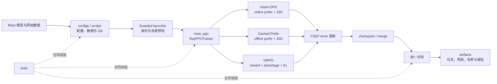

# Vision-OPD 项目复盘

> 持续维护中。正文将随本对话中的项目复盘逐步补充。
>
> 双版本维护规则：日常对话只更新本完整版；`project_retrospective_compact.md` 保持不变。只有用户明确提出更新精简版时，才基于当时的完整版重新提炼并更新精简版。

## 1. 项目背景（Situation）

### 1.1 行业与技术背景

近年来，多模态大语言模型（MLLM）在通用图像理解、视觉问答和图文推理任务上取得了明显进展，但它们在细粒度视觉场景中仍然容易失败。例如，当问题依赖图像中的小目标、局部文字、细小属性、遮挡区域、物体间局部空间关系或高分辨率区域时，模型即使能够理解整幅图像的大意，也可能无法获得回答问题所需的关键局部证据。

这一问题并不只是语言推理能力不足。多模态模型在进入语言模型前，通常需要对图像进行缩放、切块、编码和视觉 token 压缩。为了控制显存、上下文长度和推理成本，完整高分辨率图像往往只能被表示成有限数量的视觉 token。小目标或局部纹理在这个过程中可能被弱化甚至丢失。语言模型可以基于已有视觉信息推理，却无法可靠恢复在视觉编码阶段没有被保留下来的细节。因此，模型可能出现“知道应该看哪里，但实际上没有看清”的现象。

最直接的解决办法是让模型在推理时放大、裁剪或反复观察相关区域，或者为模型增加目标检测器、OCR、区域检索和视觉工具调用。这类方案可以改善局部感知，但也会引入新的代价：推理流程从单次前向变成多阶段系统，延迟和显存开销增加，需要维护额外工具及路由逻辑，并且上游区域选择一旦错误，后续推理仍然可能失败。另一类方法依赖更强的外部教师、人工标注或奖励模型，也会增加数据构建和系统训练成本。

因此，本项目关注的核心矛盾是：**裁剪后的局部区域更容易看清，但实际部署希望模型只输入完整图像、通过一次前向就完成回答。如何把训练阶段的局部视觉优势迁移到完整图像策略中，同时避免部署阶段继续依赖裁剪、工具或外部教师？**

### 1.2 Vision-OPD 研究的问题

Vision-OPD 将上述问题建模为一种从区域到全局的 on-policy 自蒸馏问题。训练时构造两个视角：

- Student 观察完整的红框图，输入形态与最终部署一致；
- Teacher 观察与问题相关的裁剪区域，拥有更清晰的局部视觉信息；
- Student 先用当前策略在线生成回答前缀；
- 在同一条 Student 当前轨迹上，比较 Teacher 与 Student 的 token 概率分布；
- 使用 Top-K JSD 将 Crop Teacher 的局部感知能力蒸馏给完整图像 Student；
- Teacher 由 Student 参数的 EMA 更新，因此不需要一个永久独立的外部大模型教师。

这里的关键不是让 Student 模仿一批预先生成的固定答案，而是让 Teacher 在 Student 当前真实会访问的自回归状态上提供分布级监督。因为生成模型后续每个 token 都依赖此前的 prefix，一旦 Student 的当前轨迹与离线缓存轨迹不同，固定前缀上的监督就可能出现分布偏移。on-policy prefix 的研究价值正在于：监督信号始终作用在当前策略真正访问的状态上，有机会减少训练—推理不一致和自回归误差累积。

训练完成后，只保留完整图像 Student。Teacher crop、EMA Teacher 和在线双视角过程只存在于训练阶段，推理时不需要裁剪工具、区域搜索或额外教师模型。这使研究目标不仅是提高 Benchmark 分数，也包括把训练阶段的特权区域信息压缩进可单次部署的模型参数。

### 1.3 Situation 一句话总结

多模态大模型能够理解图像整体语义，却经常因视觉 token 压缩和局部信息不足而看不清关键细节；本项目研究如何利用训练阶段更清晰的裁剪区域作为特权信息，通过 on-policy 自蒸馏把局部感知能力迁移到只看完整图像的 Student，并进一步以 Cached Prefix 和 GRPO 分支分析在线轨迹、离线蒸馏与结果奖励三类后训练信号的作用及代价。


## 2. 项目目标（Target）

### 2.1 总体目标

本项目的总体目标不是简单地“把训练脚本跑通”，而是围绕同一个冻结的 Qwen3.5-4B、同一 revision 的 6,241 条 Vision-OPD 数据和同一套外部评测协议，建立一套可复现、可比较、可审计的多模态后训练实验矩阵，完成 Base、Vision-OPD、Cached Prefix 和 GRPO 四条路线的模型、训练证据与统一评测交付。

项目需要同时达到三个层面的目标：

1. **研究目标**：验证区域到全局的 on-policy 自蒸馏是否能够改善细粒度视觉理解，并分析在线轨迹、离线缓存轨迹和结果奖励三种训练信号的差异。
2. **工程目标**：在双卡 RTX PRO 6000、有限内存与磁盘条件下，稳定完成多模态数据处理、在线 rollout、FSDP 训练、checkpoint 保存恢复、权重合并和冷加载。
3. **评测与交付目标**：以统一、冻结且可追溯的协议比较四组模型，保存逐样本证据、Bad Case、资源与成本，而不是只交付无法复核的汇总分数。

### 2.2 四条实验路线的目标

#### Base / Vanilla：建立统一起点

Base 不进行本项目训练，直接评测冻结的原始 Qwen3.5-4B。它的目标是提供训练前基线，回答“后训练模型相对原始模型改变了什么”。Base 还承担三条训练分支的共同初始化身份，以及 GRPO 的冻结 reference 身份。

需要保证 Base 权重、processor、tokenizer、chat template、生成参数和模型哈希可追溯。Vanilla 只是对 Base 的直接推理与评测，不产生新的 checkpoint。

#### Vision-OPD：完成项目主实验

Vision-OPD 的目标是让完整图像 Student 在其当前在线生成轨迹上，接受 Crop EMA Teacher 的 Top-K JSD 分布监督，把局部区域中更清晰的视觉证据迁移到 Student 参数中。

该分支需要证明的不只是 loss 能下降，还包括：

- Student 使用完整红框图，Teacher 使用对应裁剪图；
- prefix 确实由当前 Student 在线生成；
- Teacher/Student logits、Top-K 选择、JSD、mask 和 EMA 更新路径正确；
- 训练过程数值稳定，参数发生真实更新；
- 最终部署只需要完整图像 Student；
- 模型能够保存、合并并由新进程重新加载。

#### Cached Prefix：验证 on-policy prefix 的作用

Cached Prefix 的目标不是独立追求最高分，而是构造 Vision-OPD 的关键消融：使用训练前 Base 预生成并冻结的 Student prefix，替代训练期间的在线 Student rollout，其余蒸馏条件尽量保持一致。

该分支需要解决一个严格的合同问题：缓存文本经过 tokenizer 重编码后，prompt IDs、response IDs、EOS、padding、response mask、样本顺序和 JSD 计算必须与在线分支的训练语义一致；训练过程中在线 Student 生成调用应为 0。只有这些条件成立，才能把结果差异主要解释为 prefix 来源变化。

#### GRPO：比较结果奖励路线

GRPO 的目标是在不使用 Crop Teacher、JSD、EMA Teacher、Critic 和学习式 Reward Model 的情况下，让模型对每个视觉选择题在线采样多个回答，通过确定性规则判断最终选项是否正确，并利用组内相对优势直接优化策略。

该分支需要证明：

- 6,241 条数据全部能够稳定、无歧义地路由到规则 Reward；
- gold 只供 Reward 使用，不泄漏到策略输入；
- 每个 prompt 的多条 rollout 正确分组，不发生跨题串组；
- Reward、组均值、样本标准差、advantage 和 response mask 对齐；
- mixed-reward group 能产生来自正确性信号的真实 policy-gradient；
- Actor 参数变化不能只由 KL 或 weight decay 引起；
- 正式训练能够保存、恢复、合并并完成统一外部评测。

### 2.3 Target 一句话总结

以冻结的 Qwen3.5-4B 和 6,241 条多模态数据为共同起点，独立完成 Vision-OPD 在线自蒸馏、Cached Prefix 消融和规则 Reward GRPO 三条后训练分支，交付三个可重载训练后模型及一个 Base 基线，并用统一的 2,536 条外部评测、逐样本 Bad Case、训练资源和完整哈希证据回答不同轨迹与监督机制的效果、退化和工程代价。


## 3. 行动（Action）

> 结构约定：Action 保留 3.1 总体执行路线，并按 3.2 基础准备、3.3 训练设计、3.4 数据工程、3.5 Vision-OPD项目、3.6 Cached Prefix项目、3.7 GRPO项目、3.8 总结组织。共同环境与代码架构归入基础准备，共同实验边界和评测协议归入训练设计，共享数据处理归入数据工程；每个项目的方法、配置、Pilot、具体训练、恢复、排错、资源记录、checkpoint、合并和评测均直接补充到该项目内。跨项目比较与交付归入总结，不再按训练日程新增同级章节。Day 只作为时间与证据索引。

### 3.1 总体执行路线

项目没有直接启动 6K 正式训练，而是按照“先冻结、再小规模验证、再扩大、最后统一评测”的顺序推进：

论文与代码理解 → 项目和资源冻结 → 1K 数据与评测链路验证 → 外部 Benchmark 和 Base 基线冻结 → Vision-OPD 小规模 Pilot → 6,241 条全量数据 → Vision-OPD 正式训练 → Cached Prefix 消融 → 三模型评测 → GRPO 数据和 Reward → GRPO Pilot 与正式训练 → 四模型评测和交付。

日程上先完成 Vision-OPD，再完成 Cached Prefix 和 GRPO；模型血缘上，三条训练分支都从同一个冻结 Base 独立启动，不串行继承。

### 3.2 基础准备

正式排期前，先完成方法边界、仓库主链路、基础模型、软件栈和资源方案的验证。本节只保留后续训练共同依赖的内容；各路线的数学推导、张量流、具体实验和面试追问放入对应项目章节或第 4 章。

#### 3.2.1 前置方法确认

在设计实验前，我先确认三种训练方式在仓库中的真实语义和代码入口：Vision-OPD 是在线自蒸馏，Cached Prefix 是替换轨迹来源的离线前缀分支，GRPO 是规则 Reward 驱动的独立策略优化；CPT、SFT、DPO 和学习式 Reward Model 不在本项目执行范围内。

这一阶段只解决“是否理解方法、能否定位实现、基础模型能否运行”的前置问题，不在此处重复实验目标和对照关系。四路线的可执行实验矩阵统一放在第 3.3.1 节；算法公式、梯度路径和实际训练分别在 Vision-OPD、Cached Prefix、GRPO 项目章节展开。

#### 3.2.2 仓库架构与调用链



仓库按实验生命周期组织，而不是只围绕模型代码组织：

| 目录 | 核心职责 |
|---|---|
| `configs/` | 冻结数据、训练、资源、终止和评测参数 |
| `scripts/` | 数据构建、受控启动、监控、审计、合并与定版 |
| `verl/` | 数据集、Ray trainer、FSDP Worker、vLLM rollout、loss 与 Reward 实现 |
| `eval/` | 统一推理、解析、Base Judge、评分和逐样本比较 |
| `tests/` | 数据、算法、启动、恢复和评测合同测试 |
| `artifacts/` | 配置快照、哈希、日志、遥测、checkpoint、预测和报告 |
| `docs/` | 冻结决策、运行手册、阶段简报和项目复盘 |

主调用链为：

```text
项目 YAML
  → guarded launcher / preflight
  → Hydra overrides
  → verl.trainer.main_ppo
  → RayPPOTrainer
  → RLHFDataset + FSDP Worker + vLLM rollout
  → DataParallelPPOActor / core_algos
  → checkpoint → model_merger → 统一评测
```

关键实现入口：

| 模块 | 作用 |
|---|---|
| `verl/trainer/main_ppo.py` | Hydra 与 Ray 入口 |
| `verl/trainer/ppo/ray_trainer.py` | 采样、批处理、训练循环和保存 |
| `verl/utils/dataset/rl_dataset.py` | Parquet、多模态 processor 与 prompt |
| `verl/workers/fsdp_workers.py`、`verl/workers/rollout/` | FSDP 模型生命周期与 vLLM 生成 |
| `verl/workers/actor/dp_actor.py`、`verl/trainer/ppo/core_algos.py` | loss、反向传播、optimizer 与 EMA |
| `verl/trainer/ppo/cached_prefix.py` | Cached Prefix 读取与绑定 |
| `verl/utils/reward_score/vision_opd_mcq_grpo.py` | GRPO 确定性规则 Reward |

### verl：组织大模型后训练的框架

verl（Volcano Engine Reinforcement Learning for LLMs）是面向大模型强化学习后训练的框架，也是 HybridFlow 的开源实现。它把数据输入、回答生成、训练信号计算、参数更新、权重同步和 checkpoint 保存组织成完整流程，支持 PPO、GRPO 等算法，并通过可替换的后端执行训练与推理。[官方介绍](https://github.com/verl-project/verl)

**为什么需要 verl？** 普通监督训练通常读取输入和标准答案后直接计算损失、更新模型；在线策略训练还需要先用当前模型生成回答，再计算奖励或其他监督信号，最后更新策略并将新权重交给生成端。这些环节涉及多个模型、进程和计算引擎。verl 提供训练循环与接口，让项目能够复用分布式基础设施，并接入自己的算法。

**框架分层与组件分工。** verl 本身是框架，并不是几个互不相关框架的简单集合。本项目采用以下组合；其中 FSDP 和 vLLM 是选择的后端，不代表 verl 只能使用这套组合。

| 层次 | 本项目使用的组件 | 职责 |
|---|---|---|
| 训练流程层 | verl Trainer | 安排输入、rollout、监督计算、参数更新和保存 |
| 任务与资源层 | Ray | 启动 Worker、分配 CPU/GPU、远程调用与结果回收 |
| 模型计算层 | PyTorch | 前向计算、自动求导和优化器更新 |
| 分布式训练层 | FSDP | 分片保存参数、梯度与优化器状态，执行跨卡通信 |
| 生成推理层 | vLLM | 调度生成请求、管理 KV cache、高效生成回答 |
| 配置管理层 | Hydra + OmegaConf | 读取、组合和覆盖训练配置 |

**核心设计：控制流程与模型计算分开。** 上层控制器安排“先生成、再计算训练信号、再更新”；下层 Worker 在多张 GPU 上执行前向、反向和集合通信。上层以较直观的训练循环组织任务，下层保留多 rank 协同计算，这就是 HybridFlow 混合控制设计的核心。控制器不亲自执行每层的梯度计算，Worker 也不意味着必须独占一张 GPU。[HybridFlow 编程说明](https://verl.readthedocs.io/en/latest/hybrid_flow.html)

**训练中的主要角色。** 角色表示职责，不一定对应独立模型副本、独立进程或独占 GPU；是否启用取决于算法和资源布局。

| 角色 | 职责与使用条件 |
|---|---|
| Actor | 正在训练的策略模型，计算回答概率并接受参数更新 |
| Rollout | 使用当前策略生成回答，在线采样时需要 |
| Reference（策略约束） | 提供参考策略概率，用于 KL 等策略偏离约束，是否需要取决于配置 |
| Reward（实际回报） | 对回答评分，可以是规则函数或奖励模型 |
| Critic（预期回报） | 估计价值以辅助优势计算，PPO 常用；标准 GRPO 通常不需要独立 Critic |
| Teacher（ | 本项目蒸馏分支中提供监督分布的模型，可通过 EMA 更新 |

Reference 与 Teacher 的算法职责不同：前者提供，后者提供。本项目复用部分 reference 相关基础设施承载 Teacher，不能因此将两种用途混为一谈。

**一次训练如何流转？** 以在线策略训练为例：读取图文输入 → vLLM 使用当前策略生成回答 → 计算奖励、参考概率或蒸馏目标等所需信息 → 构造 advantage 或相应损失 → FSDP Actor 前向、反向并更新参数 → 按算法更新 Teacher 等状态 → 在下一轮生成前同步 Actor 权重到 vLLM。不同分支会省略或替换其中步骤，保存和评估按配置触发。入口名包含 `ppo` 不代表所有分支都采用 PPO 算法。

**整体流程：** 下载源码 → 准备兼容环境 → 下载模型 → 转换数据 → 配置训练 → 小规模试跑 → 检查日志和 checkpoint → 导出并独立加载模型。以下是上游 verl 的学习流程，尚未在本项目环境中执行；依赖和配置字段应以所选 commit 的官方文档为准。学习环境应使用独立目录，不能覆盖现有 Vision-OPD 的代码和冻结环境。

1. **检查机器。** 用 `nvidia-smi` 检查 GPU 和驱动，用 `df -h` 检查磁盘；同时确认 Python、CPU 内存及容器 cgroup 限制。驱动、PyTorch、CUDA 运行库、vLLM 和注意力算子必须兼容，不能分别随意安装最新版。
2. **下载代码并记录版本。** 使用 `git clone https://github.com/verl-project/verl.git verl-learning` 下载上游源码，进入目录后用 `git rev-parse HEAD` 记录 commit；源码、示例和文档采用同一版本。
3. **准备环境。** 当前官方提供 uv 依赖管理方式，选择 `vllm` 和 `fsdp` 后端，使用仓库的锁文件。典型命令前缀为 `uv run --frozen --all-packages --extra vllm --extra fsdp`，首次执行会准备环境。先验证 `torch`、`ray`、`vllm`、`verl` 能导入，CUDA 可用且 verl 指向预期目录；主进程与 Ray Worker 必须使用一致环境。已有项目环境则按项目冻结的安装方法维护。[安装说明](https://verl.readthedocs.io/en/latest/start/install.html)
4. **下载小模型。** 初次学习可采用官方入门示例中的 `Qwen/Qwen2.5-0.5B-Instruct`，用 Hugging Face 下载工具保存模型权重、config 和 tokenizer，记录模型路径。此时只是准备初始模型，还没有训练。
5. **准备数据。** 运行 `examples/data_preprocess/gsm8k.py --local_save_dir <数据目录>`，将 GSM8K 转成训练与测试 Parquet。主要字段包括模型输入 `prompt`、评分来源 `data_source`、规则答案 `reward_model.ground_truth` 和样本信息 `extra_info`；标准答案供生成后判分，不能泄漏到 prompt。[官方入门流程](https://verl.readthedocs.io/en/latest/start/quickstart.html)
6. **配置训练。** 明确模型路径、训练与验证数据、算法、GPU 数、输入和输出长度、batch、每题生成数、学习率及保存位置。使用 GRPO 时配置 `algorithm.adv_estimator=grpo`；例如一轮 8 个 prompt、每题生成 4 条回答，会得到 32 条轨迹。micro-batch 控制单次计算量，mini-batch 与 rollout 展开的对应关系需按该版本实现确认。
7. **先做小规模试跑。** 通过 `python3 -m verl.trainer.main_ppo` 启动，先限制为少量训练步，使用小 batch 和适当长度上限；可先只用 console 日志，并检查实际执行的配置。目标是打通生成、训练信号计算、反向、更新和保存，不用几步训练判断能力提升。单卡试跑也不能证明多卡 FSDP 分片和通信正确。配置字段报错时检查版本定义，不要盲目添加字段。
8. **检查运行结果。** 确认达到预定步数、回答能生成和解析、Reward 正常计算、loss 与梯度有限、参数更新完成、checkpoint 落盘，且 GPU/CPU 占用可接受。GRPO 中同题回答奖励完全相同时可能没有组内优势信号，不能只凭 loss 接近零判断失败。
9. **导出并验证模型。** 从日志找到实际 checkpoint 目录，使用 `python3 -m verl.model_merger merge --backend fsdp --local_dir <actor检查点目录> --target_dir <导出目录>` 合并分片，再在新进程中加载模型做固定输入推理。保留原始训练 checkpoint；合并后的推理权重不能替代完整恢复状态，冷加载成功也不等于已经验证断点续训。
10. **迁移到本项目。** 将纯文本数据换成项目的图文配对数据，使用项目中的 Qwen3.5-4B 配置及修改过的 verl，按 Vision-OPD、Cached Prefix 或 GRPO 分支运行。正式实验仍使用项目 YAML、preflight 和 guarded launcher，并遵守既定资源与验证条件，不能直接套用上游示例参数。


##### verl Trainer、Ray、FSDP 与 vLLM：工作原理

四个组件共同完成训练：**Trainer 安排流程，Ray 调度进程与资源，FSDP 执行分布式训练，vLLM 高效生成回答。**

**verl Trainer：组织训练流程。** Trainer 负责把各阶段串起来：读取数据、调用生成端得到回答、组织监督信息、调用训练端更新模型，再记录结果和保存 checkpoint。它主要决定“先做什么、后做什么”，具体模型计算交给 Worker 执行。

**Ray：让多个工作进程协同执行。** Ray 可以把任务交给远程进程执行，并收集结果；也可以创建长期保存模型等状态的 Worker，避免每次任务都重新加载。它根据资源需求安排任务，使生成、训练等环节协作。Ray 负责进程和资源调度，但不会自动保证多个模型能同时放进显存。Ray 中的 Actor 是有状态的远程对象，与策略模型 Actor 含义不同。

**FSDP：分片存储训练状态，计算时临时拼齐。** 全分片模式将模型参数、梯度和优化器状态分散保存在多张 GPU 上。每张卡处理不同样本，计算某个模块前临时收集完整参数；反向传播后汇总并分片梯度，各卡更新自己负责的参数分片。这样减少了重复存储，但增加跨卡通信；计算中的激活和临时完整参数仍会占显存，因此可能还需要 offload。它不是把模型前半部分固定交给一张卡、后半部分交给另一张卡。

**vLLM：提高逐 token 生成的效率。** 模型先处理输入上下文，再逐 token 生成回答。注意力层通过 KV cache 保存历史 Key、Value，供后续生成复用，避免重复计算；PagedAttention 将缓存分块管理，减少显存浪费；连续批处理让完成的请求退出、新请求及时加入，提高 GPU 利用率。vLLM 负责生成，训练端负责反向传播和参数更新，两者通过权重同步衔接。

在本项目的在线训练中，可以理解为：**Trainer 组织任务 → Ray 调用相应 Worker → vLLM 生成回答 → 训练端计算监督与损失，借助 FSDP 更新 Actor → 将新权重同步给 vLLM → 下一轮生成。**


#### 3.2.3 GPU、CPU cgroup 与资源预算

GPU 显存主要承载参数、activation、梯度、部分 optimizer state、KV cache 和算子 workspace，决定模型规模、序列长度、图片尺寸、batch 和 rollout 并发；CPU 内存主要承载 Python/Ray 进程、数据处理、共享对象、offload 状态和 checkpoint staging。offload 会降低显存，但会增加 CPU 占用和传输开销，两者不能简单相加或互相替代。

“不开卡时只有 2 GiB”指平台给轻量容器设置的 CPU memory cgroup 上限，不是宿主机只有 2 GiB。达到 `memory.max` 时进程可能被 `SIGKILL`，表现为 exit 137；只有 `memory.events` 中 `oom/oom_kill` 增加时，才能确认是 cgroup OOM。本项目曾出现 exit 137 但 OOM 计数未增加，因此保留为未完全确认的外部 kill。

240 GiB 不是由 GPU 显存相加得到，而是同构 Pilot 的实测冻结值：六次有效运行峰值为 177.39～189.79 GiB，均无 `oom/oom_kill` 增量；以 95% 为中止线时，最高峰距离中止线仍有 38.21 GiB，距离硬上限有 50.21 GiB。

迁移到其他环境时必须重新测量：

```text
P = 多次同构 Pilot 的最大 cgroup 峰值
U = max(P × 不确定性比例, 绝对余量)
C_required = 向上取可申请档位((P + U) / 中止比例)
```

Pilot 应覆盖正式模型、GPU/FSDP 布局、并存模型、offload、长尾 token、rollout 数、worker、optimizer step、checkpoint 保存与恢复。正式启动前重新读取 `memory.max/current/peak/events`；资源不足时调整工作负载并重跑 Pilot，不能只降低 YAML 门槛。

#### 3.2.4 Three-way offload 资源方案

为解决双卡训练中 Actor、优化器状态和 Teacher/reference 仍可能同时占用大量显存。三路 offload 把当前阶段不用的状态移到 CPU，降低同时驻留的显存峰值。

| 卸载对象 | 是什么 | 什么时候需要 | 卸载作用 | 代价 |
|---|---|---|---|---|
| Actor parameters | 当前被训练模型的权重，即 Vision-OPD 的 Student 或 GRPO 的 Actor | **生成回答、计算回答概率、反向传播和更新模型**时；部署推理也需要 | 非计算阶段移到 CPU，降低常驻显存 | 增加权重搬运 |
| Optimizer states | 优化器保存的更新历史，例如 Adam/AdamW 的梯度一阶、二阶动量；与模型权重、当前梯度不同 | **更新参数**时参与计算，并跨训练步保留；完整恢复训练通常也需要，纯推理不需要 | 更新窗口外移到 CPU，降低更新前的显存占用 | 增加 CPU 内存与更新延迟 |
| Teacher/reference parameters | 提供监督或约束的另一套模型权重：Teacher 提供蒸馏分布，Reference 提供策略偏离的参照 | **蒸馏时**计算 Teacher 分布，或 GRPO 中计算 Reference 概率以构造 KL 约束；最终 Student/Actor 部署不需要 | 不使用时移到 CPU，减少辅助模型常驻显存 | 切换阶段增加传输 |

本项目的 Teacher 通过 Student 参数的 EMA 更新，Reference 则始终冻结；两者都不通过反向传播训练，因此不需要各自的优化器状态。卸载只改变数据存放位置，不等于删除数据或冻结参数。

关键改造是 `defer_optimizer_state_load`：optimizer state 只在 `_optimizer_step()` 前加载到 GPU，更新后立即卸载，避免与 rollout、Teacher/reference forward 的显存高峰重叠。它改变的是资源生命周期，不改变损失函数和参数更新语义。

固定 Actor 输入的 A/B 结果：

| 指标 | 改造前 | 改造后 |
|---|---:|---:|
| GPU0 峰值 | 94.69 GiB | 80.02 GiB |
| GPU1 峰值 | 94.95 GiB | 85.26 GiB |
| 最坏单卡占用率 | 99.33% | 89.19% |
| CPU cgroup 占用率 | 79.01% | 79.08% |

随后 1024-token 压力测试完成 16 个 step，最坏 GPU 占用 90.59%、CPU cgroup 76.34%，warmup、更新和 checkpoint 均通过。该方案的亮点是用阶段化驻留消除显存峰值，同时没有显著抬高 CPU 峰值；它属于有实验证据的工程优化，而不是新的训练算法。

#### 3.2.5 基础模型与分布式系统追问

##### 一、面试主问题

1. **模型怎样结合图片和文字？你训练了哪些部分？**

   **答案：** Qwen3.5-4B 通过“视觉编码器 → 视觉合并与投影模块 → 语言模型”连接图片和文字，具体分为四步。

   首先，图片经过尺寸调整、归一化等预处理，再切成小块（patch），送入**视觉编码器（ViT)**。视觉编码器将像素转换成特征向量，提取局部外观以及图像区域之间的关系，形成后续理解所需的视觉表示。

   然后，视觉合并与投影模块（merger）将相邻位置的**特征合并**，减少传给语言模型的视觉 token 数量，并把特征转换到与语言模型的隐藏维度一致的维度。这样，视觉特征就可以接入语言模型的输入序列。

   （可以把 merger 理解成视觉编码器与语言模型之间的“压缩器和接口转换器”。当 `spatial_merge_size=2` 时，它将空间上相邻的 `2×2` 个视觉特征合并为一个视觉 token，使 token 数量约降为原来的四分之一；同时将合并后的特征映射成语言模型要求的 2560 维向量。这样能够缩短输入序列、降低计算和显存开销，但局部信息也会被压缩，过小的细节可能因此弱化。）

   同时，问题和提示文字经过 tokenizer 分词，再通过 embedding 层转换成文字向量。输入序列预留了图像占位位置，模型用 merger 输出的视觉向量填入这些位置，与文字向量共同组成输入，并配合多模态位置信息保留图像的空间结构。这里传入的是视觉特征，不是先将图片描述成一段文字。

   （可以简单理解为：文字 token 先变成文字向量，图像占位符则被替换成真实的视觉向量，二者按顺序组成同一条输入序列。多模态位置编码帮助模型识别视觉 token 在图像中的行列位置及文本 token 的先后关系。模型因此能够直接结合原始视觉特征和问题进行推理，避免先生成图片描述时遗漏颜色、形状、位置或局部细节。）

   最后，语言模型结合图片特征、问题和已经生成的内容，逐 token 预测后续回答。例如，回答“红框中的物体是什么颜色”时，模型需要根据文字问题利用对应区域的视觉信息，再输出颜色答案。

   **训练部分：** 本项目 Student/Actor 采用**全参数训练方案**，没有冻结视觉编码器。视觉编码器、merger 和语言模型都属于可训练范围：视觉编码器可以调整图像特征的提取方式，merger 可以调整视觉特征的合并与映射方式，语言模型可以调整对图文信息的利用和回答生成方式。训练时，损失通过反向传播作用于这些模块，由优化器更新参数；“全参数训练”不意味着每个参数在每一步都会发生非零变化。

   在 Vision-OPD 和 Cached Prefix 中，Student 看完整红框图并接受梯度更新，Teacher 看裁剪图、提供分布监督，其参数通过 Student 参数的指数移动平均（EMA）更新，不使用自己的反向传播和优化器。在 GRPO 分支的训练方案中，Actor 接受奖励驱动的更新，Reference 始终冻结，用于约束 Actor 偏离原始模型的程度。

2. **模型多模态合并采用 ViLT 还是 CLIP 类方案？两者有何区别？**

   **答案：** Qwen3.5-4B 既不是直接采用 ViLT，也不是直接使用 CLIP。它先用独立的 ViT 类视觉编码器提取图像特征，再通过视觉 merger 合并相邻特征并映射到语言模型的隐藏维度，最后把视觉 token 填入文本序列中的图像占位位置，与文本 token 一起交给语言模型处理。从结构上看，它更接近“CLIP 类的独立视觉塔 + 语言模型”路线，但视觉塔和融合模块是 Qwen 自己的实现，不能直接称为 CLIP。

   ViLT 属于较早融合方案：图像被切成 patch 后，图像 patch 与文本 token 较早进入同一个 Transformer 联合编码。它结构直接，但统一编码器需要同时学习视觉表示和图文关系。CLIP 类方案通常先用独立视觉编码器提取图像表示，再与文本侧对齐或交给后续语言模型，视觉处理和语言处理的分工更清楚。经典 CLIP 通过图文对比学习对齐独立的图像编码器和文本编码器，本身并不负责逐 token 生成回答。

   面试时可以概括为：Qwen3.5-4B 使用独立的 ViT 类视觉塔，通过 merger 将视觉特征转换成语言模型能够接收的视觉 token；它不是 ViLT 的早期图文联合编码，也不能简单说成使用了 CLIP。

4. **为什么裁剪能提供更好的监督？红框与裁剪有什么区别？**

   **答案：** 完整图经过缩放、切块和视觉 token 压缩后，小目标可能只占少量 patch，文字、纹理和边缘等细节容易丢失。裁剪去除大量无关背景，使目标在相同输入尺寸和视觉 token 预算下占据更多像素与 token，因此 Teacher 更容易识别问题相关的局部证据，并通过 token 概率分布为 Student 提供更清晰的监督。

   红框主要告诉模型“**应该看哪里**”，但不会真正增加框内目标的像素和视觉 token，目标仍可能看不清；裁剪则相当于放大目标，解决“**能不能看清***”的问题。红框保留完整场景和全局关系，裁剪可能丢失外围上下文。因此本项目让 Student 看完整红框图，以保持部署输入和全局信息；Teacher 看局部裁剪图，以获得训练阶段的高分辨率局部证据。红框是注意力提示，不是 Teacher crop 的等价替代。

5. **Ray、FSDP、vLLM 分别负责什么？**

   **答案：** Ray 负责**分布式任务和资源编排**。它启动并管理不同的 Worker，给进程分配 CPU/GPU，安排 rollout、训练、Teacher/reference 前向和保存等任务，并负责远程调用与结果回收。Ray 解决的是“哪些进程在什么资源上、按什么顺序工作”，但不负责模型内部的梯度计算和显存分片。Ray 中的 Actor 是一种可保持状态的远程进程对象，与强化学习中的策略模型 Actor 含义不同。

   FSDP 负责**分布式训练和训练状态分片**。它将模型参数、梯度和优化器状态分散保存在两张 GPU 上，减少单卡常驻显存；计算某个模块时临时收集所需参数，反向传播后再汇总并分片梯度。FSDP 解决的是“模型怎样在多张卡上训练并节省显存”，但不负责整个任务流程的调度，也不是专门的生成引擎。

   vLLM 负责**高吞吐推理和 rollout**。它加载当前策略权重，利用 KV cache 管理和连续批处理等机制，高效生成回答轨迹。Vision-OPD 用这些轨迹作为 Student 的在线前缀，GRPO 则对同一道题生成多条回答用于计算 Reward 和 advantage。vLLM 只负责生成，不负责反向传播或优化器更新；Actor 更新后，训练系统需要把新权重同步给 vLLM，下一轮 rollout 才会使用新策略。

   三者的协作可以概括为：Ray 安排进程、任务和资源，FSDP 执行多卡分片训练，vLLM 高效生成回答。它们解决的是不同层面的问题，因此不能互相替代。

6. **两张 GPU 怎样分担训练？为什么还需要 offload？**

   **答案：** 两张 GPU 通过 FSDP 共同训练同一个 Actor。**每张卡处理不同的样本，并长期保存一部分模型参数、梯度和优化器状态**；计算某个模块前通过 all-gather 临时收集所需参数，反向传播后通过 reduce-scatter 汇总并重新分片梯度，再由各卡更新自己负责的参数分片。它仍属于**数据并行**，并不是把模型前后两半固定分给两张卡。

   FSDP 只减少训练状态的长期重复存储，计算期间仍要容纳临时完整参数、激活、KV cache、vLLM、Teacher/reference、优化器状态及通信缓冲区。两张 96GB GPU 的显存也不能合并成一块连续的 192GB 空间，所以单卡峰值仍可能接近上限。offload 会把当前阶段不用的 Actor、Teacher/reference 或优化器状态移到 CPU，进一步降低同时驻留的显存；代价是增加 CPU 内存、数据传输和训练延迟。可以概括为：FSDP 通过跨卡分片节省显存，offload 再通过 CPU/GPU 间的阶段化搬运削减峰值。

7. **一批数据从输入到完成参数更新，经历哪些步骤？**

   **答案：** 首先，Dataset 读取完整红框图、问题、样本 ID 及各分支所需的 crop、缓存前缀或标准答案；Processor 对图片进行缩放、切块和归一化，对文字分词，形成模型输入。随后，Vision-OPD 使用当前 Student 在线生成回答前缀，Cached Prefix 直接读取训练前保存的固定前缀，GRPO 则由当前 Actor 为每道题生成多条回答。

   接着计算训练信号：Vision-OPD/Cached 让 Student 看完整图、Teacher 看裁剪图，在同一前缀上计算 token 分布和 Top-K JSD；GRPO 根据回答是否正确计算 Reward 和组内 advantage，并结合策略概率与 Reference KL 形成训练损失。Actor 对损失进行反向传播，FSDP 在两张 GPU 间汇总并分片梯度，优化器根据梯度及动量状态更新 Actor 参数，scheduler 再更新学习率。

   更新完成后，Vision-OPD/Cached 使用新的 Student 参数对 Teacher 执行 EMA 更新，GRPO 的 Reference 保持冻结；新 Actor 权重还要同步给 vLLM，确保下一批 rollout 使用更新后的策略。整个过程可概括为：数据读取与图文预处理 → 生成或读取轨迹 → 计算蒸馏分布或 Reward → 计算损失并反向传播 → 优化器更新 Actor → 更新 EMA Teacher并同步生成端。

9. **Actor 更新后，生成端怎样使用新权重？**

   **答案：** FSDP 训练 Actor 和 vLLM 生成模型是用途不同的权重实例：前者负责反向传播和参数更新，后者负责高效 rollout。Actor 完成 `optimizer.step()` 后，系统在下一轮生成前从 FSDP Actor 提取最新 `state_dict`，整理各 rank 的参数分片并转换为 vLLM 可识别的名称和格式；随后唤醒生成端的权重存储，调用 `update_weights` 将新参数直接加载到 vLLM，再恢复 KV cache 并开始下一轮 rollout。这个过程在内存中完成，不需要先保存和读取 checkpoint。可以概括为：Actor 更新 → 提取并转换最新权重 → 加载到 vLLM → 下一轮使用新策略生成。若同步遗漏或失败，生成端会继续使用旧策略，造成 rollout 策略与训练 Actor 不一致。

10. **输入长度不一致时，怎样控制显存？**

   **答案：** 不同图片会产生不同数量的视觉 token，问题和生成回答的长度也不同，因此只固定样本 batch 不能保证显存稳定。本项目先设置硬长度合同：Vision-OPD/Cached 的 prompt 上限为 8192、response 上限为 1024，GRPO 当前 response 上限为 128；超限输入使用 `truncation: error` 直接报错，避免静默截断。

   训练时，**全局 batch 保持不变，但根据样本的实际 token 数动态拆成多个 micro-batch**：短样本可以一起计算，长样本使用更小的 micro-batch，必要时单独处理；各 micro-batch 依次前向和反向并累积梯度，最后仍只执行一次全局参数更新。 单卡 token 预算进一步限制每次计算量，Vision-OPD 为 9216，GRPO 为 8320。生成阶段还将 vLLM 的显存利用率限制为 0.4，并把 log-prob micro-batch 设为 1；同时结合 gradient checkpointing、FSDP 和 three-way offload 控制激活与训练状态。可以概括为：**长度上限负责拦截异常长样本，动态 micro-batch 按真实 token 数削平批次峰值，其他显存措施再控制模型、激活和生成缓存的占用。**

11. **训练中断怎样恢复？最终模型怎样验证？**

   **答案：** 严格的断点恢复不能只加载模型权重，还要恢复 optimizer、学习率 scheduler、global step、随机数、数据进度以及 EMA Teacher 等训练状态；随后将恢复后的 Actor 权重同步到 vLLM，再从下一步继续 rollout 和更新。若只有模型权重而缺少这些状态，只能算从旧权重重新训练，不能保证训练轨迹连续。恢复后应检查步数和学习率是否衔接、数据是否重复或跳过、loss 是否正常，以及 Actor 与生成端的权重版本是否一致。

   最终模型先验证 FSDP checkpoint 的文件、大小和哈希，再将分片合并成 Hugging Face 模型，检查 tensor 数量、类型和配置；之后在全新进程中用固定图文样本冷加载推理，最后按冻结协议完成正式评测。本项目的 `global_step_780` checkpoint 已完成 13 个文件的 SHA256 校验；合并模型包含 724 个 BF16 tensor，冷加载测试为 5/5 输出非空、0 个推理错误。需要说明的是，正式训练没有发生中断后续训，且配置为 `resume_mode: disable`，因此现有证据证明 checkpoint 完整、模型可合并和独立推理，但尚未通过一次真实的“保存—终止—恢复—继续更新”测试证明完整 resume 链路。


##### 二、深入追问

###### Ray、FSDP 与 vLLM

1. **为什么训练和生成要用两套执行框架？直接用训练模型生成不行吗？**

   **答案：** 两套执行框架指**训练端的 PyTorch + FSDP 和生成端的 vLLM**：前者负责前向、反向传播和参数更新，后者负责高效生成 rollout；Ray 则负责 Worker 和资源编排。直接用训练模型逐 token 生成当然可以，生成量较小时实现更简单。但**训练侧重点是训练状态分片与梯度计算，生成侧重点是 KV cache 管理、请求调度和吞吐**。**直接使用全分片模型生成时，可能因反复收集参数增加通信；保留完整参数又会增加显存占用，因此项目用 vLLM 专门加速在线生成。**

   引入 vLLM 的代价是**额外维护生成权重和 KV cache**，并处理权重同步及框架适配。Actor 更新后，需要在下一轮 rollout 前将新权重同步给 vLLM，两边并非随时自动同步。是否值得，应比较实际每步耗时：生成节省的时间需要抵消权重同步和额外管理成本，同时满足显存预算。

3. **FSDP 到底把什么拆到了两张卡上？计算某一层时，如果本卡只有部分权重，怎么完成计算？**

   **答案：** FSDP 的全分片模式将**模型参数、梯度和优化器状态分散保存在两张 GPU 上，各卡长期只保存其中一部分**，但仍处理不同样本并参与模型各层的计算。计算某个模块前，通过 **all-gather 临时收集该模块的完整权重，各卡用完整权重处理自己的数据**；前向后通常释放临时完整权重，反向需要时再次收集。反向得到的梯度通过 reduce-scatter 汇总并分片，各卡再用对应的梯度和优化器状态更新自己负责的参数分片。实际收集范围取决于 FSDP 包装的模块，可能包含一层或多层。

   可以理解为“平时分片存储，计算时临时拼齐，梯度汇总后各自更新”。这样减少了训练状态的长期重复存储，但增加参数收集和梯度通信；激活、临时完整参数和通信缓冲区仍占显存，因此两张卡的显存占用不会简单减半，速度也不保证翻倍。

4. **FSDP 和 DDP 的区别是什么？什么时候选择哪一种？**

   **答案：** DDP（Distributed Data Parallel，分布式数据并行）和 FSDP（Fully Sharded Data Parallel，完全分片数据并行）都是多张 GPU 协同训练同一个模型的方法，各张卡处理不同的数据，再通过通信汇总训练结果。

   **DDP：每张卡保存一套完整训练状态。** 标准 DDP 中，**每张 GPU 都持有完整模型参数**，通常也各自保存完整梯度和优化器状态。每张卡用自己的数据做前向和反向，在反向传播过程中通过 all-reduce 汇总各卡梯度；各卡使用一致的梯度和优化器状态更新参数，因此模型副本保持一致。例如，两张卡各处理 4 条样本，就能共同完成一个 8 条样本批次的训练，但每张卡仍需要装下完整模型和相应训练状态。

   **FSDP：把训练状态分片保存，计算时临时拼齐。** 在全分片模式下，**模型参数、梯度和优化器状态分散保存在各张 GPU 上**。计算某个被包装的模块前，通过 all-gather 临时收集该模块所需的完整参数；前向后可释放完整参数，反向需要时再次收集，梯度则通过 reduce-scatter 汇总并分片，各卡更新自己负责的参数分片。两张卡仍各自处理不同样本，并参与模型各层的计算，并非一张卡只算前半模型、另一张卡只算后半模型。

   **主要区别是用通信换显存。** DDP 主要同步梯度，流程较简单；FSDP 还需要收集参数，**减少了训练状态的长期重复存储，但增加通信和调度开销**。FSDP 不能让总显存占用简单减半，因为激活、临时完整参数、通信缓冲区，以及生成端的 KV cache 等仍会占用显存，两张卡也不保证两倍速度。**完整模型和训练状态能放下时，通常优先考虑 DDP；单卡显存紧张时，考虑 FSDP**。本项目同时存在 Actor、Teacher/reference 和生成端，采用 FSDP 分片后仍需结合 offload，将当前不用的状态移到 CPU，进一步控制同时驻留的显存峰值。


###### Three-way offload（重点准备）

6. **优化器状态为什么可以等到参数更新前才上 GPU？反向传播时到底需要哪些数据？**

   **答案：** 优化器只负责参数更新，前向和反向不需要这些历史动量；等梯度计算、累积完成，准备执行 optimizer.step() 时再加载即可，从而减少显存占用重叠。

   反向传播通常需要前向输入与中间激活、相关模型参数、后续层传来的梯度，以及计算图和算子保存的信息；部分激活可通过 gradient checkpointing 重算，FSDP 参数可按需收集。优化器的一阶、二阶动量只在 optimizer.step() 时参与更新，因此前向和反向期间可以留在 CPU，等参数更新前再加载到 GPU，更新后立即卸载。

   梯度累积期间，需要保留已累积的参数梯度；每个 micro-batch 完成反向后，不再使用的激活通常可以释放，优化器状态则可以继续留在 CPU，直到所有 micro-batch 的梯度累积完成。这样缩短了优化器状态在 GPU 上的驻留时间，减少它与激活、临时张量同时占用显存造成的峰值。

  
8. **把状态移到 CPU，为什么你的 CPU 峰值几乎没增加？这些数据原来在哪里？**

   **答案：** 原方案已经开启 optimizer offload，优化器状态原本就在 CPU 与 GPU 之间搬运：Actor 更新开始时提前加载到 GPU，更新后再卸载回 CPU。**延迟加载只是让它在前向、反向期间继续留在 CPU，等 optimizer.step() 前才上 GPU，因此主要改变驻留时间，并没有新增一整套 CPU 状态，CPU 所需存储规模不一定明显增加**。


10. **两张卡的显存峰值为什么不一样，优化后的下降幅度也不同？**

    **答案：** FSDP 分片的是参数、梯度和优化器状态，各卡总显存还包括激活、临时完整参数、通信缓冲及其他进程占用。两张卡处理的样本长度、视觉 token 数和 micro-batch 可能不同，额外任务、缓存池历史及峰值出现的阶段和时刻也可能不同，因此峰值不一定一致。延迟加载减少的是优化器状态与其他张量的驻留重叠，优化后各卡的最高峰可能转由不同因素决定，所以即使卸载的状态大小接近，整卡峰值降幅也不一定相同，不能把降幅直接当作卸载数据量。

11. **你怎样证明显存下降来自延迟加载，而不是输入长度、缓存状态或其他配置变化？**

    **答案：** 应做**受控 A/B 对照**，尽量**只改变是否延迟加载优化器状态**：回放相同的 Actor 输入，核对图片、token、mask 和实际 micro-batch；固定硬件、模型与优化器初始状态、代码、精度和其他配置，两组使用相同监控、独立进程及一致的 warmup 流程。相同数据集和 seed 不能保证在线生成长度一致，因此必须核对实际输入。测量时对齐训练步、计算阶段和显存口径，在相同边界同步并重置可重置的峰值统计，同时保留整段运行的遥测，多次重复确认差异稳定；还应核对优化器状态确实在前向、反向期间留在 CPU，验证显存下降与驻留变化是否对应。

    **追问：** **A/B 固定了什么，warmup 怎样处理，峰值统计如何重置，有没有重复测量？**

    **答案：** A/B 回放同一份封存的 Actor 输入，核对输入哈希、实际 micro-batch、硬件、CPU 配额和 runtime 源码，两组使用相同监控，主要比较是否延迟加载；但在线生成、reference/log-prob 计算及显存池历史未完全固定。每组对照运行 8 步，未跨过 10 步学习率 warmup；后续 16 步长回复压力测试覆盖第 11～16 步更新，但不能替代 warmup 后的 A/B。学习率 warmup 与 CUDA、算子预热不同，更完整的对照还应统一预热流程，分别报告启动和预热后峰值


    
### 3.3 训练设计与实验冻结

先确定各实验比较什么，再固定关键条件，让结果可比较、可复现，出现问题时也能追溯原因。

**实验设计**

| 路线 | 做法 | 比较目的 |
|---|---|---|
| Base | 不训练，直接评测原始 Qwen3.5-4B | 提供训练前基线 |
| Vision-OPD | Student 看完整红框图并在线生成，crop EMA Teacher 用 Top-K JSD 提供监督 | 主实验 |
| Cached Prefix | 使用训练前 Base 生成的固定前缀，保留相同蒸馏设计 | 检查前缀来源的影响 |
| GRPO | Actor 看完整红框图，每题生成 4 条回答，用规则奖励和组内优势训练，并加入 KL 约束 | 比较另一条后训练路线 |

三条训练分支都独立从同一 Base 开始。Vision-OPD 与 Cached Prefix 尽量只改变前缀来源，其他差异单独记录；GRPO 的监督方式和生成量不同，属于路线比较，不能当作严格的单变量消融。

**为什么冻结**

冻结就是记录并固定关键版本和参数，避免模型、数据或评测方式悄悄变化，导致结果无法解释。需要调整时保留旧版本、修改原因和验证记录，再形成新版本。

| 固定对象 | 主要内容 |
|---|---|
| 模型与数据 | 同一 Base、tokenizer、processor、提示模板，固定训练样本和 full/crop 配对，用版本号、样本 ID 和哈希核对身份 |
| 训练设置 | seed=42、prompt batch=8、1 epoch；6,241 条中有效使用 6,240 条，drop-last 1 条，预期 780 次更新；各路线的损失、学习率、生成长度和保存策略分别固定 |
| 评测方式 | 三个 Benchmark 共 2,536 条，固定推理、解析和 Base Judge 规则 |
| 资源条件 | 双卡布局、CPU 内存、磁盘和中止阈值 |

**怎样落实**

文档说明设计和比较范围，YAML 保存参数，版本号与哈希标记输入，最终配置和启动命令记录实际执行内容，再通过预检、样本覆盖、checkpoint 和评测记录检查是否符合约定。检查结论只覆盖已验证的内容，例如文件完整不等于已经验证断点续训。


### 3.4 数据工程

本项目的数据工程包括训练数据准备和外部评测数据准备。训练侧将原始图文记录整理为三条训练路线可以读取的数据；评测侧统一题目、图片、评分依据和样本编号，使不同模型的结果能够逐题比较。

整个流程分层完成：固定版本保证数据来源一致，标准化建立统一字段和样本身份，Manifest 确定实验名单，图片检查验证视觉输入，Parquet 对接训练程序，最终通过逐样本评测记录保留可复核的结果。

```text
Hugging Face 固定 revision
├── train.jsonl：问题、A–D 选项、gold、图片引用、bbox
├── Student 全图压缩包：带红框的完整图片，六个分片
└── Teacher crop 压缩包：相关区域图片
        ↓
源身份冻结：revision + 行数 + 字节数 + SHA256
        ↓
元数据标准化：sample_id / group_id / source_id
路径、bbox、题型、问题、答案检查
        ↓
Manifest：candidate + 固定选样/排序 + split + statistics
历史 train-1024 / eval-128 / retention-64 → 当前 train-6241
        ↓
图片层：按名单提取 → 完整解码、尺寸、bbox、配对、逐图 SHA256、人工抽查
        ↓
train_6241.parquet：prompt + images + bbox_images + reward_model
                      + extra_info.provenance
        ├── Vision-OPD：Student 全图在线生成，Teacher 看 crop
        ├── Cached Prefix：Base 全图推理 → 固定 response_token_ids 缓存表
        └── GRPO：删除 crop → 保留全图、A–D、gold、reward_route

外部 Benchmark 固定版本原始数据
        ↓
统一 JSON + 冻结图片 + sample_uid
        ├── 与训练集做文件 SHA256 / 规范化问题 / pHash overlap
        └── predictions → judge_results → scores → summary / badcases
```

#### 3.4.1 获取固定来源并冻结数据身份

**本节作用。** **明确原始数据提供了哪些内容、各图像字段代表什么，并固定可重复获取和核验的数据版本。完成后，后续标准化与选样都以同一份源数据为依据，避免把来源变化引入实验比较。**

训练数据来自 `yuanqianhao/Vision-OPD-6K`，共 6,241 条。每条记录已经包含问题、A–D 选项和答案字母，即 gold 标准答案；原始记录没有独立的答案解析字段。项目的数据准备从这些已有记录开始，不需要重新出题或生成标准答案。

图像字段区分了训练时的两种视角：`images` 是带红框的完整图，供 Student 使用；`teacher_images` 是相关区域的裁剪图，供 Teacher 使用；`original_images` 引用无框原图；`bbox=[x1,y1,x2,y2]` 记录原图坐标系下矩形区域的左上角和右下角。“完整图”指保留完整场景，当前 Student 仍然获得了红框提供的区域提示。

**单样本示例。** 原始第 1 条记录询问“舞台地板上的灯光是什么颜色”，选项为黑、白、蓝、紫，标准答案为 D（紫色）。`problem` 包含图片占位符、问题、红框关注提示、选项和作答要求；`extra_info.question` 保留问题、选项和作答要求；顶层答案与 `extra_info.answer` 一致。选项直接写在文本中，没有独立的 `options` 字段。

该样本的 Student 全图为 2667 × 1500，Teacher 局部图为 1946 × 164，两图均完整解码成功，目视内容与答案 D 相符。bbox 为 `[975,1128,1779,1195]`，区域宽 804、高 67，以 Student 图尺寸检查未越界。Teacher 图仍带红框，且尺寸与 bbox 宽高不同，具体裁剪和缩放方式需结合数据生成代码确认。当前数据目录未找到其无框原图，因此本次没有直接核对原图坐标。

**版本冻结的操作。** 下载时指定完整 commit SHA，避免远端 `main` 更新后取到不同内容；下载后记录并核对源文件的记录数、字节数和 SHA256。commit SHA 标识远端提交版本，文件 SHA256 则用于判断本地文件内容是否与约定一致。例如答案从 A 改成 B，记录数和字节数不变，但文件指纹会改变。

| 检查项 | 本项目冻结值或处理方式 |
| --- | --- |
| 远端 revision | `eb5c1c2e7b9a7b6a619efe4161c7369c71bf8af4` |
| 原始题目文件 | 6,241 条，4,566,587 字节 |
| 文件指纹 | 题目文件、图片压缩包及各分片的 SHA256 保存于项目配置，使用前核对 |

图片源包括六个 Student 压缩分片和一个 Teacher 压缩包。Student 分片属于同一个连续归档，应按顺序拼接读取。生成训练名单前再次校验题目文件，发现记录数、大小或指纹不一致就停止处理。官方准备工具主要完成下载、解压和转 Parquet；版本冻结、稳定编号、名单管理与审计属于本项目补充的工程工作。

#### 3.4.2 元数据标准化：明确身份、字段和关联关系

**本节作用。** **将原始记录整理为字段一致、来源可追溯、样本可关联的候选数据。通过统一格式、建立编号和检查结构，为后续分组选样、图片配对及缓存绑定提供可靠依据，并提前暴露缺失或冲突字段。**

元数据标准化先整理记录格式，再建立样本身份。逐行读取原始 JSONL，统一 Unicode、换行、空白和相对路径，保留 `problem`、`question`、答案、三种图片引用及 bbox，减少格式差异对比较和关联的影响。

三种 ID 分别承担来源定位、原图分组和样本识别：

| 字段 | 生成方式 | 用途 |
| --- | --- | --- |
| `source_id` | 优先使用源记录自带 ID；缺失时使用“revision＋原始行号”，并记录生成方式 | 定位记录来自哪个源版本、哪一行 |
| `group_id` | 根据原图相对路径生成带 `img_` 前缀的截断 SHA256 | 将引用同一原图的题归为一组，用于选样和集合划分 |
| `sample_id` | 根据数据源、revision、图片路径、problem 和 answer 生成带 `vopd_` 前缀的截断 SHA256 | 标识具体样本，关联训练记录与缓存回答 |

同一原图可以对应不同问题，因此可以共享 group_id，但有不同的 sample_id。同一冻结输入重复处理时，样本 ID 保持稳定；版本或答案改变后，ID 也会改变。由于 group_id 根据路径生成，同图不同路径的情况需要后续图像审计识别。

随后检查字段完整性和内部一致性：图片字段是否各有一个合法路径，问题和答案是否为空，图片占位符是否恰有一个，两处答案是否一致，bbox 是否为四个有限数值且具有正面积，以及 sample_id 是否重复。检查结果、问题原因和选择状态随候选记录一起保存。这批选中记录的题型均被识别为 `multiple_choice`。

该阶段验证的是记录结构。题型识别尚不能保证 A–D 选项完整或答案正确；bbox 具有正面积还需要结合图片尺寸检查边界；路径合法还需要实际读取图片验证。各阶段分别完成自己能够确认的检查。

#### 3.4.3 Manifest：先验证小样本，再冻结全量训练名单

**本节作用。** **明确每次实验实际选用了哪些样本，以及选样规则、顺序和集合用途。固定名单后，图片提取、训练文件构建和样本数量核验可以使用同一依据，使小规模验证到全量训练的范围变化有据可查。**

Manifest 是实验使用的样本清单，同时记录来源版本、选样规则、随机种子、集合划分和样本顺序。它将“本次实验使用哪些数据”从临时操作变为可保存、可核对的实验条件。

项目早期使用 train-1024、eval-128、retention-64 验证数据和训练流程。扩展后，当前活动集合为 train-6241；旧 eval/retention 仅保留作历史记录，新 checkpoint 使用外部 Benchmark 评估。

名单生成先按原图分组，每组按样本 ID 和原始行号确定代表记录，再根据固定 seed=42 与 group_id 计算排序值，得到可复现的顺序。当前有 6,241 个原图组，每组一条记录，因此分组没有减少样本：6,241 条通过该阶段检查，全部进入训练集。

| 保存内容 | 作用 |
| --- | --- |
| 候选记录及检查结果 | 说明哪些记录可用、哪些存在问题 |
| 正式 Manifest | 固定名单、顺序和选样依据 |
| 选中记录 | 供图片提取和训练格式转换使用 |
| 数量统计 | 核对有效记录、分组和入选数量 |

生成后核对正式名单与选中记录的 sample_id 集合，避免声明的数据与实际输入不一致。Manifest 固定初始名单及顺序，DataLoader 仍可以在训练时 shuffle。

当前 batch=8，采用 drop-last，即丢弃不足一个完整批次的尾批。6,241 条数据一轮形成 780 个完整批次，实际使用 6,240 条，剩余 1 条不参与该轮训练，不做 padding。源数据规模与实际训练覆盖数需要分别记录。

#### 3.4.4 图片层：把名单引用落实为可读取的视觉输入

**本节作用。** **将训练名单中的图片引用落实为可读取的全图与局部图，并检查文件完整性、区域边界和配对关系。自动检查与人工语义抽查分别保留证据，为后续多模态输入构建提供图片及其质量依据。**

图片处理以 Manifest 为依据，从压缩归档中流式提取所需全图和 crop，并检查缺失、重名和多余文件。小规模实验选择性提取，全量训练对应 6,241 对图片。提取时先写临时文件，完成后替换目标文件；已有非空文件可以复用，但仍需后续验证完整性。

自动检查包含四项：

1. **完整解码。** 实际读取每张图片的全部像素，记录尺寸、格式、颜色模式和字节数，检查损坏、异常尺寸及格式不符。
2. **区域边界。** 结合 Student 全图宽高，检查整数 bbox 满足 `0≤x1<x2≤W`、`0≤y1<y2≤H`，并统计区域面积占比。
3. **配对关系。** 核对名单引用和 Teacher 文件名中的 Student 标识，发现错配或重复引用。
4. **逐图指纹。** 保存解压后每张图片的 SHA256，用于后续检查图片内容是否改变。

现有提取报告记录全图和 crop 各 6,241 张、缺失与重复均为 0，该次运行复用了已有文件；后续自动 QA 覆盖 12,482 张图片，报告 0 个问题。bbox 检查使用 Student 图尺寸，没有独立读取无框原图核对坐标系；命名配对检查也不能直接证明 crop 像素来自正确区域。

**人工语义检查（QA）** 进一步确认红框、局部图、问题和答案是否对应。已有全量报告的人工依据为负责人确认：在新增 5,025 条中分层抽查约 10 条，未发现语义配对错误；报告更新时未再次独立复查。前述舞台样本提供了另一条具体检查记录，这些证据均属于抽查，不能扩大为全量人工验收。

本阶段产出可读取的图片、检查统计和逐图指纹。图片解码通过后，还要在模型输入阶段检查视觉 token 长度及截断行为。

#### 3.4.5 基础训练 Parquet 与三条数据分支

**本节作用。** **把已经整理和检查的数据转换为训练程序约定的输入格式，并按 Vision-OPD、Cached Prefix 和 GRPO 的学习方式准备对应字段与回答来源。三条路线共享基础样本，同时明确各自如何使用全图、crop、缓存和标准答案，使实验差异能够对应到具体训练机制。**

Parquet 是训练程序读取的结构化表格格式，每行对应一条图文样本。构建时将选中记录映射到统一 Schema，写入压缩 Parquet，再回读核对行数、列名和文件指纹。基础表共 6,241 行。

| 字段 | 保存内容与作用 |
| --- | --- |
| `prompt` | 将原题包装为 user 消息，保留图片占位符、红框提示和选项 |
| `images` | Student 全图路径，图片字节单独存放 |
| `bbox_images` | Teacher crop 路径，名称中的 bbox 不表示坐标数值 |
| `reward_model` | 基础表设置 `style=none`，保留标准答案供相应流程使用 |
| `extra_info.provenance` | 保存来源、样本与原图编号，以及 split、bbox 等追溯信息 |

训练配置指定各列的用途，数据加载器读取记录后，由聊天模板、tokenizer 和 processor 生成模型输入。来源信息和标准答案不默认拼入题目。图片采用绝对路径引用，因此迁移数据时需要同时保证图片位置可访问。

三条训练分支共享题目和 Student 全图，并从同一冻结 Base 独立初始化：

| 分支 | 数据准备 | 回答来源与监督方式 |
| --- | --- | --- |
| Vision-OPD | 直接使用基础 Parquet | 当前 Student 在线生成回答；Teacher 看 crop，在同一回答前缀上提供 token 分布 |
| Cached Prefix | 基础 Parquet 加独立回答缓存 | 使用 Base 预生成的固定回答；训练时继续计算 Student/Teacher 分布 |
| GRPO | 从基础表另行派生，移除 crop 并加入规则评分信息 | 当前模型每题生成多条回答，根据标准答案得到奖励 |

**Vision-OPD 的输入组织与在线生成。** 该分支直接读取基础 Parquet，每条样本提供题目、Student 全图和对应的 Teacher crop。Student 使用带红框的全图与题目，在训练过程中按当前策略在线生成回答，不预先缓存回答。

随后，将同一条 Student 回答分别接到两种视觉输入后：Student 继续看全图，Teacher 看对应 crop。在每个回答位置，两者使用相同的已有回答前缀，分别计算下一个 token 的概率分布，并据此计算蒸馏损失。Teacher 不另行生成一条回答，标准答案也不作为该分支的蒸馏目标。

数据准备的重点是保证题目、全图、crop 和样本编号正确绑定；进入训练后，还要保证师生虽然视觉输入长度不同，参与比较的回答位置与 mask 仍然对齐。它与 Cached Prefix 的主要区别在于：回答由当前 Student 在线生成，随训练变化；Cached Prefix 使用训练前冻结的 Base 回答。具体分布对齐与损失计算在 3.5 节展开。

**Cached Prefix 的构建与绑定。** 先核对 Base、题目和模板版本，只将问题与 Student 全图提供给 Base。每题采样一条回答，temperature=1、top_p=1、top_k=-1、seed=42，上限 1,024 tokens。返回文本经 tokenizer 重编码，处理结束标记和长度限制后保存为 `response_token_ids`，同时记录样本编号、输入指纹、图片、生成配置和异常标记。

缓存保留模型实际输出，包括可能的解释和错误回答，不依据 gold 筛选或改写。训练时按 sample_id 关联基础表，再核对 prompt 指纹和图片路径，避免 shuffle 后错配；直接使用固定 token，不再在线生成回答。固定的是回答轨迹，Teacher 的监督分布仍随训练计算。

当前缓存有 6,241 条，无缺失、重复、空回答或推理错误；48 条达到生成长度上限，1 条重编码后超长并裁至上限，未重新采样。若以后每题需要多条固定回答，应扩展缓存键和加载逻辑，重新生成并冻结缓存。

**GRPO 的数据与规则评分。** 派生表保留题目和 Student 全图，删除 crop 及不使用的相关信息；检查有序 A–D 选项、合法 gold 和唯一 ID，设置规则评分类型与路由。标准答案仅供评分，模型输入不含 gold。

评分程序提取唯一明确的最终选项：与 gold 一致得 1，否则得 0；空白、冲突和无法解析的回答计 0，并保存原因。当前 GRPO 表有 6,241 条，12,482 次合成正确／错误回答验证通过；真实训练的奖励与梯度还要通过 Pilot 验证。

每题四次采样在训练时完成，不需要提前复制题库。回答、奖励及组相对优势在运行中产生，此处的回答组与元数据层按原图生成的 group_id 用途不同。在线分支调整采样数通常不改变基础题库，但需要重新核对批次组织和资源需求。

#### 3.4.6 外部 Benchmark：统一考卷与重叠审计

**本节作用。** **为各模型建立版本、样本和输入格式一致的外部评测数据，并检查它与训练数据的重叠情况。统一评测数据提供共同的比较基础，重叠审计则说明结果的独立性边界，为后续整体评分和分层分析提供依据。**

主评测使用三个固定版本的外部 Benchmark，共 2,536 题。固定题库版本、样本名单和输入格式，是模型间公平比较的基础；后续 R4 调整评分口径，不因此更换考题。

| Benchmark | 数据来源 | 题数 | 评估侧重点 |
| --- | --- | --- | --- |
| ZoomBench | `inclusionAI/ZoomBench` | 845 | 文字、颜色、材质、结构、计数等细粒度感知 |
| MMStar | `Lin-Chen/MMStar` | 1,500 | 视觉感知、逻辑推理、数学和科技等综合能力 |
| V* Bench | `lmms-lab/vstar-bench` | 191 | 目标属性与相对位置判断 |

转换时将问题统一为 `query`、参考答案统一为 `response`，从源数据导出原始图片字节，生成 sample_uid，并保留来源版本、分类和图片指纹。这里的 response 是参考答案，模型输出另行保存。V* 按要求保留选项作答后缀，缺失分类明确标记。

主评测只向被测模型发送问题与全图。ZoomBench crop 评测作为独立诊断，不并入主评测分母。各来源的完整 revision 保存在冻结配置中，尤其 V* 使用固定镜像，不与早期其他来源混用。

外部来源仍可能与训练数据重叠，因此对训练全图、crop 与 Benchmark 做三类比较：

| 方法 | 检查内容 | 解释边界 |
| --- | --- | --- |
| 文件 SHA256 | 是否为完全相同的文件 | 能定位精确文件匹配 |
| 规范化问题匹配 | 统一 Unicode、大小写和空白后，问题是否相同 | 同一句问题可能对应不同图片 |
| 感知哈希 pHash | 比较图片外观，筛选视觉相似候选 | 相似候选需要进一步复核 |

pHash 检查采用 EXIF 校正后的 64-bit DCT 指纹，汉明距离≤5 时提出候选。现有审计发现 22 对候选：V* 确认 21 对，影响 21/191 题（10.99%）；ZoomBench 的 1 对被排除；MMStar 未发现候选。未决项和指纹错误均为 0，项目负责人签署状态仍为未签署。

审计状态 `PASS_WITH_CONFIRMED_OVERLAP` 表示检查和计数核验完成，同时存在已确认重叠。项目保留全部训练记录和官方完整评测分母，重叠分层及去重结果另作诊断，因此不能将 V* 描述为完全独立的评测集。

#### 3.4.7 从固定考卷到逐样本结果与交付

**本节作用。** **将模型回答、评分依据和汇总指标组织成可追溯的评测记录，使每个分数都能回到具体样本进行核对。逐题结果同时支持总分重算、模型配对比较和 Bad Case 分析，为效果判断及最终交付提供证据。**

评测以 `benchmark + view + sample_uid` 关联每道题的输入、回答和评分。这样的逐样本记录既能重算总分，也能配对比较不同模型，定位训练后哪些题由错变对、哪些由对变错。

| 结果层 | 保存内容 | 用途 |
| --- | --- | --- |
| 模型预测 | 回答、结束原因、运行错误和样本标识 | 还原模型实际输出 |
| 评分依据 | 答案解析或 Judge 判定及其来源 | 解释每题如何计分 |
| 逐样本得分 | 每题正确性 | 重算指标、配对比较 |
| 汇总结果 | 按固定分母计算的分数 | 比较整体与分类表现 |
| Bad Case | 按预先确定规则选取的错题和分歧样本 | 分析改进与退化原因 |

每个模型主评测固定 2,536 个样本键。失败项保留并按冻结协议处理，不能仅统计成功请求。汇总结果应能从逐样本得分重建，Bad Case 分析不反向修改得分。

模型、数据和评分协议的版本信息随结果保存。R3、R4 以及后续自适应输出上限评估分别记录，避免将不同协议下的分数直接作为同条件结果比较。

最终交付覆盖源数据、训练名单、图片检查、分支输入、评测数据和逐题结果。文件身份一致、图片可读、人工抽查通过和评测独立性分别由对应证据支持。

#### 3.4.8 单样本输入与多模态数据合同追问

**本节作用。** 验证已准备的数据经过加载、模板处理和多模态编码后，是否按预期成为模型输入。通过实际样本检查字段流转、张量形状、mask 和长度限制，提前发现题图错配、格式不一致或截断问题，并衔接后续师生对齐与训练计算检查。

数据合同指数据准备端与训练端共同遵守的字段、形状、对齐和长度约定。正式训练前，应选取一条真实样本，检查从 Parquet 到模型输入的完整过程，并记录关键张量的 shape、device 和 mask。

| 检查环节 | 操作与目的 |
| --- | --- |
| 样本加载 | 核对 question、sample_id、full image 和 crop 是否正确进入数据加载器，确认题图配对 |
| 多模态处理 | 查看 processor 输出的 `pixel_values`、`image_grid_thw` 和视觉占位 token，确认图像内容及位置关系进入输入 |
| 文本与模板 | 核对 chat template、特殊 image token 和 `add_generation_prompt`，保证输入格式符合模型约定 |
| 张量与 mask | 检查 input IDs、position IDs、attention mask、response IDs 和 response mask，区分有效输入、回答及 padding |
| 长度与截断 | 统计处理后的实际输入长度，检查是否丢失问题、选项或视觉信息，并记录回答达到上限的情况 |

当前 `max_prompt_length=8192`，Vision-OPD response 上限为 1,024。单样本检查用于验证字段流转和输入结构，长度是否适配全量数据还需要结合整体长度统计。Student 全图与 Teacher crop 的视觉输入长度可能不同，应分别核对；回答生成、师生 logits 对齐和梯度更新继续在 3.5.3 检查。


#### 3.4.9 数据工程面试核心追问

**数据来源与实验设计**

1. 能否用一条真实样本说明原始数据包含哪些字段，以及 Student、Teacher 和评分程序分别使用哪些内容？

   **参考回答：** 以原始第 1 条“舞台地板上的灯光是什么颜色”为例，选项为黑、白、蓝、紫，标准答案是 D。**原始字段包括题目文本 `problem`、带红框全图 `images`、局部图 `teacher_images`、无框原图引用 `original_images`、区域坐标 `bbox`、标准答案 `answer`，以及保存问题和重复答案的 `extra_info`**。选项直接写在题目文本中，没有独立的答案解析字段。

   Student 使用题目、选项和带红框全图生成回答，不读取标准答案；蒸馏分支的 Teacher 使用题目、选项、对应 crop 和同一条 Student 回答前缀，提供下一个 token 的概率分布。GRPO 规则评分程序使用模型回答、标准答案及有效选项，提取最终选项后判分：选 D 得 1，答错、冲突或无法解析得 0。Vision-OPD 和 Cached Prefix 使用 Teacher 分布进行蒸馏，GRPO 使用 gold 进行规则评分、不使用 Teacher；`original_images` 和 `bbox` 在当前流程中主要用于来源记录与区域检查。

2. 为什么需要全图和 crop 两种视角？Student 全图已经带有红框提示，这对实验结论和实际应用范围有什么影响？

   **参考回答：** **全图保留场景上下文，crop 集中呈现相关区域**，减轻小目标和局部细节在整图缩放、视觉编码过程中被弱化的问题。**Teacher 利用局部视图提供分布监督，目标是让 Student 在全图输入下也能更好地识别细节；推理时只保留 Studen**t。

   红框提示了“关注哪里”，但不保证模型“看清细节”。例如舞台样本的 bbox 仅占全图约 1.35%，局部视图仍可能带来感知优势。**这一设计检验的是已有区域提示条件下的局部到全图能力迁移**，不能据此宣称模型具备自主定位能力，或默认无框输入也有相同收益。应用范围更接近用户框选或上游系统提供目标框的场景；无框应用需另行评测，依赖检测器提供框时还应考虑定位误差和工具成本。

3. 你具体冻结了哪些数据身份信息？commit SHA 与文件 SHA256 各解决什么问题，如何确认训练实际读取的是已冻结的数据？

   **参考回答：** 冻结信息包括三个层面：**原始来源的数据集名称、完整 revision、记录数、文件大小和 SHA256**；**实验名单中的 sample_id、顺序、集合划分、选样规则与种子；最终训练 Parquet、图片和回答缓存的文件指纹及关联信息**。

   commit SHA 固定远端提交版本，避免下载内容随 main 更新；文件 SHA256 核对本地实际内容，发现下载不完整或后续修改。两者分别约束来源版本和文件内容，需要配合使用。

   核验应沿实际读取链路完成：准备入口检查源文件，构建后回读 Parquet 并核对 Manifest 中的样本编号，启动前依据最终生效配置解析训练文件和图片路径，再与冻结指纹比较；Cached Prefix 还需核对缓存版本、样本绑定和输入指纹。生效配置与核验结果随运行保存。关键是检查训练实际读取的文件；若要防止启动后被覆盖，还需采用只读快照或受控的版本化目录等措施，不能仅凭启动前校验宣称运行期间内容不变。

4. 为什么同时需要 source_id、group_id 和 sample_id？同图不同路径、同图不同问题，以及答案修正时，分别会怎样影响这些编号？

   **参考回答：** 三种 ID 分别负责来源追溯、原图分组和具体样本识别。**`source_id` 优先保留源记录 ID，缺失时使用“revision＋原始行号”；`group_id` 根据原图相对路径生成，用于分组选样；`sample_id` 根据数据源、revision、图片路径、题目和答案生成，用于关联训练记录与缓存**。

   同图使用不同原图路径时，group_id 和 sample_id 都会变化，source_id 则取决于源记录身份；这种路径分组无法直接识别同图异名，需要图片指纹或感知哈希补充审计。若仅改变全图或 crop 路径，原图路径不变，则只有 sample_id 在这两类 ID 中变化。

   同一原图对应不同问题时，group_id 相同、sample_id 不同，不同源记录通常也有不同 source_id。

   修正答案会改变 sample_id；原图路径不变时 group_id 不变，保留原来源定位时 source_id 也不变。如果同时切换到新 revision，采用“revision＋行号”的 source_id 也会改变。修正后应同步更新 Manifest 和训练记录，并重新核验缓存绑定，保留来源与修改记录以便追溯。

**训练名单与质量控制**

5. Manifest 如何生成并与最终训练文件核对？为什么按原图分组、每组选择一条记录，这种规则有什么代价？

   **参考回答：** **先核验源数据并完成字段标准化与编号，再按原图路径对应的 group_id 分组，每组按 `(sample_id, source_row)` 确定一条代表记录，使用固定 seed=42 与 group_id 计算排序值，形成训练名单**。Manifest 同时保存来源版本、选样规则、种子、集合划分和样本顺序，后续图片提取与 Parquet 构建均以此为依据。

   核对最终训练文件时，应**回读 Parquet，比较行数、唯一 ID 数量、sample_id 集合和写入顺序，并核对题目、答案及全图/crop 引用，排除漏样本、重复、混入和字段错配；再记录最终文件 SHA256，供启动前核验**。仅比较行数或 ID 集合不足以证明内容一致，文件顺序核验与训练时 DataLoader 的 shuffle 也应分开。

   按原图分组有助于避免同图不同题跨训练集和评测集，并识别同一图片的重复贡献；每组只选一条则进一步限制每张图的训练权重，但会丢失其他问题、区域和任务信号，按 ID 排序也不保证选中质量最高的题。分组不必然要求只保留一条，后续可采用整组划分、组内保留多题或限制每组采样数。当前 6,241 个原图组各有一条记录，因此该规则未减少本批样本；同图不同路径仍需图片审计补充识别。

6. 6,241 条数据、batch=8 时，一轮实际使用多少条？shuffle 和 drop-last 如何影响覆盖范围及不同分支的可比性？

   **参考回答：** 当前 `train_batch_size=8`、`total_epochs=1`，采用 drop-last，因此**一轮形成 `floor(6241/8)=780` 个完整批次**，实际使用 6,240 道题，丢弃不足一批的 1 道题，不做补齐。shuffle 先改变题目顺序，再分批，因此影响批次组成和最终丢弃哪道题；每轮重新打乱时，被丢弃的题可能变化，但不能仅凭开启 shuffle 就保证多轮累计覆盖全部样本。

   题目数与回答轨迹数应分别统计。**当前 Vision-OPD 和 Cached Prefix 每题四条回答，一轮消费 24,960 条轨迹；GRPO 每题四条，对应 24,960 条。**

   batch 也会影响模型效果：**较大题目 batch 通常使单次梯度更有代表性，较小 batch 更新更频繁、也更易受个别样本影响**。按同一数据、drop-last、n=8、mini-batch 等于题目 batch 且每批更新一次推算，batch=96 一轮是 65 次更新，batch=8 则是 780 次；虽然总轨迹数相同，在线回答生成时的 Student 状态和 Teacher 的 EMA 更新节奏仍不同，因此相同 epoch、学习率和 EMA 系数不代表训练过程等价。仅减小 micro-batch、累积梯度后再做同一次全局更新，主要改变计算拆分；增加 rollout.n 则主要增加同题回答路径，不能替代更多不同题目的多样性。


7. 自动数据检查能发现哪些错误？能否举一个结构检查全部通过，但题图关系或答案仍然错误的例子？

   **参考回答：** 自动检查贯穿数据工程，主要集中在 3.4.2 元数据标准化和 3.4.4 图片层。**前者检查字段缺失、答案冲突、非法路径、图片占位符数量、bbox 格式和重复 ID；后者检查缺图、损坏、尺寸与格式异常、bbox 越界及全图/crop 的命名引用配对**。来源冻结阶段核对版本与文件指纹，Manifest 阶段核对名单，Parquet 与分支构建阶段检查字段和缓存绑定，模型输入阶段继续验证张量、mask 和截断行为。每个阶段检查当时能够识别的问题，例如 bbox 宽高为正可在元数据层判断，是否越界则需要读取图片尺寸后确认。

   结构合法不保证语义正确。以舞台灯光题作假设：图中灯光是紫色、正确选项为 D，但原始数据将两处答案都标为 C，则选项合法、答案一致，结构检查仍会通过；如果 Teacher crop 实际截取了旁边的屏幕，却使用预期文件名且可正常解码，命名配对和 bbox 边界检查也不能证明裁剪内容正确。若错误已存在于冻结源数据中，SHA256 同样会通过，因为它验证内容是否变化，不判断内容是否正确。这些是假设例子，需要结合全图、区域、crop、问题和答案进行语义复核；自动 QA 的“0 个问题”仅表示未发现检查规则覆盖的错误。

8. bbox 基于哪个坐标系？图片缩放、crop 尺寸与 bbox 不一致时，如何验证区域边界和实际裁剪位置？

   **参考回答：** 本项目 bbox 定义在无框原图的像素坐标系中，**原点位于左上角**，x 向右、y 向下，`[x1,y1,x2,y2]` 表示矩形的左上角和右下角。若 Student 图仅增加红框而未改变几何关系，可直接使用原坐标；若原图从 `W×H` 缩放至 `W'×H'`，则按 `x'=x×W'/W`、`y'=y×H'/H` 转换，裁切、留白或旋转还需应用对应偏移或变换。转换后检查 `0≤x1<x2≤W'`、`0≤y1<y2≤H'`，确认区域有正面积且未越界。

   验证实际裁剪位置时，应从原图按 bbox 和生成规则重建 crop，复现区域外扩、缩放、留边及红框等处理，再比较像素或图像相似性，并复核是否包含问题所指内容。crop 尺寸不同可能来自正常缩放，也可能涉及其他处理，不能仅凭尺寸判断对错。舞台样本的 bbox 区域为 804×67，Teacher 图为 1946×164；目前仅确认基于 Student 尺寸的边界合法、图片可解码及单样本目视配对。本地未找到无框原图，也未复现裁剪过程，因此尚不能宣称严格验证了原图坐标映射和 crop 的逐像素来源。

9. 人工语义检查如何选样？现有抽查能支持什么结论，发现错误后如何修复或剔除，并同步更新名单与缓存？

   **参考回答：** 人工检查应结合**分层随机抽样与高风险样本检查：按题型、来源、区域占比和图片尺寸覆盖不同情况，再重点检查极小目标、模糊文字、边界区域、crop 比例异常和答案歧义**。将全图、红框、crop、问题、选项和 gold 一起核对，记录样本编号、选样方式、判断依据与结果；随机样本和定向挑选样本应分别记录。当前证据是负责人确认在新增 5,025 条中分层抽查约 10 条，未发现语义配对错误，只能支持已抽查样本的结论，不能证明全量无误或可靠估算错误率。

   发现错误后，明确的答案录入错误经复核后修正；bbox 或 crop 错配需找到正确原图并重建相关图片；题目有歧义、缺少证据或无法确认答案时，应暂停使用，必要时从新名单剔除。同类问题反复出现，应扩大对应类别或来源的检查范围。修正另存为新数据版本，保留原记录及修改依据，按规则更新受影响的 ID、Manifest、训练表、统计和文件指纹；仅改变图片像素而路径不变时，ID 可能不变，但图片指纹必须更新。

   缓存按生成输入是否变化处理：题目或 Student 全图变化时重新生成回答；仅修正 gold、Student 输入未变时，可在核验后复用原回答并绑定新的 sample_id；仅修改 Teacher crop 时，通常无须重新生成 Student 回答，但需更新 Teacher 输入和指纹。剔除样本后，应同步从活动缓存中排除对应记录，并重算有效样本数、drop-last 和预期步数，重新核验各分支的数据与缓存绑定。已有训练结果仍绑定旧数据版本，修正后重训应另建运行记录。

**训练格式与多模态输入**

10. 为什么使用 Parquet，并将图片单独存放？这种组织方式对读取效率、数据迁移和版本管理有什么影响？

    **参考回答：** Parquet 用于保存 prompt、图片路径、答案和来源编号等结构化字段，支持列式存储、压缩及批量读取，并可直接对接项目的数据加载器。图片独立存放、表中仅保留引用，使训练表较小，也便于三条分支复用全图，派生新表时无须复制图片。但读取速度仍受图片访问、解码和 processor 处理影响；大量独立文件会产生随机 I/O 和文件打开开销，不能仅凭使用 Parquet 就断言训练更快。

    迁移时必须**同时保证表格和图片可访问**。当前表中采用绝对路径，换机器后应保持目录布局，或重写路径并重新记录文件指纹；相对路径加可配置数据根目录更便于迁移，但需要加载器支持。版本管理应将 Parquet、图片集合、Manifest 和指纹清单作为一套数据版本分别核验：图片被替换但路径不变时，Parquet 的 SHA256 可能不变，需通过逐图指纹发现变化。数据规模扩大后，可根据实际 I/O 瓶颈考虑图片分片归档等组织方式。

11. 能否沿一条样本说明，从 Parquet、聊天模板、tokenizer 和 processor，到模型实际输入张量的完整过程？

    **参考回答：** 以 Vision-OPD 在线训练分支中的“舞台地板上的灯光是什么颜色”这条样本为例，处理过程分为以下七步。Cached Prefix 替换其中的在线生成步骤，GRPO 不执行 crop Teacher 蒸馏步骤。

    **第一步：读取 Parquet 记录。** 取出题目消息 `prompt`、Student 全图引用 `images`、Teacher crop 引用 `bbox_images`，以及标准答案和来源编号。此时得到的是一条结构化样本，标准答案保留给相应评分流程，不拼入模型题目。

    **第二步：组织图文消息。** 数据加载器将题目中的 `<image>` 与对应全图绑定，形成同时包含图片引用和题目文本的 `raw_prompt`。AgentLoop 再提取并读取图片，准备后续图文处理。

    **第三步：应用聊天模板。** 当前代码在 AgentLoop 中为消息补上 user/assistant 角色标记、视觉标记和生成前缀，得到模型约定的对话文本。模板负责输入格式，尚未将图片编码为视觉特征。

    **第四步：执行文本与图像预处理。** processor 协调 tokenizer 和图像处理组件，将文本及特殊标记转成 `input_ids`，对图片进行缩放、归一化和切分等处理，生成 `pixel_values`、`image_grid_thw`，并建立视觉输入与文本占位位置的对应关系。`pixel_values` 是视觉编码器的输入，最终视觉表示由模型内部计算。

    **第五步：生成 Student 回答。** Student 从冻结的 Qwen3.5-4B 初始化，由 vLLM 推理引擎使用同步后的当前 Student 权重，接收 prompt token IDs 和全图数据，逐 token 预测并采样，直到结束或达到长度上限，返回 `response_ids`。Qwen3.5-4B 是模型，vLLM 负责高效执行生成；随着训练更新，后续生成使用的 Student 权重也会变化。

    数据集的 gold 说明“应该答什么”，在线生成则提供“当前 Student 实际如何回答”的轨迹，Vision-OPD 沿这条轨迹施加分布监督。因此，即使已有标准答案 D，也仍需生成可能正确或错误的回答，且不使用 gold 替换生成结果。Cached Prefix 分支则使用训练前由冻结 Base Qwen3.5-4B 生成并保存的回答；GRPO 在生成后用 gold 进行规则评分。

    **第六步：组装训练张量。** Student 侧对 prompt 左侧补齐、回答右侧补齐，拼接为训练 `input_ids`，构造 attention mask、response mask 和 position IDs。若补齐后的 prompt、回答长度分别为 P、R，则 Student 单样本 `input_ids` 与 attention mask 为 `[1,P+R]`，回答及 response mask 为 `[1,R]`。Teacher 侧使用 crop 和同一条回答单独构建输入，记录自己的回答起点与 padding 布局，不能直接套用 Student 的长度和绝对下标。视觉张量尺寸取决于 processor 输出，进入 Actor 后还可能按后端去 padding 或重排。

    **第七步：师生重新前向并计算蒸馏损失。** vLLM 生成只提供回答轨迹，不承担训练反向传播。训练端 Actor 使用全图、题目和已生成的回答重新前向，计算带梯度的 Student 下一 token 分布；Teacher 同样从 Qwen3.5-4B 初始化，使用 crop、题目和同一条回答，在 `no_grad` 下计算监督分布，不另行采样完整回答。对齐有效回答位置后，计算包含尾部概率桶的 Top-K JSD，结合 mask 和配置中的损失权重聚合，反向更新 Student；本次 Actor 更新完成后，再通过 EMA 更新 Teacher，后续 rollout 前同步新的 Student 权重到生成端。

    两边虽然输入完整回答序列，但因果注意力保证预测第 t 个回答 token 时只能使用题目、图片和此前的回答前缀，不能看到后续 token。第 t 个回答 token 对应其前一个序列位置的预测 logits；代码结合各自回答起点及一位偏移进行提取，例如 Teacher 使用 `response_start_idx - 1`，保证比较的是同一前缀下的分布。

    例如，在共同前缀“The answer is”之后，Student 可能更偏向 C，而看 crop 的 Teacher 更偏向 D；蒸馏推动 Student 分布接近 Teacher，并不把 Student 已生成的 C 当作正确标签强化。这只是机制示例，Teacher 也可能判断错误。若直接将 gold D 作为目标 token 计算交叉熵，则属于另一种监督训练目标，不是当前 Vision-OPD 的分布蒸馏。


13. Student 和 Teacher 的视觉输入长度不同，如何对齐相同的回答位置？attention mask 与 response mask 分别起什么作用？

    **参考回答：** 对齐的是“回答第几个 token 的预测”，不要求全图和 crop 占用相同长度。Student 和 Teacher 使用同一条 Student 回答：Student 看全图，Teacher 看 crop。两边先分别完成前向计算，再**根据各自的回答起点，取出预测回答第 1、2、3……个 token 的概率分布，逐项比较**，**不比较前面的Student：[全图＋题目：1000 tokens]或Teacher：[crop＋题目： 400 tokens]长度**。 原始输入中的位置可以不同，取出后对应的回答位置是一致的。

    例如，两边都使用回答“The answer is D”。比较预测 D 的分布时，Student 的条件是“全图＋题目＋The answer is”，Teacher 的条件是“crop＋题目＋The answer is”。它们看见的图片不同，但题目和已有回答前缀相同，预测的都是接下来的选项。此处只是文字示意，实际对齐以 tokenizer 生成的 token 序列为准。

    **图片没有被当作 padding 屏蔽。** 图片和题目都参与前向，影响回答预测；计算这项蒸馏损失时，只提取回答预测分布进行比较。padding 是为了凑齐批次长度而增加的空位，**attention_mask 标记哪些位置有真实内容、哪些是空位** ；**`response_mask` 标记哪些回答位置参与损失，排除回答补齐等无效位置**。因此，定位并提取回答预测负责解决长度不同的问题，mask 负责排除无效位置。


**三条数据分支**

14. Vision-OPD、Cached Prefix 和 GRPO 共享哪些数据、分别增加或移除哪些内容？

    **参考回答：** 三条分支共享同一批 6,241 道题、选项、Student 带红框全图和样本身份，并从同一冻结 Base 独立初始化。

    Vision-OPD 直接使用基础 Parquet，保留 crop，使用当前 Student 在线生成的回答接受 Teacher 分布监督；

    Cached Prefix 在基础表外增加冻结 Base 预生成的回答缓存作为student 离线生成的回答，仍保留 crop；

    GRPO 派生新表，移除 crop 及不使用的区域信息，增加规则评分字段与路由，根据已有 gold 对在线回答评分。GRPO 的 Student 全图和题目仍保留红框及其提示，gold 不进入模型题目。

    Cached Prefix 固定的是回答 token 序列：训练前由 Base 看题目和全图，每题生成一条回答并绑定 sample_id；Student 更新后不重新生成回答，训练仍读取原缓存。**但 Student 使用当前参数重新计算全图条件下的概率**，Teacher 使用 crop 和同一固定前缀重新计算监督分布，Student 经梯度更新、Teacher 经 EMA 更新。当前只训练一轮，每题通常只读取一次；“固定”指回答来自训练前的 Base，而非不断更新的 Student。

    

16. Cached Prefix 缓存的是什么，哪些内容仍在训练时计算？

    **参考回答：** 缓存的是训练前由冻结 Base Qwen3.5-4B 看题目和 Student 全图生成的回答。项目将返回文本重新编码为 `response_token_ids`，连同样本编号、题目指纹、图片引用和生成配置保存，训练时按样本编号读取，不在 Student 更新后重新生成。缓存保留模型真实输出，可能答错，不按 gold 改写。

    | 内容 | 训练时的处理 | 原因 |
    | --- | --- | --- |
    | 回答 token 序列 | 固定，直接读取缓存 | 实验固定回答轨迹及其前缀来源 |
    | Student 概率分布 | 当前 Student 看全图，在固定回答前缀上重新计算 | 参数已随训练更新，相同输入的概率可能变化；本次前向还需建立通向当前参数的计算图 |
    | Teacher 概率分布 | 当前 Teacher 看 crop，在同一前缀上重新计算 | Teacher 参数通过 EMA 变化，监督分布也可能变化 |
    | 蒸馏损失与梯度 | 根据本次师生分布计算，反向更新 Student | 损失取决于当前分布差异，旧损失和旧梯度不能代替本次计算 |
    | Teacher 参数 | Student 更新后通过 EMA 更新 | 将新 Student 参数按既定比例融入 Teacher，为后续批次提供监督 |

    重新计算的根本原因是：**概率分布同时取决于输入和模型参数，冻结回答 token 并没有冻结师生参数。仅保存旧概率数值，既不能反映当前模型，也不能直接对当前 Student 参数求梯度。当前每道题通常每轮读取一次；训练按批次使用当时的师生参数计算该批数据，并非每次更新后重算全部缓存。**

    **回答由什么生成？** 需要大模型。训练前，冻结 Base Qwen3.5-4B 接收题目、选项和 Student 全图，不接收 gold 或 crop；推理引擎运行模型，根据图片、题目和已有回答逐 token 预测并采样，直到结束或达到长度上限。Qwen3.5-4B 是模型，vLLM 是执行生成的引擎。Vision-OPD 每个外层训练步用当前 Student 为当前批次在线生成；Cached Prefix 将生成工作提前完成，正式训练直接读取缓存。当前 cached 路径跳过在线生成服务创建，仍复用 AgentLoop 处理输入和组装张量，师生前向与反向由 PyTorch/FSDP 训练端执行。

    **真实回答长什么样？** 舞台灯光题的缓存并非只有一个字母，而是先解释灯光主要呈白色，承认有少量紫色或蓝色，最后输出 `Correct Answer: **B. white**`。原始英文回答重新编码并处理结束标记后，缓存记录的长度为 61 tokens，未发生重编码后截断。该题 gold 为 D（紫色），所以这是一条真实的错误缓存回答，并未被改写成标准答案。

    **如何沿回答计算师生分布？** 将同一条缓存回答分别接到“全图＋题目”和“crop＋题目”后，Student、Teacher 各自前向。利用因果注意力，每个位置只根据此前内容预测下一个 token；再按回答顺序提取两边的预测分布并逐项比较，无须为每个前缀单独调用模型。例如，到 `Correct Answer: **` 后的选项位置，Student 可能偏向 B，Teacher 可能偏向 D，蒸馏会推动 Student 分布接近 Teacher。这里的概率倾向只是机制示意，尚未对该样本实测。

    **每个位置的分布如何计算？** 设题目为 \(q\)，全图和 crop 分别为 \(x\)、\(x^{crop}\)，固定回答前缀为 \(y_{<t}\)，师生当前参数为 \(\theta\)、\(\bar\theta\)。先计算用于预测第 t 个回答 token 的隐藏表示，再经输出层得到整个词表的 logits（以下省略可能存在的偏置）：

    \[
    h_t^S=f_\theta(x,q,y_{<t}),\qquad
    h_t^T=f_{\bar\theta}(x^{crop},q,y_{<t}),
    \]

    \[
    z_t^S=W_{\mathrm{out}}^S h_t^S,\qquad
    z_t^T=W_{\mathrm{out}}^T h_t^T.
    \]

    对词表 \(\mathcal V\) 中任意 token \(v\)，用 softmax 将 logits 转为概率：

    \[
    P_t(v)=\frac{\exp(z_t^S(v)/\tau)}{\sum_{u\in\mathcal V}\exp(z_t^S(u)/\tau)},\qquad
    Q_t(v)=\frac{\exp(z_t^T(v)/\tau)}{\sum_{u\in\mathcal V}\exp(z_t^T(u)/\tau)}.
    \]

    其中 \(\tau\) 为温度，取 1 时直接对 logits 做 softmax。每个分布在完整词表上归一化，概率之和为 1，不是只对 A–D 选项归一化。\(h_t\) 表示用于预测 \(y_t\) 的状态，在实际输入中位于该 token 的前一个位置；因果注意力保证它只能使用此前的回答内容。固定前缀不代表分布固定：师生参数变化会改变隐藏表示、logits 和概率，因此训练时仍需重新前向。

    比较对象是候选 token 的概率分布，项目用 Top-K 加尾部概率桶计算 JSD，再汇总有效回答位置的损失。即使更新后 Student 更偏向 D，缓存中的 B 也不被替换，后续位置仍沿包含 B 的固定前缀计算；Teacher 也不保证能纠正错误。固定的是回答轨迹，模型参数及其概率判断仍会变化。这不是 KV cache，也不是把错误缓存当作正确标签做 SFT；省去的是在线生成，师生前向、蒸馏损失、反向传播和参数更新仍需执行。


**评测与工程证据**

17. 为什么选择这三个外部 Benchmark？

    **参考回答：** 三个 Benchmark 分别覆盖专项收益和能力保持：
| Benchmark | 本项目题数 | 选择目的 |
| --- | ---: | --- |
| ZoomBench | 845 | 检查文字、颜色、材质、计数等细粒度感知，与局部到全图蒸馏的目标直接相关 |
| V* Bench | 191 | 检查复杂场景中的目标属性和相对位置，观察模型能否获取关键局部证据 |
| MMStar | 1,500 | 覆盖视觉理解与多种推理任务，检查专项训练后是否出现综合能力退化 |

18. Benchmark 中的 Judge 模型是什么？它接收哪些内容，如何运行评分？

    **参考回答：** Judge 是判断被测模型回答是否与参考答案一致的评分大模型。本项目使用冻结的原始 Qwen3.5-4B，由 vLLM 提供推理服务，所有被测模型共用这一 Judge，不使用训练后的 checkpoint 替换它。它与训练中的 Teacher 不同：Teacher 看 crop，提供蒸馏分布并通过 EMA 更新；Judge 在外部评测中判定对错，参数始终冻结。

    **第一步，规则判断。** 先执行 MathRuler 等既定规则；进入 R4 选择题解析后，明确匹配或不匹配的回答直接计分，无法明确判断的才交给 Judge，并非每题都调用评分模型。

    **第二步，组织评分输入。** 将题目及选项、参考答案和被测模型的待判定回答组成文本提示，要求判断回答是否与参考答案表达一致，正确只输出 Yes，否则只输出 No。当前 Judge 请求不包含图片，因此它依据参考答案判分，不重新看图解题，也不能验证 gold 本身是否标错。

    **第三步，调用并解析。** 通过接口调用冻结的 Qwen3.5-4B 服务，关闭 thinking，temperature=0，输出上限 2,048 tokens。去除输出首尾空白并统一大小写后，仅接受 Yes/No：Yes 记对，No 记错。接口失败或输出非法时重试，当前代码最多尝试 3 次，最终仍失败则记录错误并计错；尚未完成调用的样本保持待评分状态。

    **第四步，保留证据。** 保存样本编号、Judge 输入、原始输出、标准化判定、重试次数和错误信息，与规则评分合并后计算总分。Judge 本身也可能误判，固定模型与提示词只能统一评分条件，不能代替正确性复核。

19. Judge 使用 Qwen3.5-4B 而非论文评分模型有什么影响？被测模型与 Judge 来自同一基础模型有什么风险？

    **参考回答：** 项目配置记录论文 Judge 为 GPT-OSS-120B，本地因不可用而采用冻结 Qwen3.5-4B 替代。不同 Judge 对长回答、语义等价、冲突和模糊表达可能有不同判断，因此绝对分数可能升高或降低，也可能改变模型间差距乃至排名。**R4 中规则已直接判分的题不受 Judge 替换直接影响，影响集中在实际送入 Judge 的样本**；应分别记录各模型的 Judge 调用数量及判定贡献。本地结果属于统一的内部评测，不能作为与论文完全同协议的分数直接比较。

    被测 Base 和 Judge 使用同一冻结原始模型，Vision-OPD、Cached Prefix 则是从该 Base 训练得到的模型。**同系列模型可能共享理解盲区，或对相似措辞、回答风格有相近偏好，使评分误差与被测模型相关**；但这是需要验证的风险，不能直接断言 Judge 一定偏袒 Base 或同系列模型。Judge 接收参考答案进行判定，与独立重新解题也不同。

    这些影响发生在外部评测，不直接改变当前训练：Vision-OPD/Cached Prefix 使用 crop Teacher 蒸馏，GRPO 使用规则奖励，均不依靠该外评 Judge 更新参数。检验评分结论是否稳健，应报告规则与 Judge 的覆盖数、失败数，对 Judge 样本做分层人工盲审，并在条件允许时用论文 Judge 或另一模型对同一批回答交叉评分，观察分歧是否改变提升幅度或排名。统一 Judge 保证程序一致，人工复核和交叉评分用于进一步评估偏差；这些验证措施不能在未执行时写成已有结论。

20. 评测失败、回答截断或无法解析时如何计分？如何从逐样本记录重算总分，并保证不同模型使用相同评分协议？

    **参考回答：** 所有模型都做固定的 2,536 道题。遇到失败或异常时保留这道题，记录原因，不能删掉它来提高准确率。具体分三部分处理。

    **第一，异常怎么计分。** 模型调用失败，按事先约定重试，最终仍失败就记错。回答因长度限制被截断，不直接判错：如果已经给出正确答案，仍可得分。程序先按约定的规则判断，包括 MathRuler 和 R4 选择题解析；能明确判断的直接计分，无法明确判断的交给固定的评分模型 Judge。Judge 重试后仍报错或没有给出合法判断，就记错并记录原因；如果只是还没完成评分，则保留“待评分”状态，不能提前发布最终准确率。这里说的是外部评测，和 GRPO 训练中的奖励规则分开。

    **第二，总分怎么算。** 每道题都保存模型原始回答、判分依据和最终对错，用题库、图片视图和题目编号关联起来。先确认没有漏题、重复题或未评分题，再数出答对多少道，除以固定题数：ZoomBench 除以 845，MMStar 除以 1,500，V* 除以 191。如果把三个题库合在一起计算，就是总答对数除以 2,536；如果先算三个准确率再取平均，则每个题库权重相同，是另一种指标，要明确标注。调用失败、截断和 Judge 失败的比例另外报告，便于解释分数受哪些问题影响。

    **第三，怎样公平比较模型。** 各模型使用同一版本的题目和图片、相同提示词与输入处理方式、相同生成设置和回答长度上限，并使用同一套解析规则、同一个 Judge 及其设置、相同重试和计分办法。实际使用的配置和文件指纹随结果保存，便于核对。评分规则从 R3 改成 R4，就把所有待比较模型的回答按 R4 重新评分；如果改变回答长度上限等生成条件，就需要按新条件重新生成回答，不能只给某一个模型额外的机会。

21. 数据工程中哪些工作是你亲自设计或修改的？请结合一个实际遇到的问题，说明发现、定位、处理和验证过程。

    **参考回答：** 本项目补充和修改的数据工程主要包括四部分：固定来源版本和文件指纹，建立稳定 ID、Manifest 及训练文件核对；增加字段、图片解码、bbox 边界和配对检查，保留人工抽查证据；构建基础 Parquet、Cached Prefix 缓存及绑定检查、GRPO 数据和规则评分验证；统一外部题库、开展重叠审计，并建立逐样本结果与评分版本管理。面试时应结合实际承担范围说明个人贡献，原始数据集、基础模型及框架已有能力不计为个人实现。

    **实际案例：修复选择题解析误判。**

    **第一，发现：原始回答与最终得分不一致。** 在 R3 评测复核中，发现部分模型明确选择了错误选项，最终得分却为正确。排查时需要把同一道题的标准答案、模型原始输出、提取出的选项、规则来源和 Judge 结果关联起来，判断错误发生在模型回答、答案解析还是评分路由。该问题属于评测数据到得分的转换错误，不能从汇总准确率直接定位。

    **第二，定位：宽松的首字母回退把普通单词当成选项。** 旧 `extract_first_option` 先尝试括号、标点等选项格式，匹配不到时使用 `([A-Z])` 搜索任意首个大写字母。项目保留了一个最小回归用例：标准答案为 A，模型输出 `Answer: **D**`。D 被 Markdown 加粗包裹，前面的格式规则未能识别，最后回退抓到 Answer 的 A，结果将明确错误的 D 判为正确。问题在于把“字符串里有大写字母”当成“模型明确选择了该选项”，使输出格式影响得分。该用例用于稳定复现缺陷，并非声称它就是最初发现问题的原始样本。

    **第三，修复：明确提取依据，并将解析结果分成三种状态。** 新增 R4 解析器，按优先级识别答案标签、明确答案标记、独立选项和末尾单独选项行，支持 `Answer: B`、`The answer is (B)`、中文答案标记及加粗、boxed 等包装形式。对选中解析层提取的候选去重，只有唯一明确选项才与参考答案比较；没有可靠选项或候选冲突时标为歧义，不再从任意英文单词取字母。

    | R4 结果 | 示例 | 评分处理 |
    | --- | --- | --- |
    | match：明确正确 | gold 为 B，输出 `Answer: B` | 直接记对 |
    | mismatch：明确错误 | gold 为 A，输出 `Answer: **D**` | 直接记错，不再交给 Judge 改判 |
    | ambiguous：无法明确判断 | `I cannot tell.`，或 `Answer: A. Final Answer: C.` | 交给冻结的 Base Judge |

    这一修改作用于选择题解析及其 Judge 路由，原有协议中的前置 MathRuler 检查保留。R4 同时保存解析状态、预测选项、候选选项和匹配依据，便于逐题解释判分。解析器采用有限规则，并不等于能够正确理解任意自然语言回答，歧义输出仍需要 Judge 处理。

    **第四，隔离改动：固定模型输出，只重新评分。** 原 R3 预测和评分保留，在独立 R4 版本中对 Base、Vision-OPD、Cached Prefix 的同一批输出重新解析和评分。被测模型、题目、图片及原始回答不变，Judge 继续使用冻结的 Qwen3.5-4B Base。这样观察到的分数变化可以归于解析和评分路由变化；该操作没有重新训练、选择 checkpoint 或重新生成回答，也与后续提高输出上限的诊断分开记录。

    **第五，局部验证：同时测试选项提取与评分路由。** 回归测试覆盖加粗答案、括号、答案标签、中文标记、boxed 格式、独立选项及末尾选项行；还检查任意大写字母不能成为答案、多个冲突选项应返回歧义。评分集成测试确认明确错误不调用 Judge、歧义进入 `pending_judge`，并验证未启用 R4 时仍保留 R3 行为，避免旧协议被无记录地改写。这些测试证明已覆盖用例的行为，不能替代对全部真实输出的检查。

    **第六，全量验证：逐题对比变化并核对原始文件。** 三个模型各完成 2,536 题，重复键和待评分数均为 0；三模型合计新增 Judge 判定 190 条，全部完成、失败为 0。R3 源文件运行前后 SHA256 一致，确认旧产物未被改写。Base MMStar 的 1,500 条结果迁移如下：

    | 同一道题在两个协议下的结果 | 条数 |
    | --- | ---: |
    | R3 对 → R4 对 | 1,010 |
    | R3 对 → R4 错 | 116 |
    | R3 错 → R4 对 | 10 |
    | R3 错 → R4 错 | 364 |

    因此，R3 正确数为 `1010+116=1126`，准确率 75.07%；R4 正确数为 `1010+10=1020`，准确率 68.00%，净减少 106 题，即 7.07 个百分点。116 条“对→错”中，93 条是旧首字母规则误判、R4 提取到明确错误选项；19 条是旧规则判对、R4 转交 Judge 后判错；4 条是旧 Judge 判对、R4 根据明确错误选项直接判错。10 条“错→对”则是 R4 提取到正确选项，而旧路由交给 Judge 后被判错。可见变化同时涉及选项提取和评分路由，不能把全部差值都解释成 Answer 首字母这一种错误。

    **结果与贡献边界。** 这次工作建立了从原始输出、解析依据、评分路由到最终得分的可追溯记录，消除了已确认的解析偏差，并使三模型按同一修订协议比较。分数降低反映测量方式被修正，不代表模型参数或原始回答变差。R4 仍使用本地 Base Judge，也仍有有限解析规则的边界；它是项目内部修正版，不能据此认定论文实际评测使用了同一缺陷版本或宣称已精确复现论文评分。

### 3.5 Vision-OPD项目

本节按照“基本原理 → 本项目的具体应用与迭代 → 面试常见问答”组织，保留工程验证、正式训练、模型定版和评测记录。

#### 3.5.1 Vision-OPD 的基本原理

##### 定义、目标与适用范围

Vision-OPD 是面向多模态大模型的 On-Policy Self-Distillation（在线策略自蒸馏）：让看相关局部裁剪图的 Teacher，指导看完整图片的 Student，并在 Student 自己生成的回答前缀上匹配下一 token 概率分布。

它利用区域到全局的感知差距：同一个模型可能在完整图中忽略小目标，却能在裁剪图中认出细节。Teacher 的优势首先来自更有利的视觉输入，而不一定来自更多参数。训练希望将局部视图的识别优势迁移到完整图条件下；推理只保留 Student，不需要额外运行 Crop Teacher 或裁剪工具。

“不依赖外部大教师、标准答案或 verifier”针对蒸馏监督本身，不代表数据构造无需区域定位、问题生成与质量检查，也不意味着每条 crop 的 Teacher 都正确。本项目使用冻结配对数据，不把上游数据合成算作自己的训练贡献。

##### 第一步：在线采样与同前缀双视图

一条样本为 \((x,x^{\mathrm{crop}},q)\)：完整图、相关裁剪图和问题。设 Student 参数为 \(\theta\)，Teacher 参数为 \(\bar\theta\)，先由采样时的 Student 生成回答：

\[
y=(y_1,\ldots,y_T)\sim\pi_{\theta_{\mathrm{old}}}(\cdot\mid x,q).
\]

随后沿这条回答，在每个位置计算：

\[
P_t(v)=\pi_\theta(v\mid x,q,y_{<t}),\qquad
Q_t(v)=\pi_{\bar\theta}(v\mid x^{\mathrm{crop}},q,y_{<t}).
\]

\(v\) 为词表 token，\(y_{<t}\) 是同一个 Student prefix。Teacher 不另生成一份完整答案，也不把标准答案拼进这个视觉蒸馏分支，而是在更清楚的视觉条件下评价 Student 实际访问的前缀。

例如，在“手套的颜色是”这个前缀下，Student 看完整图偏向“黑色”，Teacher 看 crop 偏向“绿色”，蒸馏推动两者分布接近。这是机制示例，不是实测样本。即使 Student 最终答错，也可以获得分布监督，不必先筛掉错误回答。

On-Policy 指前缀随当前 Student 策略在线生成，不是数据实时读取。训练时将采样出的离散回答当作固定轨迹，对重新前向得到的 Student 分布求导；不对 token 采样过程反向传播，也不自动引入 REINFORCE 或 GRPO 优势项。

**每轮重新生成什么，Teacher 提供什么？** 本项目每轮先由当前 Student 为一批 8 条样本各生成 1 条回答，再计算师生分布、更新 Student，并通过 EMA 更新 Teacher；下一批使用更新后的 Student 重新生成。这里的一轮是一次批次训练更新，不是每生成一个 token 就更新，也不是每次更新后重新生成整个训练集。Teacher 没有独立的回答文本：它根据 crop、同一个问题和 Student 前缀，每批重新计算下一 token 概率分布；Teacher 参数则在学生优化完成后通过 EMA 更新。

**生成回答究竟用在哪里？** 回答提供每个预测位置的上下文。在位置 \(t\)，\(P_t(v)\) 和 \(Q_t(v)\) 分别表示师生在同一前缀 \(y_{<t}\) 下，认为下一 token 是候选 \(v\) 的概率；遍历词表得到完整分布，后续再按 Top-K 加尾部桶比较。JSD 比较的是两份分布，不把实际生成的 \(y_t\) 当成正确标签。例如 Student 生成“手套 / 是 / 黑色 / 的”（按词切分仅作示意），预测“黑色”所在位置时，两边只用“手套是”作前缀，Teacher 可以更偏向“绿色”；到下一位置时，已生成的“黑色”才进入双方前缀。因此，回答决定在哪些前缀下学习，Teacher 分布提供这些前缀下的监督。实际采样 token 还用于重要性权重计算，回答的有效长度用于确定监督范围。

**未来位置需要 padding 吗？** 不需要为每个预测位置把当前及后续 token 改成 padding。训练前向可以一次输入完整的 prompt 和回答，通过因果注意力掩码阻止各位置看到未来，并将输出与预测目标错开一位：

| 使用哪个位置的输出 | 预测目标 | 该输出能看到的回答前缀 |
| --- | --- | --- |
| prompt 最后一个位置 | \(y_1\) | 空 |
| \(y_1\) 位置 | \(y_2\) | \(y_1\) |
| \(y_2\) 位置 | \(y_3\) | \(y_1,y_2\) |

例如预测 \(y_2\) 使用 \(y_1\) 位置的输出，该输出看不到 \(y_2,y_3\)，即使它们已存在于输入张量中。这样可在一次训练前向中并行算出所有回答位置的分布；最初生成回答仍是自回归采样。因果掩码负责防止看到未来，padding 用于补齐批内不同长度的序列，损失 mask 则负责只在有效回答位置计算 JSD、排除 prompt 和 padding。师生各自按正确的 response 起点取出这些预测分布，再对齐比较。

##### 第二步：Top-K 与尾部概率桶

先将师生分布压缩为 Top-K 加尾部桶，再计算下一步的 JSD。Top-K 是损失计算前的分布压缩，不是算完 KL/JSD 后再追加的一项损失。

每个回答位置选取 Student 概率最高的 \(K=100\) 个词表 token，组成集合 \(S_t\)，再取 Teacher 在同一组 token 上的概率。不是选序列中最重要的 100 个位置，也不是师生各取自己的 Top-K 后直接对齐。

剩余词表聚合为尾部桶：

\[
P_t^{\mathrm{tail}}=1-\sum_{v\in S_t}P_t(v),\qquad
Q_t^{\mathrm{tail}}=1-\sum_{v\in S_t}Q_t(v).
\]

实际比较：

\[
\widetilde P_t=[P_t(v_1),\ldots,P_t(v_{100}),P_t^{\mathrm{tail}}],
\]

\[
\widetilde Q_t=[Q_t(v_1),\ldots,Q_t(v_{100}),Q_t^{\mathrm{tail}}].
\]

每个位置比较 101 个桶。尾部总质量被保留，但内部差异被压缩，不能称为完整词表 JSD 的精确等价。这减少后续蒸馏概率张量的存储和计算开销，不代表模型完全不计算完整词表 logits 或归一化项。

##### 第三步：用 JSD 匹配师生分布

上一阶段得到每个位置的 101 桶分布后，再计算 JSD。下面先给出通用数学定义；本项目实际计算时，将其中的 \(P_t,Q_t\) 替换为压缩后的 \(\widetilde P_t,\widetilde Q_t\)，后续停止梯度的规则同样适用。

定义混合分布和广义 Jensen–Shannon 散度：

\[
M_t=(1-\alpha)P_t+\alpha Q_t,
\]

\[
\operatorname{JSD}_{\alpha}(P_t,Q_t)
=(1-\alpha)D_{\mathrm{KL}}(P_t\|M_t)
+\alpha D_{\mathrm{KL}}(Q_t\|M_t),
\]

其中：

\[
D_{\mathrm{KL}}(P\|M)=\sum_vP(v)\log\frac{P(v)}{M(v)}.
\]

本项目 \(\alpha=0.5\)，即等权 JSD。两分布相同时 JSD 为零；自然对数下标准等权 JSD 位于 \([0,\ln 2]\)。这个界针对未加权散度，不直接约束所有加权日志指标，也不保证梯度或训练绝对稳定。

上述公式是散度的数学定义，尚未标出训练时的梯度边界。实际计算中，教师分布停止梯度，显式写为：

\[
\widehat Q_t=\operatorname{stopgrad}(Q_t),\qquad
M_t=(1-\alpha)P_t+\alpha\widehat Q_t,
\]

\[
\mathcal L_t=(1-\alpha)D_{\mathrm{KL}}(P_t\|M_t)
+\alpha D_{\mathrm{KL}}(\widehat Q_t\|M_t).
\]

\(\operatorname{stopgrad}\) 保留概率数值，但切断通过该分布向 Teacher 参数回传梯度的路径。例如 \(Q_t=[0.1,0.7,0.2]\) 时，\(\widehat Q_t\) 数值不变，**反向传播时却被视为常量**。代码中可用 `Q.detach()`，或在 `torch.no_grad()` 中执行 Teacher 前向来实现；本分支采用 Teacher 无梯度前向。

数学上对称不代表师生都由优化器训练：梯度只流向 Student，Teacher 之后通过 EMA 更新。第二个 KL 项也会影响 Student，因为其中的混合分布 \(M_t\) 仍包含可求导的 \(P_t\)；不能因为 \(\widehat Q_t\) 固定，就把第二项或整个 \(M_t\) 一起停止梯度。

##### 第四步：聚合损失与重要性权重

**先将本次更新 batch 中每个有效回答 token 的加权 JSD 相加，再除以有效 token 总数。** 设 i 为回答编号、t 为回答内的位置，\(m_{i,t}\) 为有效回答 mask，省略额外采样修正时，默认 `token-mean` 的聚合形式为：

\[
\mathcal L=
\frac{\sum_{i,t}m_{i,t}w_{i,t}\,
\operatorname{JSD}_{0.5}(\widetilde P_{i,t},\widetilde Q_{i,t})}
{\sum_{i,t}m_{i,t}}.
\]

其中，JSD 比较同一回答位置的师生 Top-K 加尾部桶分布，\(w_{i,t}\) 是停止梯度的重要性权重。**分母是有效 token 数，不是权重之和。** 有效位置的 mask 为 1，无效位置为 0；prompt 和 padding 不参与回答监督，EOS 是否计入由实际 response mask 决定。

例如，暂时令所有重要性权重为 1，回答 A 有两个有效 token，JSD 分别为 0.2、0.4；回答 B 有一个有效 token，JSD 为 0.6：

\[
\mathcal L=\frac{0.2+0.4+0.6}{2+1}=0.4.
\]

若先对每条回答求平均、再将回答等权平均，则得到 \((0.3+0.6)/2=0.45\)，属于不同的聚合方式。`token-mean` 让每个有效 token 具有相同的基础权重，因此较长回答贡献的位置更多。

拆成 micro-batch 时，需要保持上述聚合口径。设第 b 个 micro-batch 有 \(N_b\) 个有效 token，其 token-mean loss 为 \(\mathcal L_b\)，则整体 loss 应为 \(\sum_b N_b\mathcal L_b/\sum_b N_b\)。梯度累积也应按同一比例缩放；有效 token 数不同时，不能简单平均各 micro-batch 的 loss。分布式训练还需结合跨卡梯度归约方式核对缩放，保证与本次全局更新 batch 的聚合目标一致。

配置的重要性权重上限为 2.0；实现用当前 Student 与 old policy 对实际采样 token 的概率比加权，且停止对权重求导：

\[
w_{i,t}=\operatorname{stopgrad}\!\left[
\min\!\left(
\frac{\pi_\theta(y_{i,t}\mid x_i,q_i,y_{i,<t})}
{\pi_{\mathrm{old}}(y_{i,t}\mid x_i,q_i,y_{i,<t})},2
\right)\right].
\]

代码还限制 log-ratio 的数值范围。当前策略与 old policy 一致时权重为 1；old log-prob 的计算或复用由训练路径决定。这不是 PPO 的双侧 clipped surrogate，也不是超过两倍就删掉整个回答。

本项目走纯 `vopd` 损失，不应写成未经配置证实的“交叉熵任务损失 + JSD”。默认额外 reference KL loss 关闭、熵系数为 0；JSD 内部使用 KL，不代表额外开启了 GRPO 式 reference KL 约束。

##### 第五步：Student 更新、EMA 与完整迭代

初始化时师生来自同一 Base；本项目 Student 使用 AdamW 优化器，Teacher 通过指数滑动平均（EMA）更新。JSD 定义“优化什么”，AdamW 决定“如何根据梯度更新 Student”，EMA 决定“Teacher 如何跟随 Student”。具体更新分为三个环节。

**1. 从损失计算 Student 梯度。** 上一步将有效回答位置的加权 JSD 聚合成标量损失 \(\mathcal L_k\)，反向传播得到：

\[
g_k=\nabla_{\theta_k}\mathcal L_k.
\]

梯度描述当前损失对 Student 各参数变化的敏感程度，优化器据此构造降低损失的更新。这里求导的是重新前向得到的 Student 分布；固定的回答轨迹、Teacher 分布和停止梯度的重要性权重不通过各自路径回传梯度。

**2. AdamW 更新 Student。** 原来的通用优化器更新式，在本项目中具体对应 AdamW：

\[
\theta_{k+1}=\operatorname{AdamWStep}(\theta_k,g_k).
\]

AdamW 维护梯度的移动平均与梯度平方的移动平均，并进行偏差修正，结合当前梯度和历史状态调整各参数的更新幅度；权重衰减则作为独立于梯度项的参数收缩执行。因此，它不是简单地对每个参数统一减去“学习率乘当前梯度”。上式省略了优化器内部状态；这些状态会随训练更新，并用于恢复训练。本项目的学习率先预热、之后保持恒定，具体训练参数见后文正式配置。

**3. EMA 更新 Teacher。** Student 优化完成后，将更新后的 Student 参数与旧 Teacher 的对应参数加权平均：

\[
\bar\theta_{k+1}=(1-\tau)\bar\theta_k+\tau\theta_{k+1},\qquad\tau=0.05.
\]

即保留 95% 旧 Teacher，加入 5% 更新后的 Student。0.05 是新 Student 的混合比例，不是旧 Teacher 的保留比例。Teacher 不积累直接梯度、不由 Student optimizer 更新；EMA 在一次 `update_policy` 内的学生优化完成后执行。

裁剪视图提供有利视觉条件，EMA 让监督目标更平滑。EMA 不引入标准答案，不保证 Teacher 永远更强，也不能消除错误 crop 或教师分布的影响。

一次通用迭代依次为：读取图像对与问题 → 当前 Student 在线生成 → 固定回答轨迹 → 师生对同一前缀计算分布 → 聚合蒸馏损失 → 反向传播和 Student optimizer 更新 → EMA 更新 Teacher → 同步生成权重 → 下一批在线采样。采样、优化和 Teacher 更新是三个不同环节。

#### 3.5.2 Vision-OPD 在本项目中的具体应用与迭代顺序

##### 数据与 Teacher 输入的具体实现

使用冻结的 6,241 条配对数据。Student 从 `images` 读取完整红框图，Teacher 从 `bbox_images` 读取相应 crop，两者绑定同一问题与 sample_id。数据准备检查图片解码、full/crop 配对、长度、身份与哈希；具体数据工程见 3.4。

`teacher_always_on=true` 的视觉蒸馏路径使用 crop，不以 Student 是否答对决定是否提供教师监督，也不把 gold 或环境反馈拼成答案提示。训练时使用同一份 Student response，但分别构造师生的输入、位置编码和 response 起点；图像 token 数不同，不能按绝对序列下标直接对齐。

##### 模型、损失和正式参数

正式实验为 `E-D12-6K-VOPD-001`，以 `configs/vopd_6241.yaml` 和运行凭据为准：

下表中的影响是机制解释，不代表本项目已经通过消融实验验证这些值最优。调整参数时需同时看独立评测、退化样本与无效输出，不能仅凭蒸馏 loss 降低判断效果更好。

| 配置项 | 正式值 | 设置目的与验证口径 | 对训练效果的影响 |
| --- | --- | --- | --- |
| 初始化模型 | Qwen3.5-4B Base | 各分支从同一 Base 独立启动，不继承 Pilot 权重 | 决定初始视觉与语言能力、回答习惯，也限制同源 Teacher 的局部识别和监督质量。 |
| 随机种子 | 42 | 单 seed 不证明稳定性 | 影响数据打乱和采样等随机过程，可能产生不同训练结果；没有数值越大越好的含义。 |
| 配对输入 | `train_6241.parquet`；`images` / `bbox_images` | Student 全图、Teacher crop；核对同题配对和样本身份 | crop 清晰且与问题相关时可提供细节监督；错误裁剪或缺少全局上下文可能误导 Student。 |
| 前缀来源 | `online` | 每批由当前 Student 生成，而非读取固定缓存 | 监督随当前模型访问的前缀变化；固定缓存则保留旧模型的前缀分布，两者训练访问的状态不同。 |
| Prompt batch | 8 | 每批 8 个问题 | 增大通常增加单批问题覆盖、减小梯度波动；若同步增大更新 batch，固定 epoch 下更新次数会减少，需结合学习率考虑。 |
| 每题 rollout 数 | 1 | 每批合计 8 条轨迹；蒸馏不依赖组内奖励优势 | 增大可覆盖同题更多回答前缀，但增加成本，不等同于增加新问题；VOPD 在 n=1 时仍可训练。 |
| Mini-batch | 全局 8 | 双卡共同更新，不是每卡 8 | 决定一次优化更新使用的轨迹数；改小可能将一批 rollout 拆成多次更新，改变梯度波动及当前策略与采样策略的差距。 |
| 学习率 | \(2\times10^{-6}\) | 结合实际学习率与参数探针判断更新 | 太小可能更新不足；太大可能不稳定、破坏已有能力或更快吸收错误监督。 |
| Warmup | 10 steps | 学习率先预热，之后保持恒定 | 缓和初始更新；太短可能起步过猛，太长则占用更多低学习率训练步骤。 |
| Sampling temperature | 1 | 在线采样、正常 EOS | 降低使回答更集中；提高增加前缀多样性，也可能增加错误或不连贯的上下文。 |
| Sampling top-p | 1 | 不做 nucleus 概率截断 | 降低后只从累计概率达到阈值的候选中采样，减少低概率选择，也缩小探索范围。 |
| Sampling top-k | -1 | 关闭固定数量的候选截断；与蒸馏 Top-K 区分 | 改为正整数后仅从概率最高的若干 token 中采样，限制生成前缀的多样性。 |
| 最大 prompt 长度 | 8,192 tokens | 长度合同；超长按配置报错 | 需容纳问题及图像 token；过小可能使长样本无法训练，不应理解为自动截断。 |
| 最大 response 长度 | 1,024 tokens | 在线生成的回答长度上限 | 过小可能截断回答；增大允许更长轨迹，但增加成本及重复、偏题风险。token-mean 下，长回答贡献更多有效位置。 |
| Teacher reprompt 上限 | 10,240 tokens | Teacher 输入路径的长度限制 | 过小可能导致教师输入无法处理；足够容纳实际输入后，继续增大上限不会自动提升监督质量。 |
| 蒸馏 Top-K | 100 | Student 选择词表支持，Teacher 在同一支持上取概率 | 增大保留更多候选细节、更接近完整词表比较，但增加开销；减小可能遗漏 Teacher 看好的正确 token。 |
| 尾部概率桶 | 开启 | Top-K 外概率合并，共比较 101 个桶 | 保留剩余概率总质量，但丢失尾部内部的 token 差异；尾部中的正确候选无法得到独立的细粒度比较。 |
| JSD alpha | 0.5 | 等权混合与等权 KL 项 | 改变混合分布、损失和梯度形状；不能简单理解为越大越听 Teacher。在本定义下，alpha 为 0 或 1 时 JSD 退化为零。 |
| 重要性权重上限 | 2.0 | 概率比停止梯度并截上限，不是 PPO 双侧 Clip | 更大允许大概率比位置被更强地加权，也可能增加梯度波动；更小限制这种放大。当前与 old policy 一致、比率为 1 时，该上限不触发。 |
| Teacher always-on | true | 不以答对与否决定是否提供教师监督，不使用环境反馈 | 保持监督覆盖，错误回答也可获得分布指导；同时也可能使用质量较差的 Teacher 分布。 |
| Teacher EMA 更新率 | 0.05 | 无直接梯度、无 optimizer 更新 | 较小使目标更平滑但可能滞后；较大使 Teacher 更快跟随 Student，也更快吸收其变化与错误。0 为冻结 Teacher，1 为每次直接复制新 Student。 |
| 训练 epoch | 1 | 源 6,241 条，有效 6,240 条，共 780 steps | 增加 epoch 提供更多更新和重新采样机会，也可能放大教师错误、过拟合或损害通用能力。 |
| 尾批策略 | drop-last | 丢弃 shuffle 后不足一批的 1 条记录 | 保持批大小一致；本项目直接减少的样本量很小，但被丢弃样本不参与该轮更新。 |
| 数据 padding | 0 | 不为凑足样本数重复填充记录，不是序列无 padding | 避免部分样本因重复填充被额外训练；若改为重复填充，会改变这些样本的训练权重。 |
| 保存频率 | 390 steps | 保存 step 390 与 780 | 正常连续训练时不直接改变梯度；影响中断后可恢复的进度和可检查的中间模型。 |
| 保留策略 | 最新恢复点 | 最终淘汰中期分片，交付固定最终模型 | 主要影响磁盘占用与可恢复历史，本身不是提高准确率的训练参数。 |

生成的 `top_k=-1` 控制采样过滤，蒸馏的 Top-K 100 控制分布比较范围。保留 `ppo_mini_batch_size`、`clip_ratio` 等框架字段，不代表本次执行 PPO 策略损失。

上游启动脚本为每节点 8 GPU、global batch 96、rollout n=8；本次为双卡、batch 8、n=1。准确表述是保留核心算法机制的资源缩放实验，不是完全相同训练规模的复现。

##### 单次外层迭代：一批数据怎样变成一次更新

1. **读取与样本身份。** 读取 8 条配对样本，核对 sample_id、full image、crop 和问题。
2. **在线采样。** 将当前 Student 权重用于 rollout，每题生成 1 条 response，得到固定 token 轨迹及 mask。
3. **Student 前向。** 对完整图和轨迹重新前向，构建可求梯度的分布；生成本身不等于训练前向。
4. **对齐 Teacher 输入。** 接入 crop 与同一 Student response，处理视觉 token 导致的 prompt 长度和 response 起点差异。
5. **Teacher 前向。** 在 `no_grad` 中计算 Student 选定的 Top-K token 概率，双方补齐尾部桶。
6. **损失与反向传播。** 计算 mask 后的 JSD 和配置权重，按 micro-batch 累积梯度；教师输入齐全的纯 VOPD 分支跳过 GRPO 优势计算。
7. **Student 优化。** 执行 optimizer step；Teacher 此时不由优化器改变。
8. **EMA、同步与记录。** 学生优化完成后更新 EMA Teacher；后续 rollout 同步新 Student 权重，记录损失、参数更新与资源，再处理下一批。

简写为：\(\theta_k\) 生成轨迹 → 师生同前缀比较 → 优化得到 \(\theta_{k+1}\) → EMA 得到 \(\bar\theta_{k+1}\) → 新 Student 生成下一批。不是每生成一个 token 更新一次，也不是每个 micro-batch 都执行一次 EMA。

780 步来自 \(\lfloor6241/8\rfloor=780\)，有效覆盖 \(780\times8=6240\)。丢弃 seed 42 shuffle 后不足一批的尾部记录，不是固定丢弃 Parquet 物理末行。1 epoch 中不断换 batch、更新共享参数，不是对同一道题纠错 780 次。

下表描述一批回答在训练过程中如何存储、对齐和汇总。先明确三个维度；示例假设本批补齐后的回答长度为 200，实际运行长度以张量为准。

| 维度 | 本项目含义 | 示例与理解 |
| --- | --- | --- |
| \(N=B\times n=8\) | 本批回答条数；8 个问题，每题采样 1 条回答 | 第一个维度定位“第几条回答”。 |
| \(T\) | 本批 padded response 长度，上限为 1,024 | 若本批补齐到 200 个 token，则 \(T=200\)；短回答尾部填 PAD。第二个维度定位“第几个回答位置”。 |
| \(K=100\) | 每个回答位置保留的蒸馏候选 token 数 | 第三个维度定位“该位置的第几个候选”；这是蒸馏 Top-K，不是采样 Top-K。 |

| 数据 / 张量 | 逻辑形状（T=200 示例） | 保存什么、怎样使用 | 直观示例与注意点 |
| --- | --- | --- | --- |
| `responses` | [N,T]，即 [8,200] | 每个格子保存一个 Student 采样 token ID（整数）；生成后作为本轮固定轨迹，为师生重新前向提供回答前缀。 | 一行是一条回答，例如 `[手套, 是, 绿色, EOS, PAD, …]`，按词表示 token 仅作示意。这里存的是 ID，不是概率；JSD 不把这些 token 当成正确标签。 |
| `response_mask` | [N,T]，即 [8,200] | 与回答位置一一对应，标记哪些位置参与损失；有效位置为 1，padding 等无效位置为 0。 | 与示例回答对应可为 `[1,1,1,1,0,…]`，EOS 是否纳入以实际 mask 构造为准。这是损失的有效位置标记，不是阻止模型看到未来的因果注意力掩码。 |
| Student Top-K indices | [N,T,K]，即 [8,200,100] | 每个预测位置保存 Student 概率最高的 100 个词表 token ID，定义该位置师生共同比较的候选集合。 | 在“手套是”之后，可选出“黑色、绿色、白色”等候选；每个位置有自己的一组 Top-100，整批不共用同一组。 |
| Student / Teacher Top-K log-prob | 各 [N,T,K]，即各 [8,200,100] | 在上述同一组候选、同一排列顺序上，分别保存师生的概率对数；Student 参与求导，Teacher 无梯度。 | 对同一个“绿色”候选，Student 与 Teacher 可分别给出 0.20 和 0.60 的概率，实际保存其对数。Teacher 不另选自己的 Top-100；双方按同一回答前缀和词表 token 对齐。 |
| 加尾部桶后的分布 | 各 [N,T,K+1]，即各 [8,200,101] | 将 Top-100 外所有 token 的总概率作为第 101 个桶，形成每个位置用于计算 JSD 的两份分布。 | 形式为 `[候选1概率,…,候选100概率,尾部总概率]`，每份分布的总质量为 1；保留尾部总量，但无法再区分其中各 token 的差异。 |
| current / old sampled log-prob | 各 [N,T]，即各 [8,200] | 每个位置只保存实际采样 token 在当前 Student 与 old policy 下的概率对数，用于计算重要性权重。 | 若实际生成“黑色”，这里只取两种策略对“黑色”的 log-prob，不保存全部候选。记为 \(\ell_{\mathrm{current}},\ell_{\mathrm{old}}\)，权重为 \(\operatorname{stopgrad}[\min(\exp(\ell_{\mathrm{current}}-\ell_{\mathrm{old}}),2)]\)，实现还限制 log-ratio 数值范围。old policy 是旧 Student 策略，不是 Teacher。 |
| `self_distillation_mask` | [N]，即 [8] | 每条样本一个标记，表示该样本是否使用蒸馏监督。 | 它管理“整条样本是否使用蒸馏”；`response_mask` 管理“这条回答中的哪些位置有效”，两者粒度不同。 |
| 逐位置 JSD（聚合前） | [N,T]，即 [8,200] | 每个位置将两份 101 桶分布比较成一个散度值，供后续加权和 mask 聚合。 | 词表候选维度被汇总掉，留下“第几条回答、第几个位置”；它是理解计算过程的逻辑中间量，不要求实现始终保存完整 padded 张量。 |
| JSD loss | 标量，即一个数 | 对逐位置 JSD 乘重要性权重，按有效监督 mask 汇总，并按 token-mean 口径除以有效 token 数，得到反向传播的目标。 | 分母是有效 token 数，不是权重之和或回答条数；更长回答贡献更多有效位置。损失更新 Student，Teacher 随后通过 EMA 更新。 |

整体形状变化为：师生各一份 \([8,200,101]\) 分布 → \([8,200]\) 的逐位置 JSD → 加权、mask 与平均 → 标量损失 \(\mathcal L\)。

这些是 padded 逻辑形状，用于理解完整批次。remove-padding 会去掉无效填充，动态 micro-batch 会拆分计算，双卡会分担工作，因此局部实际 shape 可以不同；拆分的是计算过程，当前合同下两张卡共同完成一次全局更新，而不是各自独立更新一份模型。正式运行记录为 780 个 optimizer steps。图像张量由 processor 和图像网格决定，不能凭文本长度猜测。


##### 资源方案与项目推进顺序

正式环境为单节点双 RTX PRO 6000 Blackwell 96GB，采用 FSDP、vLLM、动态 batch、gradient checkpointing，以及 actor 参数、optimizer 和 reference 参数 offload；CPU cgroup 合同为 240 GiB。卸载减少常驻显存，但增加 CPU 内存与传输开销，不改变 JSD 或 EMA 的算法定义。

| 阶段 | 操作与数量 | 验收重点 |
| --- | --- | --- |
| 数据与输入准备 | 冻结 6,241 条 full/crop/question 配对 | 身份、图片解码、哈希、长度与 response 对齐 |
| Smoke 与稳定性 Pilot | 少量真实更新，再做固定 64 条、8 steps | 有限 JSD、Student 更新、Teacher 无直接梯度、EMA、资源与冷加载 |
| 正式配置与 Gate | 依据 Pilot 冻结双卡配置、预算和保存策略 | fail-closed 启动条件与中止策略 |
| 6K 正式训练（已完成） | 6,240 条有效数据，780 steps，约 6 小时 | 连续指标、有效覆盖、参数探针、无异常中止 |
| 模型定版（已完成） | 最终 Student 合并、哈希、固定 5 条冷加载 | 独立加载、输出非空、0 inference error |
| 统一评测与消融 | Base、Vision-OPD、Cached 使用冻结共同协议 | 逐题修正与退化、解析、长度及成本；共同记录见 3.6 |


**方法实现与 Smoke、Pilot、Gate。**

将上游大规模配置缩放成双卡版本，用真实项目样本打通完整训练链：

1. Student 输入完整红框图并在线生成 response；
2. Teacher 输入对应 crop；
3. Teacher 和 Student 使用相同 Student prefix；
4. 计算 Top-K JSD；
5. 只对 Student 反向传播；
6. optimizer step 后用 EMA 更新 Teacher。

先完成少量真实更新，再扩大到固定 64 条、8 steps 的稳定性训练。重点检查 JSD、Student gradient、Teacher 无直接梯度、EMA、response mask、长 prompt、显存、CPU 内存和 checkpoint。保存 checkpoint 后关闭原进程，冷加载 5 条样本。

最后根据 Pilot 实测吞吐和资源，冻结正式配置、预算、保存策略、中止条件和 fail-closed 启动 Gate。

**6K 正式训练与恢复。**

从冻结 Base 冷启动，使用完整 train-6241、在线 Student prefix、Crop Teacher、Top-K JSD、EMA、原生 drop-last 和双卡守护入口执行 780 个 optimizer steps。

前 3 步核对 sample_id、online response、Teacher crop、有限 JSD、Student 参数变化、Teacher 无 optimizer 更新、EMA、长度和资源。随后持续记录 GPU、RSS/cgroup、磁盘、心跳、训练指标和异常事件。

中段保存恢复 checkpoint，结束后验证 global_step_780、权重分片、覆盖计数和退出凭据。任何 OOM、NaN、Teacher 直接梯度、Student/EMA 不更新或资源越界都先保留证据，再按冻结策略处理。

实际结果：Day 12 完成 780/780 steps，退出码 0，墙钟约 6.00 小时；运行记录未出现 NaN/Inf、OOM、Teacher 直接梯度、Teacher optimizer 更新、EMA 漏更新或 rollout abort。step 390 恢复点保存成功，最终恢复点完成后按保留策略淘汰中期分片；保存恢复点不等于正式训练曾中断并恢复。

首步学习率为 0、Student 参数 delta 为 0 属于 warmup 预期；正学习率 steps 才结合参数探针判断真实更新。step 1、390、780 的 VOPD loss 分别约为 0.027270、0.001416、0.000778。下降只说明采样状态上的师生分布更接近，不能据此宣称 Benchmark 准确率提升。

**训练后交付：模型导出、冷加载与统一评测。**

训练结束后，学到的能力已经保存在 Student 参数中；后续通过“检查 checkpoint → 导出模型 → 冷加载验证 → 统一评测 → 固定交付版本”，使训练产物成为可独立使用、可比较效果的模型，这些步骤本身不需要继续训练。

| 步骤 | 具体工作 | 目的与验收口径 |
| --- | --- | --- |
| 检查最终 checkpoint | 确认 `global_step_780`、权重分片和完成凭据，计算 SHA256 文件指纹 | 确认训练产物完整，并能追踪后续使用的模型身份 |
| 导出 Hugging Face Student | 从 FSDP 分片还原 Student 权重，配齐匹配的模型配置、Tokenizer、图像 Processor 和对话模板 | 让推理框架能够正确加载权重并处理图文输入；“合并”指还原 Student 参数，不是融合 Student 与 Teacher，导出权重仍可分文件保存 |
| 独立冷加载 | 关闭训练进程，在新进程中加载导出目录，运行固定图文样本 | 验证仅凭交付文件即可完成预处理、生成和解码；非空输出与零推理错误证明可运行，不代表答案正确 |
| 统一评测 | 按 3.3 冻结的共同协议，先跑 Benchmark Smoke，再以统一的数据、提示词、图像处理、生成参数与评分口径进行全量生成和判分 | 保存逐样本 prediction、Judge、score、summary 和 validation；比较任务分数、corrected/regressed、invalid、长度、资源与成本，判断能力变化 |
| 固定交付版本 | 记录模型路径、权重哈希、来源 checkpoint、加载方式、推理配置与评测结果 | 保证使用和评测的是同一版本；本项目固定最终模型，不按外部分数重选 checkpoint |

三个验收点应分开理解：训练完成说明得到最终参数；导出并冷加载成功说明模型可独立推理；统一评测完成后才能判断效果及相对 Base 的变化。

本项目的定版结果：Day 13 导出的 Student 包含 724 个 BF16 张量，固定 5 条冷加载全部生成非空回答、0 inference error，通过独立加载验收。checkpoint 文件数量和路径属于当时证据，不代表后续归档清理后恢复分片仍全部保留。

部署和评测使用最终 Student：完整图片与问题 → Student → 回答。不需要 EMA Teacher、crop 配对或 JSD 计算，也不是交付师生集成模型。

评测对照中，Base 提供未训练的起点，Cached Prefix 从同一 Base 独立训练，保留 Crop Teacher、JSD、EMA 及其他冻结合同，用固定回答替代在线生成，以检验前缀随 Student 更新的作用。共同三模型评测、R3/R4 修复与中间交付记录见 3.6；Vision-OPD 自身的失败案例和后续评测继续补充在本节。

#### 3.5.3 Vision-OPD 项目面试问题与答案

以下按方法直觉、数学目标、单步张量流和失效条件分类整理，各问题独立编号，已有答案保留在对应题下。

##### 一、方法直觉与 Teacher 选择

###### 1. 用两分钟介绍 Vision-OPD 和你的工作。

Vision-OPD 研究的是：模型看整张图片时容易忽略小细节，能否利用局部放大的图片帮助它学习，让它以后只看完整图片也能回答得更准确。采用了区域到全局的在线自蒸馏：Student 看完整图生成回答，Teacher 看 crop，两者分别在相同 Student 回答前缀上提供下一 token 分布；通过 Top-100 加尾部桶的 JSD 只更新 Student，再用 EMA 更新 Teacher。我在 Qwen3.5-4B 上将配置缩放为双卡RTX6000Pro，正式训练前首先完成了Smoke/Pilot/Gate、然后进行6.2K 数据的 780 步正式训练、模型合并与冷加载，并用统一协议比较 Base、Vision-OPD 和 Cached Prefix。当前评测表现为 ZoomBench 小幅提升、MMStar 和 V* 退化，具体结果见第 4 章。

###### 2. 师生从同一个模型初始化，为什么还能学？Crop Teacher 提供了什么额外信息？

初始参数相同不代表条件分布相同。**Teacher 看 crop，Student 看完整图，看到的图片不同，因此给出的判断也会不同**。比如问“手套是什么颜色”，Student 看整张图，手套太小，可能偏向“黑色”；Teacher 看放大的手套局部，细节更清楚，可能偏向“绿色”。
训练就利用这种差异：让 Student 看完整图时的预测，逐渐接近 Teacher 看局部图时的预测。 相当于用模型已有的局部识别能力，帮助它改善完整图下的判断。另外，只有初始化时两者参数相同。训练中 Student 直接学习更新，Teacher 则缓慢跟随 Student 更新，之后参数也可能不同。

###### 3. Crop Teacher 提供的 privileged information（训练时可用的额外信息）具体是什么？这种训练方式与普通数据增强有什么区别？

**Crop Teacher 获得的是相关区域被提前选出、裁剪放大后的有利视觉条件**，通常没有看到原图之外的新内容，也没有直接获得标准答案。例如手套在完整图中很小，裁剪后在视觉输入中占比更大，颜色细节更清楚、背景干扰更少。本项目 Student 的完整图也带有红框，因此双方都有区域提示，Teacher 的额外优势主要是局部放大和更集中的视觉信息。
**区别在于裁剪图如何参与训练。** 普通数据增强通常让模型直接学习变化后的输入，并沿用原有标签；这里则让 Teacher 看 crop，在同一 Student 回答前缀下提供概率分布，通过 JSD 指导看完整图的 Student。裁剪本身可以是增强操作，核心是将局部观察优势通过蒸馏迁移到 Student 参数中，使部署时只需保留 Student；实际收益仍需独立评测验证。

###### 4. 什么是 Student prefix 和 on-policy prefix？为什么不直接让 Teacher 生成答案？

Student prefix 是 Student 回答到某一步时已经生成的内容。例如，回答“手套是什么颜色？”时，已经生成的“这只手套的颜色是”就是预测下一个 token 的前缀；它随回答逐步变长，预测第一个回答 token 时为空。

使用 Student prefix，是为了**让 Teacher 在 Student 实际走到的位置上指导下一步**：双方使用同一个问题和前缀，Student 看完整图，Teacher 看局部图，再比较下一 token 的概率分布。这里让 Student 自己生成，Teacher 沿同一条回答提供分布监督，减少训练与实际生成的前缀错配。Teacher 仍需前向计算，但无需另生成完整答案；错误前缀也可能影响 Teacher，所以这种方式不保证总能纠错。

###### 5. on-policy prefix 中的“policy”具体指哪个模型、哪个参数版本、哪条自回归轨迹？如何证明前缀来自本批采样时的 Student？

**Policy 指本批 rollout 时，vLLM 实际加载的那一版 Student 参数。** Student 看完整图和问题，逐 token 采样出回答；预测第 t 个回答 token 时，prefix 就是这条回答的前 t−1 个 token。同题生成多条回答时，每条回答有自己的轨迹和前缀，Teacher 分别沿各条轨迹提供监督。若同批回答用于多次优化，Student 参数会继续变化，但回答仍来自该批最初的采样版本。

**验证需要串起权重版本 → 生成结果 → 训练输入三段证据**：记录 Student 更新编号、权重同步完成记录和 rollout 的 policy version；将 batch、样本、轨迹 ID 与生成版本及 response token IDs 绑定；再核对训练 Worker 收到的有效回答 token 与生成结果逐 token 一致，且 Teacher 复用同一回答并正确对齐预测位置。仅调用在线生成或保存 `old_log_probs` 都不足以证明来源；是否已完成验证，应以实际版本记录和张量核对结果为准。


###### 8. 训练与推理分别需要什么？为什么部署时只保留 full-image Student？是否泄漏标准答案？

训练是根据学习目标调整模型参数，推理是使用已有参数生成回答，通常不更新参数。Vision-OPD 训练先让 Student 逐 token 生成完整回答，再计算师生分布、更新 Student 和 EMA Teacher；单步计算与梯度流见本节“从在线生成到下一轮 rollout 的张量流”。

**推理：只作答。**

加载训练好的 Student，用户输入图片和问题，模型经过图文预处理后逐个 token 生成回答，再解码输出。回答生成后就结束，不计算蒸馏损失、不反向传播，也不更新参数。

| 对比项 | Vision-OPD 训练 | 推理 |
| --- | --- | --- |
| 样本输入 | 完整红框图、相关 crop 和同一个问题 | 完整图片和问题 |
| 模型与组件 | Student、EMA Teacher、优化器和蒸馏损失，以及匹配的图文处理组件 | 最终 Student、模型配置、Tokenizer、图像 Processor 和对话模板 |
| 生成回答 | 需要，先生成回答作为后续学习的路径 | 需要，生成回答交给用户 |
| 根据监督学习 | 生成完成后，比较师生预测并更新模型 | 不需要 |
| 参数更新 | Student 由优化器更新，Teacher 通过 EMA 更新 | 通常不更新 |

本视觉蒸馏分支不把标准答案作为 Student 的回答标签，也不将标准答案拼进 Teacher 提示词，监督来自 Teacher 看 crop 后的预测分布。但 crop 和完整图红框提供了额外区域信息，属于训练时的有利视觉条件，不等于直接提供答案文本，也不能声称没有区域监督。推理不需要额外 crop 或 Teacher，但对无红框普通图片的泛化效果仍需验证。

评测时标准答案可以供评分程序使用，不应进入被测模型的生成输入；还需检查训练与评测数据重叠。因此，Teacher 未接收标准答案不等于整个评测已排除信息泄漏。


###### 10. 与 GRPO 的根本区别是什么？为什么不需要 ground-truth Reward 和 Critic，n=1 也能训练？

根本区别是监督来源：**Vision-OPD 匹配 Crop Teacher 的逐 token 概率分布；GRPO 根据同题多个回答的奖励计算组内相对优势，再优化策略**。n 表示每题生成的回答数，纯 VOPD 不依赖组内比较，n=1 也能获得分布监督。标准 GRPO 在单回答时没有组内相对信号；本项目代码对单回答使用基线 0、标准差 1 的特殊处理，仍可能产生奖励信号，但不再体现通常的组内比较。多个回答奖励全相同时，标准组内优势为零；VOPD 则在师生分布不同时仍可能有信号。


###### 12. 为什么做 Cached Prefix？如何保证公平？

Cached Prefix 用于检验：Student 更新后，持续使用当前模型新生成的回答前缀，是否比沿用训练前的固定回答更有效。Vision-OPD 每批在线生成，Cached 则读取训练前 Base 生成的回答；固定的是回答轨迹，不是 Teacher 概率。Cached 仍重新计算当前师生在固定前缀下的分布，使用 Crop Teacher、JSD 和 EMA 更新模型。

公平比较要尽量只改变前缀来源：两组从同一 Base 独立启动，保持 full/crop/question 配对、样本覆盖、打乱种子、尾批策略，以及 n、batch、学习率、更新步数、Top-K、JSD 和 EMA 设置一致；评测采用相同题库、输入处理、生成上限、解析规则和 Judge。还需验证缓存与样本身份正确绑定、Cached 的 online generation calls 为零，以及 Vision-OPD 确实使用更新后的 Student 生成。

相同数据和更新步数不等于相同计算成本：Cached 有一次预生成开销，但训练时省去在线生成，应同时报告缓存准备与训练成本。前缀来源也会带来回答内容和长度的变化，需要记录分析。该对照比较的是在线与固定前缀两种训练方式，不能单独证明 Crop Teacher 的贡献；本项目结果分任务有胜有负，尚不支持在线前缀全面优于固定前缀。


###### 13. 算法来自上游，你的具体贡献是什么？

算法贡献归于上游，本项目的工作是将其落到 Qwen3.5-4B 双卡环境：冻结配对数据和训练合同，完成真实更新检查、Smoke/Pilot/Gate、780 步正式训练与模型交付，并实现 Cached Prefix 对照及统一评测修复。回答时应选实际修改说明输入、行为和验证证据，例如固定回答按样本身份绑定、绕过在线生成，以及 R4 解析与评分路由修复；不能把上游已有的 JSD、EMA 或整个 verl 框架算作自己实现。训练与交付证据见 Day12、Day13 简报，缓存及评测工作见 3.6 和 3.4.9。

##### 二、数学目标、梯度与边界输入

###### 14. Top-K JSD 的输入分布、混合分布和最终 loss 公式是什么？怎样按有效 token 聚合到 batch loss？

输入是每个回答位置的师生 Top-K 加尾部桶分布 \(\widetilde P_{i,t}\)、\(\widetilde Q_{i,t}\)。本项目等权混合分布为 \(M_{i,t}=(\widetilde P_{i,t}+\widetilde Q_{i,t})/2\)，逐 token 损失为：

\[
\ell_{i,t}=
\tfrac12D_{\mathrm{KL}}(\widetilde P_{i,t}\|M_{i,t})
+\tfrac12D_{\mathrm{KL}}(\widetilde Q_{i,t}\|M_{i,t}).
\]

**batch loss 是有效回答 token 的加权损失总和，除以有效 token 总数：**

\[
\mathcal L_{\mathrm{batch}}
=\frac{\sum_{i,t}m_{i,t}w_{i,t}\ell_{i,t}}{\sum_{i,t}m_{i,t}}.
\]

\(m_{i,t}\) 标记有效位置，排除 prompt、padding 等非监督位置，EOS 是否参与由实际 response mask 决定；\(w_{i,t}\) 是上限为 2、停止梯度的重要性权重，**分母仍是有效 token 数，不是权重之和**。Teacher 分布停止梯度，但混合分布保留通向 Student 的梯度路径。

例如，权重均为 1 时，回答 A 的两个有效 token 损失为 0.2、0.4，回答 B 的一个有效 token 损失为 0.6，则 batch loss 为 \((0.2+0.4+0.6)/3=0.4\)。先分别求回答平均再等权平均会得到 0.45；`token-mean` 按 token 聚合，较长回答贡献的位置更多。拆成 micro-batch 时，应按各 micro-batch 的有效 token 数占比缩放并累积梯度，不能简单平均大小不同的 micro-batch loss。完整权重公式与聚合说明见 3.5.1“第四步：聚合损失与重要性权重”。

###### 15. 为什么用 JSD，而不是交叉熵、KL(Teacher || Student) 或反向 KL？JSD 的对称性和有界性有什么意义？

硬标签交叉熵指定目标 token，分布蒸馏保留多个候选的相对概率。JSD 通过混合分布比较师生，等权时对称且有界；单向 KL 方向不同，覆盖模式与追随高概率模式的偏好也不同。本项目沿用 alpha 0.5 的 JSD，没有据此证明它必然优于所有其他散度。


###### 17. Top-K 选谁的、尾部桶怎样处理？会不会忽略长尾正确 token，K=100 是怎样选择和验证的？

Top-100 用于减少后续蒸馏概率张量的存储和计算开销，在成本与分布细节之间折中；不代表模型无需计算完整词表 logits 或归一化项。K 越大，保留的信息越多、开销也越大；K 越小，越容易遗漏重要候选。本项目沿用 K=100，未通过消融证明它是最优值。

每个回答位置选 Student 概率最高的 100 个 token，再取 Teacher 对同一组 token 的概率，确保双方比较的是相同候选。每个位置有自己的一组 Top-100，不是选回答中最重要的 100 个位置，也不是师生各取自己的排名后直接对齐。

尾部桶将这组候选之外的概率分别求和，与 Top-100 组成总概率为 1 的 101 桶分布，再计算 JSD。例如，Student 对所选候选的总概率为 0.9，Teacher 为 0.6，则尾部概率分别为 0.1 和 0.4，保留了双方对集合外候选的重视程度；直接丢弃尾部再归一化会丢失这项差异。局限是只保留尾部总量，不区分其中各 token：如果 Teacher 看好的正确 token 未进入 Student Top-100，就无法得到单独的细粒度比较，因此它不等价于完整词表 JSD。

可通过不同 K 值或师生候选并集对照，检查长尾信息损失是否影响实际效果。

###### 18. JSD 对称，为什么 Teacher 使用 no_grad？如果师生都接收梯度，会怎样？

JSD 对称是指交换师生分布后损失数值不变；Teacher 不求梯度则是训练时明确只优化 Student，两者并不矛盾。Teacher 在 `no_grad` 下提供本轮固定参考，保留概率数值但切断向教师参数回传梯度的路径。这样让 Student 向 Teacher 学习；如果双方都接受梯度，Teacher 也可能向 Student 靠近，损失下降未必代表 Student 学到了更好的判断。Teacher 随后通过 EMA 缓慢跟随更新后的 Student。

Teacher 不求梯度，也不代表第二个 KL 项没有作用：混合分布 \(M=(P+Q)/2\) 仍包含可求导的 Student 分布 \(P\)，因此 \(D_{\mathrm{KL}}(Q\|M)\) 也会影响 Student，不能将整个 \(M\) 停止梯度。概括来说，对称性是损失的数学性质，停止梯度是训练策略。

###### 19. EMA 更新式是什么？teacher_update_rate=0.05 是新 Student 占比还是旧 Teacher 保留率？为什么在学生优化后更新？

EMA 0.05 表示每次保留 95% 的旧 Teacher 参数，混入 5% 的最新 Student 参数：\(\bar\theta\leftarrow0.95\bar\theta+0.05\theta_{\mathrm{new}}\)。这是对每个对应参数做加权平均，不是只更新 5% 的参数，也不是学习率为 0.05。例如某个参数在旧 Teacher 中为 1.0、在更新后的 Student 中为 1.2，则新 Teacher 参数为 \(0.95\times1.0+0.05\times1.2=1.01\)，使 Teacher 缓慢跟随 Student。

执行顺序是：Student 生成回答 → 师生计算分布与损失 → 反向传播并由优化器更新 Student → 用最新 Student 参数更新 EMA Teacher → 下一批训练。本项目在一次 `update_policy` 内的学生优化完成后执行 EMA，不是每生成一个 token 或每处理一个 micro-batch 就更新一次。更新率越小，目标越平滑但可能滞后；越大，跟随越快，也更容易吸收 Student 的波动与错误。EMA 不保证 Teacher 始终正确或更强。

可通过不同 EMA 更新率及冻结 Teacher 对照，检查目标滞后、错误积累与训练稳定性。

###### 20. loss 只在哪些 response token 上计算？prompt、padding 和无效位置怎样排除，EOS 是否计入有效监督？

**Loss 只在有效回答位置上聚合，每个位置比较同一回答前缀下的师生下一 token 分布。** Prompt 中的图片、问题和提示词仅作为上下文，不作为回答目标计算蒸馏 loss；padding 和其他无效位置由 `response_mask=0` 排除。若提供样本级 `self_distillation_mask`，最终监督 mask 为 `response_mask * self_distillation_mask.unsqueeze(1)`，样本级 mask 为 0 时整条回答不参与蒸馏。被排除的位置不贡献损失，也不计入有效监督 token 数；有效位置不要求 Student 答对。

**EOS 若保留在实际返回的 response 中，就参与监督，不会仅因它是特殊 token 而被排除。** 仓库单轮生成路径先将返回的回答 token 标为有效，再通过 attention mask 排除 padding。例如 `[手套, 是, 绿色, EOS, PAD]` 对应 mask `[1, 1, 1, 1, 0]`，有 4 个有效位置；EOS 对应的损失比较读完“手套是绿色”后的下一 token 分布，让 Student 学习何时结束。若返回序列没有 EOS，则没有该监督位置。代码依据：`core_algos.py` 的 `compute_self_distillation_loss`，以及 `single_turn_agent_loop.py`、`agent_loop.py` 中的回答 mask 构造。


##### 三、从在线生成到下一轮 rollout 的张量流

###### 23. 从一条样本到下一轮 rollout，数据和梯度怎样流动？离散采样为什么仍能训练，backward 后哪些参数有梯度？

一条样本先让 Student 生成回答，再让师生沿这条回答计算预测差异；差异形成 loss，反向传播产生 Student 梯度，最后由优化器更新参数。以“手套是什么颜色？”为例，完整流程如下。

**第一步：读取配对样本。**

读取完整图片、相关局部裁剪图和同一个问题，并核对样本身份及配对关系。完整图给 Student，手套局部图给 Teacher，分别通过匹配的图文处理组件构造输入。

**第二步：Student 先生成回答。**

Student 看完整图和问题，逐 token 生成回答，例如“手套是黑色的”，保存回答的 token IDs 和标记有效回答位置的 response mask。此时不更新参数，也不对离散采样过程反向传播。生成结果随后作为固定的学习路径，不被当作标准答案；实际采样 token 还用于后续重要性权重计算。

**第三步：师生沿同一回答重新计算概率。**

将同一份回答 token IDs 分别接到师生各自的图文输入后面：

| 对比项 | Student | Teacher |
| --- | --- | --- |
| 图片 | 完整图 | 局部裁剪图 |
| 回答 | 同一份 Student 回答 | 同一份 Student 回答 |
| 前向是否记录梯度 | 是 | 否，在 `no_grad` 下计算 |

例如，预测“黑色”所在位置时，双方只使用“手套是”这个前缀；Student 可能更倾向“黑色”，Teacher 可能更倾向“绿色”（按词表示 token 仅作示意）。完整图和 crop 的 prompt 长度可能不同，需要按各自回答起点提取预测，确保比较同一个回答位置。回答已经知道，可以通过因果掩码在序列前向中并行计算各位置分布，防止看到后续内容，不需要重新生成答案。

**第四步：将分布差异汇总成 loss。**

每个有效回答位置先选 Student Top-100 token，取 Teacher 对相同候选的概率，双方补上尾部概率桶，形成各自的 101 桶分布；再计算 JSD，应用重要性权重和有效位置 mask，按 token-mean 汇总。

**第五步：反向传播，将 loss 变成参数梯度。**

梯度沿“loss → Student 概率分布 → Student 前向计算 → Student 可训练参数”回传。Student 最初的离散采样过程、Teacher 概率及参数、停止梯度的重要性权重，都不通过各自路径回传梯度。Teacher 提供监督数值，接受这次反向传播训练的是 Student；JSD 的两个 KL 项均可通过包含 Student 的混合分布影响 Student。

如果本次更新拆成多个 micro-batch，就分批前向、反向并按聚合口径累积梯度。累积期间不逐条更新参数，也不每个 micro-batch 更新 Teacher。

**第六步：更新 Student，再更新 Teacher，进入下一批。**

完成本次更新所需的梯度计算后，AdamW 根据累积梯度和优化器历史状态更新 Student 参数。学生优化完成后执行 EMA，保留 95% 旧 Teacher 参数、混入 5% 最新 Student 参数；随后将新 Student 权重同步到生成模块，下一批用更新后的模型生成回答。


###### 25. Teacher 如何替换为 crop 并复用同一 response？师生 logits 怎样在时间和词表维度对齐？

Student 看完整图、Teacher 看 crop，视觉 token 数和 prompt 长度可能不同，但**蒸馏必须比较同一回答前缀下的下一 token 分布**。如果直接按相同绝对下标比较，可能将 Student 的回答预测与 Teacher 的图片或问题位置混在一起；此时 loss 仍可能有限甚至下降，所以仅检查 NaN 或 loss 曲线不足以证明实现正确。

具体分四步对齐：

1. **复用同一回答。** Student 生成后，将完全相同的 response token IDs 分别接到师生各自的 prompt 后面。Teacher 不另生成答案，也不把回答重新分词，确保回答 token 的身份、顺序和长度一致。
2. **按各自起点提取预测。** 分别定位回答在输入张量中的起点，再按“预测位置 = 回答起点 − 1 + 回答内偏移”提取 logits 或对应隐藏状态。减 1 是因为前一个输入位置预测下一个 token；无显式起点且回答位于序列末尾时，代码使用 `[:, -response_length - 1 : -1]` 切片。
3. **保持输入位置与有效范围正确。** Teacher 根据 crop 的图像网格和输入重新构造位置编码，再延续到回答部分，不直接复制 Student 的位置编码；两者数值不必相同。Teacher attention mask 接上同一份 response mask，损失只使用有效回答位置，因果注意力防止看到未来 token。位置编码负责模型内部的位置关系，回答起点负责提取预测，response mask 负责监督范围，三者不能混淆。
4. **对齐词表候选。** 每个回答位置由 Student 选出 Top-100 token IDs，再让 Teacher 返回对同一组候选的概率；双方补尾部桶后计算 JSD，不能分别按各自概率排名直接比较。

例如，忽略 padding，师生 prompt 长度分别为 500 和 200，共同回答为 `[手套, 是, 绿色]`（按词表示 token 仅作示意）。从 0 编号时：

| 预测目标 | Student 预测位置 | Teacher 预测位置 | 共同回答前缀 |
| --- | --- | --- | --- |
| 手套 | 499 | 199 | 空 |
| 是 | 500 | 200 | 手套 |
| 绿色 | 501 | 201 | 手套、是 |

因此，对齐的是“同一回答位置、同一候选 token”，不要求图片 token 数或绝对序列下标相同。代码依据：`ray_trainer.py` 的 `_build_teacher_prompt_inputs` 拼接同一 response 并记录起点；`dp_actor.py` 的 `_build_response_positions`、`_select_response_positions` 提取预测位置，Teacher 前向接收 `student_topk_indices`。涉及 padding、remove-padding 和动态 batch 时，还需核对这些位置在实际张量中的映射。

###### 26. 提高 n 有什么优势？多条回答怎样计算概率、共同更新参数，是否需要提高 batch？

提高 n 是让**同一道题生成更多回答，覆盖更多表达、判断和错误路径，使 Teacher 能在更多 Student 实际生成的前缀上提供指导，也减少训练信号对单次采样的依赖**。但回答高度重复时新增信息有限，错误前缀也可能误导 Teacher；在固定预算下，同题多次采样还会挤占不同问题的覆盖。本项目正式训练使用 n=1，尚未通过 n 值消融验证这些潜在收益。

**每条回答都需要计算自己的师生概率分布，因为各自的前缀不同**。Student 在训练阶段重新前向，获得可反向传播的分布；Teacher 看 crop，沿对应回答前缀计算监督分布。不同回答可以批量处理，一条回答的各位置可以通过因果掩码在序列前向中并行计算，不必逐条、逐位置串行执行。因此，n=4 增加了轨迹和计算量，但耗时与峰值显存不一定恰好变成四倍。

**更新时不选出一条最佳回答，而是汇总各条回答的逐位置 JSD，共同更新同一份 Student 参数**。以同题四条回答为例，省略重要性权重，仅保留有效位置时，token-mean 的形式为：

\[
\mathcal L=\frac{\sum_{j=1}^{4}\sum_{t=1}^{T_j}\ell_{j,t}}{\sum_{j=1}^{4}T_j},
\]

其中 \(T_j\) 是第 j 条回答的有效 token 数，\(\ell_{j,t}\) 是该位置的 JSD。实际训练在整个更新 mini-batch 上加入 mask 和配置权重后聚合；不是先将每条回答等权平均，较长回答贡献更多有效位置。各条回答的梯度按聚合方式累积，再由 AdamW 执行参数更新；方向一致的梯度共同推动学习，冲突的梯度可能部分抵消。

显存不足时拆成 micro-batch，分批前向、反向并累积梯度，完成本次更新所需的全部回答后才执行 optimizer step，而不是每处理一条回答就更新参数。在问题 batch=8、n=4 的设置下，8 个问题各生成 4 条回答，32 条回答共同参与一次全局更新；学生优化完成后，再执行 EMA Teacher 更新。

**改为 n=4 是否需要提高 batch？**

batch 要区分问题数、优化更新使用的回答数，以及单次计算的 micro-batch：

| 项目设置 | n=1 | n=4（保持问题 batch） |
| --- | --- | --- |
| `train_batch_size`：每批问题数 | 8 | 8 |
| 每批回答总数 | 8 | 32 |
| 配置中的 `ppo_mini_batch_size` | 8 | 8 |
| FSDP 换算后的全局更新 mini-batch，按回答计 | 8 | 32 |

本项目 FSDP Worker 会将配置中的 `ppo_mini_batch_size` 先乘以 n，再按设备划分，因此无需为容纳 32 条回答而将该配置再改为 32；保持其他更新设置时，也不会因 n=4 自动变成每批四次 optimizer 更新。问题 batch 不必提高，micro-batch 也不必提高，可通过分批计算和梯度累积控制内存。若将问题 batch 降至 2、n=4，每批仍是 8 条回答，但每个 epoch 的批次数会增加，更新 mini-batch 需相应核对；每批回答数相同不代表总训练成本相同。实际耗时和峰值显存需重新测量，不能直接按 n 推断。

###### 27. 6,241 条为什么是 780 步？micro-batch 怎么算？改为 batch=32、n=4 会怎样？

当前每批 8 个问题、每题生成 1 条回答，1 epoch 使用 drop-last：\(6241=780\times8+1\)，因此有效覆盖 6,240 条，丢弃 shuffle 后不足一批的 1 条记录，无重复填充样本。当前每个外层批次只做一次 optimizer 更新，所以批次数与更新次数都是 780；两者并非总是相等。

问题 batch 决定一次取多少题生成回答，更新 mini-batch 决定一次 optimizer step 使用多少条回答，micro-batch 则是一次前向、反向计算的大小。若一次更新使用 U 条回答、双卡平均分担、每卡固定 micro-batch 为 m，且可整除，则每卡梯度累积次数为 \(U/(2m)\)。例如当前 U=8、m=1，各卡累积 4 次后共同更新一次，不是每个 micro-batch 更新一次。本项目实际开启动态 batch，按每卡 9,216 的 token 预算及序列长度拆分，不能仅由回答条数确定 micro-batch 数；`log_prob_micro_batch_size_per_gpu=1` 也不等于 Student 训练固定每次只处理一条。

如果 batch=32 指每批 32 个问题，n=4，则每批生成 \(32\times4=128\) 条回答；1 epoch 有 \(\lfloor6241/32\rfloor=195\) 个外层批次，仍覆盖 6,240 个问题、丢弃 1 条，共生成 24,960 条回答。参数更新次数还取决于更新 mini-batch：本项目 FSDP Worker 会将配置中的 `ppo_mini_batch_size` 乘以 n，再按设备划分。

| 设置 | 当前配置 | 新配置 A：更新 mini-batch 也改为 32 | 新配置 B：更新 mini-batch 保持 8 |
| --- | --- | --- | --- |
| 问题 batch / n | 8 / 1 | 32 / 4 | 32 / 4 |
| 配置中的 `ppo_mini_batch_size` | 8 | 32 | 8 |
| 每批回答数 | 8 | 128 | 128 |
| 每次全局更新的回答数 | 8 | 128 | 32 |
| 每批 optimizer 更新次数 | 1 | 1 | 4 |
| 每 epoch 外层批次数 | 780 | **195** | 195 |
| 每 epoch optimizer 更新次数 | 780 | 195 | 780 |
| 每 epoch 回答总数 | 6,240 | 24,960 | 24,960 |

以上假设 1 epoch、drop-last、每批轨迹只训练一遍，未额外重复优化。配置 B 的四次更新使用同一批预先生成的回答，后续更新时 Student 已变化，轨迹仍来自该批采样时的旧策略。两种新配置每批回答数都是原来的 16 倍，整个 epoch 的回答数是 4 倍，但耗时和峰值显存不一定按相同比例增长。

效果上，更多回答可能丰富同题前缀，但重复或错误监督也可能增加；配置 A 更新更大、次数更少，配置 B 则将同批轨迹拆成多次更新，不能直接推断准确率更高。修改时需重新核对动态 micro-batch、资源预算、warmup、EMA 和保存日程。例如只有 195 次更新时，原每 390 步保存的设置不能继续作为中期保存安排。

###### 28. Teacher 是否需要额外生成？计算开销来自哪里？

Teacher 不需要额外生成一份完整答案，但需要额外做前向计算。Student 已经生成了回答，Teacher 看局部图，沿这份回答的每个前缀计算下一 token 的概率分布。因为回答已知，可以通过因果掩码在一次序列前向中计算各位置的分布，无需逐个 token 采样生成；实际执行仍可能按 micro-batch 拆分。

| 开销来源 | 具体工作 |
| --- | --- |
| Student 在线生成 | 逐个 token 生成回答，提供训练前缀 |
| Student 训练前向与反向传播 | 重新计算概率分布，再根据损失计算梯度、更新参数 |
| Teacher 前向 | 看局部图，计算同一前缀下的监督分布，不计算梯度 |
| 其他开销 | 分布比较、EMA 更新，以及双卡通信、参数卸载和生成权重同步 |

因此，省去的是 Teacher 独立生成答案的开销，提供监督的计算仍然存在。哪个环节最耗时，需要结合实际运行记录判断。

###### 29. 如何证明 Student 真实更新而不是空跑？

不能只看 loss 有数值或下降，要核对“有效监督 → 梯度产生 → 参数更新 → 保存并用于后续生成”的完整链路：

1. **有效信号与梯度。** 确认有效监督 token 数不为零、loss 有限，实际执行 `vopd` 分支，损失经 mask 后仍连接 Student 计算图；backward 后检查 Student 梯度有限且存在非零梯度。
2. **真实参数变化。** 在 optimizer step 前后对同一组 Student 参数计算差值，记录差值范数或最大绝对变化，并结合实际学习率判断。本项目首步 warmup 学习率为 0，参数不变属于预期；应重点检查正学习率且有有效梯度的步骤。参数探针只能证明被检查部分发生变化，不能代表逐一验证了全部参数。
3. **更新来源正确。** 有梯度不等于执行了更新，参数改变也可能来自优化器历史动量或权重衰减。因此要同时核对蒸馏损失、backward、梯度和 optimizer step，不能单凭参数差值认定本轮蒸馏有效。
4. **Teacher 只通过 EMA 更新。** 检查 Teacher 无直接梯度、无 Student optimizer 更新，并在学生优化完成后验证 \(\bar\theta_{\mathrm{new}}=0.95\bar\theta_{\mathrm{old}}+0.05\theta_{\mathrm{new}}\)。同时核对 EMA 应用标记；师生对应参数相同时，正确执行 EMA 也可能没有数值变化，不能机械要求每步 EMA delta 都为正。
5. **更新被使用与交付。** 核对新 Student 权重同步到后续 rollout，checkpoint 保存训练后权重，导出后可在新进程独立加载。冷加载证明可用性，与 Base 对比权重验证交付参数变化，独立评测才判断能力是否提升。


##### 四、局部视图、EMA 与 Top-K 的失效条件

###### 31. Student 答错、crop 选错或 Teacher 更差时，会不会强化错误？EMA 会不会循环放大错误？

有强化错误的风险，但训练并不是把 Student 的错误答案当作正确标签。**Student 回答用于确定前缀，监督来自 Teacher 在同一前缀下的下一 token 概率分布**。例如，在“手套的颜色是”之后，Student 生成了“黑色”，而看局部图的 Teacher 更倾向“绿色”，训练会推动 Student 在这个位置的预测向 Teacher 靠近，而不是奖励“黑色”。

但在后续位置，如果前缀已包含“这只黑色手套”等错误判断，Teacher 也可能受其影响；裁剪图选错、缺少上下文或 Teacher 自身判断错误，也可能传递错误监督。因此，错误回答仍可能提供纠偏信号，但不保证纠错，需要检查裁剪质量，并通过独立评测中的改对题、改错题和具体案例判断实际效果。

可先检查图片与问题是否匹配、分析 Teacher 失败样本，再验证低质量样本筛选是否有效。


###### 33. Loss 在训练中表示什么？下降说明什么？能否证明视觉能力提升？

Loss 是衡量当前预测与训练目标差距的数值，优化器根据其梯度更新参数。Vision-OPD 的 loss 对同一 Student 前缀下的师生 Top-100 加尾部桶分布计算 JSD，再经过重要性权重、有效位置 mask 和 token-mean 聚合；它**衡量师生分布差异**，不是回答错误率，也不直接衡量视觉能力。

Loss 整体下降通常说明**训练所访问前缀上的师生分布更接近**：
**一起判断错**。 Teacher 看 crop 仍把绿色认成黑色，Student 学得越像，loss 越低，但答案仍然错误。
**只适应了训练数据**。 训练前缀上的分布更接近，不代表换一张图片、换一种问题也能答对。
**训练状态改变了**。 模型可能生成更短、更重复或更容易与 Teacher 达成一致的回答，loss 降低，却未必更会理解图片。

证明视觉能力提升，需要在独立、统一协议的评测中比较训练前后：

- 各视觉任务的准确率是否提高。
- 原本答错、训练后答对的题有多少。
- 原本答对、训练后答错的题有多少。
- 变化是否来自真正的视觉判断，而非输出格式、长度或评分偏差。
- 在更多样本、不同随机种子下，收益是否稳定。

###### 34. 除上述机制风险外，在线生成成本和泛化收益还有哪些局限？下一步怎样改进？

| 局限 | 具体影响 | 下一步改进 |
| --- | --- | --- |
| **在线生成成本高** | 每批都要生成回答，再进行师生前向和 Student 反向传播 | 比较在线与缓存路线的效果和总成本，验证是否可以周期性刷新缓存 |
| **泛化收益不稳定** | 当前 ZoomBench 小幅提升，但 MMStar、V* 退化；单 seed 也不足以证明稳定性 | 分析改对与改错样本，检查长度、评分、训练分布和通用能力保留，再补多 seed 验证 |

### 3.6 Cached Prefix项目

Cached Prefix 是 Vision-OPD 的前缀来源消融。本节只补充固定缓存带来的方法差异、实现要求与实验结果；共用的蒸馏原理见 3.5.1，训练配置、张量与交付流程见 3.5.2。

#### 3.6.1 Cached Prefix 与 Vision-OPD 的原理差异

##### 前缀来源：从当前 Student 在线生成改为训练前 Base 生成

**核心区别是回答来自哪个模型版本、何时生成。** 固定 Base 回答在训练前由冻结的 Base 生成并保存，后续训练始终读取原回答；on-policy 回答在每批训练时由当前 Student 生成，下一批使用更新后的 Student，因此回答分布可以随学习变化。Teacher 分别沿 Base 的固定前缀或当前 Student 实际生成的前缀提供监督。

两种回答都可能出错，都用于提供学习轨迹，不直接作为标准答案。On-policy 的本批回答在本次优化期间也保持固定，更新后的 Student 用于下一批生成，不会改写本批已有回答。

Cached Prefix 在训练前用冻结 Base 看完整图和问题，为每条样本生成一次回答，随后保存并冻结：

\[
y_i^0\sim\pi_{\theta_0}(\cdot\mid x_i,q_i).
\]

训练到第 \(k\) 步时，仍以 \(y_{i,<t}^0\) 作为位置 \(t\) 的回答前缀，不再调用当前 Student 生成新回答。这里保存的是完整 response 的 token 轨迹及样本身份；“Prefix”指各预测位置使用的历史部分，与 attention KV Cache 无关。

| 差异 | Vision-OPD | Cached Prefix |
| --- | --- | --- |
| 回答生成时点与模型 | 每批训练时，由当前 Student 生成 | 训练前，由冻结 Base 生成 |
| 训练前缀是否跟随策略变化 | 后续批次使用更新后的 Student 生成 | 始终使用预先保存的 Base 回答 |
| 轨迹获取方式 | 在线 rollout | 按 sample_id 读取缓存 |
| 生成成本发生阶段 | 训练期间 | 缓存准备阶段 |

固定的只有回答轨迹。师生仍在缓存前缀上重新计算当前分布，沿用 3.5.1 的 Top-K JSD 和更新机制。缓存决定“在哪些前缀上学习”，不会自动成为 SFT 的正确答案标签；Teacher logits 和 Top-K 集合也没有预先缓存。

##### 固定前缀带来的状态分布偏移

随着 Student 更新，它自行生成时可能走到与 Base 不同的前缀，但 Cached 仍只沿旧轨迹提供监督，因此可能无法覆盖当前策略会访问的状态。

例如，Base 缓存为“手套是黑色的”。在“手套是”之后，Crop Teacher 可以偏向“绿色”，提供纠偏信号；但后续训练位置仍接着“手套是黑色”计算，不会切换为纠正后的“手套是绿色”。Vision-OPD 则允许后续批次的回答随新 Student 改变。这个例子仅解释机制，不能据此认定在线前缀一定表现更好。

本项目只训练一个 epoch，每条有效样本使用一次。缓存的关键是所有回答都来自训练前 Base，而非同一回答被反复训练很多遍。

##### 重要性权重的解释边界

Cached 拼装分支设置 `response_logprobs=None`，没有保存 Base 原始生成时的 token log-prob。训练阶段计算的 old log-prob 锚点不能直接视为 \(\pi_{\theta_0}\) 的原始采样概率。因此，沿用上限 2.0 的重要性权重，不代表已将固定 Base 轨迹精确校正为当前 Student 的 on-policy 状态分布。

#### 3.6.2 Cached Prefix 的差异实现与实验结果

##### 新增缓存生成与身份绑定

全量缓存为 `cached_prefix_base_6241.parquet`，共 6,241 条、每题 1 条。训练前 Base 只接收完整图和问题，不接收 crop 或 gold；采用非 thinking 模式，temperature=1、top-p=1、top-k=-1、max_new_tokens=1024、seed=42。这些参数用于预生成缓存，正式 Cached 训练不再据此采样。

早期 train-1024 缓存仅作为工程验证；扩展到 6K 后重新生成全量缓存。新增的缓存合同如下：

| 字段或身份 | 缓存专属检查 |
| --- | --- |
| sample_id | 按 ID 绑定训练样本，避免 shuffle 后按行号错配 |
| prompt_sha256 / image_path | 核对缓存对应的问题与 Student 完整图 |
| response_token_ids / response_length | 核对固定回答 token、长度与训练上限 |
| finish_reason / inference_error | 检查结束原因，拒绝错误记录 |
| generation_config_sha256 / model_path | 绑定预生成协议与指定 Base |
| token_ids_source | 明确 token 的实际来源 |
| 缓存文件 SHA256 / 总行数 | 冻结文件身份，验证 ID 唯一性及 6,241 条覆盖 |

项目 token IDs 来自 Base tokenizer 对服务返回文本的重新编码，标记为 `base_tokenizer_reencoded_openai_response_text`；正常 stop 时按配置和 tokenizer EOS 信息补齐 EOS。因此不能声称逐 token 无损保存了推理引擎内部的原始采样 IDs。

加载和绑定时，缺失、错配或超长记录应报错。图片字节身份仍依赖冻结的数据清单，仅路径相同不足以证明内容相同。

##### 训练入口：用缓存拼装替换在线 rollout

正式实验为 `E-D14-6K-CACHED-001`，配置见 `configs/cached_prefix_6241.yaml`。该分支从同一原始 Base 独立冷启动，不继承 Vision-OPD 或 Cached Pilot 权重；其余共同训练条件沿用 3.5.2，核心切换为 `prefix_source=online → cached`。

每批按 sample_id 取出固定 response，通过 `build_cached_sequences` 构造训练序列，替换 3.5.2 中的在线采样步骤，随后接入共用蒸馏流程。新增验收关注：

- 缓存内容与本批问题、完整图身份一致。
- 重编码后的 prompt/response IDs、EOS、padding、response mask、响应起点和顺序满足训练合同。
- 在线生成调用为 0，缓存缺失时不回退到在线生成。

完成全量静态审计后，64 条、8-step Cached Pilot 验证了缓存路径可训练。正式 780 步每步记录 `cache resolved=8`、`online generation calls=0`、`policy fallback=0`、`empty target=0`，作为实际绕过在线生成的运行证据。

##### Cached 正式运行的特有记录与成本

Day 14 完成 780/780 steps，有效覆盖 6,240/6,241 条，padding 0、drop-last 1；每步 EMA 更新生效，运行记录无 OOM、NaN 或致命异常。Day 15 完成最终模型合并校验及 5 条新进程冷加载，全部非空、0 inference error。

本次特有的收尾问题是：旧监控器退出时漏读最后一行，使原凭据停在 step 779，而完整训练日志与最终 checkpoint 已到 780。处理时保留原凭据，用完整日志重放补齐末行，并修复 post-exit final drain。

Cached 训练墙钟为 17,217 秒，即 4 小时 46 分 57 秒；按双卡合计 14 元/小时估算约 66.95 元。相较 Vision-OPD 约 6 小时，Cached 的训练阶段更短，但尚未计入缓存预生成成本，不能据此推算端到端节省比例；费用也仅为估算，并非平台账单。

##### 统一评测中的差异与消融结论

共同评测沿用 3.3 的协议；针对 MMStar 输出上限与解析偏差的修复形成固定 1,024-token R4 结果，每模型 2,536 条。以下主表与历史 R3、自适应长度诊断分开记录：

| 模型 | ZoomBench | MMStar | V* Bench |
| --- | --- | --- | --- |
| Base | 50.65% | 68.00% | 82.72% |
| Vision-OPD | 52.54% | 59.20% | 71.73% |
| Cached Prefix | 51.36% | 56.33% | 73.30% |

相较 Vision-OPD，Cached 在 ZoomBench、MMStar 分别低 1.18、2.87 个百分点，在 V* 高 1.57 个百分点。当前结果不支持在线前缀全面优于固定前缀；两种训练也都没有全面超过 Base。

该对照用于考察前缀来源的影响。解释结果时，仍需考虑单 seed、资源缩放、生成内容与长度、文本重编码及本地 Judge 的限制；不能仅凭更低蒸馏 loss 或更短训练时间判断路线优劣。


#### 3.6.3 Cached Prefix 项目面试常见问题与答案


##### 1. 固定 Base 前缀能通过重要性权重校正为当前 Student 的 on-policy 分布吗？

本项目不能通过现有的重要性权重，把固定 Base 前缀校正成当前 Student 的 on-policy 分布。
例如，Base 缓存是“手套是黑色的”，更新后的 Student 更可能生成“手套是绿色的”。Cached 训练仍沿“黑色”这条轨迹计算损失；调整已有位置的损失权重，不会生成“绿色”之后缺失的前缀，也不会让模型在这些新前缀上获得监督。

##### 3. 如何证明 Cached 训练没有偷偷回退到在线生成？

**从代码路径和完整运行日志两方面验证。** 检查 Cached 使用 `build_cached_sequences` 读取并拼装固定回答，缓存缺失、身份错配或超长时直接报错，没有在线生成的兜底路径。正式 780 步每步均记录 `cache resolved=8`、`online generation calls=0`、`policy fallback=0`，表明本批全部命中缓存，且未记录到在线生成或回退。

还需核对计数确实覆盖实际生成入口和回退路径，而非根据 `cached` 配置直接填零；必要时用生成服务请求日志交叉检查。只有配置、执行路径和运行证据一致，才能支持“未回退到在线生成”的结论。

##### 4. 为什么不把 Teacher logits 也一起缓存？

**Teacher 会通过 EMA 持续更新，同一前缀下的预测分布也可能变化。** 只缓存回答时，前缀固定，但 Teacher 用当前参数重新提供监督；若同时缓存 logits 并一直复用，监督就停留在生成缓存时的旧 Teacher，后续更新无法体现在目标分布中。

本项目要单独考察前缀来源的影响，因此保留 Teacher 实时前向。缓存 logits 会同时改变“前缀是否刷新”和“教师目标是否更新”，无法再将结果差异只归因于前缀来源。工程上可以这样做以节省教师前向计算，但需考虑额外存储与缓存刷新成本，并作为另一项消融实验。

##### 5. 每条样本只训练一次，提前缓存还有什么意义？

**提前缓存的是冻结 Base 看完整图片和问题后生成的完整回答。** 项目将返回文本重编码为 token IDs，连同 sample_id、回答长度和生成配置等信息保存。训练时，这条回答在各位置的历史部分就是学习前缀；当前 Student 和 Teacher 的概率分布仍重新计算，缓存不包含 Teacher logits 或 attention KV。

缓存的意义在于**固定生成回答的模型版本，不依赖同一回答被重复使用**。例如第 100 批，**Cached 读取的仍是训练前 Base 的回答，on-policy 则由经过前 99 批更新的 Student 生成**。因此单 epoch 也能比较固定旧前缀与当前策略前缀的效果。成本上必须把缓存预生成与正式训练合计，不能仅凭 Cached 训练阶段更短认定总成本更低。


**1. 为什么固定 Base 生成的 Cached Prefix 可能产生状态分布偏移？这种偏移怎样影响后续 token 的蒸馏？**

**Student 持续更新，但缓存前缀始终来自训练前 Base，因此训练访问的前缀可能偏离当前 Student 实际生成时会访问的前缀。** 这里的“状态”指预测下一 token 所依据的图片、问题和已有回答；同一道题中，偏移主要来自回答前缀的差异。

例如，Base 缓存为“手套是黑色的”，当前 Student 已更可能生成“手套是绿色的”。预测颜色时，双方前缀仍是“手套是”，Teacher 可以提供偏向“绿色”的纠偏信号；但预测后续 token 时，缓存中的“黑色”已进入前缀，蒸馏仍沿旧路径进行，不会自动切换到“手套是绿色”。此例仅用于解释机制。

这种偏移可能让监督集中在当前 Student 较少访问的旧前缀上，而实际生成的新前缀缺少监督；错误前缀也可能影响 Teacher 的后续判断。但新旧策略仍可能共享许多前缀，错误出现前也能获得纠偏信号，因此不能据此认定缓存蒸馏无效，实际影响需通过消融评测判断。

**追问：缓存训练也能纠正 Student，那么“手套颜色”的例子在 Vision-OPD 中有何不同？**

**两者都能通过 Teacher 分布纠正 Student 以后的生成倾向，但都不会在本批优化中改写已有回答。** 假设本批都使用“手套是黑色的”，在“手套是”之后，Teacher 可以推动 Student 更偏向“绿色”；训练后续位置时，两者仍沿“手套是黑色”计算分布。改变的是 Student 参数，输入中的“黑色”不会被自动替换。

区别发生在后续批次：Cached 继续读取训练前 Base 的回答；Vision-OPD 用更新后的 Student 生成新回答。若下一批遇到类似题目，Vision-OPD 可能生成“绿色”，Teacher 就能沿这一新前缀继续指导；Cached 若仍保存“黑色”，监督就仍沿旧前缀展开。本项目只有一个 epoch，通常体现为前面样本的更新影响后面样本的回答，而非同一道题反复生成与纠正。此例仅说明机制，不保证在线生成一定纠正错误。

**“Cached 以后不改、Vision-OPD 以后可能改”应怎样理解？** 不改的是 Cached 保存的训练回答，不是 Student 以后的作答能力。两者都保留本批已有回答，Teacher 提供下一 token 的概率分布来指导参数更新，并不直接改写文本，也不一定显式判定整条回答对错。Cached 训练后的 Student 自己生成时仍可能答出纠正后的答案；Vision-OPD 则进一步用更新后的 Student 生成后续批次的训练回答，让参数变化反映到后续学习前缀中。“以后可能改”指新生成的回答可能不同，原回答本身不会被追溯修改。

**2. Cached Prefix 为什么是对 Vision-OPD 的关键消融？除了 prefix 来源，是否真的做到其他条件一致？**

**它用于检验当前 Student 在线生成前缀（On-policy）的作用。** Cached 将前缀换成训练前 Base 的固定回答，保留共用蒸馏机制，比较在线刷新与固定旧前缀的效果。两组都使用 Crop Teacher、JSD 和 EMA，因此该对照不能单独验证这些组件各自的贡献。

本项目按记录对齐主要条件：从同一 Base 独立初始化，使用相同配对数据和 full/crop 视图，保持 Top-K JSD、EMA、学习率、batch、每题回答数、训练步数及尾批策略一致，并采用统一外评协议。Cached 不继承 Vision-OPD 的训练权重。

**主要设置一致，不代表所有执行细节完全相同。** 回答内容和长度的变化是前缀来源改变带来的结果，会影响有效监督 token 数与计算量；Cached 还存在返回文本重编码、EOS 处理和缺少 Base 原始采样 log-prob 的实现边界，需要核对 token、mask 与概率锚点的可比性。成本应合计缓存预生成与正式训练，同数据、同步数不等于同算力预算。因此应将其表述为以 prefix 来源为主要变量的受控对照，同时报告上述差异。

**3. Cached Prefix 的性能如果更好，是否否定 on-policy 假设？还需要检查哪些混杂？**

**不能凭一次分数更高就否定 on-policy 的价值。** 它首先说明在线刷新前缀在本次设置下没有取得优势；若经严格控制和多 seed 重复验证，则说明其收益在这些条件下并非必然。On-policy 让监督更贴近当前 Student 会访问的前缀，但不保证最终准确率更高。

应检查随机性与分数差异的稳定性，核对初始化、数据顺序与覆盖、优化设置及评测协议是否一致，并排查在线权重同步、缓存重编码、EOS、mask、响应对齐和重要性权重的实现差异。比较效率时还需计入缓存预生成成本。回答长度、有效监督 token 数、错误率和重复率的变化也应分析，但它们可能是前缀来源影响效果的途径，不能全部当作外部混杂排除。


### 3.7 GRPO项目

本节依次说明 GRPO 的通用原理、本项目的应用和迭代顺序，以及项目面试常见问答。方法理解、配置设计和真实训练证据分别记录，便于区分“知道怎样训练”与“已经证明训练有效”。

#### 3.7.1 GRPO 的基本原理

##### 定义、目标与适用范围

GRPO（Group Relative Policy Optimization，组相对策略优化）在同一个问题的多条回答之间比较奖励，用组内统计量构造优势，再更新生成策略，省去了单独训练价值模型 Critic 的步骤。它由 DeepSeekMath 提出，属于 PPO 家族。原文同时讨论结果监督和过程监督；下文主要解释面试中常见的结果监督版本。

GRPO 是优化算法，Reward 是评价函数。Reward 可以来自规则、程序验证或学习式评分模型；“使用 GRPO”不自动意味着“没有 Reward Model”。当奖励可以通过答案、测试用例等验证时，训练也可归入 RLVR（可验证奖励强化学习）。

语言模型中的状态是问题与已有回答前缀，动作是下一个 token，策略是模型给出的 token 概率分布。对于问题 \(x\) 和回答 \(y\)，目标是提高期望奖励：

\[
J(\theta)=\mathbb E_{x}\mathbb E_{y\sim\pi_\theta(\cdot\mid x)}[R(x,y)].
\]

##### 先理解“策略”：它不是一个数值

策略 \(\pi_\theta\) 不是单独的分数，而是由参数 \(\theta\) 决定的“状态到动作概率分布”的映射。在语言模型中，状态是问题、图像和已有回答前缀，动作是下一个 token。若

\[
s_t=(x,y_{<t}),
\]

那么

\[
\pi_\theta(v\mid s_t)
\]

表示模型在状态 \(s_t\) 下把词表 token \(v\) 选作下一个 token 的概率。模型先根据上下文得到隐藏状态，再由输出层产生整个词表的 logits：

\[
h_t=f_\theta(x,y_{<t}),\qquad
z_t=W_{\mathrm{out}}h_t+b.
\]

logit 是未归一化分数。对整个词表 \(V\) 使用 Softmax 后，才得到策略在当前状态下的概率分布：

\[
\pi_\theta(v\mid s_t)
=\frac{\exp(z_{t,v})}{\sum_{u\in V}\exp(z_{t,u})}.
\]

因此，\(\pi_\theta\) 表示整套策略函数，\(\pi_\theta(\cdot\mid s_t)\) 表示当前状态下覆盖整个词表的概率分布，而 \(\pi_\theta(y_t\mid s_t)\) 才是已选 token \(y_t\) 对应的具体概率数值。

语言模型逐 token 生成回答，所以完整回答 \(y=(y_1,\ldots,y_T)\) 的概率为：

\[
\pi_\theta(y\mid x)
=\prod_{t=1}^{T}\pi_\theta(y_t\mid x,y_{<t}),
\]

其对数概率为：

\[
\log\pi_\theta(y\mid x)
=\sum_{t=1}^{T}\log\pi_\theta(y_t\mid x,y_{<t}).
\]

训练通常使用 log-prob，因为它把连续概率乘法转成加法，并能避免多个小概率相乘造成数值下溢。GRPO 后续比较的新旧策略概率，也是在相同问题、相同回答前缀和相同已采样 token 上进行。

##### 第一步：同题采样与相对优势

固定采样策略 \(\pi_{\mathrm{old}}\)，对同一道题采样 \(G>1\) 条回答：

\[
y_1,\ldots,y_G\sim\pi_{\mathrm{old}}(\cdot\mid x),
\qquad R_i=R(x,y_i).
\]

组均值与标准差给出这道题的比较基准：

\[
\mu_g=\frac1G\sum_{i=1}^{G}R_i,\qquad
A_i=\frac{R_i-\mu_g}{s_g+\epsilon_{\mathrm{num}}}.
\]

\(\epsilon_{\mathrm{num}}\) 是防止除零的数值稳定项。标准差采用总体还是样本口径须由实现明确；不是所有实现都使用同一种约定。

例如，四条回答的奖励为 \([1,0,0,0]\)。采用样本标准差时：

\[
\mu_g=0.25,\qquad
s_g=\sqrt{\frac{(0.75)^2+3(-0.25)^2}{4-1}}=0.5,
\]

\[
A\approx[1.5,-0.5,-0.5,-0.5].
\]

正优势表示比组平均好，负优势表示比组平均差。减均值提供相对基准，除标准差调整梯度权重尺度；后者也会改变不同问题之间的相对权重，并不保证更低方差或更好效果。

全对、全错或任何奖励完全相同的组都有 \(A_i=0\)，没有该组结果奖励产生的策略梯度。若还存在 KL、其他辅助损失或优化器状态，参数仍可能改变。

##### 第二步：奖励如何变成梯度

采样和规则判分是离散操作，但训练不需要对判分函数求导。利用对数导数恒等式：

\[
\nabla_\theta J
=
\mathbb E_{y\sim\pi_\theta}
\left[R(x,y)\nabla_\theta\log\pi_\theta(y\mid x)\right],
\]

以及自回归分解：

\[
\log\pi_\theta(y\mid x)
=\sum_{t=1}^{T}\log\pi_\theta(y_t\mid x,y_{<t}).
\]

结果监督 GRPO 用组相对优势对这些 token 的梯度加权。理解其方向时，可以先看简化的加权对数概率损失：

\[
L_{\mathrm{intuition}}
=-\sum_i\operatorname{stopgrad}(A_i)
\sum_t\log\pi_\theta(y_{i,t}\mid x,y_{i,<t}).
\]

\(A_i>0\) 时鼓励相应动作，\(A_i<0\) 时抑制相应动作；这是单条样本的梯度倾向。由于模型参数共享、多条样本梯度叠加和正则项同时存在，一次实际更新不保证每个正优势 token 的概率都增加。

这里的基础策略梯度恒等式不能直接当作“组标准化 GRPO 对原始期望奖励梯度严格无偏”的证明。组均值含本样本、随机标准差、截断与损失归一化都会影响估计性质。

##### 第三步：旧策略、概率比与 Clip

旧策略生成的回答在更新期间固定，当前策略 \(\pi_\theta\) 继续变化。对同一状态 \(s_{i,t}=(x,y_{i,<t})\) 和同一个已采样 token，计算：

\[
\rho_{i,t}(\theta)
=\frac{\pi_\theta(y_{i,t}\mid s_{i,t})}
{\pi_{\mathrm{old}}(y_{i,t}\mid s_{i,t})}
=\exp(\ell_{\theta,i,t}-\ell_{\mathrm{old},i,t}).
\]

分母与优势在当前批次更新中不接收梯度。\(\rho=1\) 表示该 token 概率与旧策略相同，\(\rho>1\) 表示概率增大。

PPO 风格的单 token 截断收益为：

\[
u_{i,t}
=\min\left(
\rho_{i,t}A_i,\,
\operatorname{clip}(\rho_{i,t},1-\varepsilon_{\mathrm{clip}},
1+\varepsilon_{\mathrm{clip}})A_i
\right).
\]

采用 \(\varepsilon_{\mathrm{clip}}=0.2\) 时：

- \(A_i>0\) 且 \(\rho>1.2\)：不再奖励继续增大该概率比；
- \(A_i<0\) 且 \(\rho<0.8\)：不再奖励继续减小该概率比；
- 向不利方向变化时，未截断分支仍可产生纠正梯度。

例如，\(A=1.5,\rho=1.3\) 时，收益取 \(\min(1.95,1.8)=1.8\)；\(A=-0.5,\rho=0.7\) 时，收益取 \(\min(-0.35,-0.4)=-0.4\)。

Clip 是对代理目标的收益截断，不是把模型概率比硬性锁在区间内，也不保证实际 KL 低于某个上限。token 比率也是局部动作的比率，不能直接称为整条回答的概率比。

##### 第四步：Reference 与 KL 正则

通常保留一个冻结参考策略 \(\pi_{\mathrm{ref}}\)，约束当前策略偏离参考分布的程度。它与旧策略职责不同：

| 策略 | 生命周期 | 职责 |
| --- | --- | --- |
| 当前策略 \(\pi_\theta\) | 随 optimizer 更新 | 被训练的 Actor |
| 旧策略 \(\pi_{\mathrm{old}}\) | 当前批次内固定，随后刷新 | PPO ratio 的近端锚点 |
| 参考策略 \(\pi_{\mathrm{ref}}\) | 通常长期冻结 | KL 的长期锚点 |

部署中还要区分实际生成引擎里的 \(\pi_{\mathrm{rollout}}\)。理想同步时它与采样时的旧策略一致；权重版本、精度或采样设置不一致时，二者可能出现差异。

在固定状态 \(s_t\)，记 \(p(v)=\pi_\theta(v\mid s_t)\)、\(q(v)=\pi_{\mathrm{ref}}(v\mid s_t)\)，正向 KL 为：

\[
D_{\mathrm{KL}}(p\|q)=\sum_{v\in V}p(v)\log\frac{p(v)}{q(v)}.
\]

它比较同一上下文下的完整词表分布，不是分别生成两句话再比较文本。完整 KL 可以直接算，但代价较高；训练常用已采样 token 的 log-prob 估计，避免额外保留和比较两套完整词表分布。

令 \(d=\log p(y_t)-\log q(y_t)\)，常见估计为：

\[
k_1=d,\qquad k_2=\frac12d^2,\qquad
k_3=e^{-d}+d-1.
\]

\(k_1\) 单样本可为负；\(k_2\) 是非负局部近似；\(k_3\) 由 \(z-1-\log z\ge0\) 可知非负。若 token 从当前分布 \(p\) 采样，分布具有适当支持集，且未作数值截断，则：

\[
\mathbb E_p[k_3]
=\underbrace{\sum_vp(v)\frac{q(v)}{p(v)}-1}_{0}
+\sum_vp(v)\log\frac{p(v)}{q(v)}
=D_{\mathrm{KL}}(p\|q).
\]

这个等式是估计值的期望关系。如果样本来自旧策略，或对估计值做 clipping，不能无条件声称它仍是当前策略 KL 的无偏估计；估计值无偏也不等于对固定样本直接反向传播就获得精确 KL 梯度。

例如某个 token 上 \(p=0.3,q=0.2\)：

\[
k_3=\frac{0.2}{0.3}-\log\frac{0.2}{0.3}-1
\approx0.0721.
\]

这只是一个 token 的估计，不等于完整词表 KL。原始 GRPO 将 KL 作为目标中的显式正则；其他训练方案也可将 KL 纳入奖励，但经过组标准化、截断后，两种放置方式通常不等价。

##### 第五步：聚合损失与完整迭代

原始 GRPO 的常见书写方式是先对每条回答的有效 token 平均，再对组内回答平均：

\[
J_{\mathrm{GRPO}}
=\mathbb E_{x,\{y_i\}}
\left[
\frac1G\sum_{i=1}^{G}\frac1{T_i}
\sum_{t=1}^{T_i}(u_{i,t}-\beta k_{i,t})
\right],
\qquad L=-J_{\mathrm{GRPO}}.
\]

\(\beta\) 控制 KL 的相对强度。这种逐序列平均与“全部有效 token 一起平均”权重不同，不能省略聚合口径。Prompt 和 padding 不计入响应损失，实际生成的 EOS 是否计入须遵循 response mask 定义。

一次通用迭代依次为：读取问题 → 固定采样策略并生成每题多条回答 → 计算奖励 → 按题分组计算优势 → 固定 old log-prob 与优势 → 计算当前策略和 Reference log-prob → 聚合 PG 与 KL → 反向传播和 optimizer 更新 → 同步生成权重 → 下一批在线采样。每批可安排一个或多个优化步，具体由 mini-batch 和更新轮数决定。


#### 3.7.2 GRPO 在本项目中的具体应用与迭代顺序

##### 研究目的与当前阶段

本项目用 GRPO 研究“基于最终答案正确性的奖励”是否能改善整图视觉选择题能力，并与 Vision-OPD 的 Teacher 分布监督、Cached Prefix 消融进行路线比较。三条分支分别从同一个原始 Qwen3.5-4B Base 初始化，运行日程不代表权重继承。

##### 数据与 Reward 的具体实现

将冻结的 6,241 行 Vision-OPD 数据非破坏性转换为 GRPO Parquet。Actor 输入只包含完整红框图、问题与 A–D 选项；移除 Teacher crop、bbox_images 和蒸馏专用输入。gold 保存于 reward_model.ground_truth，只供判分使用；字段名不代表部署了神经 Reward Model。

Reward 先独立提取唯一、明确、合法的最终选项，再比较 gold。正确为 1；错误、空输出、冲突、越界或无法解析为 0。不给额外格式分、长度分或推理篇幅分。支持裸选项、Answer 标记、中文答案标记及有限包裹格式，不扫描任意大写字母，不借 gold 猜测输出。

截断是单独诊断字段：当前评分函数并非“一旦截断就自动给零”，是否得分仍取决于能否解析出正确最终选项。输入超过 prompt 合同则报错，不静默删题或截断。数据错误与模型答错应分别处理，前者阻断运行，后者正常记 Reward。


##### 模型、损失和候选参数

项目采用 outcome-only GRPO：组内样本标准差归一化、vanilla PPO 风格损失、token-mean 聚合，以及单独的 Actor KL。没有 Critic、学习式 Reward Model、训练期 Base Judge、Crop Teacher、JSD 或 EMA。Actor 是可训练策略，Reference 是长期冻结的原始 Base；部署只需 Actor。

| 配置项 | 候选值 | 设置目的与待验证点 |
| --- | --- | --- |
| 初始化 / seed | Qwen3.5-4B Base / 42 | 保持分支起点一致；单 seed 不证明稳定性 |
| Prompt batch / 每题 rollout | 8 / 4 | 每轮 32 条轨迹；在多样性与生成成本之间取舍 |
| PPO mini-batch / PPO epochs | 顶层 8 / 1 | worker 按 rollout 展开；减少同批重复更新 |
| 学习率 / warmup | 1e-6 / 10 steps | 保守全参数更新；效果需 Pilot 验证 |
| Clip low / high | 0.2 / 0.2 | 限制有利方向的过大代理收益 |
| 熵系数 | 0 | 无显式熵奖励，但仍需监控多样性 |
| KL | low_var_kl，系数 0.001 | Actor loss 中单一路径，KL in Reward 关闭 |
| Sampling | temperature=1，top-p=1，top-k=-1 | 保留采样多样性；不保证四次输出不同 |
| 最大 prompt / response | 8,192 / 128 tokens | 128 是候选上限，需按 Pilot 截断情况冻结 |
| 数据覆盖 | 1 epoch，drop-last，padding=0 | 6,241 行中使用 6,240 行、丢弃 1 行 |
| 保存频率 / 恢复 | 390 / 当前 resume disabled | 恢复能力须在单独 Pilot 中验证 |

Hydra 合并配置记录了 AdamW、weight decay=0.01、betas=(0.9,0.999)、梯度裁剪 1.0、warmup 后 constant scheduler，以及不冻结 vision tower。真实 trainable 参数集合仍须在启动时审计。

vanilla 实现还包含负优势 dual-clip，默认系数 3.0；因此通用基础 Clip 公式只说明主线，严格复算须遵循代码分支。项目采用的聚合是：

\[
L_{\mathrm{PG}}
=-\frac{\sum_{i,t}M_{i,t}u^{\mathrm{impl}}_{i,t}}
{\sum_{i,t}M_{i,t}},\qquad
L_{\mathrm{actor}}=L_{\mathrm{PG}}+0.001L_{\mathrm{KL}}.
\]

其中 \(u^{\mathrm{impl}}\) 包含实现中的 dual-clip。KL 令 \(\Delta=\ell_{\mathrm{ref}}-\ell_\theta\)，先截到 [-20,20]，计算 \(e^\Delta-\Delta-1\)，再截到 [-10,10]，按有效响应 token 聚合。这些数值保护会改变极端值与梯度行为，不能包装成精确全词表 KL。

token-mean 对所有有效 token 统一平均：长回答含更多 token，因此相较逐序列平均占更大总权重。token 平均并不意味着完全消除了长度偏差。

##### 单次外层迭代：一批数据怎样变成一次更新

1. **读取与分组身份。** 读取 8 个 prompt，保存 sample_id，给每题分配 UID；gold 留在 Reward 路径。
2. **在线采样。** 将每题按 interleave 重复 4 次，vLLM 使用同步后的 Actor 权重生成 32 条回答。
3. **对齐张量。** 合并响应、响应 mask、图像输入和 UID。负载均衡可改变行顺序，因此分组必须依据 UID。
4. **规则判分。** 对 32 条回答分别解析并产生序列 Reward，保存 prediction、gold、解析原因与截断信息。
5. **计算概率锚点。** 取得本批固定的 old log-prob，Reference 在相同输入和响应前缀上无梯度计算 ref log-prob。实际 rollout log-prob 与 old log-prob 是否复用由 trainer 分支决定，须检查 policy version 和两者差异。
6. **计算优势。** 根据 UID 将每题的 4 个 Reward 归组，计算样本标准差与均值，将序列优势广播到 response 位置并应用 mask。优势计算不反向传播。
7. **Actor 前向与反向。** 当前 Actor 对既有轨迹计算可微 log-prob，构造 ratio、policy loss 与 KL；按动态 micro-batch 累积梯度，执行梯度裁剪和 AdamW。
8. **同步与记录。** 将更新后的 Actor 同步给 rollout 引擎，记录 Reward、mixed-group、PG 梯度、KL、entropy、clip fraction、资源及样本覆盖，然后进入下一批。

设 \(N=B\times G=32\)，\(T\) 是本批 padded response 长度，候选上限为 128：

| 数据 / 张量 | 逻辑形状 | 用途 |
| --- | --- | --- |
| responses | [N,T] | 采样 token IDs，固定训练数据 |
| response_mask | [N,T] | 标记有效生成位置 |
| Reward | [N] | 每条回答一个结果分数 |
| UID | [N] | 同题四条回答共享组身份 |
| advantages | [N,T] | 序列优势广播到有效 token，无梯度 |
| old / rollout / ref log-prob | 各 [N,T] | 固定概率锚点或采样诊断 |
| current log-prob | [N,T] | 连接 Actor 参数的梯度入口 |
| PG loss / KL loss | 标量 | 聚合后的优化目标 |

这些是便于理解的 padded 逻辑形状；remove-padding、动态微批次与双卡切分后，局部实际 shape 不一定仍为 [32,T]。图像张量形状由 processor 和图像网格决定，不能凭文本长度猜测。

按当前批次合同，顶层 mini-batch 8 经 rollout 展开为全局 32 条轨迹，双卡约每卡 16 条，再动态切 micro-batch。当前设计每轮预期一次全局 optimizer update；两张卡共同完成同一次更新，不应计为两次。训练时还须用真实 optimizer step 计数验证这一关系。

##### 资源方案与项目推进顺序

候选环境为单节点双 GPU，FSDP、vLLM、gradient checkpointing、Actor 参数卸载、optimizer 卸载和 Reference 参数卸载；rollout TP=1，GPU memory utilization=0.4，token 预算 8,320，log-prob micro-batch 每卡 1。预检要求至少 240 GiB CPU cgroup 和 120 GiB 空闲磁盘。offload 降低常驻显存，但会占 CPU 内存并增加传输开销。

项目执行顺序如下，每个后续阶段以相应 Gate 通过为前提：

| 阶段 | 操作与数量 | 验收重点 |
| --- | --- | --- |
| 数据与静态预检（已有记录） | 6,241 行转换、Reward 审计、Hydra 合并 | 输入隔离、哈希、资源与授权条件、无意外组件 |
| 32-prompt 功能 Pilot（待执行） | 从 Base 启动，4 轮、128 条轨迹 | UID、mixed group、优势复算、非零有限 PG、真实输出解析 |
| 64-prompt 稳定性 Pilot（待执行） | 从 Base 独立启动，8 轮、256 条轨迹 | 资源、受控恢复、合并、5 条冷加载与长度设置 |
| 正式配置冻结（待执行） | 根据 Pilot 冻结 response 上限、预算和恢复合同 | 不凭静态 PASS 宣称可正式训练 |
| 6K 正式训练（待执行） | 从 Base 独立启动，6,240 个有效 prompt | 780 轮、24,960 条轨迹、预期 780 次更新及完整覆盖 |
| 定版与统一外评（待执行） | 最终 checkpoint 合并、哈希、冷加载 | 与 Base/Vision-OPD/Cached 使用相同协议 |
| 四模型分析（待执行） | ZoomBench 845、MMStar 1,500、V* 191 | 逐题修正与退化、成本、投机和结论边界 |

规模算术为 \(6240/8=780\)、\(6240\times4=24960\)。这些是计划有效计数，不包含失败 attempt、重复生成或额外 Pilot。训练期 Reward 与外评 Judge 是不同机制，Benchmark 不进入训练奖励。

代码定位：[优势与损失](../verl/trainer/ppo/core_algos.py)、[Trainer](../verl/trainer/ppo/ray_trainer.py)、[Actor 更新](../verl/workers/actor/dp_actor.py)、[静态预检](../scripts/grpo_training_preflight.py)、[守护入口](../scripts/run_grpo_guarded.py)。

##### 训练、恢复与模型定版的执行记录

以下保留原执行方案；具体运行记录、故障处理、checkpoint 和评测结果后续继续补充在本项目内。当前 GRPO 仍以候选配置和静态预检状态为准，下面的 Pilot、正式训练与外评为待执行步骤。

**32/64 prompt Pilot。**

先从 Base 独立运行 32-prompt Pilot，每题在线采样 4 条回答。逐题检查 group UID、response、prediction、gold、Reward、advantage、token mask 和 policy version，并离线复算组内优势。

确认存在 mixed-reward group，且正确性 Reward 产生非零、有限的 policy-gradient 和 Actor 参数更新；同时区分 PG、KL 和 weight decay 的贡献。人工检查高 Reward、截断、重复和冲突输出，排除 Reward hacking。

随后运行 64-prompt 稳定性 Pilot，验证更长运行、checkpoint 保存恢复、Actor 合并、5 条冷加载以及 GPU、CPU、磁盘和吞吐。根据实测结果冻结正式训练参数和中止策略。

**6K 正式训练。**

重新从原始 Base 启动，不继承 Pilot、Vision-OPD 或 Cached 权重。6,241 条 source prompts 采用原生 drop-last，有效训练 6,240 条；每题 4 条 rollout，共 24,960 条有效训练轨迹和 780 个外层迭代。

前 3 个迭代再次检查分组、Reward、advantage、PG、KL、entropy、长度和资源。运行期间监控 mixed-group fraction、全对/全错组率、invalid、选项分布、截断、KL、clip fraction、grad norm、吞吐和资源，并抽查高 Reward 输出。结束后验证最终 checkpoint，并生成覆盖与更新计数 receipt。

**模型合并与外部评测。**

合并最终 GRPO Actor，保存权重、tokenizer、processor、chat template 与文件哈希，并在新进程冷加载固定样本。冻结最终训练步，不根据外部成绩选择中途 checkpoint。

在首次 GRPO 外评前冻结支持第四模型的统一评测配置，先完成 4×3 Smoke，再完成 ZoomBench 845、MMStar 1,500、V* Bench 191，共 2,536 条固定上限评测。使用与其他模型相同的输入、解析器、固定 Base Judge、错误规则和分母。

#### 3.7.3 GRPO 项目面试常见问题与答案

##### 1. 请用一分钟介绍 GRPO 和你的项目。

GRPO 对同题多条回答计算相对奖励，以组统计量替代 Critic baseline，再用 clipped policy gradient 更新策略。本项目把它用于整图视觉选择题：Qwen3.5-4B 每题采样 4 条回答，明确且正确的选项得 1 分，其他为 0；使用组内标准化优势、token-mean loss 和冻结 Base 的 KL 正则。它研究结果奖励与视觉自蒸馏两条路线的区别。当前完成的是数据、Reward 和静态合同，真实更新及能力收益待 Pilot 和外评验证。

##### 2. 为什么 GRPO 不需要 Critic？和 PPO 的区别是什么？

常见的 Actor-Critic PPO 使用 Critic 估计状态价值，并通过回报减去价值基准或 GAE 得到 Advantage。GRPO 不训练 Critic，而是对同一道题采样多条回答，用组内奖励均值作为 baseline，并进行标准差归一化：
\[
A_i=\frac{R_i-\mu_g}{s_g+\epsilon}.
\]因此，GRPO 不是不需要 Advantage，而是用组内相对奖励替代了 Critic 的价值估计。它仍然保留 PPO 风格的新旧策略概率比和 clipped objective。
这样做可以节省 Critic 的参数、显存和训练成本，也避免价值模型拟合不准的问题；代价是每道题需要多次 rollout，而且如果一组回答全对或全错，组内奖励没有差异，结果奖励对应的 Advantage 就全部为零。对于答案可以规则验证的数学、代码或选择题，GRPO 通常比较适合。

##### 3. 为什么规则 Reward 不可微，Actor 还能训练？

规则 Reward 不可微并不妨碍 Actor 训练，因为策略梯度不对判分函数求导。根据对数导数恒等式，期望奖励的梯度可以写成奖励乘以模型 log-prob 的梯度。在 GRPO 中，奖励先转换成固定的组相对优势，再通过概率比和 clipped loss 更新 Actor。因此，采样和判分负责提供训练数据及权重，真正的反向传播入口是当前模型对已采样 token 计算出的 log-prob。

##### 4. Reward 为零为什么还能产生负梯度？全错组怎么办？

GRPO 使用相对优势。mixed group 中，零分回答低于组平均奖励，因此优势为负，策略梯度会倾向于降低这条回答的概率。严格来说，这是负优势带来的抑制作用，不能直接说所有参数梯度都为负。若一组全错，奖励均值为零，优势也全部为零，因此没有正确性奖励对应的学习信号。此时要检查解析、截断、采样多样性和题目难度，再决定如何提高有效组的比例。


##### 6. Clip 和 KL 是否重复？Clip=0.2 是什么意思？

Clip 约束当前策略相对本批旧策略的更新收益，KL 约束当前策略相对冻结参考模型的分布偏移。Clip=0.2 表示概率比的基础截断区间是 \([0.8,1.2]\)：正优势下，概率比超过 1.2 后不再奖励进一步增大；负优势下，低于 0.8 后不再奖励进一步减小。它不是概率的硬限制。KL 则通过独立惩罚项控制多轮训练后的累计漂移，两者作用互补，但都不构成严格的变化上限。

##### 7. 一批只更新一次时，Clip 一定会发挥作用吗？

不一定。若 old policy 与更新前 Actor 完全一致，且一批只做一次 optimizer step，求梯度时 ratio 接近 1，Clip 可能基本不激活；它仍是配置目标的一部分。多次 mini-batch/epoch 更新或策略不匹配时，Clip 更容易生效。面试应结合实际更新次数、ratio 分布和 clip fraction 解释，不能只凭开关宣称稳定收益。

##### 8. 为什么需要估计 KL？项目如何估计？k3 为什么非负，是否始终精确？

KL 本身可以精确计算，但要在每个回答位置比较当前模型和参考模型对整个词表给出的概率，存储和计算开销比较大。因此，训练中通常利用已经采样出来的 token 估计 KL，减少完整分布的存储和比较开销，不过仍然需要两个模型做前向计算。

本项目使用 k3 估计：在相同问题和回答前缀下，分别取当前 Actor 与冻结 Reference 对同一个已采样 token 的对数概率，将两者的差转换成 k3 正则值，再对所有有效回答 token 取平均，以 0.001 的系数加入 Actor loss。计算过程中会对极端值做截断，防止数值不稳定；Reference 保持冻结，梯度从当前 Actor 回传。

k3 的非负性来自对数函数的基本不等式。直观上，它对应的函数在两个概率相等时取得最小值零，概率比向任一方向偏离时都不会低于零。但单个 token 上的 k3 为零，只说明两个模型对这个 token 给出的概率相同，并不代表整个词表分布相同。

k3 并非始终等于精确 KL。只有在样本来自当前策略、两分布具有共同支持集且没有数值截断等条件下，它的期望才等于完整 KL；单次采样仍有误差。本项目使用旧策略生成的轨迹，并加入了数值截断，因此应称为“带数值保护的采样 KL 正则”，不能宣称始终精确或无偏。此外，估计值在期望上正确，也不自动保证对固定样本反向传播得到精确的 KL 梯度，非负性本身不能证明梯度估计正确。


##### 11. 每题四次采样有什么意义？加大 N 一定更好吗？

每题四次采样主要是为了探索不同回答，并利用同题回答的奖励差异构造相对优势。加大 N 通常更容易发现好坏不同的回答，但也增加生成和训练成本；固定预算下，还会减少题目覆盖。如果输出高度重复或者模型基本不会做题，多采样的收益也有限。因此 N=4 是资源与探索之间的折中，是否需要增大，要结合有效奖励组比例、多样性和实际评测结果判断。


##### 12. 什么是 token-mean？作用于哪一步？是否消除了长度偏差？

token-mean 是把整个 batch 中所有有效 response token 的损失相加，再除以有效 token 总数，Prompt 和 padding 不参与。它作用于 Actor 的损失聚合阶段：先计算 Reward 和组内 Advantage，再计算每个 token 的概率比、clipped policy loss 和 KL，随后用 token-mean 将逐 token 损失聚合成标量，最后反向传播并更新 Actor。本项目的策略损失和 KL 分别按有效 token 平均，再按配置系数组合；token-mean 不参与 Reward 判分或组内 Advantage 的计算。

它没有完全消除长度偏差。token-mean 使每个有效 token 权重相同，但长回答包含更多 token，在整体损失中占更大的总权重；逐回答平均则先在每条回答内部平均，再对回答平均，使每条回答总权重相同。例如两条回答分别有 10 和 90 个有效 token，token-mean 下它们的损失项总权重分别为 10% 和 90%，逐回答平均下则各占 50%。实际梯度贡献还取决于优势、概率比和模型导数，不能仅凭长度判断。

结果监督 GRPO 通常将同一个序列优势广播给整条回答，长回答会让这个优势作用于更多 token，但这不意味着模型一定越答越长，负优势长回答也会受到抑制。因此，需要结合有效长度、截断率、Reward 和优势分布分析实际影响，不能仅凭 token-mean 宣称没有长度偏差，也不能宣称项目逐项复现原始 GRPO。

##### 13. 128-token 上限会不会影响训练？

每条 rollout 最多新生成 128 个 token，不包含输入的问题和图像 token，也不是四条回答合计 128。每题 G=4 时，每条回答各有自己的上限。它能控制训练成本，但如果最终答案还没生成就被截断，可能造成解析失败、零奖励，甚至整组没有优势信号。因此，128 只是候选值，需要在 Pilot 中检查截断率、答案是否完整、解析成功率和资源开销，再冻结正式训练的长度设置。

##### 14. 如何防止 Reward hacking 和答案泄漏？

**Reward hacking 是模型利用评分漏洞或数据捷径获得奖励，却没有真正提升任务能力；答案泄漏则是标准答案意外进入了模型输入。**

我从输入隔离、奖励设计、解析验证和独立评测四个方面防范。Actor 只看到图片、问题和选项，gold 只进入判分路径；解析器先独立提取唯一合法选项，再比较标准答案，拒绝冲突、越界和无法解析的输出，也不给额外格式或长度奖励。目前完成了规则单测、格式边界用例和全量模板验证。后续还要通过 Pilot 审计真实高分输出、监控选项偏置，并用独立外评验证收益，因为规则测试通过不能证明不存在 reward hacking。


**15. GRPO 为什么用同题多条回答的均值作为 baseline？它替代了 PPO 中的哪个组件？**

   同题多条回答的平均奖励，可以近似反映当前策略在这道题上的平均表现。GRPO 用它作为 baseline，不同题目的难度不同，直接看奖励不容易判断一次回答相对表现如何。让同一个模型对同一道题回答多次，再与组均值比较，就能判断：
- 高于组均值：这条回答相对更好，应该鼓励；
- 低于组均值：这条回答相对更差，应该抑制。
- 减均值提供比较基准，除以标准差则调整优势尺度。
它**替代了常见 Actor-Critic PPO 中由 Critic 提供价值基准、辅助计算 Advantage 的作用**，因此省去了价值模型的训练。不过，Critic 可以预测每个回答前缀的状态价值，而结果监督 GRPO 使用问题级的组内基准，为每条回答计算优势并广播到各 token。代价是每题需要多次采样，而且全对、全错等同奖励组没有结果奖励对应的相对学习信号。

**16. 一组 Reward 为 \([1,0,0,0]\) 时 advantage 如何计算？全对或全错时为什么正确性梯度消失？**
奖励为一对三错时，组均值是 0.25，样本标准差是 0.5，标准化后优势约为 1.5、负 0.5、负 0.5、负 0.5。全对或全错时，每条奖励都等于组均值，优势全部为零。由于策略梯度由优势加权，这组的正确性学习信号就消失了；不过其他正则项仍可能更新参数。


**17. \(\pi_{rollout}\)、\(\pi_{old}\) 与 \(\pi_{ref}\) 分别解决什么问题？importance ratio 与 reference KL 为什么不能混为一谈？**
| 策略 | 作用 | 什么时候变化 |
|---|---|---|
| \(\pi_{\mathrm{rollout}}\) | 生成引擎实际使用的策略，负责采样回答 | 生成引擎同步 Actor 权重时 |
| \(\pi_{\mathrm{old}}\) | 本批更新的旧策略，提供 PPO 概率比的固定分母 | 下一轮采样和更新时刷新 |
| \(\pi_{\mathrm{ref}}\) | 冻结参考策略，提供 KL 的长期参照 | 通常整个训练期间不变

importance ratio 用于**衡量并调整当前策略相对旧策略的动作概率变化**，而 Reference KL 用于**控制相对原始模型的累计漂移**。它们的参照对象和优化作用不同，不能互相替代。

**18.PPO clip 限制的是 token 概率、概率变化量，还是新旧策略概率比？正负 advantage 下分别怎样起作用？**

PPO Clip 针对的是同一状态下、同一个 token 的新旧策略概率比，但实际截断的是代理目标的收益。正优势时，概率比超过上界后不再奖励继续提高；负优势时，低于下界后不再奖励继续降低。向不利方向变化时，基础 PPO Clip 仍保留纠正梯度。它控制有利方向上的过度更新收益，不是对 token 概率或概率比施加硬性边界。

**19.完整词表 KL、采样 k1、k2 与低方差 k3 有什么区别？为什么训练中通常不保存两套全词表 logits？**

完整词表 KL 是在一个固定上下文下，对所有候选 token 的分布差异求和；k1、k2、k3 则只利用已采样 token 的概率，构造更省资源的估计。

k1 使用采样 token 的对数概率差，满足条件时无偏，但单个值可能为负；k2 使用平方近似，非负但一般有偏；k3 加入零期望修正项，满足条件时保持无偏且非负，在分布接近时通常更稳定。训练保留已采样 token 的 log-prob，就能计算概率比和采样 KL，因此通常不长期保存两套全词表 logits，以节省显存和传输成本。

**20.KL 应放在 Reward 还是 Actor loss？如果两条路径同时开启会有什么风险？**

两种方式都可以，但作用路径不同：放在 Reward 中，是先从任务奖励扣除 KL 惩罚，再计算组内优势，因此会改变奖励均值、标准差和回答的相对优势；放在 Actor loss 中，则保留任务奖励计算优势，将 KL 作为独立正则项直接参与反向传播。

原始 GRPO 采用后者，将 KL 直接加入 Actor loss，不加入 Reward，以避免干扰组相对优势的计算。本项目沿用这一选择：开启 Actor KL，系数为 0.001，关闭 Reward 中的 KL 惩罚；关闭的是奖励里的 KL 路径，任务 Reward 仍正常计算。

两条路径可以同时开启，但属于额外的目标设计，并非原始 GRPO 的默认做法。此时 KL 既通过奖励影响优势，又提供独立正则梯度，可能造成重复约束、限制过强，并增加调参与归因难度。由于 Reward 路径还经过组内标准化和策略 Clip，两者不能简单理解为 KL 系数相加；若同时使用，需要分别调节系数、监控贡献并通过实验验证。

**21. 本项目为什么使用冻结 reference 和 KL，而不需要 Critic？哪些是本次配置选择，哪些属于 GRPO 的核心机制？**

本项目用同题多条回答的奖励统计计算优势函数，所以不需要 Critic 预测价值。冻结 Reference 和 KL 则负责约束 Actor 相对原始 Base 的分布偏移，与优势估计承担不同职责。

组内相对优势和无需 Critic 是 GRPO 的核心特征，概率比与 Clip 属于原始更新机制；Reference KL 也是原始 GRPO 的设计，但具体参考模型、KL 系数、每题采样数和损失聚合方式都是配置选择。我们选择冻结原始 Base，并仅在 Actor loss 中加入系数为 0.001 的 KL，实际效果仍需训练和外评验证。


### 3.8 总结

#### 四模型统一比较与最终交付

统一比较 Base、Vision-OPD、Cached Prefix 和 GRPO，报告训练样本、有效覆盖、轨迹来源、监督信号、loss、更新参数、steps、GPU 小时、墙钟和成本。

从逐样本层面分析 corrected、regressed、模型分歧、解析失败、长度问题、重叠样本与 Reward 投机，完成代表性 Bad Case。最后更新 README、最终报告、证据索引、项目复盘、面试材料和简历内容，归档模型、配置、命令、日志、预测、哈希和费用，完成最终提交与里程碑标记。

#### Action 总结

项目通过“1K 验证链路、6K 完成主实验、GRPO 独立扩展”的渐进路线，先冻结数据和评测，再通过 Smoke、Pilot 和 fail-closed Gate 验证训练链路与系统。当前已完成 Vision-OPD、Cached Prefix 的独立训练和三模型统一评测，并完成 GRPO 的数据、Reward 与静态预检；后续计划完成 GRPO 训练及四模型逐样本比较。已有成果、待交付项和归因边界见第 4 章 Result。

#### 训练流程与时间证据索引

Action 按基础准备、训练设计、数据工程和三条项目路线组织。下表保留原时间索引；Day18～21 为 GRPO 及最终交付的计划安排，不能据此认定已经完成：

| 后训练流程阶段 | 对应时间 | 本项目实际行动 | 阶段输出 |
| --- | --- | --- | --- |
| 目标、Base 与资源冻结 | Day 1 | 冻结 Qwen3.5-4B、实验矩阵、seed、硬件、预算、存储和证据规则 | 项目冻结文档、Base/环境哈希、执行边界 |
| 早期数据工程 | Day 2～3 | 构建历史 1024/128/64 数据，完成 full/crop/bbox 配对、Schema、QA 和 Parquet | 可训练的 1K 数据闭环 |
| 训练前基线与评测设计 | Day 4～6 | 运行内部 Base、生成早期缓存，冻结三项 Benchmark、Judge、解析、分母和 Base 外部结果 | Base 基线及统一评测协议 |
| 专项训练方案验证 | Day 7～9 | 打通 Student 在线生成、Crop Teacher、Top-K JSD、EMA；完成 Smoke、64 条 Pilot、恢复和资源 Gate | 可扩展的 Vision-OPD 双卡训练方案 |
| 全量数据与正式训练预检 | Day 10～11 | 扩展到 6,241 条，完成全量图片、长度、overlap、drop-last、Cached Prefix 和资源审计 | train-6241、正式配置和启动资格 |
| 主模型正式训练 | Day 12～13 | 从 Base 训练 Vision-OPD 780 steps，监控并保存 checkpoint，随后合并、哈希和冷加载 | 可交付 Vision-OPD Student |
| 消融模型正式训练 | Day 13～14 | 验证 Cached Prefix 契约和 Pilot，从同一 Base 完成 780-step Cached 训练并定版 | 可交付 Cached Student |
| 阶段性统一评测 | Day 15～16 | 比较 Base、Vision-OPD、Cached，完成 R3/R4 评测、输出上限诊断和 Bad Case | 三模型结果及不含 GRPO 的阶段交付 |
| 强化学习数据与奖励设计 | Day 17 | 转换 6,241 条 GRPO 数据，实现确定性 Reward、反投机测试、配置和静态预检 | GRPO 数据、Reward 和候选配置 |
| 强化学习 Pilot | Day 18 | 运行 32/64 prompt Pilot，验证分组、Reward、advantage、PG、恢复和资源 | 正式 GRPO 训练资格 |
| 强化学习正式训练 | Day 19 | 从同一 Base 训练 780 个外层迭代、24,960 条有效轨迹，监控 Reward、KL 和覆盖 | GRPO 最终 Actor checkpoint |
| 模型定版与最终评测 | Day 20 | 合并、哈希和冷加载 GRPO，完成统一 2,536 条外部评测 | 可交付 GRPO 模型及评测结果 |
| 结果分析与项目交付 | Day 21 | 四模型 corrected/regressed、Bad Case、成本和边界分析，归档代码、模型和证据 | 四模型最终报告与项目交付 |

从模型生命周期看，可以进一步压缩为：

1. **先定义怎样证明有效**：Day 1～6 先冻结 Base、数据和评测，不先看训练后分数。
2. **先小规模证明能够正确训练**：Day 7～9 验证 Vision-OPD 算法链路和双卡稳定性。
3. **再扩大数据并正式训练主模型**：Day 10～13 扩展到 6K，完成 Vision-OPD。
4. **通过对照实验解释主模型**：Day 13～16 完成 Cached Prefix，并与 Base 统一比较。
5. **再增加不同监督机制的强化学习分支**：Day 17～20 完成 GRPO 数据、Reward、Pilot、正式训练和评测。
6. **最后统一解释和交付**：Day 21 从能力、退化、样本、资源和成本五个维度比较四模型。

这里需要特别说明：CPT 和 SFT 在本项目范围中被跳过。Day 12 的 Vision-OPD、Day 14 的 Cached Prefix 与计划 Day 19 的 GRPO 分别从 Base 独立启动，而不是一条 Base→Vision-OPD→Cached→GRPO 的连续权重链。

#### 结果答辩、反例与证据检查

本节负责提出最终比较必须回答的问题，实际成绩、完成状态与归因结论统一见第 4 章 Result，避免把待验证的解释写成实验成果。

1. 专项数据提升细粒度能力时，为什么可能损害通用多模态能力？
2. 为什么“训练跑完、loss 下降”仍不能证明方法有效？
3. 面对已经观察到的提升与退化，哪些失效解释有证据，哪些仍是假设？下一项实验如何区分这些解释？

各节核心问题按以下五层检查回答完整性，不再单列准备度矩阵或重复题单：

1. **30 秒直觉版**：说明问题、方法和价值。
2. **2 分钟结构版**：完整说明输入、流程、目标、输出和边界。
3. **白板数学版**：写出对应目标函数，解释张量形状、mask 与梯度流向。
4. **代码定位版**：指出 dataset、trainer、worker、loss、reward 或评测的实际入口。
5. **证据与反例版**：给出实测记录，说明限制和下一步验证。
