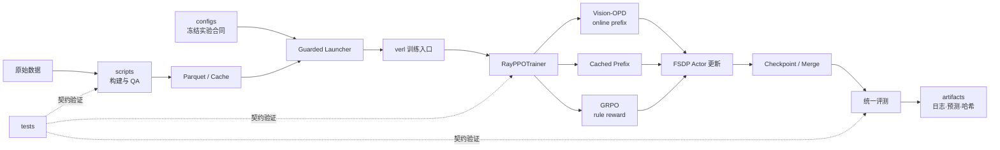

# Vision-OPD 项目复盘（精简主线版）

> 本文采用 STAR 框架，重点保留项目框架、核心问题、关键决策和执行方法。命令、逐日日志与完整证据不在正文重复，统一引用 `docs/`、`configs/` 和 `artifacts/`。执行细节只写入 Action 对应阶段；Day 仅作为时间与证据索引。
>
> 本文默认不自动更新；只有用户明确提出同步精简版时，才基于当时的完整版重新提炼。

## Situation：项目背景

### 1.1 Vision-OPD 研究的问题

多模态模型看整图时，可能因缩放和视觉信息压缩而看不清关键细节。本项目研究：能否在训练时借助更清晰的局部裁剪图，让部署时只看完整图像的模型也能更好地识别细节？

Vision-OPD 采用从局部到整图的在线自蒸馏：

- Student 看完整红框图，用当前模型在线生成回答前缀（已经生成的部分回答）。
- Teacher 看相关裁剪区域，沿用同一前缀，提供下一 token 的概率分布。
- 用 Top-K JSD 衡量师生分布差异，并据此训练 Student；Teacher 通过 Student 参数的指数移动平均（EMA）更新，无需独立的外部大模型教师。
- 训练结束只保留 Student，推理时不再需要裁剪工具或 Teacher。

在线前缀让监督作用于 Student 当前实际生成的轨迹，而非固定的历史回答，有机会减少训练与推理之间的偏差。局部视觉优势能否迁移，仍需实验验证。

### 1.2 本项目需要回答的研究问题

以冻结的 Qwen3.5-4B 为共同起点，重点回答：

1. 区域到整图的在线自蒸馏能否提升细粒度视觉理解？
2. 如果出现提升，它来自 Crop Teacher 的局部视觉信息，还是普通离线前缀蒸馏也能达到？当前前缀对照不能单独隔离 crop 的贡献。
3. 将在线前缀换成训练前 Base 生成的固定缓存后，效果和训练行为如何变化？
4. 不使用 Crop Teacher 和 JSD，只按选择题答案正确与否提供奖励的 GRPO，能否改善模型？
5. token 分布监督与最终答案奖励分别带来哪些修正、退化、成本和稳定性差异？
6. 能否在有限双卡资源下，完成从数据、小规模试跑、正式训练到模型合并和统一评测的可复现流程？

实验包含 Base、Vision-OPD、Cached Prefix 和 GRPO 四组模型。三条训练分支均从同一 Base 独立初始化，不继承彼此的训练权重。

### 1.3 Situation 一句话总结

利用训练时更清晰的裁剪区域，通过在线自蒸馏改善只看整图的 Student，并用 Cached Prefix 和 GRPO 比较在线轨迹、离线前缀与结果奖励的效果及代价。

## Target：项目目标

### 2.1 总体目标

围绕同一冻结的 Qwen3.5-4B、同一版本的 6,241 条 Vision-OPD 数据和统一外部评测，建立可复现、可比较、可审计的四模型实验。

- **研究目标**：验证在线自蒸馏的效果，比较在线轨迹、离线前缀和结果奖励的差异。
- **工程目标**：在双卡 RTX PRO 6000 和有限内存、磁盘条件下，稳定完成数据处理、在线生成、分布式训练、模型保存恢复、合并和重新加载。
- **评测与交付目标**：用统一协议比较四模型，交付可加载模型、逐样本结果、典型错误案例和资源成本，让结论能够复核。

### 2.2 四条实验路线的目标

| 路线 | 核心目标 | 关键验证 |
|---|---|---|
| Base / Vanilla | 直接评测原始模型，提供基线、三条分支的共同起点和 GRPO 的冻结参考模型 | 权重、图像处理、分词和生成设置可追溯；不产生新训练模型 |
| Vision-OPD | 用 Crop EMA Teacher 的分布指导整图 Student 的当前在线轨迹 | 整图/裁剪图配对、在线前缀、JSD 和 EMA 正确；Student 真实更新，能独立加载推理 |
| Cached Prefix | 用训练前 Base 的固定前缀替代在线生成，检验前缀来源的作用 | 其余蒸馏条件尽量一致；缓存与样本、token 和有效回答位置正确对齐；训练期间在线生成次数为 0 |
| GRPO | 每题生成多个回答，按最终选项正确性给奖励，用组内相对表现更新策略 | 全部 6,241 条数据可判分；标准答案只用于奖励；同题回答正确分组；正确性奖励产生真实训练梯度 |

GRPO 不使用 Crop Teacher、JSD、EMA Teacher、Critic 或学习式奖励模型；需确认参数变化并非仅来自策略约束（KL）或权重衰减。三条训练路线都要验证稳定训练、保存恢复、合并和统一外评。

Cached Prefix 是前缀来源的关键消融；GRPO 与蒸馏的监督来源和计算预算不同，属于后训练路线比较，不能视为严格单变量对照。

### 2.3 Target 一句话总结

从同一 Base 和 6,241 条数据独立训练 Vision-OPD、Cached Prefix、GRPO，交付三个可重新加载的训练后模型及 Base 基线，用统一的 2,536 条外部评测、逐样本案例和训练证据，说明各路线的效果、退化与工程成本。

## 3. Action：执行过程

### 3.1 总体执行路线

```text
目标与边界冻结
→ 代码/环境理解
→ 数据与评测冻结
→ Vision-OPD Smoke/Pilot/Gate
→ 6K Vision-OPD 正式训练
→ Cached Prefix 消融
→ 三模型评测
→ GRPO Reward/Pilot/正式训练
→ 四模型统一评测与交付
```

全程遵循三个原则：先冻结再训练、先小规模证明正确再扩量、模型路线从同一 Base 独立启动。

### 3.2 基础准备：理解方法、代码与运行环境

#### 3.2.1 方法拆解

Vision-OPD 的关键不是普通 Teacher–Student 蒸馏，而是四个约束同时成立：

- 视角不对称：Student 看 full image，Teacher 看 crop。
- 轨迹一致：Teacher 使用 Student 当前在线生成的 prefix。
- 监督稀疏：只在有效位置的 Top-K token 上计算 JSD。
- 更新不对称：Student 反向传播，Teacher 仅做 EMA。

可概括为：

```text
L = L_task + λ_kd · JSD_top-k(Student(full, prefix), Teacher(crop, prefix))
Teacher ← μ·Teacher + (1-μ)·Student
```

#### 3.2.2 仓库架构



| 目录 | 项目职责 |
|---|---|
| `configs/` | 冻结训练、评测、资源和 Gate 配置 |
| `scripts/` | 数据构建、QA、缓存、启动、合并和审计 |
| `verl/` | 分布式训练主干及 Vision-OPD/Cached/GRPO 扩展 |
| `eval/` | 生成、解析、Judge、汇总和逐样本比较 |
| `tests/` | 数据、loss、EMA、Reward、恢复和评测契约测试 |
| `artifacts/` | 每次运行的日志、配置、checkpoint、预测和凭据 |
| `docs/` | 阶段简报、冻结说明、结果与复盘 |

核心调用链为：冻结配置 → guarded launcher 预检 → `main_ppo` → `RayPPOTrainer` → 各训练分支 → FSDP 更新/保存 → merge → 统一评测。

#### 3.2.3 运行环境

| 项目 | 冻结配置 |
|---|---|
| 平台 | AutoDL Linux，2×RTX PRO 6000 96GB |
| 驱动/CUDA | Driver 580.95.05，CUDA 12.8 |
| CPU/内存 | 44 vCPU；宿主机约 1 TiB，但训练容器受 240 GiB cgroup 限制 |
| 磁盘 | 正式启动前保留至少 120 GiB 安全余量 |
| Python/框架 | Python 3.12.13，PyTorch 2.10.0+cu128，Transformers 5.5.0，vLLM 0.18，Ray 2.53，FlashAttention 2.8.3.post1，verl 0.7 editable |
| 精度/并行 | bf16、双卡 FSDP、必要组件 offload |

环境冻结依赖版本、设备拓扑、模型 revision、数据哈希和关键路径。安装器提示不等于运行失败，最终以导入、CUDA、算子和最小链路 Smoke 为准。

#### 3.2.4 GPU 显存、CPU 内存与 cgroup

GPU 显存主要承载参数、梯度、激活、KV cache 和 CUDA workspace，决定模型能否训练及 batch/长度上限；CPU 内存承载数据、Ray 进程、缓存、offload 参数/优化器和 checkpoint 暂存，决定系统能否持续运行。

可见的宿主机内存不等于进程可用内存。不开卡环境曾只有约 2 GiB cgroup 配额，重任务超过配额会触发 OOM kill，常见表现是退出码 137；开卡训练容器的 240 GiB 同样来自 cgroup 上限，而不是宿主机总容量。

迁移到其他环境时按“有效上限”预算：

```text
可用 CPU 内存 = cgroup limit - 系统/Ray/数据缓存/offload/checkpoint 峰值 - 安全余量
可用显存 = 单卡显存 - 参数/梯度/激活/KV/通信与运行时峰值 - 安全余量
```

优先用实测高水位校准估算，并将正式运行控制在限制以下，而不是只看平均值。

#### 3.2.5 Three-way offload 资源方案

资源瓶颈来自 Student Actor、冻结 Reference/Teacher 和优化器状态同时驻留。项目采用三路卸载：

| 对象 | 策略 | 目的 |
|---|---|---|
| Actor 参数 | 计算时上卡，非计算阶段按需卸载 | 降低常驻参数显存 |
| 优化器状态 | 延迟到更新阶段驻留，更新后卸载 | 削减最危险的更新峰值 |
| Reference/Teacher | 前向时上卡，完成后卸载 | 避免冻结模型长期占卡 |

该方案利用不同组件的生命周期错峰，而不是简单减少 batch。A/B 中，在共同 offload 基础上延迟优化器驻留，使双卡峰值约从 94.69/94.95 GiB 降到 80.02/85.26 GiB，最坏利用率约从 99.33% 降到 89.19%；CPU cgroup 比例基本不变（约 79%）。因此它是项目较有工程亮点的一部分，但收益应准确表述为“生命周期调度降低显存峰值”，不能把所有改善都归因于单一开关。

### 3.3 定义目标、实验边界并冻结

先把研究问题转成最小可证伪实验：Vision-OPD 对 Base 是否提升；在线前缀相对 Cached 是否有效；GRPO 与蒸馏的收益和代价有何不同。

| 冻结维度 | 决策 |
|---|---|
| 模型 | 同一 Qwen3.5-4B revision，各路线独立冷启动 |
| 数据 | source=6,241，effective=6,240，global batch=8，drop 1，不 padding |
| 变量 | Vision-OPD/Cached 只改变 `prefix_source`；GRPO 单独定义监督机制 |
| 评测 | ZoomBench 845、MMStar 1,500、V* Bench 191，共 2,536 条 |
| 协议 | 同输入、生成上限、解析、固定 Base Judge、错误规则和分母 |
| 资源 | 双卡、预算、磁盘、保存间隔、恢复和中止条件 |

冻结分为五层：研究合同、数据身份、训练配置、评测协议、运行证据。若发现必须修改的错误，先保留旧结果，再版本化新协议并说明影响，禁止静默覆盖。

### 3.4 数据工程 I：建立 1K 小闭环

先从官方元数据确定性抽样，构建历史 train-1024、eval-128 和 retention-64。为每条样本生成稳定 ID，配对 full image、crop、bbox、问题与答案，完成解码、Schema、路径、重复、长度和人工抽查，并用 SHA256 冻结。

目的不是提前得到结论，而是低成本验证数据—训练—评测—归档全链路。

### 3.5 评测准备 I：Base 与缓存

在内部 eval-128 上运行 Base，保存逐样本输出、解析和失败记录；同时用训练前 Base 为 train-1024 生成 Cached Prefix，验证 sample ID、文本和 token 对齐。早期缓存只作工程证据，全量数据冻结后重新生成。

### 3.6 冻结外部评测协议

准备 ZoomBench、MMStar 和 V* Bench，先做端到端 Smoke，再冻结 prompt、图像处理、生成参数、解析器、Judge、错误规则和分母。

训练集与 Benchmark 同时进行文件哈希、规范化问题文本和图像感知哈希 overlap 审计；重叠样本不静默删除，而是在官方主分母外单独诊断。最终用固定原始 Base Judge 完成 2,536 条 Base 基线。

### 3.7 Vision-OPD 工程验证：Smoke、Pilot、Gate

用真实样本逐级验证：Student 在线生成 → Teacher crop 前向 → 同前缀 Top-K JSD → Student 反向 → optimizer step → Teacher EMA。

Smoke 验证功能正确；64 条、8-step Pilot 验证 JSD、梯度、mask、长样本、显存/内存、checkpoint 和冷加载；最后根据实测吞吐和峰值冻结正式配置、预算、中止条件及 fail-closed Gate。

### 3.8 数据工程 II：扩展到 6,241 条

将项目范围扩展到冻结 revision 的全部 6,241 条数据，保留 1K 阶段证据但不再使用旧正式方案。重新构建 manifest、下载 full/crop、完成全量 QA、长度与截断审计、Benchmark overlap、drop-last 和 checkpoint 预算，并生成全量 Cached Prefix。

正式合同：source=6,241、effective=6,240、dropped=1、global batch=8、optimizer steps=780。

### 3.9 Vision-OPD 6K 正式训练

从 Base 冷启动，使用在线 Student prefix、Crop Teacher、Top-K JSD、EMA 和双卡守护入口训练 780 steps。

前 3 步强校验样本、轨迹、loss、梯度、EMA、长度和资源；全程记录 GPU、cgroup、磁盘、心跳和训练指标；中途验证恢复，结束后核对 step、覆盖、checkpoint、哈希和退出凭据。OOM、NaN、Teacher 直接梯度或 Student/EMA 不更新均触发保留现场并中止。

### 3.10 Vision-OPD 定版与 Cached Pilot

审计并合并最终 FSDP checkpoint，在新进程冷加载固定样本，按训练合同定版而非根据外评分数挑 checkpoint。

Cached 模式按 sample ID 读取训练前 Base 前缀，绕过在线生成；Teacher 仍看 crop，Student 仍看 full image，JSD、EMA、batch、steps 等不变。Pilot 重点证明在线生成调用为 0、缓存身份正确且训练/保存/冷加载正常。

### 3.11 Cached Prefix 6K 正式训练

从同一 Base 独立冷启动，使用相同数据、seed、batch、780 steps、学习率、长度、Top-K JSD、EMA 和守护策略，唯一申报差异为 `prefix_source=cached`。

训练前段验证缓存哈希和调用路径，结束后校验覆盖、checkpoint、遥测、成本和 SHA256，再合并最终 Student。

### 3.12 三模型统一评测

冻结模型、比较程序和 Bad Case 规则后，对 Base、Vision-OPD、Cached 运行相同的三项 Benchmark。保存逐样本 prediction、Judge、score、summary 和 validation，并分析 corrected、regressed、invalid、长度和 overlap。

MMStar 固定 1,024-token 上限作为 R4 主口径；自适应上限只作诊断，避免混入主表。此阶段形成不含 GRPO 的可独立交付版本。

### 3.13 GRPO 数据、Reward 与静态 Gate

将 train-6241 转成 GRPO Schema。Policy 只接收整图、问题和选项；crop 与 Vision-OPD 字段不进入策略输入；gold 仅供 Reward 使用。

Reward 保守解析唯一最终选项：正确为 1，其余为 0。通过单测、格式变体和全量正确/错误模板验证，防止任意字母回退等奖励漏洞。

配置冻结为 prompt batch=8、rollout n=4、组内相对优势、冻结 Base reference 和单一 KL 路径；不使用 Critic、学习式 Reward Model、Teacher、JSD 或 EMA。

#### 3.13.1 Reference：冻结的策略锚点

Reference Policy $\pi_{ref}$ 是从原始 Base 初始化、训练期间始终冻结的模型。它不生成另一套答案，而是在 Actor 已生成的同一 response 上计算 token-level log-prob，与当前 Actor $\pi_\theta$ 的概率差形成 KL 正则：

```text
L_actor = L_GRPO + 0.001 × L_KL
```

项目配置为 `use_kl_loss=true`、`kl_loss_type=low_var_kl`、`use_kl_in_reward=false`，即 KL 只直接加入 Actor loss，不再从 Reward 中重复扣除。Reference 用于限制策略为追逐规则奖励而过度偏离 Base；系数过大会抑制学习，过小则增加策略漂移和 Reward hacking 风险。

它与其他角色不同：Actor 可训练；Old Policy 只在一批更新内固定，用于 importance ratio/PPO clip；Reference 在整个训练中冻结，提供长期 KL 锚点；Vision-OPD EMA Teacher 会更新并看 crop，负责分布蒸馏。Reference 虽无梯度和 optimizer state，仍需模型前向，因此通过 `reference_parameter_offload=true` 按需上下 GPU。

### 3.14 GRPO 32/64 Prompt Pilot

先跑 32-prompt 功能 Pilot，再跑 64-prompt 稳定性 Pilot。逐题核对 group UID、response、prediction、gold、Reward、advantage、mask 和 policy version，并离线复算组内优势。

只有在 mixed-reward group、有限非零 PG、Actor 参数更新、无 Reward hacking，且 checkpoint/恢复/合并/冷加载和资源均通过后，才开放正式训练。

### 3.15 GRPO 6K 正式训练

从原始 Base 独立启动，不继承其他路线或 Pilot 权重。6,240 个有效 prompt，每题 4 个 rollout，共 24,960 条有效轨迹和 780 个外层迭代。

前 3 个迭代复核分组、Reward、advantage、PG、KL、entropy、长度和资源；全程监控 mixed-group、全对/全错、invalid、选项分布、截断、KL、clip fraction、grad norm、吞吐和高 Reward 输出；结束后校验 checkpoint、覆盖与更新计数。

### 3.16 GRPO 定版与评测

合并最终 Actor，保存权重、tokenizer、processor、chat template 和哈希，并在新进程冷加载。固定最终训练步，不按外评分数选择中间 checkpoint。

先完成 4 模型 × 3 Benchmark Smoke，再按相同输入、解析、固定 Base Judge、错误规则和分母运行 2,536 条全量评测。

### 3.17 四模型比较与项目交付

统一报告四模型的数据覆盖、监督信号、loss、更新参数、steps、GPU 小时、墙钟和成本；逐样本分析 corrected、regressed、分歧、解析失败、长度、重叠和 Reward 投机。

最终归档模型、配置、命令、日志、预测、哈希和费用，并更新 README、最终报告、证据索引、复盘、面试材料和简历内容。

### 3.18 训练流程与时间证据索引

| 标准后训练阶段 | 时间 | 本项目执行 |
|---|---|---|
| 目标与资源冻结 | Day 1 | 冻结 Base、矩阵、硬件、预算和证据规则 |
| 数据小闭环 | Day 2–3 | 构建并 QA 1K 训练数据 |
| 基线与评测冻结 | Day 4–6 | Base、早期缓存、三项 Benchmark 与协议 |
| 方法工程验证 | Day 7–9 | Vision-OPD Smoke、Pilot、恢复与资源 Gate |
| 全量数据与预检 | Day 10–11 | 扩展 6,241 条，冻结正式训练合同 |
| Vision-OPD 正式训练 | Day 12–13 | 780 steps、合并、哈希和冷加载 |
| Cached 消融 | Day 13–14 | Pilot、780-step 正式训练与定版 |
| 三模型评测 | Day 15–16 | 统一评测、协议修复和 Bad Case |
| GRPO 准备 | Day 17 | 数据、Reward、反投机测试和静态 Gate |
| GRPO Pilot | Day 18 | 32/64 prompt 功能与稳定性验证 |
| GRPO 正式训练 | Day 19 | 780 iterations、24,960 条有效轨迹 |
| 定版与四模型评测 | Day 20 | GRPO 合并及统一 2,536 条评测 |
| 分析与交付 | Day 21 | 结果、成本、边界、证据和文档归档 |

### 3.19 Action 总结

项目采用“1K 打通链路、6K 完成主实验、GRPO 独立扩展”的渐进路线。核心执行方法是：先定义如何证明有效，再用 Smoke/Pilot/Gate 证明训练正确，随后正式训练；最后在同一协议下比较四模型，并用逐样本证据、资源数据和失败案例解释结果。

## 4. 项目面试问题与准备状态

这不是 3.2 的单阶段内容，而是覆盖整个项目的横向答辩索引。详细答案和证据仍归入对应的 Situation、Target、Action 或 Result，本章只组织问题和检查准备度。

### 4.1 问题归属与准备度

| 问题组 | 主要归属 | 当前状态 |
|---|---|---|
| 研究问题与方法直觉 | Situation、Target、Action 3.3 | 基础具备，需形成 30 秒和 2 分钟版本 |
| JSD、EMA 与逐张量实现 | Action 3.7～3.11 | 待补数学、shape、mask 和梯度流 |
| Qwen3.5、Ray/FSDP/vLLM | Action 3.2、3.7 | 环境资源较完整，模型与同步语义待补 |
| Vision-OPD/Cached/GRPO 边界 | Action 3.9～3.16 | 概念具备，数学与公平性证据待补 |
| 失效模式、评测归因与结论边界 | Action 3.12～3.17、Result | 待结合最终结果完善 |

### 4.2 面试官的五类核心追问

1. 为什么：感知瓶颈、crop 特权信息和 on-policy prefix 为什么成立？
2. 数学是什么：Top-K JSD、EMA、GRPO advantage、KL 和 mask 如何定义？
3. 代码如何实现：一条样本怎样经过 dataset、rollout、Teacher、loss、更新和 checkpoint？
4. 实验如何归因：变量是否隔离，缓存、Reward、Judge 和外评分母是否公平？
5. 结论边界是什么：crop 错误、Reward hacking、通用能力退化和单 seed 等限制如何处理？

### 4.3 准备齐全的标准

每个核心问题都应能提供：

- 30 秒直觉版；
- 2 分钟结构版；
- 白板数学与梯度版；
- 代码定位与张量流版；
- 项目证据、反例和结论边界版。

### 4.4 后续补强顺序

1. 一次 Vision-OPD optimizer step 的张量、shape、device 和 mask。
2. Top-K JSD、EMA 和 importance sampling 的公式与代码对应。
3. on-policy 与 Cached Prefix 的状态分布差异。
4. Qwen3.5 视觉 token、位置编码和 crop 信息密度。
5. Ray、FSDP、vLLM 的分工、通信和 policy 权重同步。
6. GRPO 的 Reward、组相对 advantage、KL 与失效模式。
7. 四模型的公平比较、Bad Case 和最终结论边界。

## 5. Result：待后续复盘

后续按统一评测结果补充：核心指标、增益与退化、消融结论、GRPO 对比、成本收益、失败案例、项目亮点与可改进项。
