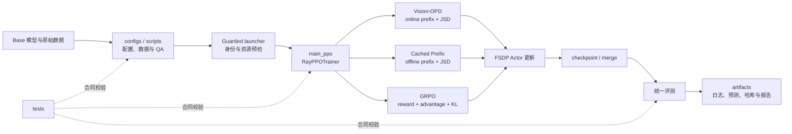

# Vision-OPD 项目复盘

> 持续维护中。正文将随本对话中的项目复盘逐步补充。
>
> 双版本维护规则：日常对话只更新本完整版；`project_retrospective_compact.md` 保持不变。只有用户明确提出更新精简版时，才基于当时的完整版重新提炼并更新精简版。

## 1. 项目背景（Situation）

### 1.1 行业与技术背景

近年来，多模态大语言模型（MLLM）在通用图像理解、视觉问答和图文推理任务上取得了明显进展，但它们在细粒度视觉场景中仍然容易失败。例如，当问题依赖图像中的小目标、局部文字、细小属性、遮挡区域、物体间局部空间关系或高分辨率区域时，模型即使能够理解整幅图像的大意，也可能无法获得回答问题所需的关键局部证据。

这一问题并不只是语言推理能力不足。多模态模型在进入语言模型前，通常需要对图像进行缩放、切块、编码和视觉 token 压缩。为了控制显存、上下文长度和推理成本，完整高分辨率图像往往只能被表示成有限数量的视觉 token。小目标或局部纹理在这个过程中可能被弱化甚至丢失。语言模型可以基于已有视觉信息推理，却无法可靠恢复在视觉编码阶段没有被保留下来的细节。因此，模型可能出现“知道应该看哪里，但实际上没有看清”的现象。

最直接的解决办法是让模型在推理时放大、裁剪或反复观察相关区域，或者为模型增加目标检测器、OCR、区域检索和视觉工具调用。这类方案可以改善局部感知，但也会引入新的代价：推理流程从单次前向变成多阶段系统，延迟和显存开销增加，需要维护额外工具及路由逻辑，并且上游区域选择一旦错误，后续推理仍然可能失败。另一类方法依赖更强的外部教师、人工标注或奖励模型，也会增加数据构建和系统训练成本。

因此，本项目关注的核心矛盾是：**裁剪后的局部区域更容易看清，但实际部署希望模型只输入完整图像、通过一次前向就完成回答。如何把训练阶段的局部视觉优势迁移到完整图像策略中，同时避免部署阶段继续依赖裁剪、工具或外部教师？**

### 1.2 Vision-OPD 研究的问题

Vision-OPD 将上述问题建模为一种从区域到全局的 on-policy 自蒸馏问题。训练时构造两个视角：

- Student 观察完整的红框图，输入形态与最终部署一致；
- Teacher 观察与问题相关的裁剪区域，拥有更清晰的局部视觉信息；
- Student 先用当前策略在线生成回答前缀；
- 在同一条 Student 当前轨迹上，比较 Teacher 与 Student 的 token 概率分布；
- 使用 Top-K JSD 将 Crop Teacher 的局部感知能力蒸馏给完整图像 Student；
- Teacher 由 Student 参数的 EMA 更新，因此不需要一个永久独立的外部大模型教师。

这里的关键不是让 Student 模仿一批预先生成的固定答案，而是让 Teacher 在 Student 当前真实会访问的自回归状态上提供分布级监督。因为生成模型后续每个 token 都依赖此前的 prefix，一旦 Student 的当前轨迹与离线缓存轨迹不同，固定前缀上的监督就可能出现分布偏移。on-policy prefix 的研究价值正在于：监督信号始终作用在当前策略真正访问的状态上，有机会减少训练—推理不一致和自回归误差累积。

训练完成后，只保留完整图像 Student。Teacher crop、EMA Teacher 和在线双视角过程只存在于训练阶段，推理时不需要裁剪工具、区域搜索或额外教师模型。这使研究目标不仅是提高 Benchmark 分数，也包括把训练阶段的特权区域信息压缩进可单次部署的模型参数。

### 1.3 本项目需要回答的研究问题

本项目以冻结的 Qwen3.5-4B 为共同起点，围绕以下问题进行受控复现与扩展：

1. Vision-OPD 的区域到全局 on-policy 自蒸馏，能否提升 4B 多模态模型的细粒度视觉理解能力？
2. 改进如果存在，究竟来自 Crop Teacher 提供的局部视觉分布，还是来自普通的离线前缀蒸馏？
3. 将在线 Student prefix 替换为训练前 Base 生成的 Cached Prefix 后，效果和训练行为如何变化？这构成对 prefix 来源的关键消融。
4. 不使用 Crop Teacher 和 JSD，而是对同一批可验证视觉选择题使用规则 Reward 与 GRPO，能否通过结果正确性信号改善模型？
5. Vision-OPD 的稠密 token 分布监督与 GRPO 的稀疏结果奖励各自带来哪些修正、退化、训练成本和稳定性差异？
6. 在有限双卡资源下，能否建立一套从数据、Pilot、正式训练、checkpoint 合并到统一外部评测都可审计、可复现的后训练流程？

项目因此设置了四组模型：未经项目训练的 Base、在线自蒸馏的 Vision-OPD、离线前缀对照 Cached Prefix，以及规则奖励强化学习 GRPO。三条训练分支均从同一 Base checkpoint 独立初始化，日程上的先后不代表模型权重的串行继承。

### 1.4 为什么这个问题有研究价值

#### 科学价值：区分“看不清”和“不会推理”

细粒度视觉任务把多模态模型的感知瓶颈暴露得更明显。研究这类问题有助于判断错误究竟来自视觉证据缺失，还是来自语言推理错误。Vision-OPD 通过 Teacher/Student 的视角差异，把“局部区域看得更清楚”转化为可训练的分布差异，为研究感知能力如何迁移到完整图像策略提供了明确路径。

#### 方法价值：研究 on-policy 自蒸馏

传统离线蒸馏通常在固定数据或固定教师轨迹上进行，而自回归模型实际生成时访问的是由当前策略决定的状态分布。本项目通过 Vision-OPD 与 Cached Prefix 的对照，研究在线轨迹是否比离线缓存轨迹更适合提供蒸馏监督。这不仅适用于视觉任务，也与语言推理、工具调用和长轨迹模型中的 exposure bias、轨迹分布偏移问题相关。

#### 对齐价值：比较稠密监督与结果奖励

Vision-OPD 在每个生成位置使用 Teacher token 分布提供较稠密的训练信号；GRPO 则根据最终选项是否正确给出稀疏规则 Reward，再利用同题多条 rollout 的组内相对优势更新策略。把两者放在同一个 Base、数据来源和评测协议下比较，可以观察“过程中的分布引导”和“最终结果正确性优化”在多模态任务中的不同作用。两者不是严格单变量算法对照，但构成有意义的后训练路线比较。

#### 工程价值：训练复杂、部署简单

如果局部感知能力能够在训练阶段写入 Student 参数，部署时就可以避免额外的 crop、zoom、OCR 或区域选择工具，保持完整图像上的单次推理。这有助于降低在线服务延迟、系统耦合、故障点和维护成本。项目还验证了在 4B 模型和双卡资源下进行数据审计、分级 Pilot、FSDP 训练、checkpoint 恢复/合并及统一评测的可行性。

#### 实验价值：建立可解释的受控比较

项目没有只训练一个模型并报告最终分数，而是设置 Base、Vision-OPD、Cached Prefix 和 GRPO 四条路线，并冻结模型身份、数据 revision、随机种子、评测请求、解析器、Judge 和分母。这样的设计可以进一步回答：哪些 Base 错题被修正、哪些正确样本发生退化、提升是否集中于某类视觉问题，以及训练收益是否值得其计算成本。

### 1.5 项目背景的边界

本项目研究的是细粒度多模态感知的专项后训练，而不是从随机参数开始预训练一个通用基础模型，也不是覆盖 CPT、SFT、DPO、安全对齐和线上灰度的完整工业大模型流水线。Vision-OPD 主实验不依赖 ground-truth Reward；后续 GRPO 扩展则明确使用选择题 gold 构造规则奖励，二者的监督来源必须分开表述。

项目最终能够支持的结论，应限定为：在冻结的 Qwen3.5-4B、Vision-OPD-6K 数据与统一多模态评测协议下，对区域到全局 on-policy 自蒸馏、离线前缀消融和规则奖励 GRPO 三种训练路线进行可复现比较。它不能直接推出模型在所有通用、多轮、安全或生产场景中都获得提升。

### 1.6 Situation 一句话总结

多模态大模型能够理解图像整体语义，却经常因视觉 token 压缩和局部信息不足而看不清关键细节；本项目研究如何利用训练阶段更清晰的裁剪区域作为特权信息，通过 on-policy 自蒸馏把局部感知能力迁移到只看完整图像的 Student，并进一步以 Cached Prefix 和 GRPO 分支分析在线轨迹、离线蒸馏与结果奖励三类后训练信号的作用及代价。

## 2. 项目目标（Target）

### 2.1 总体目标

本项目的总体目标不是简单地“把训练脚本跑通”，而是围绕同一个冻结的 Qwen3.5-4B、同一 revision 的 6,241 条 Vision-OPD 数据和同一套外部评测协议，建立一套可复现、可比较、可审计的多模态后训练实验矩阵，完成 Base、Vision-OPD、Cached Prefix 和 GRPO 四条路线的模型、训练证据与统一评测交付。

项目需要同时达到三个层面的目标：

1. **研究目标**：验证区域到全局的 on-policy 自蒸馏是否能够改善细粒度视觉理解，并分析在线轨迹、离线缓存轨迹和结果奖励三种训练信号的差异。
2. **工程目标**：在双卡 RTX PRO 6000、有限内存与磁盘条件下，稳定完成多模态数据处理、在线 rollout、FSDP 训练、checkpoint 保存恢复、权重合并和冷加载。
3. **评测与交付目标**：以统一、冻结且可追溯的协议比较四组模型，保存逐样本证据、Bad Case、资源与成本，而不是只交付无法复核的汇总分数。

### 2.2 四条实验路线的目标

#### Base / Vanilla：建立统一起点

Base 不进行本项目训练，直接评测冻结的原始 Qwen3.5-4B。它的目标是提供训练前基线，回答“后训练模型相对原始模型改变了什么”。Base 还承担三条训练分支的共同初始化身份，以及 GRPO 的冻结 reference 身份。

需要保证 Base 权重、processor、tokenizer、chat template、生成参数和模型哈希可追溯。Vanilla 只是对 Base 的直接推理与评测，不产生新的 checkpoint。

#### Vision-OPD：完成项目主实验

Vision-OPD 的目标是让完整图像 Student 在其当前在线生成轨迹上，接受 Crop EMA Teacher 的 Top-K JSD 分布监督，把局部区域中更清晰的视觉证据迁移到 Student 参数中。

该分支需要证明的不只是 loss 能下降，还包括：

- Student 使用完整红框图，Teacher 使用对应裁剪图；
- prefix 确实由当前 Student 在线生成；
- Teacher/Student logits、Top-K 选择、JSD、mask 和 EMA 更新路径正确；
- 训练过程数值稳定，参数发生真实更新；
- 最终部署只需要完整图像 Student；
- 模型能够保存、合并并由新进程重新加载。

#### Cached Prefix：验证 on-policy prefix 的作用

Cached Prefix 的目标不是独立追求最高分，而是构造 Vision-OPD 的关键消融：使用训练前 Base 预生成并冻结的 Student prefix，替代训练期间的在线 Student rollout，其余蒸馏条件尽量保持一致。

该分支需要解决一个严格的合同问题：缓存文本经过 tokenizer 重编码后，prompt IDs、response IDs、EOS、padding、response mask、样本顺序和 JSD 计算必须与在线分支的训练语义一致；训练过程中在线 Student 生成调用应为 0。只有这些条件成立，才能把结果差异主要解释为 prefix 来源变化。

#### GRPO：比较结果奖励路线

GRPO 的目标是在不使用 Crop Teacher、JSD、EMA Teacher、Critic 和学习式 Reward Model 的情况下，让模型对每个视觉选择题在线采样多个回答，通过确定性规则判断最终选项是否正确，并利用组内相对优势直接优化策略。

该分支需要证明：

- 6,241 条数据全部能够稳定、无歧义地路由到规则 Reward；
- gold 只供 Reward 使用，不泄漏到策略输入；
- 每个 prompt 的多条 rollout 正确分组，不发生跨题串组；
- Reward、组均值、样本标准差、advantage 和 response mask 对齐；
- mixed-reward group 能产生来自正确性信号的真实 policy-gradient；
- Actor 参数变化不能只由 KL 或 weight decay 引起；
- 正式训练能够保存、恢复、合并并完成统一外部评测。

### 2.3 项目需要解决的核心问题

#### 研究问题

1. Crop Teacher 的局部视觉分布能否迁移给完整图像 Student？
2. on-policy prefix 是否比训练前 Base 的离线 Cached Prefix 更适合自回归蒸馏？
3. Vision-OPD 的稠密 token 分布监督与 GRPO 的稀疏结果 Reward，分别会修正和损害哪些能力？
4. 模型在专项细粒度能力上发生变化时，是否伴随 MMStar 等较通用多模态能力退化？
5. 训练收益是否来自真实视觉学习，而不是答案格式、输出长度、Judge 偏差、解析器漏洞或数据重叠？

#### 数据问题

1. 如何从冻结 revision 恢复并验证 6,241 条完整源数据？
2. 如何保证 full image、crop image、bbox、问题、答案与 sample_id 一一对应？
3. 如何处理损坏图片、缺失路径、异常 bbox、图文错配和多模态长尾长度？
4. 如何对训练数据与 ZoomBench、MMStar、V* Bench 进行文本、文件和感知哈希重叠审计？
5. 如何在三条训练分支之间保持数据身份和样本顺序可追溯？
6. 如何将 Vision-OPD 数据非破坏性地转换为 GRPO Schema，并保证 6,241/6,241 可规则判分？

#### 算法与实现问题

1. 如何在 verl 中正确实现 Student 在线 rollout、Crop Teacher forward、Top-K JSD、EMA 和多模态 mask？
2. 如何实现 Cached Prefix 分支，并证明它没有暗中进行在线生成？
3. 如何设计保守的选择题解析器，避免扫描任意大写字母、选项正文或冲突答案造成 Reward hacking？
4. 如何验证 GRPO 的 group UID、repeat/interleave、分布式重排、Reward、advantage 与 token mask 始终一致？
5. 如何区分 policy-gradient、KL 和 weight decay 对参数变化的贡献？
6. 如何处理 6,241 条数据不能被 global batch 8 整除的问题，并明确记录原生 drop-last 后 6,240 条有效训练和 1 条 dropped sample？

#### 系统与资源问题

1. 如何让 Qwen3.5-4B 的 Actor、Teacher/Reference、optimizer、vLLM rollout 和 FSDP 在两张 96GB GPU 上共存？
2. 如何通过 gradient checkpointing、动态 batch 和必要的 parameter/optimizer/reference offload 控制峰值显存及 CPU cgroup 压力？
3. 如何为多模态长 prompt 和最高 1,024-token response 选择不会静默截断的长度合同？
4. 如何处理 Ray、vLLM、Transformers、FlashAttention、FSDP 和 Blackwell GPU 之间的运行时兼容问题？
5. 如何建立显存、CPU、磁盘、心跳和训练异常的 fail-closed 守护，避免错误训练继续消耗预算？
6. 如何保证 checkpoint 可以原子保存、恢复、合并和冷加载，并避免误删唯一可恢复模型？

#### 评测问题

1. 如何保证 Base、Vision-OPD、Cached Prefix 和 GRPO 使用相同数据、图像、prompt、生成上限、解析器、Judge、错误规则和分母？
2. 在无法使用论文原 Judge 的情况下，如何冻结并校准本地 Base Judge，同时限定结论边界？
3. 如何处理明确答案、歧义答案、推理错误、Judge 错误和输出截断，避免只统计成功样本？
4. 如何避免外部 Benchmark 反向参与超参数选择或 checkpoint 挑选？
5. 如何从逐样本层面分析 corrected、regressed、方法分歧、数据重叠、解析失败和 Bad Case？

### 2.4 需要交付的产物

#### 模型产物

- 冻结的原始 Qwen3.5-4B Base 身份与哈希清单；
- Vision-OPD 最终 FSDP checkpoint 与合并后的 Hugging Face Student；
- Cached Prefix 最终 FSDP checkpoint 与合并后的 Hugging Face Student；
- GRPO 最终 Actor checkpoint 与合并后的 Hugging Face 模型；
- 每个最终模型配套的 config、tokenizer、processor 和 chat template；
- checkpoint 文件级 SHA256、合并凭据和模型身份 manifest；
- 每个最终模型的新进程冷加载与非空输出 receipt。

Base 本身不产生新的训练 checkpoint，因此最终是“三个训练后模型 + 一个冻结 Base”的四模型比较，而不是四个新训练模型。

#### 数据产物

- 6,241 条 source/candidate/train manifest；
- 冻结的训练 JSONL/Parquet 和数据 SHA256；
- 图片、路径、bbox、Schema、统计分布和 Processor 长度 QA 报告；
- 训练集与外部 Benchmark 的 overlap 报告；
- 6,241 条由训练前 Base 生成的 Cached Prefix、生成配置和一一对应审计；
- 6,241 条 GRPO Parquet/JSONL；
- 每条 GRPO 样本的 reward route、规范化 gold、可判分状态和审计字段；
- Reward 全量验证报告及正确、错误、异常格式测试证据。

#### 代码与配置产物

- Vision-OPD、Cached Prefix 和 GRPO 的冻结训练配置；
- 单机双卡启动脚本和 guarded launcher；
- 数据准备、Cached Prefix 生成和 GRPO 转换脚本；
- Vision-OPD/Cached 训练实现、GRPO Reward 模块及相关适配；
- 显存、CPU、磁盘、checkpoint 和异常中止策略；
- 固定外部评测配置、推理、Judge、评分与 validation 入口；
- 数据、Reward、训练合同、解析器和恢复路径的自动化测试。

#### 训练与运行证据

每个正式实验至少需要保存：

- 实际执行 config 与 resolved config；
- 完整命令、代码 commit、工作树 patch 或关键文件哈希；
- 模型、数据、Reward 和评测协议哈希；
- 环境、GPU、CPU/cgroup、磁盘和端口预检；
- Pilot 与正式训练日志、metrics 和资源遥测；
- rollout、Reward、advantage、mask、policy version 和抽查样本；
- optimizer update 数、有效样本覆盖与 dropped sample receipt；
- checkpoint 保存/恢复/合并记录；
- 墙钟、GPU 小时和费用；
- 失败 attempt、异常原因与修复凭据。

失败记录也是正式产物，不能删除或覆盖后只保留最终成功的一次。

#### 评测与分析产物

- Base、Vision-OPD、Cached Prefix、GRPO 在统一协议下的逐样本预测；
- 答案解析结果、Judge 请求/响应来源和错误记录；
- ZoomBench 845、MMStar 1,500、V* Bench 191，共 2,536 条的完整结果；
- 每个模型 2,536 个唯一结果键、固定分母及 validation receipt；
- 四模型总体与分 Benchmark 指标；
- 相对 Base 及模型间的 corrected、regressed 和净变化；
- 训练重叠与非重叠样本分层；
- 输出长度、invalid、截断和 A/B/C/D 选项分布；
- 预先规定抽样规则的代表性 Bad Case；
- 样本级配对 bootstrap 区间及其不能代表多 seed 稳定性的说明；
- 训练成本、推理成本、资源峰值和方法复杂度对照表。

#### 文档与项目交付

- 项目冻结文档、范围修订和 21 天执行计划；
- 各阶段工作简报、运行手册和证据索引；
- README 中可执行的数据准备、训练、合并和评测入口；
- 最终四模型比较报告；
- 项目复盘、面试问答和简历 bullet；
- 可审查的代码 diff、最终提交及里程碑 tag。

### 2.5 最终验收标准

项目完成不能只依据“训练进程正常退出”，至少需要满足以下标准：

1. **数据完整**：6,241 条源数据身份唯一、字段合法、图像可读、关键映射可追溯；GRPO 为 6,241/6,241 可判分。
2. **训练真实**：Vision-OPD 的 JSD/EMA、Cached 的离线 prefix、GRPO 的 Reward/advantage/PG 都有张量或逐样本证据，不能只是配置文件中声明开启。
3. **训练稳定**：正式训练无未解释的 NaN、OOM、Reward collapse、长度爆炸或组错配；异常均保留凭据。
4. **覆盖可核验**：三条分支均读取 6,241 条源数据，按现行原生 drop-last 合同有效训练 6,240 条、丢弃 1 条，并保存覆盖 receipt。
5. **模型可交付**：最终 checkpoint 完整，可恢复、可合并，并能在新进程中加载和生成非空结果。
6. **评测可比较**：四个模型使用同一冻结协议，每个模型的 2,536 条外部结果完整，无静默删样本或改变分母。
7. **结论可追溯**：报告中的每个核心数字都能追溯到训练日志、prediction、Judge 记录或机器生成报告。
8. **边界诚实**：明确资源缩放、单 seed、本地替代 Judge、无内部留出集、潜在 overlap 和不同方法并非严格单变量等限制。
9. **资源受控**：训练与评测成本、GPU 小时、墙钟和峰值资源均被记录，并满足项目预算及存储安全线。

### 2.6 非目标

为了防止项目范围被误解，以下内容不属于本项目 Target：

- 不从随机参数预训练一个基础模型；
- 不复现论文原始八卡资源配置或冒充复现论文全部数值；
- 不把已删除的 SFT、CPT、DPO 或学习式 Reward Model 描述为已完成；
- 不把 Vision-OPD、Cached Prefix 和 GRPO 串行训练成一个模型；
- 不依赖外部 Benchmark 反复调参或挑选中途 checkpoint；
- 不因为发现训练集与 Benchmark overlap 就静默删除官方测试样本；
- 不将训练 Reward、JSD loss 与外部 accuracy 混为同一指标；
- 不宣称三个视觉 Benchmark 能代表模型全部通用、安全和生产能力；
- 不把 checkpoint 冷加载等同于已经完成生产级灰度部署和线上反馈闭环。

### 2.7 Target 一句话总结

以冻结的 Qwen3.5-4B 和 6,241 条多模态数据为共同起点，独立完成 Vision-OPD 在线自蒸馏、Cached Prefix 消融和规则 Reward GRPO 三条后训练分支，交付三个可重载训练后模型及一个 Base 基线，并用统一的 2,536 条外部评测、逐样本 Bad Case、训练资源和完整哈希证据回答不同轨迹与监督机制的效果、退化和工程代价。

## 3. 行动（Action）

> 结构约定：Action 保留 3.1 总体执行路线，并按 3.2 基础准备、3.3 训练设计、3.4 数据工程、3.5 Vision-OPD项目、3.6 Cached Prefix项目、3.7 GRPO项目、3.8 总结组织。共同环境与代码架构归入基础准备，共同实验边界和评测协议归入训练设计，共享数据处理归入数据工程；每个项目的方法、配置、Pilot、具体训练、恢复、排错、资源记录、checkpoint、合并和评测均直接补充到该项目内。跨项目比较与交付归入总结，不再按训练日程新增同级章节。Day 只作为时间与证据索引。

### 3.1 总体执行路线

项目没有直接启动 6K 正式训练，而是按照“先冻结、再小规模验证、再扩大、最后统一评测”的顺序推进：

论文与代码理解 → 项目和资源冻结 → 1K 数据与评测链路验证 → 外部 Benchmark 和 Base 基线冻结 → Vision-OPD 小规模 Pilot → 6,241 条全量数据 → Vision-OPD 正式训练 → Cached Prefix 消融 → 三模型评测 → GRPO 数据和 Reward → GRPO Pilot 与正式训练 → 四模型评测和交付。

日程上先完成 Vision-OPD，再完成 Cached Prefix 和 GRPO；模型血缘上，三条训练分支都从同一个冻结 Base 独立启动，不串行继承。

### 3.2 基础准备

正式排期前，先完成方法边界、仓库主链路、基础模型、软件栈和资源方案的验证。本节只保留后续训练共同依赖的内容；各路线的数学推导、张量流、具体实验和面试追问放入对应项目章节或第 4 章。

#### 3.2.1 前置方法确认

在设计实验前，我先确认三种训练方式在仓库中的真实语义和代码入口：Vision-OPD 是在线自蒸馏，Cached Prefix 是替换轨迹来源的离线前缀分支，GRPO 是规则 Reward 驱动的独立策略优化；CPT、SFT、DPO 和学习式 Reward Model 不在本项目执行范围内。

这一阶段只解决“是否理解方法、能否定位实现、基础模型能否运行”的前置问题，不在此处重复实验目标和对照关系。四路线的可执行实验矩阵统一放在第 3.3.1 节；算法公式、梯度路径和实际训练分别在 Vision-OPD、Cached Prefix、GRPO 项目章节展开。

#### 3.2.2 仓库架构与调用链



仓库按实验生命周期组织，而不是只围绕模型代码组织：

| 目录 | 核心职责 |
| --- | --- |
| `configs/` | 冻结数据、训练、资源、终止和评测参数 |
| `scripts/` | 数据构建、受控启动、监控、审计、合并与定版 |
| `verl/` | 数据集、Ray trainer、FSDP Worker、vLLM rollout、loss 与 Reward 实现 |
| `eval/` | 统一推理、解析、Base Judge、评分和逐样本比较 |
| `tests/` | 数据、算法、启动、恢复和评测合同测试 |
| `artifacts/` | 配置快照、哈希、日志、遥测、checkpoint、预测和报告 |
| `docs/` | 冻结决策、运行手册、阶段简报和项目复盘 |

主调用链为：

```text
项目 YAML
  → guarded launcher / preflight
  → Hydra overrides
  → verl.trainer.main_ppo
  → RayPPOTrainer
  → RLHFDataset + FSDP Worker + vLLM rollout
  → DataParallelPPOActor / core_algos
  → checkpoint → model_merger → 统一评测
```

关键实现入口：

| 模块 | 作用 |
| --- | --- |
| `verl/trainer/main_ppo.py` | Hydra 与 Ray 入口 |
| `verl/trainer/ppo/ray_trainer.py` | 采样、批处理、训练循环和保存 |
| `verl/utils/dataset/rl_dataset.py` | Parquet、多模态 processor 与 prompt |
| `verl/workers/fsdp_workers.py`、`verl/workers/rollout/` | FSDP 模型生命周期与 vLLM 生成 |
| `verl/workers/actor/dp_actor.py`、`verl/trainer/ppo/core_algos.py` | loss、反向传播、optimizer 与 EMA |
| `verl/trainer/ppo/cached_prefix.py` | Cached Prefix 读取与绑定 |
| `verl/utils/reward_score/vision_opd_mcq_grpo.py` | GRPO 确定性规则 Reward |

Ray 负责跨进程资源编排，FSDP 负责训练参数、梯度和状态的分片，vLLM 负责高吞吐 rollout；三者职责不同，共同组成训练运行时。

- **Ray：进程与任务调度框架。** 负责启动 Worker、分配 CPU/GPU、调用任务并回收结果。它不负责梯度计算，也不会自动解决显存不足。Ray Actor 是有状态远程进程对象，与策略模型 Actor 含义不同。
- **FSDP：全分片数据并行。** 将模型参数、梯度和优化器状态分散到多张 GPU；计算某个模块时临时收集所需参数，反向后汇总并重新分片梯度。它以通信换取显存，仍可能需要 offload。
- **vLLM：高效生成引擎。** 通过 KV cache 管理和连续批处理执行 rollout，只负责生成，不负责反向传播；训练 Actor 更新后需要把新权重同步给生成端。

可以简单记为：Ray 安排任务和资源，FSDP 执行多卡分片训练，vLLM 高效生成回答。

#### 3.2.3 实际运行环境

| 项目 | 冻结配置 |
| --- | --- |
| 计算环境 | AutoDL 单节点 Linux |
| Python 环境 | `/root/miniconda3/envs/vision-opd`，Python 3.12.13 |
| GPU | 2 × NVIDIA RTX PRO 6000 Blackwell Server Edition；PyTorch 可用显存约 94.97 GiB/卡 |
| 驱动 / CUDA | Driver 580.95.05，CUDA 12.8 |
| CPU | 44 个逻辑 CPU |
| CPU 内存 | 任务 cgroup 240 GiB；宿主机约 1 TiB 不能作为可用额度 |
| 磁盘 | 正式 Gate 120 GiB；实测可用约 361 GiB |
| 核心软件 | PyTorch 2.10.0+cu128、Transformers 5.5.0、vLLM 0.18.0、Ray 2.53.0、verl 0.7.0.dev0 |
| CUDA 扩展 | FlashAttention 2.8.3.post1（sm_120）、causal-conv1d 1.6.1 |
| 基础模型 | `/root/autodl-tmp/models/Qwen3.5-4B` |
| 正式数据 | `/root/autodl-tmp/data/vision_opd_6241` |

统一运行方式是双卡、Ray 编排、FSDP Actor/Teacher/reference、vLLM V1 rollout。rollout tensor parallel size 为 1、agent worker 为 2、`gpu_memory_utilization=0.4`、DataLoader worker 为 0；Vision-OPD/Cached 每卡动态 token 预算为 9,216，GRPO 为 8,320。

安装后存在少量上游包元数据冲突，因此环境验收不以 `pip check` 全绿为唯一标准，而以核心导入、真实模型加载、多模态推理、NCCL、训练 Smoke/Pilot 和 checkpoint 链路通过为准。

#### 3.2.4 GPU、CPU cgroup 与资源预算

GPU 显存主要承载参数、activation、梯度、部分 optimizer state、KV cache 和算子 workspace，决定模型规模、序列长度、图片尺寸、batch 和 rollout 并发；CPU 内存主要承载 Python/Ray 进程、数据处理、共享对象、offload 状态和 checkpoint staging。offload 会降低显存，但会增加 CPU 占用和传输开销，两者不能简单相加或互相替代。

“不开卡时只有 2 GiB”指平台给轻量容器设置的 CPU memory cgroup 上限，不是宿主机只有 2 GiB。达到 `memory.max` 时进程可能被 `SIGKILL`，表现为 exit 137；只有 `memory.events` 中 `oom/oom_kill` 增加时，才能确认是 cgroup OOM。本项目曾出现 exit 137 但 OOM 计数未增加，因此保留为未完全确认的外部 kill。

240 GiB 不是由 GPU 显存相加得到，而是同构 Pilot 的实测冻结值：六次有效运行峰值为 177.39～189.79 GiB，均无 `oom/oom_kill` 增量；以 95% 为中止线时，最高峰距离中止线仍有 38.21 GiB，距离硬上限有 50.21 GiB。

迁移到其他环境时必须重新测量：

```text
P = 多次同构 Pilot 的最大 cgroup 峰值
U = max(P × 不确定性比例, 绝对余量)
C_required = 向上取可申请档位((P + U) / 中止比例)
```

Pilot 应覆盖正式模型、GPU/FSDP 布局、并存模型、offload、长尾 token、rollout 数、worker、optimizer step、checkpoint 保存与恢复。正式启动前重新读取 `memory.max/current/peak/events`；资源不足时调整工作负载并重跑 Pilot，不能只降低 YAML 门槛。

#### 3.2.5 Three-way offload 资源方案

为解决双卡训练中 Actor、Teacher/reference 和 optimizer 同时驻留造成的显存峰值，项目采用三路卸载：

| 卸载对象 | 是什么 | 什么时候需要 | 卸载作用 | 代价 |
| --- | --- | --- | --- | --- |
| Actor parameters | 当前被训练的 Student/Actor 权重 | 生成、计算概率、反向传播、更新及最终推理 | 非计算阶段移到 CPU | 增加权重搬运 |
| Optimizer states | Adam/AdamW 等保存的一阶、二阶动量 | 参数更新及完整恢复训练；纯推理不需要 | 更新窗口外移到 CPU | 增加 CPU 内存与更新延迟 |
| Teacher/reference parameters | 提供蒸馏监督或 KL 参照的辅助模型权重 | Teacher 分布前向或 Reference 概率计算 | 不使用时移到 CPU | 切换阶段增加传输 |

Teacher 通过 Student 参数的 EMA 更新，Reference 始终冻结；二者都不通过反向传播训练，因此不需要自己的优化器状态。卸载只改变存放位置，不等于删除或冻结参数。

关键改造是 `defer_optimizer_state_load`：optimizer state 只在 `_optimizer_step()` 前加载到 GPU，更新后立即卸载，避免与 rollout、Teacher/reference forward 的显存高峰重叠。它改变的是资源生命周期，不改变损失函数和参数更新语义。

固定 Actor 输入的 A/B 结果：

| 指标 | 改造前 | 改造后 |
| --- | --- | --- |
| GPU0 峰值 | 94.69 GiB | 80.02 GiB |
| GPU1 峰值 | 94.95 GiB | 85.26 GiB |
| 最坏单卡占用率 | 99.33% | 89.19% |
| CPU cgroup 占用率 | 79.01% | 79.08% |

随后 1024-token 压力测试完成 16 个 step，最坏 GPU 占用 90.59%、CPU cgroup 76.34%，warmup、更新和 checkpoint 均通过。该方案的亮点是用阶段化驻留消除显存峰值，同时没有显著抬高 CPU 峰值；它属于有实验证据的工程优化，而不是新的训练算法。

#### 3.2.6 阶段验收与证据

环境与主链路按风险递增验收：

1. 核心包导入、模型文件与 tokenizer/processor 完整性；
2. 单卡普通多模态 vLLM 推理；
3. processor 输出、图像 token 和 chat template 一致性；
4. 双卡可见性、NCCL 与进程通信；
5. 真实 Ray + FSDP + vLLM Smoke；
6. 32/64/128 规模 Pilot、长尾 token 和 checkpoint I/O；
7. 正式启动前身份、资源、磁盘、配置哈希和授权 Gate。

每一步都把配置快照、manifest/SHA256、预检结果、日志、遥测和 checkpoint 写入 `artifacts/`。更细的安装命令、逐文件说明和环境排错证据保留在 `docs/environment.md`、各阶段工作简报、配置文件与 `artifacts/runs/` 中，不在复盘正文重复。

一句话总结：基础准备阶段完成了“方法边界明确、代码链路可定位、运行环境可复现、资源上限有实测、启动过程可审计”的共同底座。

#### 3.2.7 基础模型与分布式系统追问

本节先保留面试官听完基础准备后最可能提出的主问题，再按框架、资源、offload 和压力测试组织深入追问。

##### 一、面试主问题

1. **模型怎样结合图片和文字？你训练了哪些部分？**

   **答案：**Qwen3.5-4B 先对图片进行缩放、归一化和 patch 切分，由 ViT 类视觉编码器提取特征；merger 再合并相邻特征、减少视觉 token，并将其映射到语言模型的隐藏维度。文字经 tokenizer 和 embedding 变成文字向量，图像占位符被替换成真实视觉向量，二者组成同一输入序列；多模态位置编码帮助模型保留图像行列关系和文本顺序，语言模型据此逐 token 生成回答。

   merger 可以理解为视觉编码器与语言模型之间的“压缩器和接口转换器”。`spatial_merge_size=2` 时，相邻 `2×2` 特征合成一个视觉 token，数量约降为四分之一，再映射为语言模型需要的 2560 维向量。这样可降低计算和显存，但过小的局部细节可能被弱化。

   本项目 Student/Actor 采用全参数训练，没有使用 LoRA，也没有冻结视觉编码器，因此视觉编码器、merger 和语言模型都属于可训练范围。Vision-OPD/Cached 的 Teacher 不反向传播，由 Student 参数做 EMA 更新；GRPO 的 Reference 保持冻结。

2. **模型多模态合并采用 ViLT 还是 CLIP 类方案？两者有何区别？**

   **答案：**Qwen3.5-4B 既不是直接采用 ViLT，也不是直接使用 CLIP。它使用独立的 ViT 类视觉塔，经 merger 把视觉特征转换成语言模型可接收的视觉 token，结构上更接近“独立视觉塔 + 语言模型”路线。ViLT 让图像 patch 与文本 token 较早进入同一个 Transformer 联合编码；经典 CLIP 则用独立图像、文本编码器做图文对比学习，本身不负责逐 token 生成回答。因此不能把 Qwen3.5 简单称为 ViLT 或 CLIP。

3. **视觉编码器是什么？**

   **答案：**视觉编码器是把图片像素转换成特征向量的神经网络。它将图片切成 patch，为各位置建立向量表示，并通过多层网络提取颜色、纹理、形状和区域关系。它输出的是数值特征，而不是一句图片描述；后续 merger 和语言模型再结合问题使用这些特征。

4. **为什么裁剪能提供更好的监督？红框与裁剪有什么区别？**

   **答案：**完整图缩放和视觉 token 压缩后，小目标只占少量 patch，细节容易丢失。裁剪去掉无关背景，使目标在相同输入尺寸和 token 预算下占据更多像素与视觉 token，因此 Teacher 更容易获得清晰的局部证据。红框解决“应该看哪里”，但不真正放大目标；裁剪解决“能不能看清”，但可能丢失外围上下文。因此 Student 看完整红框图以保留全局信息，Teacher 看 crop 以提供局部监督。

5. **Ray、FSDP、vLLM 分别负责什么？**

   **答案：**Ray 启动和管理 Worker、分配 CPU/GPU，并编排生成、训练和保存任务；FSDP 将参数、梯度和优化器状态跨 GPU 分片并完成训练通信；vLLM 利用 KV cache 和连续批处理高效生成 rollout。三者分别解决任务调度、多卡训练和高吞吐生成，不能互相替代。

6. **两张 GPU 怎样分担训练？为什么还需要 offload？**

   **答案：**两张 GPU 通过 FSDP 处理不同数据，并分别长期保存部分参数、梯度和优化器状态；计算模块前 all-gather 所需参数，反向后 reduce-scatter 梯度，各卡更新自己的分片。FSDP 不能消除激活、KV cache、临时完整参数、Teacher/reference 和 vLLM 等峰值，两张 96GB 也不是一块连续 192GB 显存，因此还需把当前阶段不用的参数或优化器状态移到 CPU。FSDP 负责跨卡分片，offload 负责阶段化搬运。

7. **一批数据从输入到完成参数更新，经历哪些步骤？**

   **答案：**Dataset 读取整图、问题、样本 ID 及分支字段，Processor 生成图文输入；Vision-OPD 在线生成 Student 前缀，Cached 读取固定前缀，GRPO 每题生成多条回答。随后计算 Teacher 分布与 Top-K JSD，或 Reward、advantage 和 KL；Actor 反向传播，FSDP 汇总并分片梯度，优化器更新参数。最后 Vision-OPD/Cached 更新 EMA Teacher，并把新 Actor 权重同步给 vLLM。

8. **训练 Actor 和生成端的权重是否始终相同？**

   **答案：**两端不是每时每刻实时同步，而是在每轮训练与生成的边界同步。vLLM 用版本 N 生成，FSDP Actor 更新为 N+1，再把 N+1 同步到 vLLM；同步过程中两端短暂处于不同版本，但系统等待同步完成后才开始下一轮生成。

9. **Actor 更新后，生成端怎样使用新权重？**

   **答案：**系统从 FSDP Actor 提取最新 `state_dict`，整理参数分片并转换成 vLLM 可识别的名称与格式，再调用 `update_weights` 在内存中加载到生成端，恢复 KV cache 后开始下一轮 rollout，无需经过 checkpoint。同步遗漏会导致生成端继续使用旧策略。

10. **输入长度不一致时，怎样控制显存？**

   **答案：**先用长度上限拦截异常长输入，再按实际 token 数把全局 batch 动态拆成 micro-batch。micro-batch 拆的是样本组，不是从中间切开单条长样本；各组依次前向、反向并累积梯度，最后仍执行一次全局更新。项目还使用单卡 token 预算、vLLM 显存限制、gradient checkpointing、FSDP 和 offload 控制峰值。单条样本仍超限时，需要拒绝、缩小图片、减少视觉 token 或采用序列并行。

11. **训练中断怎样恢复？最终模型怎样验证？**

12. **最难的工程问题是什么？优化效果怎样证明？**

##### 二、深入追问

###### Ray、FSDP 与 vLLM

1. **为什么训练和生成要用两套执行框架？直接用训练模型生成不行吗？**

   **追问：**引入 vLLM 后增加了哪些显存、权重同步和维护成本？什么情况下值得这样做？

2. **FSDP 到底把什么拆到两张卡上？本卡只有部分权重时怎样计算？**

   **追问：**分片节省哪些内存，又引入哪些通信？为什么两张卡不一定带来两倍速度？

3. **FSDP 和 DDP 有什么区别？什么时候选择哪一种？**

   **概括答案：**DDP 在每张卡保存完整参数、梯度和优化器状态，主要同步梯度；FSDP 在全分片模式下分散保存三类状态，计算时临时收集参数，反向后汇总并分片梯度，以通信换显存。训练状态能放下时 DDP 更简单；显存紧张时选择 FSDP，必要时结合 offload。FSDP 不是把模型前后半部分固定交给不同 GPU。

4. **Ray 已负责分配 GPU，为什么还需要安排模型的显存生命周期？**

   **追问：**给进程分配 GPU 与保证多个模型同时装进显存有什么区别？

###### 资源预算与 cgroup

5. **4B 模型权重并不大，为什么两张 96GB 卡仍接近满载？能列显存预算吗？**

   **追问：**哪些占用随参数量变化，哪些随序列、图片和生成并发变化？哪些可分片？

6. **六次 Pilot 如何覆盖最危险的资源情况？**

   **追问：**更长样本或 checkpoint 临时副本出现后，原余量是否仍可信？

7. **退出码 137 为什么不能直接判定为 OOM？怎样定位？**

   **追问：**应查看哪些系统、容器和进程记录？证据不足时怎样表述？

###### Three-way offload（重点准备）

8. **优化器状态为什么可以等到参数更新前再上 GPU？反向传播需要哪些数据？**

   **追问：**参数、梯度、优化器状态分别有什么作用？梯度累积期间必须保留什么？

9. **已有 offload，为什么还需要延迟加载优化器状态？**

   **追问：**如何画出改造前后各阶段的 GPU 驻留，解释峰值下降？

10. **状态移到 CPU 后，为什么 CPU 峰值几乎没增加？**

    **追问：**CPU 是否原本已有存储？是否有临时副本？这是证据还是推测？

11. **节省显存增加了多少传输时间？怎样判断总体划算？**

    **追问：**每步搬运量、传输计算重叠和 GPU 利用率下降应怎样测量？

12. **为什么两张卡显存峰值和下降幅度不同？**

    **追问：**如何验证工作负载、分片、额外任务或测量时机的影响？

13. **怎样证明 offload 改动没有改变参数更新语义？**

    **追问：**固定输入和初始状态后，应比较输出、梯度、参数更新还是优化器状态？

###### A/B 与压力测试

14. **怎样证明显存下降来自延迟加载，而不是输入或其他配置变化？**

    **追问：**A/B 固定什么？怎样处理 warmup、重置峰值并进行重复测量？

15. **16 步压力测试能否证明长时间正式训练稳定？**

    **追问：**还应怎样检查内存增长、长尾样本、重复保存和恢复后的峰值？

### 3.3 训练设计与实验冻结

Situation 和 Target 已经回答“为什么做、要解决什么、交付什么”。本阶段不再重复研究背景或目标，而是说明我怎样把这些目标转化为能够直接执行和检查的实验合同。

#### 3.3.1 将研究问题转成实验矩阵

我先确定共同起点和对照关系，再为每条路线指定唯一角色：

| 路线 | 初始化 | 策略输入 | 轨迹来源 | 训练信号 | 更新对象 | 在实验中的作用 |
| --- | --- | --- | --- | --- | --- | --- |
| Base | 冻结 Qwen3.5-4B | 完整图 | 不训练 | 无 | 无 | 提供统一训练前基线 |
| Vision-OPD | 同一 Base | 完整红框图；Teacher 额外看 crop | 当前 Student 在线生成 | Crop EMA Teacher 的 Top-K JSD | Student | 主实验 |
| Cached Prefix | 同一 Base | 与 Vision-OPD 相同 | 训练前 Base 的冻结缓存 | 同一 Teacher 与 Top-K JSD | Student | 检验 prefix 来源 |
| GRPO | 同一 Base | 完整红框图 | 当前 Actor 每题生成 4 条回答 | 规则 Reward、组内 advantage、KL | Actor | 比较结果奖励路线 |

这一步确定了三条执行原则：

1. 三条训练分支独立从 Base 启动，禁止串行继承；
2. Vision-OPD 与 Cached Prefix 尽量只改变 prefix 来源，其他差异必须进入配置 diff；
3. GRPO 的轨迹数、监督和优化机制不同，只作为后训练路线比较，不冒充严格单变量消融。

#### 3.3.2 把设计写成多层实验合同

我没有只保留一份文字计划，而是把同一设计落到五类可检查对象中：

| 合同层 | 具体载体 | 作用 |
| --- | --- | --- |
| 决策层 | project_freeze、scope amendment、benchmark protocol | 解释范围、原因、允许和禁止事项 |
| 配置层 | project、Vision-OPD、Cached、GRPO、abort policy YAML | 固定训练和资源参数 |
| 身份层 | manifest、revision、sample_id、SHA256 | 绑定模型、数据、缓存、Reward 和协议身份 |
| 运行层 | resolved config、command、experiment ID、独立输出目录 | 记录本次实际执行内容 |
| 验收层 | preflight、gate、coverage、checkpoint、validation receipt | 证明合同在运行时真正成立 |

文字文档负责说明为什么，YAML 负责告诉程序运行什么，哈希和 manifest 负责证明输入没有被替换，receipt 负责证明实际运行符合设计。

#### 3.3.3 冻结关键控制字段

在正式实验前，我将下列字段固定为机器可比较的控制项：

| 类别 | 冻结内容 |
| --- | --- |
| 模型 | Base 路径、权重分片哈希、tokenizer、processor、chat template |
| 数据 | source revision、6,241 条身份、sample_id、full/crop 对应关系、Parquet 哈希 |
| 随机性 | master、数据、DataLoader、训练和 rollout seed 均固定为 42 |
| 训练覆盖 | global batch 8、1 epoch、有效 6,240 条、drop-last 1 条、780 steps |
| Vision-OPD/Cached | Student/Teacher 视图、Top-K、JSD、EMA、LR、长度、保存策略 |
| GRPO | prompt batch、rollout n、Reward 路由、advantage、KL、禁用组件 |
| 评测 | 三个 Benchmark、2,536 条固定分母、请求参数、解析器、Base Judge |
| 资源 | 双卡布局、CPU cgroup、磁盘安全线、墙钟、checkpoint 和中止阈值 |
| 结论 | 允许使用的比较口径、必须披露的资源缩放与方法差异 |

这些字段不是只写在复盘中，而是由训练配置、评测配置和预检脚本读取。只有显存、吞吐、Processor 长度等工程字段可以在真实 Pilot 后调整；调整必须保留证据并形成新版本。

#### 3.3.4 用 preflight 和 guarded launcher 强制执行

每次正式训练前，预检脚本检查：

- Base、Data、Config、Cached Prefix 或 Reward 的路径与 SHA256；
- 数据行数、唯一 sample_id、图像路径和 Schema；
- batch、rollout、step 与 drop-last 算术；
- Student、Teacher、Reference 的角色和允许更新对象；
- GRPO 的 gold 输入隔离与禁止组件；
- GPU、CPU cgroup、磁盘、端口、缓存路径和输出目录冲突；
- checkpoint 保存、恢复、合并条件；
- 当前实验是否取得 Pilot 或正式训练授权。

guarded launcher 采用 fail-closed：必要条件不满足时直接拒绝训练，并写出 BLOCKED 凭据；不能通过降低门槛或绕过检查继续消耗 GPU。训练启动后，实际 Hydra 合并结果、命令和关键哈希继续写入运行目录，避免“配置文件写对了，但真正执行参数不同”。

#### 3.3.5 冻结评测并隔离外部结果

在查看完整 Base 外部分数前，我先生成 training_design_lock，锁定 Base、数据、seed、chat template、Student/Teacher 视图、epoch、batch、学习率、Top-K、JSD、EMA 和 checkpoint 规则。

外部结果防泄漏规则包括：

- 训练设计锁及其 SHA256 落盘后才能查看完整结果；
- 外部 Benchmark 只评测冻结的 Base 和最终 checkpoint；
- 外部分数不能用于改学习率、epoch、prompt、loss 或选择中途 checkpoint；
- Vision-OPD 和 Cached 均完成定版后再按同一协议比较；
- GRPO 先冻结数据、Reward、解析器和 Pilot Gate，再进入正式训练与外评；
- 四模型除 checkpoint 身份和输出目录外，评测数据、请求、解析、Judge、错误规则和分母必须一致。

统一评测固定为 ZoomBench 845、MMStar 1,500、V* Bench 191，共 2,536 条。推理失败、空输出、解析失败和 Judge 最终失败均保留在分母中，训练后模型不能担任自己的 Judge。

#### 3.3.6 采用版本化冻结管理变更

冻结不等于项目永远不能修改，而是已经执行的实验不能被事后改写。项目中的主要变更按照以下方式处理：

1. 早期 1K 范围用于打通工程闭环，后续通过 scope amendment 扩展为 6,241 条；
2. SFT 被删除、外部 Benchmark 被加入时，保留旧计划和变更原因；
3. 旧评测协议保留为历史诊断，R3 以新配置、哈希和 Base 基线成为正式标准；
4. 尾批方案根据实现验证修订为原生 drop-last，并冻结 6,240/6,241、780-step 合同；
5. R4 解析与输出上限修复使用新协议身份，不覆盖 R3 产物；
6. GRPO 使用独立数据、Reward、配置、Pilot 和实验目录，不继承其他分支的通过凭据。

凡是影响可比性的变化，都必须产生 amendment、新配置哈希、新实验 ID 和新输出目录；历史结果、失败 attempt 和原始哈希继续保留。

#### 3.3.7 本阶段输出与下一阶段接口

训练设计阶段最终输出：

- 四路线实验矩阵与控制变量表；
- 冻结 Base 身份和数据 revision；
- 项目、训练、资源和评测 YAML；
- training design lock 与 Benchmark protocol；
- manifest、SHA256 和实验目录规范；
- preflight、guarded launcher 和 abort policy；
- checkpoint、覆盖、评测与成本验收规则。

这些产物成为后续数据工程、Vision-OPD、Cached Prefix 和 GRPO 阶段的统一输入。后续章节只说明各阶段如何执行该合同、遇到什么问题以及如何在不破坏实验可比性的前提下修复。

### 3.4 数据工程

本项目的数据工程围绕两条链路展开：训练侧将固定来源转为三种学习方式所需的数据，评测侧将外部题库转为统一、可追溯的考试输入。每一层都有明确产物：源身份冻结回答“拿的是哪一版”，元数据标准化回答“每条记录是什么”，Manifest 回答“本次实验用哪些记录”，图片层回答“实际图片能否使用”，Parquet 则把这些关系转换成训练代码约定的结构。

```text
Hugging Face 固定 revision
├── train.jsonl：问题、A–D 选项、gold、图片引用、bbox
├── Student 全图压缩包：带红框的完整图片，六个分片
└── Teacher crop 压缩包：相关区域图片
        ↓
源身份冻结：revision + 行数 + 字节数 + SHA256
        ↓
元数据标准化：sample_id / group_id / source_id
路径、bbox、题型、问题、答案检查
        ↓
Manifest：candidate + 固定选样/排序 + split + statistics
历史 train-1024 / eval-128 / retention-64 → 当前 train-6241
        ↓
图片层：按名单提取 → 完整解码、尺寸、bbox、配对、逐图 SHA256、人工抽查
        ↓
train_6241.parquet：prompt + images + bbox_images + reward_model
                      + extra_info.provenance
        ├── Vision-OPD：Student 全图在线生成，Teacher 看 crop
        ├── Cached Prefix：Base 全图推理 → 固定 response_token_ids 缓存表
        └── GRPO：删除 crop → 保留全图、A–D、gold、reward_route

外部 Benchmark 固定版本原始数据
        ↓
统一 JSON + 冻结图片 + sample_uid
        ├── 与训练集做文件 SHA256 / 规范化问题 / pHash overlap
        └── predictions → judge_results → scores → summary / badcases
```

#### 3.4.1 获取固定来源并冻结数据身份

训练源为 `yuanqianhao/Vision-OPD-6K`，固定 revision 为 `eb5c1c2e7b9a7b6a619efe4161c7369c71bf8af4`。源文件包括 `train.jsonl`、`images/images.tar.gz00` 至 `images.tar.gz05`，以及 `teacher_images/teacher_images.tar.gz`。Student 压缩包是一个归档的连续分片，需要按序拼接读取；不能把每个分片当成独立压缩包解压。

该数据集已经提供文字问题、A–D 选项和答案字母，不需要在本项目中重新出题或生成 gold。原始记录没有独立的答案解析字段。`images` 是带红框的完整图，`teacher_images` 是 crop；另外的 `original_images` 引用无框原图，`bbox` 为原图上的 `[x1,y1,x2,y2]`。当前 Student 使用 `images`，不能把“完整图”误写为“无任何区域提示的原图”。

完整 commit SHA 固定远端版本；行数、字节数和文件 SHA256 则冻结实际取得的文件。只记录 `main` 不足以复现，因为分支会移动；只记录行数和大小也不足以发现等长内容修改，例如答案从 A 改成 B。当前源身份如下：

| 项目 | 冻结值 |
| --- | --- |
| 源记录数 | 6,241 |
| `train.jsonl` 字节数 | 4,566,587 |
| `train.jsonl` SHA256 | `8ad2fb81da0f6fba1766545dc5f84cc2250e48704738757461b2d75aa31821df` |
| 配置与各压缩包/分片指纹 | `configs/project_6241.yaml` 的 `source_metadata`、`source_archives` |
| 原始元数据 | `/root/autodl-tmp/data/vision_opd_6241/raw/train.jsonl` |

项目通过 `scripts/prepare_vision_opd_6241.py` 组织全量准备；名单生成入口再次核对源 JSONL 的 SHA256、字节数和记录数，不一致即报错。官方 `scripts/prepare_data.py` 主要完成下载、解压和转 Parquet；固定 revision、稳定 ID、manifest 与审计是本地增加的工程层，不能混为官方已有功能。

#### 3.4.2 元数据标准化：明确身份、字段和关联关系

`scripts/prepare_project_subset.py` 逐行读取冻结 JSONL，规范 Unicode、换行和空白，统一相对路径，保留原问题 `problem`、问题文本 `question`、答案、三种图片路径及 bbox。当前 ID 的实际定义为：

| 字段 | 本项目实现 | 用途与边界 |
| --- | --- | --- |
| `source_id` | 优先保留源记录自带 ID；缺失时采用 `revision:row:六位原始行号`，并记录 `source_id_kind` | 定位原始记录，不是数据集名称 |
| `group_id` | 以原图相对路径生成 `img_` 前缀的截断 SHA256 | 将同一原图的题归组；路径不同的同图仍需后续图像审计 |
| `sample_id` | 数据源、revision、原图/全图/crop 路径、problem、answer 共同生成 `vopd_` 前缀的截断 SHA256 | 同一冻结输入重复处理保持稳定；revision 或答案改变会改变 ID |

元数据检查覆盖：三种图片字段是否各有一个路径、是否为空或含越界路径；问题和答案是否为空；是否恰有一个 `<image>`；顶层答案与 `extra_info.answer` 是否一致；bbox 是否为四个有限数值并具有正面积；是否存在重复 sample_id。题型识别后，这批选中记录全部为 `multiple_choice`。

这里的检查有明确限度：题型识别不等于完整检查每个 A–D 选项，更不能证明 gold 正确；bbox 形状合法不等于坐标未越界；路径格式正确不等于图片存在且可解码。检查结果写入候选记录的 `valid`、`issues` 和选择状态，后续阶段继续完成依赖图片或奖励规则的检查。

#### 3.4.3 Manifest：先验证小样本，再冻结全量训练名单

早期先构建历史 train-1024、eval-128、retention-64，验证抽样、图片、Parquet 和训练链路。范围扩展后，保留旧实验证据，但当前 `project_6241.yaml` 只有一个活动集合：`train: 6241`；旧 eval/retention 标为历史用途，禁止用于新 checkpoint 的评估。

实际生成的四个核心文件位于 `artifacts/data/vision_opd_6241/`：

| 文件 | 保存内容 |
| --- | --- |
| `candidate_manifest.jsonl` | 全部候选记录、稳定 ID、图片引用、内容、校验问题和选择状态；按源读取顺序写出 |
| `vision_opd_6241_manifest.json` | 来源、revision、源 SHA256、算法版本、seed、分组规则及 `splits.train` 完整名单 |
| `train_6241.jsonl` | 供图片提取与 Parquet 构建使用的选中记录，包含身份、split、问题答案、bbox、图片路径 |
| `candidate_stats.json` | 有效/无效记录、原图组、重复组、题型、入选数量等统计 |

脚本先按原图分组，每组按 `(sample_id, source_row)` 选一个确定代表，再按 `SHA256(seed, group_id)` 排序，以 `group_id`、`sample_id` 打破并列。当前 seed=42，即使全量入选也用于确定顺序。源数据恰有 6,241 个原图组、每组一条记录，因此代表选择没有减少样本：6,241 条有效、0 条无效、全部进入 train。训练 JSONL 与总 manifest 中 train 的 sample_id 集合已核对一致。

Manifest 固定的是名单及其顺序；训练 DataLoader 可以再次 shuffle。当前 batch=8、原生 drop-last，文件仍有 6,241 行，一轮有效使用 6,240 条、丢弃尾批 1 条、无 padding，对应 780 个批次；不能把有效训练覆盖数当成源数据行数。

#### 3.4.4 图片层：把名单引用落实为可读取的视觉输入

`scripts/extract_project_images.py` 从名单收集全图和 crop 文件名，流式扫描归档，只写出需要的成员。早期小名单对应选择性提取；train-6241 对应全量 6,241 对图片。提取检查缺失和重名，采用临时文件写完后替换，并可复用已有非空文件。现有 `extraction_report.json` 记录的那次运行两类图片均找到 6,241 张、缺失和重复为 0，全部复用已有文件；完整性由后续验证完成，不能将“复用非空文件”当作解码通过。

`scripts/validate_project_data.py` 完成全量自动检查：

- 对照名单检查缺图和未引用的多余文件，核对样本、split、图片引用唯一性。
- 对每张图调用 Pillow `Image.open()` 和 `image.load()` 完整解码，记录字节数、尺寸、格式、颜色模式，检查正尺寸和预期 PNG 格式。
- 结合 Student 全图宽高检查整数 bbox 是否满足 `0≤x1<x2≤W`、`0≤y1<y2≤H`，统计 bbox 面积占比。当前代码使用 Student 图尺寸，不是独立读取无框原图核对坐标系。
- 检查 Teacher 文件名是否包含对应 Student 标识；这是命名与引用配对，不能证明 crop 像素确实来自框内。
- 计算每张图片文件的 SHA256，保存逐图指纹。

源身份层的 SHA256 面向原始 JSONL、压缩包和分片；这里面向解压后的单张图片。元数据层 bbox 检查只需坐标，图片层再结合实际尺寸验证边界。部分字段检查在入口重复执行，是为了防止中间文件被改动或传错，而不是重复宣称新增能力。

自动 QA 报告记录 6,241 条样本、12,482 张图、0 个问题。人工语义 QA 另行判断“全图是否有框、crop 是否对应、问题是否询问该区域、答案是否与图一致”。当前全量报告的人工依据为负责人确认新增 5,025 条中的约 10 条分层抽样未发现语义配对错误，记录类型为 `MANUAL_USER_ATTESTATION`，更新时未再次独立复查。不能表述为逐条人工验收全部数据。

本层产物为 `images/`、`teacher_images/`，以及 `extraction_report.json`、`vision_opd_6241_data_qa.json`、`vision_opd_6241_stats.json`、`vision_opd_6241_sha256.txt`。后续 Processor 长度、静默截断和资源检查继续验证训练输入合同；图片可解码本身不能证明多模态 token 长度适配。

#### 3.4.5 基础训练 Parquet 与三条数据分支

`scripts/build_project_parquet.py` 将 `train_6241.jsonl` 的记录转换成训练 Schema，用 PyArrow 写入 Zstandard 压缩 Parquet，再回读检查行数和列，保存输出 SHA256 与 `parquet_build_report.json`。基础文件为 `/root/autodl-tmp/data/vision_opd_6241/train_6241.parquet`，共 6,241 行。

| 训练字段 | 来源与用途 |
| --- | --- |
| `prompt` | 将原始 `problem` 包装为 user 消息，保留图片占位符、红框提示和选项 |
| `images` | Student 全图绝对路径；图片字节不嵌入该训练 Parquet |
| `bbox_images` | Teacher crop 绝对路径，不是 bbox 数值 |
| `reward_model` | 基础表为 `style=none`，保留 `ground_truth` 答案字母 |
| `extra_info.provenance` | 保存 sample/source/group ID、source_row、split、题型、bbox 和原始相对路径 |
| `data_source`、`ability` | 提供框架使用的数据来源和任务标识 |

训练程序按配置读取文件及字段，不自行猜测列含义：`data.train_files` 指定文件，默认 `prompt_key=prompt`，`image_key=images`，Teacher 配置指定 `teacher_image_key=bbox_images`。`RLHFDataset` 读取 Parquet，将 `<image>` 对应到图片消息，再由聊天模板、tokenizer、processor 和 AgentLoop 构造运行时输入。来源信息不默认拼入 prompt；移动 Parquet 后还须确保其中绝对图片路径可访问。

三条分支共享题目与 Student 全图，并从同一冻结 Base 独立初始化，差异如下：

| 分支 | 数据构造 | 训练时回答与监督 |
| --- | --- | --- |
| Vision-OPD 在线前缀 | 直接使用基础 Parquet | 当前 Student 看全图生成回答；Teacher 用同一条记录的 crop，在相同回答前缀上提供 token 分布 |
| Cached Prefix | 基础 Parquet + 单独的 Base 回答缓存 Parquet | 固定回答前缀；仍读取 crop，并在训练时计算 Student/Teacher 分布 |
| GRPO | 从基础表非破坏性派生，删除 crop，加入规则评分字段 | 当前模型每题生成多条回答，按 gold 得到 0/1 奖励，再计算组相对优势 |

**Cached Prefix 构造。** `scripts/generate_cached_prefix.py` 核对基础表、Base 模型文件和模板指纹，只把问题与 Student 全图发送给冻结 Base，不提供 crop 或 gold。当前每题采样一条回答，temperature=1、top_p=1、top_k=-1、seed=42、最长 1,024 tokens。接口返回文本经 Base tokenizer 重编码，处理 EOS 和长度上限后保存为 `response_token_ids`；同时保留文本、sample_id、prompt 指纹、图片路径、模型/生成配置身份及错误和截断标记。源 gold 只有答案字母；缓存是模型实际输出，可能带解释也可能答错，不按 gold 筛选或改写成正确答案。

已有 `cached_prefix_base_6241.parquet` 为 6,241 行，报告无缺失、重复、空回答或推理错误；48 条达到生成长度上限，1 条重编码超长后裁至上限，未重新采样。训练通过 sample_id 关联基础表，并核对 prompt 指纹和图片路径，直接消费固定 token，而不是重新编码文本或在线生成。缓存的是回答序列，不是 Teacher 分布或新的标准答案。

**GRPO 构造。** `scripts/prepare_grpo_data.py` 检查有序 A–D 选项、合法 gold、图片路径和唯一 ID，原样保留 prompt 与 Student 图，删除 `bbox_images`、重复答案和未选用的 crop/bbox provenance，设置 `reward_model.style=rule`、`data_source=vision_opd_mcq_grpo_v1`、`reward_route=vision_opd_mcq_v1`、`valid_options=[A,B,C,D]`。`grpo_train_6241.parquet` 已有 6,241 行；`reward_routes.jsonl`、`source_binding.json`、转换与奖励验证报告保存生成依据。

评分代码 `verl/utils/reward_score/vision_opd_mcq_grpo.py` 保守提取唯一明确的最终选项：与 gold 一致得 1，否则得 0，空白、冲突和无法解析的回答计 0，并保存原因。gold 供评分，不进入模型问题。12,482 次合成正确/错误回答验证通过，不等同于真实 GRPO 训练验证。当前候选 `rollout.n=4` 的回答、reward、运行时 group UID 和 advantage 均在训练中产生，不提前复制题库四遍；运行时回答组也不同于原图 group_id。

改变在线分支的 `rollout.n` 通常不需要改基础题库，但需复核训练合同与资源；Cached 当前为一题一条缓存，若增加不同的固定回答，需要扩展缓存键、生成/校验/加载逻辑并重新冻结缓存。详细损失、超参数、Pilot 与运行状态见 3.5～3.7，不在数据工程章节重复展开。

#### 3.4.6 外部 Benchmark：统一考卷与重叠审计

当前主评估数据绑定 `configs/benchmark_eval_paper_basejudge_r3_single_gpu.yaml`，三个来源、样本数和用途如下。后续 R4 修改评分口径，不因此替换这批考题。

| Benchmark | 固定数据来源与 revision | 题数 | 在本项目中的作用 |
| --- | --- | --- | --- |
| ZoomBench | `inclusionAI/ZoomBench`，`b788097e57d30510c6877824833234a73bf80d25` | 845 | 检查文字、颜色、材质、结构、计数、物体识别等细粒度感知 |
| MMStar | `Lin-Chen/MMStar`，`bc98d668301da7b14f648724866e57302778ab27` | 1,500 | 检查视觉感知、实例/逻辑推理、数学、科技等综合能力是否保持 |
| V* Bench | `lmms-lab/vstar-bench`，`b44023b4dca749ed8a76b85eb576627d05a1c174` | 191 | 检查目标直接属性与相对位置判断 |

源 Parquet 已有问题、参考答案和图片字节。项目按固定来源获取原件，由 `eval/prepare_paper_aligned_primary_data.py`、`eval/prepare_paper_aligned_vstar.py` 转换：问题统一为 `query`，参考答案统一为 `response`，直接导出源图片字节并记录 SHA256，编号统一为 `benchmark:source_id:原始编号`，同时保留来源 revision、split、题型和分类。V* 确保规定的选项作答后缀存在，不重复追加；缺失分类明确标记，不自行推断。

产物位于 `/root/autodl-tmp/benchmark_data/paper_aligned/converted/{zoombench,mmstar,vstar}/`：每个题库一个 JSON 数组文件及图片目录。每条记录包含 `sample_uid`、`query`、`response`、`images`、`crop_images`、分类、源身份和图片指纹。这里的 `response` 是参考答案，不是模型输出。主评估只发送问题与全图；ZoomBench crop 仅作单独诊断，不混入 2,536 条全图主分母。当前 V* 使用上述固定镜像，不与早期其他来源配置混用。

外部来源不保证与训练数据独立。`scripts/check_benchmark_overlap.py` 按 `configs/benchmark_overlap_6241.yaml` 对训练 full/crop 与 Benchmark 图片、问题进行三路检查：

- 文件 SHA256 相同：精确文件匹配。
- 问题经 NFKC、casefold、空白合并后匹配：识别相同问题文本，不能单凭同题文字认定同图同样本。
- EXIF 校正后的 64-bit DCT pHash，汉明距离≤5：提出视觉相似候选，需进一步复核。

已有审计发现 22 对候选：V*确认 21 对，影响 21/191 题（10.99%）；ZoomBench 1 对被排除；MMStar 未发现候选；未决项为 0，指纹错误为 0。`PASS_WITH_CONFIRMED_OVERLAP` 表示审计执行与计数核验通过，绝不是“没有泄漏”。保留全部训练记录和官方完整评测分母，重叠分层或去重结果单独作为诊断；不得宣称 V* 完全独立。复核决定与项目负责人签署是不同状态，当前验证文件记录 `human_project_owner_signoff=false`。

#### 3.4.7 从固定考卷到逐样本结果与交付

评估数据层继续向结果层传递 `benchmark + view + sample_uid`，将同一道题的请求、预测、评分和 Bad Case 串联起来：

| 产物 | 作用 |
| --- | --- |
| `predictions.jsonl` | 保存被测模型回答、结束原因、运行错误及样本键 |
| `judge_results.jsonl` | 保存解析或 Judge 判定及其来源，规则/Judge 是否调用由冻结协议决定 |
| `scores.jsonl` | 保存逐样本正确性，便于重算与模型间配对 |
| `summary.json` | 按固定分母汇总，必须能够由逐样本结果重建 |
| `badcases.jsonl` | 按预先确定的规则组织错→对、对→错和模型分歧样本，不反向修改分数 |
| manifest / validation / SHA256 | 绑定模型、数据、请求与评分协议，检查缺失、重复和文件身份 |

每个模型主评估固定 845+1,500+191=2,536 个样本键；失败项保留并按协议处理，不能只统计成功请求。R3、R4 评分及后续自适应输出上限评估分别保存，不能把不同协议的分数混成一张可比结果表。具体成绩和方法解释放在实验与结果章节。

数据工程最终交付的不是一份孤立 Parquet，而是“冻结源 → 可追溯名单 → 图片与语义检查证据 → 分支训练输入 → 固定考卷 → 逐样本评分”的完整链路。数据身份、技术可读性、人工语义抽查、训练有效覆盖和外部独立性分别证明，避免用某一个 PASS 代替所有层面的质量结论。

### 3.5 Vision-OPD项目

本节按照“基本原理 → 本项目的具体应用与迭代 → 面试常见问答”组织，保留工程验证、正式训练、模型定版和评测记录。

#### 3.5.1 Vision-OPD 的基本原理

##### 定义、目标与适用范围

Vision-OPD 是面向多模态大模型的 On-Policy Self-Distillation（在线策略自蒸馏）：让看相关局部裁剪图的 Teacher，指导看完整图片的 Student，并在 Student 自己生成的回答前缀上匹配下一 token 概率分布。

它利用区域到全局的感知差距：同一个模型可能在完整图中忽略小目标，却能在裁剪图中认出细节。Teacher 的优势首先来自更有利的视觉输入，而不一定来自更多参数。训练希望将局部视图的识别优势迁移到完整图条件下；推理只保留 Student，不需要额外运行 Crop Teacher 或裁剪工具。

“不依赖外部大教师、标准答案或 verifier”针对蒸馏监督本身，不代表数据构造无需区域定位、问题生成与质量检查，也不意味着每条 crop 的 Teacher 都正确。本项目使用冻结配对数据，不把上游数据合成算作自己的训练贡献。

##### 第一步：在线采样与同前缀双视图

一条样本为 \((x,x^{\mathrm{crop}},q)\)：完整图、相关裁剪图和问题。设 Student 参数为 \(\theta\)，Teacher 参数为 \(\bar\theta\)，先由采样时的 Student 生成回答：

\[
y=(y_1,\ldots,y_T)\sim\pi_{\theta_{\mathrm{old}}}(\cdot\mid x,q).
\]

随后沿这条回答，在每个位置计算：

\[
P_t(v)=\pi_\theta(v\mid x,q,y_{<t}),\qquad
Q_t(v)=\pi_{\bar\theta}(v\mid x^{\mathrm{crop}},q,y_{<t}).
\]

\(v\) 为词表 token，\(y_{<t}\) 是同一个 Student prefix。Teacher 不另生成一份完整答案，也不把标准答案拼进这个视觉蒸馏分支，而是在更清楚的视觉条件下评价 Student 实际访问的前缀。

例如，在“手套的颜色是”这个前缀下，Student 看完整图偏向“黑色”，Teacher 看 crop 偏向“绿色”，蒸馏推动两者分布接近。这是机制示例，不是实测样本。即使 Student 最终答错，也可以获得分布监督，不必先筛掉错误回答。

On-Policy 指前缀随当前 Student 策略在线生成，不是数据实时读取。训练时将采样出的离散回答当作固定轨迹，对重新前向得到的 Student 分布求导；不对 token 采样过程反向传播，也不自动引入 REINFORCE 或 GRPO 优势项。

##### 第二步：用 JSD 匹配师生分布

定义混合分布和广义 Jensen–Shannon 散度：

\[
M_t=(1-\alpha)P_t+\alpha Q_t,
\]

\[
\operatorname{JSD}_{\alpha}(P_t,Q_t)
=(1-\alpha)D_{\mathrm{KL}}(P_t\|M_t)
+\alpha D_{\mathrm{KL}}(Q_t\|M_t),
\]

其中：

\[
D_{\mathrm{KL}}(P\|M)=\sum_vP(v)\log\frac{P(v)}{M(v)}.
\]

本项目 \(\alpha=0.5\)，即等权 JSD。两分布相同时 JSD 为零；自然对数下标准等权 JSD 位于 \([0,\ln 2]\)。这个界针对未加权散度，不直接约束所有加权日志指标，也不保证梯度或训练绝对稳定。

教师分布使用 \(\operatorname{stopgrad}(Q_t)\)，梯度只流向 Student。数学上对称不代表师生都由优化器训练；混合分布 \(M_t\) 中的 Student 部分仍参与求导。

##### 第三步：Top-K 与尾部概率桶

每个回答位置选取 Student 概率最高的 \(K=100\) 个词表 token，组成集合 \(S_t\)，再取 Teacher 在同一组 token 上的概率。不是选序列中最重要的 100 个位置，也不是师生各取自己的 Top-K 后直接对齐。

剩余词表聚合为尾部桶：

\[
P_t^{\mathrm{tail}}=1-\sum_{v\in S_t}P_t(v),\qquad
Q_t^{\mathrm{tail}}=1-\sum_{v\in S_t}Q_t(v).
\]

实际比较：

\[
\widetilde P_t=[P_t(v_1),\ldots,P_t(v_{100}),P_t^{\mathrm{tail}}],
\]

\[
\widetilde Q_t=[Q_t(v_1),\ldots,Q_t(v_{100}),Q_t^{\mathrm{tail}}].
\]

每个位置比较 101 个桶。尾部总质量被保留，但内部差异被压缩，不能称为完整词表 JSD 的精确等价。这减少后续蒸馏概率张量的存储和计算开销，不代表模型完全不计算完整词表 logits 或归一化项。

##### 第四步：聚合损失与重要性权重

设 \(m_{i,t}\) 为有效回答 mask，省略额外采样修正时，默认 `token-mean` 的聚合形式为：

\[
\mathcal L=
\frac{\sum_{i,t}m_{i,t}w_{i,t}\,
\operatorname{JSD}_{0.5}(\widetilde P_{i,t},\widetilde Q_{i,t})}
{\sum_{i,t}m_{i,t}}.
\]

它不把 prompt、padding 当作回答监督，也不等同于先对每条回答平均、再对样本等权平均。动态 micro-batch 和分布式训练还会执行相应缩放。

配置的重要性权重上限为 2.0；实现用当前 Student 与 old policy 对实际采样 token 的概率比加权，且停止对权重求导：

\[
w_{i,t}=\operatorname{stopgrad}\!\left[
\min\!\left(
\frac{\pi_\theta(y_{i,t}\mid x_i,q_i,y_{i,<t})}
{\pi_{\mathrm{old}}(y_{i,t}\mid x_i,q_i,y_{i,<t})},2
\right)\right].
\]

代码还限制 log-ratio 的数值范围。当前策略与 old policy 一致时权重为 1；old log-prob 的计算或复用由训练路径决定。这不是 PPO 的双侧 clipped surrogate，也不是超过两倍就删掉整个回答。

本项目走纯 `vopd` 损失，不应写成未经配置证实的“交叉熵任务损失 + JSD”。默认额外 reference KL loss 关闭、熵系数为 0；JSD 内部使用 KL，不代表额外开启了 GRPO 式 reference KL 约束。

##### 第五步：Student 更新、EMA 与完整迭代

初始化时师生来自同一 Base；Student 通过优化器更新，Teacher 通过指数滑动平均更新：

\[
\theta_{k+1}=\operatorname{OptimizerStep}(\theta_k,\nabla_{\theta_k}\mathcal L_k),
\]

\[
\bar\theta_{k+1}=(1-\tau)\bar\theta_k+\tau\theta_{k+1},\qquad\tau=0.05.
\]

即保留 95% 旧 Teacher，加入 5% 更新后的 Student。0.05 是新 Student 的混合比例，不是旧 Teacher 的保留比例。Teacher 不积累直接梯度、不由 Student optimizer 更新；EMA 在一次 `update_policy` 内的学生优化完成后执行。

裁剪视图提供有利视觉条件，EMA 让监督目标更平滑。EMA 不引入标准答案，不保证 Teacher 永远更强，也不能消除错误 crop 或教师分布的影响。

一次通用迭代依次为：读取图像对与问题 → 当前 Student 在线生成 → 固定回答轨迹 → 师生对同一前缀计算分布 → 聚合蒸馏损失 → 反向传播和 Student optimizer 更新 → EMA 更新 Teacher → 同步生成权重 → 下一批在线采样。采样、优化和 Teacher 更新是三个不同环节。

#### 3.5.2 Vision-OPD 在本项目中的具体应用与迭代顺序

##### 研究目的与当前阶段

本项目研究能否利用 Crop Teacher 的细粒度视觉分布监督，改善 Student 在完整图条件下的回答能力；通过 Cached Prefix 检验在线前缀的作用，并与 GRPO 的答案奖励路线比较。各训练分支从同一个原始 Qwen3.5-4B Base 独立初始化，运行日程不代表权重继承。

当前已有正式完成证据：Vision-OPD 的 780 步训练、最终模型合并与冷加载已经通过；共同三模型评测及 R3/R4 协议修复记录见 3.6。下述参数是本次实际训练合同，不是待执行的候选配置；训练成功和能力提升仍须分别举证。依据：[Day12 正式训练简报](day12_vopd_6k_formal_training_brief.md)、[Day13 定版简报](day13_vopd_final_and_cached_pilot_brief.md)。

##### 数据与 Teacher 输入的具体实现

使用冻结的 6,241 条配对数据。Student 从 `images` 读取完整红框图，Teacher 从 `bbox_images` 读取相应 crop，两者绑定同一问题与 sample_id。数据准备检查图片解码、full/crop 配对、长度、身份与哈希；具体数据工程见 3.4。

`teacher_always_on=true` 的视觉蒸馏路径使用 crop，不以 Student 是否答对决定是否提供教师监督，也不把 gold 或环境反馈拼成答案提示。训练时使用同一份 Student response，但分别构造师生的输入、位置编码和 response 起点；图像 token 数不同，不能按绝对序列下标直接对齐。

##### 模型、损失和正式参数

正式实验为 `E-D12-6K-VOPD-001`，以 `configs/vopd_6241.yaml` 和运行凭据为准：

| 配置项 | 正式值 | 设置目的与验证口径 |
| --- | --- | --- |
| 初始化 / seed | Qwen3.5-4B Base / 42 | 分支起点一致；不继承 Pilot 权重，单 seed 不证明稳定性 |
| 配对输入 | `train_6241.parquet`；`images` / `bbox_images` | Student 全图、Teacher crop；核对同题配对和样本身份 |
| 前缀来源 | `online` | 每批由当前 Student 生成，而非读取固定缓存 |
| Prompt batch / 每题 rollout | 8 / 1 | 每批 8 条轨迹；蒸馏不依赖组内奖励优势 |
| Mini-batch | 全局 8 | 双卡共同更新，不是每卡 8 |
| 学习率 / warmup | \(2\times10^{-6}\) / 10 steps | 结合实际学习率和参数探针判断更新 |
| Sampling | temperature=1，top-p=1，top-k=-1 | 在线采样、正常 EOS；与蒸馏 Top-K 区分 |
| 最大 prompt / response | 8,192 / 1,024 tokens | 长度合同；Teacher reprompt 上限 10,240 |
| 蒸馏 | Top-K 100 + tail，JSD alpha=0.5 | Student 选择词表支持，Teacher 在同一支持上取概率 |
| 重要性权重上限 | 2.0 | 概率比停止梯度并截上限，不是 PPO 双侧 Clip |
| Teacher | always-on，EMA update rate=0.05 | 无直接梯度、无 optimizer 更新，不使用环境反馈 |
| 数据覆盖 | 1 epoch，drop-last，padding=0 | 源 6,241，有效 6,240，丢弃 1 条，共 780 steps |
| 保存频率 / 保留策略 | 390 / 最新恢复点 | 保存 step 390 与 780，最终淘汰中期分片 |

生成的 `top_k=-1` 控制采样过滤，蒸馏的 Top-K 100 控制分布比较范围。保留 `ppo_mini_batch_size`、`clip_ratio` 等框架字段，不代表本次执行 PPO 策略损失。

上游启动脚本为每节点 8 GPU、global batch 96、rollout n=8；本次为双卡、batch 8、n=1。准确表述是保留核心算法机制的资源缩放实验，不是完全相同训练规模的复现。

##### 单次外层迭代：一批数据怎样变成一次更新

1. **读取与样本身份。** 读取 8 条配对样本，核对 sample_id、full image、crop 和问题。
2. **在线采样。** 将当前 Student 权重用于 rollout，每题生成 1 条 response，得到固定 token 轨迹及 mask。
3. **Student 前向。** 对完整图和轨迹重新前向，构建可求梯度的分布；生成本身不等于训练前向。
4. **对齐 Teacher 输入。** 接入 crop 与同一 Student response，处理视觉 token 导致的 prompt 长度和 response 起点差异。
5. **Teacher 前向。** 在 `no_grad` 中计算 Student 选定的 Top-K token 概率，双方补齐尾部桶。
6. **损失与反向传播。** 计算 mask 后的 JSD 和配置权重，按 micro-batch 累积梯度；教师输入齐全的纯 VOPD 分支跳过 GRPO 优势计算。
7. **Student 优化。** 执行 optimizer step；Teacher 此时不由优化器改变。
8. **EMA、同步与记录。** 学生优化完成后更新 EMA Teacher；后续 rollout 同步新 Student 权重，记录损失、参数更新与资源，再处理下一批。

简写为：\(\theta_k\) 生成轨迹 → 师生同前缀比较 → 优化得到 \(\theta_{k+1}\) → EMA 得到 \(\bar\theta_{k+1}\) → 新 Student 生成下一批。不是每生成一个 token 更新一次，也不是每个 micro-batch 都执行一次 EMA。

780 步来自 \(\lfloor6241/8\rfloor=780\)，有效覆盖 \(780\times8=6240\)。丢弃 seed 42 shuffle 后不足一批的尾部记录，不是固定丢弃 Parquet 物理末行。1 epoch 中不断换 batch、更新共享参数，不是对同一道题纠错 780 次。

设 \(N=B\times n=8\)，\(T\) 为本批 padded response 长度，上限为 1,024，\(K=100\)：

| 数据 / 张量 | 逻辑形状 | 用途 |
| --- | --- | --- |
| responses | [N,T] | Student 采样 token IDs，作为固定轨迹 |
| response_mask | [N,T] | 标记有效回答位置 |
| Student Top-K indices | [N,T,K] | 每个位置由 Student 选择的词表 token |
| Student / Teacher Top-K log-prob | 各 [N,T,K] | 同一词表支持上的师生概率；Teacher 无梯度 |
| 加尾部桶后的分布 | 各 [N,T,K+1] | 本次每个位置比较 101 个桶 |
| current / old sampled log-prob | 各 [N,T] | 当前采样 token 概率与固定锚点，用于权重计算 |
| self_distillation_mask | [N] | 标记样本是否使用蒸馏监督 |
| JSD loss | 标量 | 有效回答 token 上的聚合目标 |

这些是 padded 逻辑形状；remove-padding、动态 micro-batch 与双卡切分后，局部实际 shape 会变化。图像张量由 processor 和图像网格决定，不能凭文本长度猜测。当前实际合同下，两张卡共同完成一次全局更新，而不是各算一次；正式运行记录为 780 个 optimizer steps。

##### 资源方案与项目推进顺序

正式环境为单节点双 RTX PRO 6000 Blackwell 96GB，采用 FSDP、vLLM、动态 batch、gradient checkpointing，以及 actor 参数、optimizer 和 reference 参数 offload；CPU cgroup 合同为 240 GiB。卸载减少常驻显存，但增加 CPU 内存与传输开销，不改变 JSD 或 EMA 的算法定义。

| 阶段 | 操作与数量 | 验收重点 |
| --- | --- | --- |
| 数据与输入准备 | 冻结 6,241 条 full/crop/question 配对 | 身份、图片解码、哈希、长度与 response 对齐 |
| Smoke 与稳定性 Pilot | 少量真实更新，再做固定 64 条、8 steps | 有限 JSD、Student 更新、Teacher 无直接梯度、EMA、资源与冷加载 |
| 正式配置与 Gate | 依据 Pilot 冻结双卡配置、预算和保存策略 | fail-closed 启动条件与中止策略 |
| 6K 正式训练（已完成） | 6,240 条有效数据，780 steps，约 6 小时 | 连续指标、有效覆盖、参数探针、无异常中止 |
| 模型定版（已完成） | 最终 Student 合并、哈希、固定 5 条冷加载 | 独立加载、输出非空、0 inference error |
| 统一评测与消融 | Base、Vision-OPD、Cached 使用冻结共同协议 | 逐题修正与退化、解析、长度及成本；共同记录见 3.6 |

##### 训练、恢复与模型定版的执行记录

以下保留真实训练流程、完成凭据与评测衔接；后续具体故障、恢复和能力结果继续补充在本项目内，不把部署可用性当作能力提升。

**方法实现与 Smoke、Pilot、Gate。**

将上游大规模配置缩放成双卡版本，用真实项目样本打通完整训练链：

1. Student 输入完整红框图并在线生成 response；
2. Teacher 输入对应 crop；
3. Teacher 和 Student 使用相同 Student prefix；
4. 计算 Top-K JSD；
5. 只对 Student 反向传播；
6. optimizer step 后用 EMA 更新 Teacher。

先完成少量真实更新，再扩大到固定 64 条、8 steps 的稳定性训练。重点检查 JSD、Student gradient、Teacher 无直接梯度、EMA、response mask、长 prompt、显存、CPU 内存和 checkpoint。保存 checkpoint 后关闭原进程，冷加载 5 条样本。

最后根据 Pilot 实测吞吐和资源，冻结正式配置、预算、保存策略、中止条件和 fail-closed 启动 Gate。

**6K 正式训练与恢复。**

从冻结 Base 冷启动，使用完整 train-6241、在线 Student prefix、Crop Teacher、Top-K JSD、EMA、原生 drop-last 和双卡守护入口执行 780 个 optimizer steps。

前 3 步核对 sample_id、online response、Teacher crop、有限 JSD、Student 参数变化、Teacher 无 optimizer 更新、EMA、长度和资源。随后持续记录 GPU、RSS/cgroup、磁盘、心跳、训练指标和异常事件。

中段保存恢复 checkpoint，结束后验证 global_step_780、权重分片、覆盖计数和退出凭据。任何 OOM、NaN、Teacher 直接梯度、Student/EMA 不更新或资源越界都先保留证据，再按冻结策略处理。

实际结果：Day 12 完成 780/780 steps，退出码 0，墙钟约 6.00 小时；运行记录未出现 NaN/Inf、OOM、Teacher 直接梯度、Teacher optimizer 更新、EMA 漏更新或 rollout abort。step 390 恢复点保存成功，最终恢复点完成后按保留策略淘汰中期分片；保存恢复点不等于正式训练曾中断并恢复。

首步学习率为 0、Student 参数 delta 为 0 属于 warmup 预期；正学习率 steps 才结合参数探针判断真实更新。step 1、390、780 的 VOPD loss 分别约为 0.027270、0.001416、0.000778。下降只说明采样状态上的师生分布更接近，不能据此宣称 Benchmark 准确率提升。

**模型合并与冷加载。**

审计 Vision-OPD 最终 FSDP checkpoint，计算文件 SHA256，合并为 Hugging Face Student，并在新进程中冷加载固定 5 条样本。冻结模型身份和训练合同，不根据外部分数重选 checkpoint。

Day 13 模型定版通过：merged Student 包含 724 个 BF16 张量，固定 5 条冷加载全部生成非空回答、0 inference error。这证明可独立加载，不证明回答正确；checkpoint 文件数量和路径属于当时证据，不代表后续归档清理后恢复分片仍全部保留。

部署和评测使用最终 Student：完整图片与问题 → Student → 回答。不需要 EMA Teacher、crop 配对或 JSD 计算，也不是交付师生集成模型。

**统一评测与结果分析。**

Vision-OPD 定版后按 3.3 冻结的共同协议执行 Benchmark Smoke、全量生成与评分，保存逐样本 prediction、Judge、score、summary 和 validation。与 Base、Cached Prefix 的共同三模型评测、R3/R4 修复与中间交付记录集中在 3.6；Vision-OPD 自身的训练结果、失败案例和后续评测继续写入本项目。

Cached Prefix 从同一 Base 独立训练，读取训练前 Base 的固定回答并绕过在线生成；保留 Crop Teacher、JSD、EMA 及其他冻结合同。它检验“随着 Student 变化，持续训练当前策略的前缀”是否有价值，不是接着训练 Vision-OPD 模型。讨论收益时同时看任务分数、corrected/regressed、invalid、长度、资源与成本。

**代码与证据入口。**

- `configs/vopd_6241.yaml`：正式配置；`scripts/run_day12_vopd.py`：受保护入口。
- `verl/trainer/ppo/ray_trainer.py`：在线生成、Teacher 输入、VOPD 跳过优势计算及 actor 更新调用。
- `verl/workers/actor/dp_actor.py`：师生前向、Student Top-K、反向传播、optimizer 与 EMA。
- `verl/trainer/ppo/core_algos.py` 中 `compute_self_distillation_loss`：tail、JSD、重要性权重与聚合。
- `verl/workers/fsdp_workers.py`：训练/rollout 切换和生成端权重同步。
- `docs/day12_vopd_6k_formal_training_brief.md`、`docs/day13_vopd_final_and_cached_pilot_brief.md`：正式完成和模型定版证据。
- `docs/Vision-OPD.pdf`：项目冻结的论文版本；论文与当前代码有差异时需明确各自口径。

#### 3.5.3 Vision-OPD 项目面试常见问题与答案

##### 1. 用一分钟介绍 Vision-OPD 和你的工作。

Vision-OPD 是区域到全局的在线自蒸馏。Student 看完整图生成回答，EMA Teacher 看 crop，在相同 Student 前缀上提供下一 token 分布；通过 Top-100 加尾部桶的 JSD 只更新 Student，再用 EMA 更新 Teacher。我在 Qwen3.5-4B 上将配置缩放为双卡，完成数据合同、Smoke/Pilot/Gate、6.2K 数据的 780 步正式训练、模型合并与冷加载，并用统一协议比较 Base、Vision-OPD 和 Cached Prefix。算法不是我提出的，贡献在工程落地、可验证训练链路和受控消融。

##### 2. 师生是同一个模型，为什么还能学？

初始参数相同不代表条件分布相同。Teacher 看 crop，Student 看完整图，视觉条件使预测不同。后续 Teacher 是 Student 的 EMA 副本，参数也可能不同。这是利用已有局部识别能力指导全图感知，不是凭空创造外部知识。

##### 3. 为什么用 Student prefix，不直接让 Teacher 生成答案？

Student prefix 对应当前模型实际访问的生成状态，Teacher 在这些状态上提供监督，减少固定教师答案前缀与推理前缀的错配。Teacher 先生成答案再监督属于另一种离线蒸馏/SFT 路线。On-Policy 减少这种错配，但不保证消除所有生成错误。

##### 4. Student 答错还训练，会不会强化错误？

不是把 Student 采样 token 当作唯一正确标签，而是匹配该前缀下的 Teacher 分布，因此错误回答仍可提供纠偏位置。但错误前缀也可能诱导 Teacher，Teacher 自己也可能答错；需要 crop QA、独立评测和 bad case 分析，不能认为方法自动保证纠错。

##### 5. Teacher 是否需要额外生成？计算开销来自哪里？

无需额外自回归解码完整教师答案，但需要在 crop 和 Student response 上做 Teacher 前向。还有 Student 在线 rollout、训练前向与反向传播，所以无外部教师不等于没有教师计算成本。

##### 6. 为什么用 JSD，而不是交叉熵或单向 KL？

硬标签交叉熵指定目标 token，分布蒸馏保留多个候选的相对概率。JSD 通过混合分布比较师生，等权时对称且有界；单向 KL 方向不同，覆盖模式与追随高概率模式的偏好也不同。本项目沿用 alpha 0.5 的 JSD，没有据此证明它必然优于所有其他散度。

##### 7. JSD 对称，为什么 Teacher 不求梯度？

公式对称和计算图是两回事。Teacher 在 `no_grad` 下产生固定目标，Student 及混合分布中的 Student 部分参与求导。Teacher 之后靠 EMA 更新，不与 Student 一起接受优化器更新。

##### 8. Top-K 选谁的？尾部桶解决什么问题？

每个回答位置取 Student Top-100，再取 Teacher 对相同 token 的概率。尾部桶保留其余词表总质量，避免直接丢弃后改变概率口径，但内部差异已压缩。如果 Teacher 偏好的 token 不在 Student Top-K 中，它只进入尾部总量，这部分细粒度监督会丢失。

##### 9. EMA 0.05 怎么理解？何时更新？

\(\bar\theta\leftarrow0.95\bar\theta+0.05\theta_{\mathrm{new}}\)。Teacher 慢速跟随更新后的 Student，在本次 actor 学生优化完成后执行，不是每个 token 或 micro-batch 更新。它平滑目标，但不保证教师正确或永远更强。

##### 10. 与 GRPO 的根本区别是什么？n=1 能训练吗？

Vision-OPD 用 Crop Teacher 的逐 token 分布蒸馏；GRPO 用同题多回答的奖励构造组内优势，再优化策略。纯 VOPD 不依赖组内优势，因此 n=1 仍可有信号。组内结果奖励相同时 GRPO 优势可能退化，而 VOPD 只要师生分布不同仍可能有信号；分布相同则其信号也会消失。

##### 11. 配置里出现 PPO clip、importance clip，说明还是 PPO 吗？

不是。框架复用了命名，实际分支是 `vopd`。importance cap 2.0 对采样 token 概率比加权并截上限，不是 PPO 的优势乘 ratio 再双侧裁剪；reference KL 和熵项也不能凭字段名字推断为已启用。

##### 12. 为什么要专门检查师生 response 对齐？

完整图和 crop 的视觉 token 数、prompt 长度可能不同，要使用各自正确的 response 起点、位置编码和 mask，比较同一回答位置的分布，不能按绝对序列下标硬对齐。错位时 loss 也可能有限甚至下降，仅检查 NaN 不足以证明正确。

##### 13. 如何证明 Student 真实更新而不是空跑？

同时检查有限 loss、Student 梯度与参数探针、Teacher 直接梯度为零、Teacher optimizer delta 为零、EMA delta 和应用标记，并结合学习率、mask 与有效 token。首步 warmup 学习率为零时不能要求 Student delta 必须为正。还要保存并独立冷加载，而不是只看 loss 曲线。

##### 14. 6,241 条为什么是 780 步？micro-batch 怎么算？

global batch 为双卡合计 8，1 epoch 使用 drop-last：\(\lfloor6241/8\rfloor=780\)，有效 6,240、丢弃 shuffle 尾部 1 条、无 padding 重复样本。micro-batch 是内存与梯度累计单位，不改变冻结的全局样本合同。

##### 15. 为什么做 Cached Prefix？如何保证公平？

检验前缀随当前 Student 更新的重要性。两组从同一 Base 独立启动，保持配对数据、Teacher、JSD、EMA、batch、步数、学习率和评测协议一致；Cached 读取训练前 Base 固定 response，并验证 online generation calls 为零。也要报告在线生成的成本差异，不能宣称这是完全相同算力预算的比较。

##### 16. loss 下降能否证明视觉能力提升？

不能，师生可能共同偏向错误答案，也可能仅在采样前缀上更一致。应比较冻结协议下的任务指标、corrected/regressed、无效输出、长度和 bad cases，并检查通用能力保留、数据重叠、解析和 Judge 偏差。5 条冷加载非空只证明可用性，不是准确率评估。

##### 17. 训练与推理分别需要什么？是否泄漏标准答案？

训练需要完整图、相关 crop 和问题；这个分支的 Teacher 不接收标准答案提示。推理只需要最终 Student 和正常图文输入，不需要 crop 或 EMA Teacher。crop 是训练时特权视觉条件，训练完整图还有红框提示，所以必须明确这些条件并评测泛化，不能声称训练没有区域信息。

##### 18. 局限和下一步改进是什么？

依赖 crop/问题对齐和教师局部识别质量；在线 rollout 成本高；Top-K 丢失尾部内部信息；EMA 可能滞后；长回答和前缀分布影响监督，也可能遗忘通用能力。可考虑 crop QA、教师置信度或视图一致性筛选、K/EMA 系数消融、覆盖率与长度分层评测。这些是后续方向，不应写成已经实现或验证有效的成果。

### 3.6 Cached Prefix项目

本项目集中记录 Cached Prefix 的缓存生成、消融契约、Pilot、正式训练、模型定版和评测。它与 Vision-OPD 共用蒸馏机制，核心消融变量是回答前缀来源。

#### 3.6.1 Cached Prefix 的基本原理

##### 定义、目标与适用范围

Cached Prefix 是本项目为 Vision-OPD 实现的固定前缀蒸馏消融：训练前用冻结 Base 看完整图生成回答并保存，训练时读取这些固定回答轨迹，由当前 Student 和 EMA Crop Teacher 重新计算分布，以 Top-K JSD 更新 Student。

一句话概括：回答轨迹固定，Student 与 Teacher 仍更新，只是不再在线生成新回答。研究目标是检验“使用当前学生在线生成的前缀”相较“使用训练前 Base 的固定前缀”有什么影响，而不是提出一种 KV Cache 加速算法。

这里缓存的不是 attention KV、图像 embedding、Teacher logits 或梯度，也不是保证正确的 gold。虽然称为 Prefix，实际保存完整 response，在每个回答位置使用该 response 的历史部分作为前缀。

##### 第一步：训练前生成并冻结回答轨迹

对样本 \((x_i,x_i^{\mathrm{crop}},q_i)\)，用原始 Base 参数 \(\theta_0\) 看完整图生成：

\[
y_i^0\sim\pi_{\theta_0}(\cdot\mid x_i,q_i),\qquad
y_i^0=(y_{i,1}^0,\ldots,y_{i,T_i}^0).
\]

随后保存该回答的 token 表示和身份信息。位置 \(t\) 的缓存前缀为 \(y_{i,<t}^0\)。缓存生成阶段不给 crop 或 gold；生成结果可以错误，不能把它当作标准答案。

上述式子描述 Base 生成文本轨迹的来源。项目中的训练 token IDs 实际由 Base tokenizer 对服务返回文本重新编码，不能声称逐 token 无损捕获了推理引擎内部原始采样 IDs；具体来源和 EOS 处理须遵循缓存合同。

##### 第二步：在固定前缀上重新计算师生分布

第 \(k\) 步仍使用同一条缓存回答，但用当前参数计算：

\[
P_{i,t}^{(k)}(v)=\pi_{\theta_k}(v\mid x_i,q_i,y_{i,<t}^0),
\]

\[
Q_{i,t}^{(k)}(v)=\pi_{\bar\theta_k}(v\mid x_i^{\mathrm{crop}},q_i,y_{i,<t}^0).
\]

固定的是前缀 \(y_{i,<t}^0\)，不是概率。Student 参数 \(\theta_k\) 和 Teacher 参数 \(\bar\theta_k\) 随训练变化，双方分布也变化；Teacher 前向无直接梯度。

例如，缓存写着“手套的颜色是黑色”，在“手套的颜色是”这个位置，Teacher 看 crop 可以更偏向“绿色”，从而推动 Student 调整分布。缓存中的“黑色”不是唯一正确标签；但在更后面的位置，前缀仍包含原缓存的“黑色”，不会中途替换为纠正后的答案。这说明固定轨迹可提供纠偏位置，却不能自动切换到纠正后的新生成路径。此例仅解释机制，不是实测样本。

##### 第三步：Top-K JSD，而不是硬标签 SFT

每个位置根据当前 Student 选择 Top-100 token，再取 Teacher 在同一集合上的概率，并将剩余词表聚合为 tail，形成两个 101 维分布 \(\widetilde P_{i,t}^{(k)}\) 与 \(\widetilde Q_{i,t}^{(k)}\)。Top-K 集合和 Teacher 目标都重新计算，没有预先缓存。

\[
M_{i,t}^{(k)}=\frac{\widetilde P_{i,t}^{(k)}+\widetilde Q_{i,t}^{(k)}}{2},
\]

\[
\ell_{i,t}^{(k)}=
\frac12D_{\mathrm{KL}}(\widetilde P_{i,t}^{(k)}\|M_{i,t}^{(k)})
+\frac12D_{\mathrm{KL}}(\widetilde Q_{i,t}^{(k)}\|M_{i,t}^{(k)}).
\]

省略配置权重和分布式缩放，核心聚合为：

\[
\mathcal L_k=\frac{\sum_{i,t}m_{i,t}\ell_{i,t}^{(k)}}{\sum_{i,t}m_{i,t}}.
\]

其中 \(m_{i,t}\) 只标记有效回答位置。tail 保留剩余总质量，却丢失尾部内部细节；Top-K 不是对完整词表 JSD 的精确等价。

若对缓存回答直接做硬标签 SFT，目标会是：

\[
\mathcal L_{\mathrm{SFT}}=-\sum_t\log\pi_\theta(y_t^0\mid x,q,y_{<t}^0).
\]

这直接提高缓存目标 token 的概率。Cached Prefix 的实际目标却是匹配 Crop Teacher 分布：缓存决定“在哪些前缀上学习”，Teacher 决定“这些前缀上怎样调整预测”。喂入固定 response 不自动意味着采用 SFT 损失。

##### 第四步：Student 优化与 EMA Teacher

\[
\theta_{k+1}=\operatorname{OptimizerStep}(\theta_k,\nabla_{\theta_k}\mathcal L_k),
\]

\[
\bar\theta_{k+1}=0.95\bar\theta_k+0.05\theta_{k+1}.
\]

Teacher 不由 Student optimizer 更新，而是在学生优化完成后执行 EMA。因此缓存 token 固定，Student/Teacher 参数、概率和 Top-K 集合都可以变化。不会因为不生成新回答就失去梯度入口；梯度来自当前 Student 对既有轨迹的重新前向。

项目保留重要性权重上限 2.0 的蒸馏配置，但不能据此声称已经把固定 Base 轨迹精确校正成当前策略的 on-policy 分布。缓存拼装分支明确设置 `response_logprobs=None`，没有提供 Base 原始生成时的 token log-prob；训练期间取得的 old log-prob 锚点不能直接当作 \(\pi_{\theta_0}\) 的原始采样概率。

##### 第五步：完整迭代与在线路线的区别

一次迭代为：读取样本 → 按身份绑定固定 response → 构造图文与响应张量 → 当前 Student 全图前向 → EMA Teacher crop 前向 → Top-K JSD → Student optimizer 更新 → EMA → 下一批。省去当前 Student 的自回归生成，但仍保留图像处理、师生前向与反向传播。

| 比较项 | Vision-OPD | Cached Prefix |
| --- | --- | --- |
| 回答来源 | 当前 Student 在线生成 | 训练前 Base 提前生成并冻结 |
| 前缀随策略变化刷新 | 是 | 否 |
| Student / Teacher 视图 | full / crop | full / crop |
| 当前师生分布 | 训练时重新计算 | 训练时重新计算 |
| 损失与更新 | Top-K JSD、Student 优化、Teacher EMA | 相同机制 |
| 正式训练在线生成 | 有 | 无 |

相对不断变化的 Student，Cached 属于固定旧策略轨迹上的分布蒸馏，不保留在线前缀机制。它可能减少对当前策略状态的覆盖；这是待结合消融解释的机制，不能仅凭 loss 就认定为表现差异的唯一原因。

#### 3.6.2 Cached Prefix 在本项目中的具体应用与迭代顺序

##### 研究目的与当前阶段

两组从相同 Qwen3.5-4B Base 独立训练，冻结数据、Student 全图、Crop Teacher、JSD、EMA、batch、步数、学习率与评测协议，核心目标变量为 `prefix_source=online|cached`。Cached 不继承 Vision-OPD 权重，正式训练也不继承 Cached Pilot 权重。

已有证据包括：6,241 条缓存合同、64 条 8-step Pilot、780 步 Cached 正式训练、最终模型合并、5 条独立冷加载及三模型统一 R4 评测。以下设置属于实际实验，不是尚未运行的候选计划。

##### 数据与缓存的具体实现

全量缓存为 `cached_prefix_base_6241.parquet`。生成时 Base 只看完整图和问题，每题 1 条，temperature=1、top-p=1、top-k=-1、max_new_tokens=1024、seed=42，非 thinking 模式。缓存回答不保证正确，不以 gold 作为生成提示。

| 字段或身份 | 作用 |
| --- | --- |
| sample_id | 与训练样本绑定，防止 shuffle 后错配 |
| prompt_sha256 / image_path | 检查问题与 Student 图像身份 |
| response_token_ids / response_length | 固定回答轨迹及长度合同 |
| finish_reason / inference_error | 记录结束原因并拒绝错误记录 |
| generation_config_sha256 / model_path | 绑定生成协议和指定 Base |
| token_ids_source | 明确来自返回文本重编码，不冒充原始引擎 IDs |
| 缓存文件 SHA256 / 总行数 | 冻结完整文件身份及 6,241 条覆盖 |

生成脚本用 Base tokenizer 重编码服务文本；正常 stop 时按配置和 tokenizer EOS 信息补齐 EOS。加载和训练绑定检查文件哈希、行数、ID 唯一性、长度、生成协议、模型路径、问题哈希与图像路径；缺失或错配应报错，不静默换题。源图片内容身份还依赖冻结的数据清单，运行时路径相同本身不等于图片字节永远相同。

##### 模型、损失和正式参数

正式实验为 `E-D14-6K-CACHED-001`，以 `configs/cached_prefix_6241.yaml` 及运行凭据为准。

| 配置项 | 正式值 | 设置目的与验证口径 |
| --- | --- | --- |
| 初始化 / seed | Qwen3.5-4B Base / 42 | 与 Vision-OPD 起点一致，独立冷启动 |
| 数据 / 缓存条数 | 6,241 / 6,241 | 逐样本绑定；历史 1K 缓存不能代替 6K 缓存 |
| 前缀 / 每题条数 | cached / 1 | 正式训练在线生成调用为 0 |
| Global batch / mini-batch | 8 / 8 | 双卡合计，而非每卡 8 |
| 学习率 / warmup | \(2\times10^{-6}\) / 10 steps | 保持优化合同；首步结合实际 LR 判断参数 delta |
| Prompt / response 上限 | 8,192 / 1,024 | 缓存轨迹必须满足冻结长度 |
| Top-K / JSD alpha | 100 + tail / 0.5 | 同一 Student 词表支持上的分布比较 |
| Teacher | always-on、EMA 0.05 | 无直接梯度、无 Student optimizer 更新 |
| 重要性权重上限 | 2.0 | 不等同于精确恢复当前策略状态分布 |
| Epoch / drop-last | 1 / true | 6,240 有效、dropped 1、padding 0 |
| Optimizer steps | 780 | 用真实日志与 checkpoint 验证 |
| 保存 | step 390、780，保留最新恢复点 | 不按外部分数重选 checkpoint |

Sampling 参数主要描述预先生成缓存的协议；正式 Cached 训练不会据此再采样新回答。基础模型、processor、模板、EOS、长度和身份合同都需要保持可追溯，不能仅比较 YAML 中的一个开关。

##### 单次外层迭代：一批数据怎样变成一次更新

1. **读取与绑定。** 读取 8 条样本，按 sample_id 查找缓存，检查问题和完整图身份。
2. **构造固定轨迹。** 当前 processor 和模板处理图文输入，接入 cached response，构造 response mask 与位置编码；不调用在线推理服务生成。
3. **Student 前向。** 当前 Student 看完整图，沿缓存前缀重新计算可微分布和 Top-K。
4. **Teacher 前向。** Teacher 看对应 crop，使用同一回答轨迹与正确响应起点，无梯度计算相同词表支持上的概率。
5. **蒸馏损失。** 加 tail、计算 JSD 和配置权重，mask 后聚合；纯蒸馏路径不靠组内优势驱动更新。
6. **反向与优化。** 动态 micro-batch 累积梯度，执行 Student optimizer step。
7. **Teacher EMA。** 学生优化完成后更新 Teacher，缓存文本与 token 保持不变。
8. **记录与下一批。** 保存 cache resolved、online generation calls、fallback、loss、参数探针、EMA、资源与覆盖计数。

设 \(N=8\)、\(T\leq1024\)、\(K=100\)：

| 数据 / 张量 | 逻辑形状 | 用途 |
| --- | --- | --- |
| cached responses | [N,T] | 固定 token 轨迹 |
| response_mask | [N,T] | 有效回答位置 |
| Student Top-K indices | [N,T,K] | 当前学生重新选择的词表支持 |
| Student / Teacher Top-K log-prob | 各 [N,T,K] | 当前分布，Teacher 无梯度 |
| 加 tail 的分布 | 各 [N,T,K+1] | 每位置 101 个桶 |
| current / old sampled log-prob | 各 [N,T] | 优化阶段概率和锚点，不是缓存的 Base 原始采样日志 |
| 蒸馏 loss | 标量 | 梯度从当前 Student 前向回传 |

形状为 padded 逻辑表示，remove-padding、动态微批次和双卡切分后局部 shape 会变化。图像张量由 processor 决定，不按文本 token 数推断。

##### 资源方案与项目推进顺序

使用双 RTX PRO 6000 Blackwell 96GB、240 GiB CPU cgroup 合同，保留 FSDP、梯度检查点、动态 batch 和参数/optimizer/reference 参数 offload。正式 Cached 路径绕过在线生成服务，但仍需图像处理、Student 前向与反向、Teacher 前向以及 EMA。

| 阶段 | 工作与数量 | 验收重点 |
| --- | --- | --- |
| Base 缓存生成 | 每题 1 条，共 6,241 条 | 输入隔离、生成身份、文本重编码和 EOS |
| 缓存静态合同 | 全量加载与样本绑定审计 | ID、哈希、长度、图像、模板及 token 来源 |
| Cached Pilot | 64 条、8 steps | online generation=0、Student 更新、Teacher 无梯度、EMA、冷加载 |
| 正式训练 | 从 Base 独立启动，780 steps | 6,240 有效样本、完整日志与最终 checkpoint |
| 模型定版 | 合并、SHA256、5 条新进程冷加载 | 交付可独立加载的 Student |
| 三模型 R4 外评 | 每模型 2,536 条，固定 1,024-token 协议 | 同分母、同解析和 Judge，区分准确率与运行通过 |

##### 训练、恢复与模型定版的执行记录

**早期缓存与全量缓存身份。**

同时使用训练前 Base 为 train-1024 生成 Cached Prefix，保存生成参数、文本、token 身份和 sample_id 映射。该缓存只作为早期工程证据；扩展到 6K 后重新生成全量缓存。

**消融实现与 Pilot。**

随后实现 online/cached 两种 prefix_source。Cached 模式按 sample_id 加载训练前 Base 的 6,241 条缓存，完全绕过在线 Student generation；Teacher 仍看 crop，Student 仍看 full image，JSD 和 EMA 不变。

对 Base、processor、chat template、sampling、EOS、prompt IDs、文本重编码、response mask、padding、顺序、batch、steps、loss 和 EMA 做契约审计，再通过固定规模 Cached Pilot 验证无在线生成、Student 更新、Teacher 无直接梯度、checkpoint 保存和冷加载。

**6K 正式训练与模型定版。**

从同一原始 Base 独立冷启动，不继承 Vision-OPD 权重。使用相同数据、seed、batch、780 steps、学习率、长度、Top-K JSD、EMA 和守护策略，申报的核心差异仅为 prefix_source=cached。

前 3 步验证缓存哈希、sample_id、在线生成调用为 0、loss、Student 更新和 EMA。完成 780 steps 后，校验有效覆盖、checkpoint、日志、遥测、成本和 SHA256，再合并最终 Cached Student。

Day 14 正式训练已完成 780/780 steps：每步 cache resolved=8、online generation calls=0、policy fallback=0、empty target=0、EMA update applied=1。有效 6,240/6,241，padding 0、drop-last 1；运行记录无 OOM、NaN 或致命异常。单 epoch 中每条有效样本使用一次，固定缓存的关键是不刷新，不是同一回答一定重复训练很多遍。

墙钟为 17,217 秒，约 4 小时 46 分 57 秒；按双卡合计 14 元/小时估算约 66.95 元，不是平台账单。Vision-OPD 正式训练约 6 小时，Cached 的训练阶段更短，但这个比较未计入预先生成缓存的成本，不能直接当作端到端成本节省比例。

退出时旧监控器漏读最后一行，使原凭据停在 step 779；训练日志和最终 checkpoint 实际已到 780。处理时保留原凭据，依据完整日志重放补齐末行，并修复 post-exit final drain；不能把这个日志收尾问题描述成训练只完成 779 步，也不能无证据修改计数。

最终 checkpoint 与合并 SHA256 校验通过；合并模型含 724 个 BF16 张量。Day 15 新进程冷加载固定 5 条样本全部非空、0 inference error。交付的是最终 Student；推理只输入完整图和问题，不读取训练缓存、不运行 Teacher 或 JSD。文件数量和路径属于当时证据，不代表后续归档后训练恢复分片仍全部保留。

**三模型评测、协议修复与中间交付。**

先冻结 Vision-OPD/Cached checkpoint、比较程序、输出 Schema 和 Bad Case 抽样规则，再分别完成 Smoke 和三个 Benchmark 全量评测。Base、Vision-OPD、Cached 使用相同输入、生成、解析、固定 Base Judge 和分母，保存逐样本 prediction、Judge、score、summary 和 validation。

随后分析总体指标、分 Benchmark、corrected/regressed、invalid、长度、overlap 和代表性 Bad Case。针对 MMStar 输出上限与解析偏差进行诊断，形成固定 1,024-token R4 结果；自适应上限结果与固定上限主表分开，避免混合不可比较口径。

至此形成不含 GRPO 的可独立交付主版本。

固定 1,024-token R4 主结果如下，不与历史 R3 或 Base 单独自适应长度诊断混用：

| 模型 | ZoomBench | MMStar | V* Bench |
| --- | --- | --- | --- |
| Base | 50.65% | 68.00% | 82.72% |
| Vision-OPD | 52.54% | 59.20% | 71.73% |
| Cached Prefix | 51.36% | 56.33% | 73.30% |

Vision-OPD 在 ZoomBench、MMStar 高于 Cached，Cached 在 V* 高于 Vision-OPD；两种训练都没有全面超过 Base。可以说前缀来源改变了实验表现，不能说在线前缀必然全面优于固定前缀。单 seed、资源缩放、长度和本地 Judge 限制都应计入结论边界；较低蒸馏 loss 不能直接证明准确率更高。

代码与证据：[缓存生成](../scripts/generate_cached_prefix.py)、[缓存身份绑定](../verl/trainer/ppo/cached_prefix.py)、[固定轨迹拼装](../verl/experimental/agent_loop/agent_loop.py)、[正式配置](../configs/cached_prefix_6241.yaml)、[Day13 Pilot 与合同](day13_vopd_final_and_cached_pilot_brief.md)、[Day14 正式训练](day14_cached_6k_formal_training_brief.md)、[Day15 冷加载与 R3](day15_cached_final_and_r3_eval_brief.md)、[Day16 R4](day16_6k_delivery_and_r4_work_brief.md)。

#### 3.6.3 Cached Prefix 项目面试常见问题与答案

##### 1. 请用一分钟介绍 Cached Prefix 和你的项目。

它是为 Vision-OPD 实现的前缀来源消融。训练前用原始 Base 对完整图生成并冻结回答；训练时按 sample_id 读取固定轨迹，当前 Student 和 EMA Crop Teacher 重新计算分布，通过 Top-K JSD 更新学生。两组从同一 Base 独立训练，核心区别是是否在线生成前缀，用于比较当前策略状态覆盖与训练成本的取舍。本项目完成了 780 步训练、模型定版和三模型统一外评。

##### 2. Prefix 缓存和 KV Cache 有什么区别？

这里缓存的是回答 token 轨迹及其身份，不是 attention 的 K/V 张量。它避免重新自回归生成训练回答，不跳过当前模型对图文和响应的前向计算；不能把推理引擎的 prefix caching 概念套进来。

##### 3. 回答固定，为什么参数还能更新？

输入轨迹固定但当前 Student 参数没有冻结，重新前向得到的概率连接计算图。JSD 比较当前 Student 与 Teacher 分布，梯度回传给 Student；Teacher 再通过 EMA 跟随。固定数据与可训练模型并不矛盾。

##### 4. 为什么不是把 Base 回答拿来做 SFT？

硬标签 SFT 直接提高缓存 token 的概率；本项目匹配 Crop Teacher 的分布。缓存决定学习位置，Teacher 决定目标分布。固定 response 的 teacher-forcing 前向形式不等于损失一定是硬标签交叉熵。

##### 5. 缓存回答错了怎么办？

错误 token 不自动作为 gold。Teacher 可以在此前缀上偏向其他候选，提供纠偏信号；但后续仍沿原缓存的错误前缀训练，可能诱导 Teacher，也不能覆盖纠正后的新路径。因此它既有学习信号，也有固定状态分布的局限。

##### 6. 哪些内容固定，哪些内容更新？

缓存 response、样本身份与生成协议固定；Student 参数、Teacher EMA 参数、师生概率和 Student Top-K 集合更新。Teacher logits 没有缓存，所以 Teacher 前向计算仍然存在。

##### 7. 它还是 On-Policy 吗？重要性权重能解决问题吗？

相对当前学生，它使用训练前 Base 的固定轨迹，不再保持在线前缀机制。上限为 2 的权重不能自动恢复当前策略状态分布；缓存没有提供原始 Base 采样 log-prob，训练阶段 old log-prob 也不能直接视为该生成概率。

##### 8. 缓存 token IDs 是否就是引擎原始采样 IDs？

不是。项目明确标记 `base_tokenizer_reencoded_openai_response_text`，即对服务返回文本重编码，并按合同处理 EOS。应报告这种来源与验证边界，不能把重编码往返一致等同于证明内部原始采样轨迹完全一致。

##### 9. 如何防止 shuffle 后缓存错配？

按 sample_id 绑定，而不是依赖行号；加载时校验文件哈希、总行数、ID 唯一性与协议，绑定时检查问题哈希和完整图路径。crop 与原图配对、图片字节身份由冻结数据合同共同保证。遇到缺失、错配或超长记录应阻断，不静默继续。

##### 10. 如何证明训练确实绕过了在线生成？

同时核对代码分支和运行证据。Cached 走 `build_cached_sequences`，固定 response 的 `response_logprobs=None`，没有发起生成请求；正式 780 步每步 online generation calls=0、cache resolved=8。不能只凭配置写了 cached 就宣称生效。

##### 11. 为什么 Teacher 不能也一起缓存？

那会改变另一个变量：当前设计的 Teacher 通过 EMA 更新，目标分布在训练中重新计算。固定 Teacher logits 会引入目标陈旧程度和存储开销变化，不能再把差异仅归因于 Student 前缀来源。

##### 12. 只训练一个 epoch，缓存有什么意义？

本实验每条有效记录只训练一次，缓存不必反复复用。它的意义是把生成时点固定在训练前 Base，从而隔离在线策略更新的影响。若讨论工程加速，必须计入缓存预生成，不能靠训练阶段更短就推断总成本一定更低。

##### 13. 如何保证与 Vision-OPD 的比较公平？

同一 Base 独立初始化，冻结配对数据、模板、长度、优化设置、Teacher、JSD、EMA、batch、步数和外评协议，同时审计缓存生成身份。两条路线存在在线生成与预生成的成本差异、文本重编码边界，必须透明报告，不能宣称算力预算与所有执行细节绝对相同。

##### 14. 为什么 6,241 条数据只训练 780 步？

全局 batch 8、1 epoch、原生 drop-last，\(\lfloor6241/8\rfloor=780\)，有效 6,240 条，shuffle 尾部丢弃 1 条，无 padding 重复样本。双卡共同完成同一次全局更新，不应把 GPU 数乘进 optimizer step 数。

##### 15. 如何回答“缓存路线到底更好还是更差”？

用统一 R4 结果分任务回答：Vision-OPD 在 ZoomBench、MMStar 高于 Cached，Cached 在 V* 更高；两者都未全面超过 Base。不能用更低 loss、更短训练时间或单个任务替代全面结论，也不能把自适应长度结果与固定长度主表混合。

##### 16. 遇到日志说 779、checkpoint 说 780，怎么处理？

先核对完整训练日志、marker、checkpoint 合同与退出码。本次是监控器退出时漏读尾行，保留原凭据后用完整日志重放补齐，并修复 final drain；不是重跑训练或无依据篡改数字。它体现训练事实与监控凭据必须交叉验证。

##### 17. 训练后的模型如何应用？

合并交付最终 Student，用完整图片和问题正常推理。运行时不依赖训练缓存、Crop Teacher 或 JSD。5 条冷加载非空证明可独立使用，能力提升仍靠独立外评。

##### 18. 局限与后续改进有哪些？

固定 Base 前缀可能偏离当前学生状态；错误前缀会限制纠偏路径；EMA Teacher 和 crop 本身也可能错误；缓存还涉及身份、token 化与预生成成本。可研究周期刷新、多前缀覆盖或 online/cached 混合，但这些改变当前消融合同，需要新实验和成本核算，不能包装成已实现成果。

### 3.7 GRPO项目

本节依次说明 GRPO 的通用原理、本项目的应用和迭代顺序，以及项目面试常见问答。方法理解、配置设计和真实训练证据分别记录，便于区分“知道怎样训练”与“已经证明训练有效”。

#### 3.7.1 GRPO 的基本原理

##### 定义、目标与适用范围

GRPO（Group Relative Policy Optimization，组相对策略优化）在同一个问题的多条回答之间比较奖励，用组内统计量构造优势，再更新生成策略，省去了单独训练价值模型 Critic 的步骤。它由 DeepSeekMath 提出，属于 PPO 家族。原文同时讨论结果监督和过程监督；下文主要解释面试中常见的结果监督版本。

GRPO 是优化算法，Reward 是评价函数。Reward 可以来自规则、程序验证或学习式评分模型；“使用 GRPO”不自动意味着“没有 Reward Model”。当奖励可以通过答案、测试用例等验证时，训练也可归入 RLVR（可验证奖励强化学习）。

语言模型中的状态是问题与已有回答前缀，动作是下一个 token，策略是模型给出的 token 概率分布。对于问题 \(x\) 和回答 \(y\)，目标是提高期望奖励：

\[
J(\theta)=\mathbb E_{x}\mathbb E_{y\sim\pi_\theta(\cdot\mid x)}[R(x,y)].
\]

##### 第一步：同题采样与相对优势

固定采样策略 \(\pi_{\mathrm{old}}\)，对同一道题采样 \(G>1\) 条回答：

\[
y_1,\ldots,y_G\sim\pi_{\mathrm{old}}(\cdot\mid x),
\qquad R_i=R(x,y_i).
\]

组均值与标准差给出这道题的比较基准：

\[
\mu_g=\frac1G\sum_{i=1}^{G}R_i,\qquad
A_i=\frac{R_i-\mu_g}{s_g+\epsilon_{\mathrm{num}}}.
\]

\(\epsilon_{\mathrm{num}}\) 是防止除零的数值稳定项。标准差采用总体还是样本口径须由实现明确；不是所有实现都使用同一种约定。

例如，四条回答的奖励为 \([1,0,0,0]\)。采用样本标准差时：

\[
\mu_g=0.25,\qquad
s_g=\sqrt{\frac{(0.75)^2+3(-0.25)^2}{4-1}}=0.5,
\]

\[
A\approx[1.5,-0.5,-0.5,-0.5].
\]

正优势表示比组平均好，负优势表示比组平均差。减均值提供相对基准，除标准差调整梯度权重尺度；后者也会改变不同问题之间的相对权重，并不保证更低方差或更好效果。

全对、全错或任何奖励完全相同的组都有 \(A_i=0\)，没有该组结果奖励产生的策略梯度。若还存在 KL、其他辅助损失或优化器状态，参数仍可能改变。

##### 第二步：奖励如何变成梯度

采样和规则判分是离散操作，但训练不需要对判分函数求导。利用对数导数恒等式：

\[
\nabla_\theta J
=
\mathbb E_{y\sim\pi_\theta}
\left[R(x,y)\nabla_\theta\log\pi_\theta(y\mid x)\right],
\]

以及自回归分解：

\[
\log\pi_\theta(y\mid x)
=\sum_{t=1}^{T}\log\pi_\theta(y_t\mid x,y_{<t}).
\]

结果监督 GRPO 用组相对优势对这些 token 的梯度加权。理解其方向时，可以先看简化的加权对数概率损失：

\[
L_{\mathrm{intuition}}
=-\sum_i\operatorname{stopgrad}(A_i)
\sum_t\log\pi_\theta(y_{i,t}\mid x,y_{i,<t}).
\]

\(A_i>0\) 时鼓励相应动作，\(A_i<0\) 时抑制相应动作；这是单条样本的梯度倾向。由于模型参数共享、多条样本梯度叠加和正则项同时存在，一次实际更新不保证每个正优势 token 的概率都增加。

这里的基础策略梯度恒等式不能直接当作“组标准化 GRPO 对原始期望奖励梯度严格无偏”的证明。组均值含本样本、随机标准差、截断与损失归一化都会影响估计性质。

##### 第三步：旧策略、概率比与 Clip

旧策略生成的回答在更新期间固定，当前策略 \(\pi_\theta\) 继续变化。对同一状态 \(s_{i,t}=(x,y_{i,<t})\) 和同一个已采样 token，计算：

\[
\rho_{i,t}(\theta)
=\frac{\pi_\theta(y_{i,t}\mid s_{i,t})}
{\pi_{\mathrm{old}}(y_{i,t}\mid s_{i,t})}
=\exp(\ell_{\theta,i,t}-\ell_{\mathrm{old},i,t}).
\]

分母与优势在当前批次更新中不接收梯度。\(\rho=1\) 表示该 token 概率与旧策略相同，\(\rho>1\) 表示概率增大。

PPO 风格的单 token 截断收益为：

\[
u_{i,t}
=\min\left(
\rho_{i,t}A_i,\,
\operatorname{clip}(\rho_{i,t},1-\varepsilon_{\mathrm{clip}},
1+\varepsilon_{\mathrm{clip}})A_i
\right).
\]

采用 \(\varepsilon_{\mathrm{clip}}=0.2\) 时：

- \(A_i>0\) 且 \(\rho>1.2\)：不再奖励继续增大该概率比；
- \(A_i<0\) 且 \(\rho<0.8\)：不再奖励继续减小该概率比；
- 向不利方向变化时，未截断分支仍可产生纠正梯度。

例如，\(A=1.5,\rho=1.3\) 时，收益取 \(\min(1.95,1.8)=1.8\)；\(A=-0.5,\rho=0.7\) 时，收益取 \(\min(-0.35,-0.4)=-0.4\)。

Clip 是对代理目标的收益截断，不是把模型概率比硬性锁在区间内，也不保证实际 KL 低于某个上限。token 比率也是局部动作的比率，不能直接称为整条回答的概率比。

##### 第四步：Reference 与 KL 正则

通常保留一个冻结参考策略 \(\pi_{\mathrm{ref}}\)，约束当前策略偏离参考分布的程度。它与旧策略职责不同：

| 策略 | 生命周期 | 职责 |
| --- | --- | --- |
| 当前策略 \(\pi_\theta\) | 随 optimizer 更新 | 被训练的 Actor |
| 旧策略 \(\pi_{\mathrm{old}}\) | 当前批次内固定，随后刷新 | PPO ratio 的近端锚点 |
| 参考策略 \(\pi_{\mathrm{ref}}\) | 通常长期冻结 | KL 的长期锚点 |

部署中还要区分实际生成引擎里的 \(\pi_{\mathrm{rollout}}\)。理想同步时它与采样时的旧策略一致；权重版本、精度或采样设置不一致时，二者可能出现差异。

在固定状态 \(s_t\)，记 \(p(v)=\pi_\theta(v\mid s_t)\)、\(q(v)=\pi_{\mathrm{ref}}(v\mid s_t)\)，正向 KL 为：

\[
D_{\mathrm{KL}}(p\|q)=\sum_{v\in V}p(v)\log\frac{p(v)}{q(v)}.
\]

它比较同一上下文下的完整词表分布，不是分别生成两句话再比较文本。完整 KL 可以直接算，但代价较高；训练常用已采样 token 的 log-prob 估计，避免额外保留和比较两套完整词表分布。

令 \(d=\log p(y_t)-\log q(y_t)\)，常见估计为：

\[
k_1=d,\qquad k_2=\frac12d^2,\qquad
k_3=e^{-d}+d-1.
\]

\(k_1\) 单样本可为负；\(k_2\) 是非负局部近似；\(k_3\) 由 \(z-1-\log z\ge0\) 可知非负。若 token 从当前分布 \(p\) 采样，分布具有适当支持集，且未作数值截断，则：

\[
\mathbb E_p[k_3]
=\underbrace{\sum_vp(v)\frac{q(v)}{p(v)}-1}_{0}
+\sum_vp(v)\log\frac{p(v)}{q(v)}
=D_{\mathrm{KL}}(p\|q).
\]

这个等式是估计值的期望关系。如果样本来自旧策略，或对估计值做 clipping，不能无条件声称它仍是当前策略 KL 的无偏估计；估计值无偏也不等于对固定样本直接反向传播就获得精确 KL 梯度。

例如某个 token 上 \(p=0.3,q=0.2\)：

\[
k_3=\frac{0.2}{0.3}-\log\frac{0.2}{0.3}-1
\approx0.0721.
\]

这只是一个 token 的估计，不等于完整词表 KL。原始 GRPO 将 KL 作为目标中的显式正则；其他训练方案也可将 KL 纳入奖励，但经过组标准化、截断后，两种放置方式通常不等价。

##### 第五步：聚合损失与完整迭代

原始 GRPO 的常见书写方式是先对每条回答的有效 token 平均，再对组内回答平均：

\[
J_{\mathrm{GRPO}}
=\mathbb E_{x,\{y_i\}}
\left[
\frac1G\sum_{i=1}^{G}\frac1{T_i}
\sum_{t=1}^{T_i}(u_{i,t}-\beta k_{i,t})
\right],
\qquad L=-J_{\mathrm{GRPO}}.
\]

\(\beta\) 控制 KL 的相对强度。这种逐序列平均与“全部有效 token 一起平均”权重不同，不能省略聚合口径。Prompt 和 padding 不计入响应损失，实际生成的 EOS 是否计入须遵循 response mask 定义。

一次通用迭代依次为：读取问题 → 固定采样策略并生成每题多条回答 → 计算奖励 → 按题分组计算优势 → 固定 old log-prob 与优势 → 计算当前策略和 Reference log-prob → 聚合 PG 与 KL → 反向传播和 optimizer 更新 → 同步生成权重 → 下一批在线采样。每批可安排一个或多个优化步，具体由 mini-batch 和更新轮数决定。

#### 3.7.2 GRPO 在本项目中的具体应用与迭代顺序

##### 研究目的与当前阶段

本项目用 GRPO 研究“基于最终答案正确性的奖励”是否能改善整图视觉选择题能力，并与 Vision-OPD 的 Teacher 分布监督、Cached Prefix 消融进行路线比较。三条分支分别从同一个原始 Qwen3.5-4B Base 初始化，运行日程不代表权重继承。

截至本节重写时，当前配置和项目总结记录为：数据、Reward、候选参数和静态 preflight 已完成；真实 GPU Pilot、正式训练、模型定版与外评仍待完成。下述批次、参数与迭代是候选合同和执行设计，不是已完成训练的成绩。依据：[GRPO 项目总结](grpo_project_summary.md)、[候选配置](../configs/grpo_6241.yaml)、[Day17 简报](day17_grpo_data_reward_config_work_brief.md)。

##### 数据与 Reward 的具体实现

将冻结的 6,241 行 Vision-OPD 数据非破坏性转换为 GRPO Parquet。Actor 输入只包含完整红框图、问题与 A–D 选项；移除 Teacher crop、bbox_images 和蒸馏专用输入。gold 保存于 reward_model.ground_truth，只供判分使用；字段名不代表部署了神经 Reward Model。

Reward 先独立提取唯一、明确、合法的最终选项，再比较 gold。正确为 1；错误、空输出、冲突、越界或无法解析为 0。不给额外格式分、长度分或推理篇幅分。支持裸选项、Answer 标记、中文答案标记及有限包裹格式，不扫描任意大写字母，不借 gold 猜测输出。

截断是单独诊断字段：当前评分函数并非“一旦截断就自动给零”，是否得分仍取决于能否解析出正确最终选项。输入超过 prompt 合同则报错，不静默删题或截断。数据错误与模型答错应分别处理，前者阻断运行，后者正常记 Reward。

实现与证据：[数据转换](../scripts/prepare_grpo_data.py)、[Reward 函数](../verl/utils/reward_score/vision_opd_mcq_grpo.py)、[Day17 验证记录](day17_grpo_data_reward_config_work_brief.md)。已有记录包括 12 个 Reward 单测、125 个格式子用例及 12,482 次全量正确/错误模板验证；这些是解析与数据证据，不能代替真实 rollout 的人工检查。

##### 模型、损失和候选参数

项目采用 outcome-only GRPO：组内样本标准差归一化、vanilla PPO 风格损失、token-mean 聚合，以及单独的 Actor KL。没有 Critic、学习式 Reward Model、训练期 Base Judge、Crop Teacher、JSD 或 EMA。Actor 是可训练策略，Reference 是长期冻结的原始 Base；部署只需 Actor。

| 配置项 | 候选值 | 设置目的与待验证点 |
| --- | --- | --- |
| 初始化 / seed | Qwen3.5-4B Base / 42 | 保持分支起点一致；单 seed 不证明稳定性 |
| Prompt batch / 每题 rollout | 8 / 4 | 每轮 32 条轨迹；在多样性与生成成本之间取舍 |
| PPO mini-batch / PPO epochs | 顶层 8 / 1 | worker 按 rollout 展开；减少同批重复更新 |
| 学习率 / warmup | 1e-6 / 10 steps | 保守全参数更新；效果需 Pilot 验证 |
| Clip low / high | 0.2 / 0.2 | 限制有利方向的过大代理收益 |
| 熵系数 | 0 | 无显式熵奖励，但仍需监控多样性 |
| KL | low_var_kl，系数 0.001 | Actor loss 中单一路径，KL in Reward 关闭 |
| Sampling | temperature=1，top-p=1，top-k=-1 | 保留采样多样性；不保证四次输出不同 |
| 最大 prompt / response | 8,192 / 128 tokens | 128 是候选上限，需按 Pilot 截断情况冻结 |
| 数据覆盖 | 1 epoch，drop-last，padding=0 | 6,241 行中使用 6,240 行、丢弃 1 行 |
| 保存频率 / 恢复 | 390 / 当前 resume disabled | 恢复能力须在单独 Pilot 中验证 |

Hydra 合并配置记录了 AdamW、weight decay=0.01、betas=(0.9,0.999)、梯度裁剪 1.0、warmup 后 constant scheduler，以及不冻结 vision tower。真实 trainable 参数集合仍须在启动时审计。

vanilla 实现还包含负优势 dual-clip，默认系数 3.0；因此通用基础 Clip 公式只说明主线，严格复算须遵循代码分支。项目采用的聚合是：

\[
L_{\mathrm{PG}}
=-\frac{\sum_{i,t}M_{i,t}u^{\mathrm{impl}}_{i,t}}
{\sum_{i,t}M_{i,t}},\qquad
L_{\mathrm{actor}}=L_{\mathrm{PG}}+0.001L_{\mathrm{KL}}.
\]

其中 \(u^{\mathrm{impl}}\) 包含实现中的 dual-clip。KL 令 \(\Delta=\ell_{\mathrm{ref}}-\ell_\theta\)，先截到 [-20,20]，计算 \(e^\Delta-\Delta-1\)，再截到 [-10,10]，按有效响应 token 聚合。这些数值保护会改变极端值与梯度行为，不能包装成精确全词表 KL。

token-mean 对所有有效 token 统一平均：长回答含更多 token，因此相较逐序列平均占更大总权重。token 平均并不意味着完全消除了长度偏差。

##### 单次外层迭代：一批数据怎样变成一次更新

1. **读取与分组身份。** 读取 8 个 prompt，保存 sample_id，给每题分配 UID；gold 留在 Reward 路径。
2. **在线采样。** 将每题按 interleave 重复 4 次，vLLM 使用同步后的 Actor 权重生成 32 条回答。
3. **对齐张量。** 合并响应、响应 mask、图像输入和 UID。负载均衡可改变行顺序，因此分组必须依据 UID。
4. **规则判分。** 对 32 条回答分别解析并产生序列 Reward，保存 prediction、gold、解析原因与截断信息。
5. **计算概率锚点。** 取得本批固定的 old log-prob，Reference 在相同输入和响应前缀上无梯度计算 ref log-prob。实际 rollout log-prob 与 old log-prob 是否复用由 trainer 分支决定，须检查 policy version 和两者差异。
6. **计算优势。** 根据 UID 将每题的 4 个 Reward 归组，计算样本标准差与均值，将序列优势广播到 response 位置并应用 mask。优势计算不反向传播。
7. **Actor 前向与反向。** 当前 Actor 对既有轨迹计算可微 log-prob，构造 ratio、policy loss 与 KL；按动态 micro-batch 累积梯度，执行梯度裁剪和 AdamW。
8. **同步与记录。** 将更新后的 Actor 同步给 rollout 引擎，记录 Reward、mixed-group、PG 梯度、KL、entropy、clip fraction、资源及样本覆盖，然后进入下一批。

设 \(N=B\times G=32\)，\(T\) 是本批 padded response 长度，候选上限为 128：

| 数据 / 张量 | 逻辑形状 | 用途 |
| --- | --- | --- |
| responses | [N,T] | 采样 token IDs，固定训练数据 |
| response_mask | [N,T] | 标记有效生成位置 |
| Reward | [N] | 每条回答一个结果分数 |
| UID | [N] | 同题四条回答共享组身份 |
| advantages | [N,T] | 序列优势广播到有效 token，无梯度 |
| old / rollout / ref log-prob | 各 [N,T] | 固定概率锚点或采样诊断 |
| current log-prob | [N,T] | 连接 Actor 参数的梯度入口 |
| PG loss / KL loss | 标量 | 聚合后的优化目标 |

这些是便于理解的 padded 逻辑形状；remove-padding、动态微批次与双卡切分后，局部实际 shape 不一定仍为 [32,T]。图像张量形状由 processor 和图像网格决定，不能凭文本长度猜测。

按当前批次合同，顶层 mini-batch 8 经 rollout 展开为全局 32 条轨迹，双卡约每卡 16 条，再动态切 micro-batch。当前设计每轮预期一次全局 optimizer update；两张卡共同完成同一次更新，不应计为两次。训练时还须用真实 optimizer step 计数验证这一关系。

##### 资源方案与项目推进顺序

候选环境为单节点双 GPU，FSDP、vLLM、gradient checkpointing、Actor 参数卸载、optimizer 卸载和 Reference 参数卸载；rollout TP=1，GPU memory utilization=0.4，token 预算 8,320，log-prob micro-batch 每卡 1。预检要求至少 240 GiB CPU cgroup 和 120 GiB 空闲磁盘。offload 降低常驻显存，但会占 CPU 内存并增加传输开销。

项目执行顺序如下，每个后续阶段以相应 Gate 通过为前提：

| 阶段 | 操作与数量 | 验收重点 |
| --- | --- | --- |
| 数据与静态预检（已有记录） | 6,241 行转换、Reward 审计、Hydra 合并 | 输入隔离、哈希、资源与授权条件、无意外组件 |
| 32-prompt 功能 Pilot（待执行） | 从 Base 启动，4 轮、128 条轨迹 | UID、mixed group、优势复算、非零有限 PG、真实输出解析 |
| 64-prompt 稳定性 Pilot（待执行） | 从 Base 独立启动，8 轮、256 条轨迹 | 资源、受控恢复、合并、5 条冷加载与长度设置 |
| 正式配置冻结（待执行） | 根据 Pilot 冻结 response 上限、预算和恢复合同 | 不凭静态 PASS 宣称可正式训练 |
| 6K 正式训练（待执行） | 从 Base 独立启动，6,240 个有效 prompt | 780 轮、24,960 条轨迹、预期 780 次更新及完整覆盖 |
| 定版与统一外评（待执行） | 最终 checkpoint 合并、哈希、冷加载 | 与 Base/Vision-OPD/Cached 使用相同协议 |
| 四模型分析（待执行） | ZoomBench 845、MMStar 1,500、V* 191 | 逐题修正与退化、成本、投机和结论边界 |

规模算术为 \(6240/8=780\)、\(6240\times4=24960\)。这些是计划有效计数，不包含失败 attempt、重复生成或额外 Pilot。训练期 Reward 与外评 Judge 是不同机制，Benchmark 不进入训练奖励。

代码定位：[优势与损失](../verl/trainer/ppo/core_algos.py)、[Trainer](../verl/trainer/ppo/ray_trainer.py)、[Actor 更新](../verl/workers/actor/dp_actor.py)、[静态预检](../scripts/grpo_training_preflight.py)、[守护入口](../scripts/run_grpo_guarded.py)。

##### 训练、恢复与模型定版的执行记录

以下保留原执行方案；具体运行记录、故障处理、checkpoint 和评测结果后续继续补充在本项目内。当前 GRPO 仍以候选配置和静态预检状态为准，下面的 Pilot、正式训练与外评为待执行步骤。

**32/64 prompt Pilot。**

先从 Base 独立运行 32-prompt Pilot，每题在线采样 4 条回答。逐题检查 group UID、response、prediction、gold、Reward、advantage、token mask 和 policy version，并离线复算组内优势。

确认存在 mixed-reward group，且正确性 Reward 产生非零、有限的 policy-gradient 和 Actor 参数更新；同时区分 PG、KL 和 weight decay 的贡献。人工检查高 Reward、截断、重复和冲突输出，排除 Reward hacking。

随后运行 64-prompt 稳定性 Pilot，验证更长运行、checkpoint 保存恢复、Actor 合并、5 条冷加载以及 GPU、CPU、磁盘和吞吐。根据实测结果冻结正式训练参数和中止策略。

**6K 正式训练。**

重新从原始 Base 启动，不继承 Pilot、Vision-OPD 或 Cached 权重。6,241 条 source prompts 采用原生 drop-last，有效训练 6,240 条；每题 4 条 rollout，共 24,960 条有效训练轨迹和 780 个外层迭代。

前 3 个迭代再次检查分组、Reward、advantage、PG、KL、entropy、长度和资源。运行期间监控 mixed-group fraction、全对/全错组率、invalid、选项分布、截断、KL、clip fraction、grad norm、吞吐和资源，并抽查高 Reward 输出。结束后验证最终 checkpoint，并生成覆盖与更新计数 receipt。

**模型合并与外部评测。**

合并最终 GRPO Actor，保存权重、tokenizer、processor、chat template 与文件哈希，并在新进程冷加载固定样本。冻结最终训练步，不根据外部成绩选择中途 checkpoint。

在首次 GRPO 外评前冻结支持第四模型的统一评测配置，先完成 4×3 Smoke，再完成 ZoomBench 845、MMStar 1,500、V* Bench 191，共 2,536 条固定上限评测。使用与其他模型相同的输入、解析器、固定 Base Judge、错误规则和分母。

#### 3.7.3 GRPO 项目面试常见问题与答案

##### 1. 请用一分钟介绍 GRPO 和你的项目。

GRPO 对同题多条回答计算相对奖励，以组统计量替代 Critic baseline，再用 clipped policy gradient 更新策略。本项目把它用于整图视觉选择题：Qwen3.5-4B 每题采样 4 条回答，明确且正确的选项得 1 分，其他为 0；使用组内标准化优势、token-mean loss 和冻结 Base 的 KL 正则。它研究结果奖励与视觉自蒸馏两条路线的区别。当前完成的是数据、Reward 和静态合同，真实更新及能力收益待 Pilot 和外评验证。

##### 2. 为什么 GRPO 不需要 Critic？和 PPO 的区别是什么？

它直接用同题多条回答的奖励构造比较基准，省去学习价值函数的模型。PPO 的优势常通过 value 和 GAE 计算，可直觉理解为“回报减去价值基准”，不能把所有 PPO 实现严格写成一个标量 R−V。GRPO 节省 Critic 成本，但增加同题采样开销，并依赖奖励差异；它仍然可以使用学习式 Reward Model，只是本项目没有使用。

##### 3. 为什么规则 Reward 不可微，Actor 还能训练？

Reward 和 Advantage 作为固定权重，梯度从 Actor 对已采样 token 计算出的 log-prob 回传。训练无需对 token 采样、答案解析器或正确性比较求导。Reference、old log-prob 和优势不接收 Actor 优化器梯度。

##### 4. Reward 为零为什么还能产生负梯度？全错组怎么办？

mixed group 中，零分低于组均值，所以优势为负。全错组的均值也为零，优势全部为零，此时不能凭“答错”获得组相对纠正信号。先检查解析失败、截断、题目难度、采样重复与模型能力，再决定是否调整实验；不能人为给错误答案加分来制造 mixed group。

##### 5. 组内优势和为零，是不是 loss 和梯度也都为零？

不是。即使等长回答、ratio=1 时标量 PG loss 因正负优势抵消接近零，不同回答的 log-prob 梯度通常不同：

\[
\sum_i A_i=0
\quad\not\Rightarrow\quad
\sum_i A_i\nabla_\theta\log\pi_\theta(y_i\mid x)=0.
\]

因此要检查真实 PG 梯度范数或分离后的梯度贡献，不能把“PG loss 数值不为零”作为必要门槛。

##### 6. Clip 和 KL 是否重复？Clip=0.2 是什么意思？

Clip 相对本批 old policy 截断有利方向的收益；KL 相对长期 Reference 约束漂移。它们的锚点和目标不同。0.2 定义基础 ratio 区间 [0.8,1.2]，不是学习率、token 概率范围或严格信赖域。共享参数更新后 ratio 仍可能超界，必须监控实际变化。

##### 7. 一批只更新一次时，Clip 一定会发挥作用吗？

不一定。若 old policy 与更新前 Actor 完全一致，且一批只做一次 optimizer step，求梯度时 ratio 接近 1，Clip 可能基本不激活；它仍是配置目标的一部分。多次 mini-batch/epoch 更新或策略不匹配时，Clip 更容易生效。面试应结合实际更新次数、ratio 分布和 clip fraction 解释，不能只凭开关宣称稳定收益。

##### 8. k3 为什么非负？它是否始终是精确 KL？

令 z=q/p，有 z−1−log(z)≥0。未截断且从当前 p 采样时，其期望等于正向 KL；旧策略数据、数值截断和固定样本反向传播都需要额外辨析。项目使用的是带数值保护的采样正则，不能称为逐 token 精确全词表 KL，也不能仅凭 k3 非负判断 KL 梯度估计严格正确。

##### 9. KL 放在 Reward 和放在 Actor loss 一样吗？

通常不一样。前者会改变组内 Reward 均值、标准差和优势；后者直接增加独立正则梯度，结果奖励全相同的组也可能得到 KL 更新。本项目仅启用后者，系数为 0.001。参数未通过真实训练调优，不能声称是最优值。

##### 10. 如何证明模型确实从正确性奖励中学习？

需要 UID/Reward/advantage 可离线复算，存在 mixed group，分离后的 PG 梯度非零且有限，并核对 optimizer step 与 Actor 参数变化。再排除 KL、weight decay 和优化器动量单独造成更新的可能。训练 Reward 上升后仍需独立外评，因为格式改善、选项偏置和投机都可能提高训练分数。

##### 11. 每题四次采样有什么意义？加大 G 一定更好吗？

更多采样通常更容易观察到好坏差异，也增加生成成本。若每次独立答对概率为 p，二元奖励下 mixed group 概率为：

\[
P_{\mathrm{mixed}}=1-p^G-(1-p)^G.
\]

这是独立同分布的示意计算；真实采样可能高度相似。增加 G 不会自动解决所有回答都无法解题、奖励解析失效或推理长度不足的问题。项目选 G=4 是资源与探索的候选折中。

##### 12. token-mean 是否消除了长度偏差？

没有。它使每个有效 token 权重相同，但长回答含更多 token，在 batch 中有更大总权重；逐序列平均则每条回答总权重相同。两者都会影响优化，不能宣称项目逐项复现原始 GRPO。应一起分析有效长度、截断率、Reward 和优势分布。

##### 13. 128-token 上限会不会影响训练？

会。模型可能在最终选项出现前就截断，导致不可解析或零奖励，也可能学会更短地表达。当前 Reward 不把所有截断都自动判零；需要根据真实输出分别判断。128 只是候选值，正式训练前必须在 Pilot 中评估并冻结长度设置。

##### 14. 如何防止 Reward hacking 和答案泄漏？

Actor 输入隔离 gold/crop；解析器独立提取答案、拒绝冲突与越界、不从英文单词随意抽字母；冻结 Reward 版本并保留原始响应、解析原因和 sample_id。模板测试之后还必须人工审计真实高分输出、监控 A–D 分布与解析失败。训练时不调用外评 Base Judge，避免混淆训练监督与评测协议。

##### 15. 为什么选 GRPO，而不是 SFT、DPO 或 Vision-OPD？

选择题 gold 易于规则判分，适合在线结果奖励；SFT 也能训练最终答案，但若要模仿完整推理则需要相应示范。DPO 通常以 chosen/rejected 偏好对训练，可另行构建，不能说它只能离线运行。Vision-OPD 利用 crop Teacher 的分布引导，GRPO 利用结果奖励，比较的是路线及成本，无法只凭最终分数归因于单一 loss 差异。

##### 16. 为什么多模态输入让这条路线更难？

视觉 token、图像处理和长上下文提高 rollout、log-prob 前向与训练成本；图像、问题、gold 和 UID 一旦错配，奖励和优势都会失真。Actor、Reference、optimizer 与 vLLM 还需共享资源。项目采用 FSDP、动态微批次和三路 offload，但必须实测显存、CPU cgroup 和传输开销。

##### 17. 780 轮、24,960 条轨迹与更新次数怎样算？

6,241 条源数据按 batch=8 原生 drop-last，有效 6,240 条，得到 780 个外层迭代；每题 4 条 rollout，共 24,960 条计划轨迹。按当前展开后的 mini-batch 与 PPO epochs=1，预期每轮一次全局更新。micro-batch 梯度累积和双卡并行不额外增加有效样本或更新次数，仍须以运行计数证明。

##### 18. 如何回答“项目取得了多少提升”？

当前可确认的是数据转换、Reward 验证和静态预检成果。真实 GPU Pilot、6K GRPO、恢复和外评尚待执行，不报告虚构的准确率增益、训练时长或显存峰值。后续使用冻结的最终模型与统一 2,536 条评测，分别报告各 Benchmark、错→对、对→错、长度/解析、成本和单 seed 限制。

### 3.8 总结

#### 四模型统一比较与最终交付

统一比较 Base、Vision-OPD、Cached Prefix 和 GRPO，报告训练样本、有效覆盖、轨迹来源、监督信号、loss、更新参数、steps、GPU 小时、墙钟和成本。

从逐样本层面分析 corrected、regressed、模型分歧、解析失败、长度问题、重叠样本与 Reward 投机，完成代表性 Bad Case。最后更新 README、最终报告、证据索引、项目复盘、面试材料和简历内容，归档模型、配置、命令、日志、预测、哈希和费用，完成最终提交与里程碑标记。

#### Action 总结

项目通过“1K 验证链路、6K 完成主实验、GRPO 独立扩展”的渐进路线，先冻结数据和评测，再依次用 Smoke、Pilot 和 fail-closed Gate 证明算法与系统可靠，最终独立训练 Vision-OPD、Cached Prefix 和 GRPO，并在同一协议下完成四模型逐样本比较和可追溯交付。

#### 训练流程与时间证据索引

Action 按基础准备、训练设计、数据工程和三条项目路线组织。下表保留原时间索引；Day18～21 为 GRPO 及最终交付的计划安排，不能据此认定已经完成：

| 后训练流程阶段 | 对应时间 | 本项目实际行动 | 阶段输出 |
| --- | --- | --- | --- |
| 目标、Base 与资源冻结 | Day 1 | 冻结 Qwen3.5-4B、实验矩阵、seed、硬件、预算、存储和证据规则 | 项目冻结文档、Base/环境哈希、执行边界 |
| 早期数据工程 | Day 2～3 | 构建历史 1024/128/64 数据，完成 full/crop/bbox 配对、Schema、QA 和 Parquet | 可训练的 1K 数据闭环 |
| 训练前基线与评测设计 | Day 4～6 | 运行内部 Base、生成早期缓存，冻结三项 Benchmark、Judge、解析、分母和 Base 外部结果 | Base 基线及统一评测协议 |
| 专项训练方案验证 | Day 7～9 | 打通 Student 在线生成、Crop Teacher、Top-K JSD、EMA；完成 Smoke、64 条 Pilot、恢复和资源 Gate | 可扩展的 Vision-OPD 双卡训练方案 |
| 全量数据与正式训练预检 | Day 10～11 | 扩展到 6,241 条，完成全量图片、长度、overlap、drop-last、Cached Prefix 和资源审计 | train-6241、正式配置和启动资格 |
| 主模型正式训练 | Day 12～13 | 从 Base 训练 Vision-OPD 780 steps，监控并保存 checkpoint，随后合并、哈希和冷加载 | 可交付 Vision-OPD Student |
| 消融模型正式训练 | Day 13～14 | 验证 Cached Prefix 契约和 Pilot，从同一 Base 完成 780-step Cached 训练并定版 | 可交付 Cached Student |
| 阶段性统一评测 | Day 15～16 | 比较 Base、Vision-OPD、Cached，完成 R3/R4 评测、输出上限诊断和 Bad Case | 三模型结果及不含 GRPO 的阶段交付 |
| 强化学习数据与奖励设计 | Day 17 | 转换 6,241 条 GRPO 数据，实现确定性 Reward、反投机测试、配置和静态预检 | GRPO 数据、Reward 和候选配置 |
| 强化学习 Pilot | Day 18 | 运行 32/64 prompt Pilot，验证分组、Reward、advantage、PG、恢复和资源 | 正式 GRPO 训练资格 |
| 强化学习正式训练 | Day 19 | 从同一 Base 训练 780 个外层迭代、24,960 条有效轨迹，监控 Reward、KL 和覆盖 | GRPO 最终 Actor checkpoint |
| 模型定版与最终评测 | Day 20 | 合并、哈希和冷加载 GRPO，完成统一 2,536 条外部评测 | 可交付 GRPO 模型及评测结果 |
| 结果分析与项目交付 | Day 21 | 四模型 corrected/regressed、Bad Case、成本和边界分析，归档代码、模型和证据 | 四模型最终报告与项目交付 |

从模型生命周期看，可以进一步压缩为：

1. **先定义怎样证明有效**：Day 1～6 先冻结 Base、数据和评测，不先看训练后分数。
2. **先小规模证明能够正确训练**：Day 7～9 验证 Vision-OPD 算法链路和双卡稳定性。
3. **再扩大数据并正式训练主模型**：Day 10～13 扩展到 6K，完成 Vision-OPD。
4. **通过对照实验解释主模型**：Day 13～16 完成 Cached Prefix，并与 Base 统一比较。
5. **再增加不同监督机制的强化学习分支**：Day 17～20 完成 GRPO 数据、Reward、Pilot、正式训练和评测。
6. **最后统一解释和交付**：Day 21 从能力、退化、样本、资源和成本五个维度比较四模型。

这里需要特别说明：CPT 和 SFT 在本项目范围中被跳过。Day 12 的 Vision-OPD、Day 14 的 Cached Prefix 与计划 Day 19 的 GRPO 分别从 Base 独立启动，而不是一条 Base→Vision-OPD→Cached→GRPO 的连续权重链。

## 4. 阶段性结果与归因（Result）

### 4.1 当前成果范围

本阶段已经形成“两个训练后模型 + 一个冻结 Base”的可独立交付版本：Vision-OPD 和 Cached Prefix 均已完成正式训练、模型定版与统一外部评测。GRPO 已完成数据、规则 Reward 和静态预检，下一阶段将继续完成 GPU Pilot、正式训练、模型定版及外评。

以下完成状态以本复盘引用的 Day12～17 记录为依据，不代表本节重新运行了训练或评测。“即将完成的成果”指后续计划交付项，须通过对应验收后才能转为已完成；当前不预报 GRPO 的准确率、耗时或资源峰值。

| 成果类别 | 当前已完成的成果 | 能够证明什么 |
|---|---|---|
| 数据与实验基础 | 冻结 6,241 条训练数据、Base 身份、三条分支配置和外部评测协议；形成 full/crop 配对、长度与重叠审计记录 | 实验输入和比较口径可追溯 |
| Vision-OPD 模型 | 完成 780 步正式训练、最终 checkpoint 合并、哈希与新进程冷加载 | 在线自蒸馏链路可执行，Student 可独立加载推理 |
| Cached Prefix 模型 | 完成 6,241 条缓存合同、Pilot、780 步正式训练、模型合并及冷加载；正式训练在线生成调用为 0 | 固定前缀消融已落地，没有退回在线生成 |
| 三模型评测 | Base、Vision-OPD、Cached 各完成 2,536 条统一 R4 评测 | 已有同口径的任务效果比较 |
| GRPO 前置成果 | 完成 6,241 条数据转换、确定性 Reward、12 个单测、125 个格式子用例及 12,482 次全量模板验证，并完成静态预检 | 数据与判分路径已有验证，尚不能证明真实 rollout 和训练有效 |

证据入口：[Day12 正式训练](day12_vopd_6k_formal_training_brief.md)、[Day13 定版与 Cached Pilot](day13_vopd_final_and_cached_pilot_brief.md)、[Day14 Cached 正式训练](day14_cached_6k_formal_training_brief.md)、[Day15 冷加载与 R3](day15_cached_final_and_r3_eval_brief.md)、[Day16 R4 阶段交付](day16_6k_delivery_and_r4_work_brief.md)、[Day17 GRPO 前置准备](day17_grpo_data_reward_config_work_brief.md)。

### 4.2 当前模型效果：局部提升与跨任务退化并存

本节采用固定 1,024-token 上限的 R4 主结果：ZoomBench 845 条、MMStar 1,500 条、V* Bench 191 条。历史 R3 和自适应输出上限诊断单独保留，不与本表混用；失败项仍保留在固定分母中。

| 模型 | ZoomBench | 相对 Base | MMStar | 相对 Base | V* Bench | 相对 Base |
|---|---:|---:|---:|---:|---:|---:|
| Base | 50.65% | — | 68.00% | — | 82.72% | — |
| Vision-OPD | 52.54% | +1.89 pp | 59.20% | −8.80 pp | 71.73% | −10.99 pp |
| Cached Prefix | 51.36% | +0.71 pp | 56.33% | −11.67 pp | 73.30% | −9.42 pp |

pp 表示百分点，差值按表中已四舍五入的准确率计算。原始结果与协议记录见 3.6.2 及 Day16 简报。

两种训练方法在 ZoomBench 上均高于 Base，但在 MMStar 和 V* Bench 上均明显低于 Base。因此，当前成果是完成受控训练并观察到任务间不同方向的变化，尚未证明该训练方案能够普遍改善细粒度视觉理解。

Vision-OPD 相比 Cached，在 ZoomBench、MMStar 上分别高 1.18、2.87 个百分点，在 V* Bench 上低 1.57 个百分点。本次结果没有支持“在线前缀全面优于固定前缀”；在配对不确定性分析和多 seed 验证补齐前，也不能把小幅领先表述为稳定或显著优势。

### 4.3 阶段性归因：哪些判断已有证据

#### 工程闭环已经完成，能力收益需要单独判断

Vision-OPD 的 loss 从 step 1 的约 0.027270 降到 step 780 的约 0.000778，结合参数更新、checkpoint、合并与冷加载记录，说明训练和交付链路已经打通。但 loss 下降只反映训练采样状态上的师生分布更加接近；外评中仍有任务退化，说明分布趋近不能直接替代能力提升证据。

Cached 正式训练记录显示 online generation calls=0、policy fallback=0、empty target=0，支持固定缓存分支按设计执行。它为前缀来源比较提供了实现证据，但单 seed、轨迹内容及长度差异仍限制对方法优劣的推广。

#### 当前不能把分数变化单独归因于 Crop Teacher

完整训练方案同时包含局部视图、在线或缓存前缀、JSD 与 EMA。当前对照主要改变前缀来源，尚未通过独立的 full-image Teacher 等对照隔离 crop 的作用。因此，ZoomBench 上的正向变化不能单独证明“局部视觉能力已成功迁移”，其他任务的下降也不能直接定性为灾难性遗忘。

#### 退化原因仍需汇总逐样本证据

已有 R3/R4 修复、输出上限诊断与 Bad Case 记录，但本节尚未汇总足以量化各因素贡献的证据。后续需要明确区分观察、解释和验证结果：

| 待验证解释 | 应补充的证据 | 可支持的判断 |
|---|---|---|
| 输出长度或截断影响得分 | 各模型长度分布、截断率、截断样本表现及统一长度对照 | 判断下降是否部分来自回答未完成 |
| 解析器或 Judge 影响比较 | 解析失败率、判分分歧及盲审样本 | 判断测量误差是否影响差值 |
| 正常完成回答后仍然退化 | 三模型均未截断且可解析的共同样本上的配对结果 | 判断排除部分格式与长度因素后是否仍有退化 |
| 变化集中于特定题型 | 各题型 corrected/regressed 与原始输出 | 定位修正和损害主要发生在哪里 |
| 数据重叠影响提升 | 重叠与非重叠样本的分层结果 | 判断正向变化是否依赖重叠样本 |

分层分析用于诊断，不替代固定分母的主结果。排除某个因素也不等于证明另一个机制成立。代表性案例用于解释现象，其发生比例仍应依据全量统计。

#### 训练阶段成本已有记录，端到端成本尚未闭环

Cached 正式训练墙钟为 17,217 秒，约 4 小时 46 分 57 秒；按双卡合计 14 元/小时估算约 66.95 元。Vision-OPD 正式训练约 6 小时。该记录支持 Cached 的正式训练阶段较短，但尚未计入缓存生成、Pilot、失败重试与外评成本，不能据此报告完整流程的节省比例；估算费用也不等同于平台账单。

### 4.4 即将完成的成果与验收条件

后续交付沿 Day18～21 的计划推进，具体完成时间取决于 Pilot、资源与训练验收。以下是计划成果，不是已取得的实验成绩。

| 阶段 | 计划交付成果 | 转为“已完成”的验收条件 |
|---|---|---|
| GRPO GPU Pilot | 32/64 prompt 的真实 rollout、分组、Reward、advantage、梯度与资源报告 | 同题分组正确、gold 不进入策略输入；mixed-reward group 产生非零有限的正确性 PG 梯度；恢复与资源检查通过 |
| GRPO 正式训练 | 从同一 Base 独立训练得到最终 Actor checkpoint、日志与覆盖记录 | 计划 780 个外层迭代、24,960 条有效轨迹须由实际计数确认；记录有效样本、drop-last、Reward、KL、异常和成本 |
| GRPO 模型定版 | 合并后的模型、tokenizer/processor、哈希与冷加载凭据 | 合并校验、新进程加载与固定样本推理通过 |
| GRPO 外部评测 | 同一冻结协议下的 2,536 条预测、评分与 validation | 结果键唯一、分母完整、解析与 Judge 一致；协议如需改变，应版本化并重建共同可比结果 |
| 四模型比较 | Base、Vision-OPD、Cached、GRPO 的统一结果与归因报告 | 汇总分任务指标、corrected/regressed、长度、解析、重叠分层和代表性案例；补充样本级配对区间并注明单 seed 限制 |
| 最终交付 | 模型与证据索引、README、复盘、面试材料及完整成本表 | 模型身份、配置、命令、日志、预测和费用可追溯，交付状态与文档一致 |

四模型比较的价值在于补齐两类监督路线的证据：蒸馏分支利用 Crop Teacher 的 token 分布，GRPO 利用最终答案的规则奖励。GRPO 使用 gold 且每题采样多条轨迹，监督来源和计算预算不同，因此结果属于路线比较，不能直接当作严格单变量的算法优劣证明。即将交付的是模型、测量结果和分析，不预先承诺 GRPO 超过 Base 或消除蒸馏分支的退化。

### 4.5 下一步归因工作的优先级

1. **先汇总现有三模型预测。** 按模型和 Benchmark 输出准确率、截断率、解析失败率、corrected 和 regressed。相同分母下，用 `(corrected − regressed) / 样本数` 核对准确率差值。
2. **再核验退化来源。** 检查共同有效样本、题型与重叠分层，并审阅 Base 错/训练后对、Base 对/训练后错、Vision-OPD 与 Cached 互有胜负的真实案例；将已验证原因与尚未验证的解释分开记录。
3. **在 GRPO 验收后补齐四模型结果。** 保留现有三模型阶段结论，增加 GRPO 的收益、退化与完整成本，不用训练期 Reward 代替外部能力评价。
4. **根据诊断决定新增实验。** 若输出与评分因素不足以解释退化，再考虑训练强度、Teacher 视角等机制对照；这些属于后续研究建议，不列为当前已完成成果。

### 4.6 Result 一句话总结

当前已交付 Vision-OPD、Cached Prefix 两个训练后模型及三模型统一评测，结果显示 ZoomBench 小幅提升而 MMStar、V* Bench 退化；后续将完成 GRPO 训练与定版、四模型统一评测和逐样本归因，把工程可行性、能力收益与计算成本分别用证据说明。
